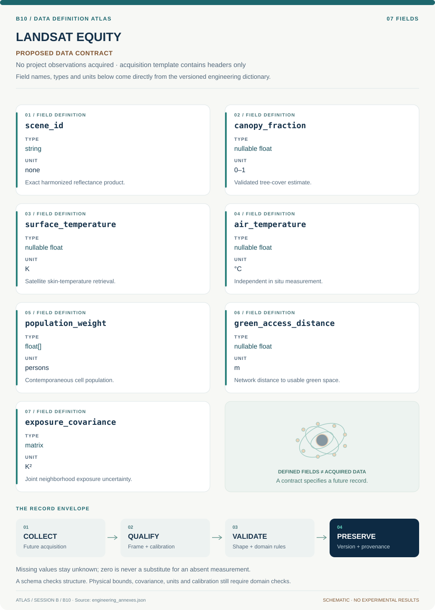

# B10 · Data blueprint

[LANDSAT EQUITY — Community Canopy Mission](../README.md) · [Figure gallery](../figures/README.md) · [Data atlas](../../../../data/README.md)

**PROPOSED CONTRACT · 7 fields · no project observations acquired.** The acquisition CSV contains column headers only. The diagram is a visual record specification, not measured data.

| Download | What it contains |
| --- | --- |
| [Acquisition CSV](acquisition.csv) | Empty columns ready for controlled acquisition |
| [Field dictionary](dictionary.csv) | Names, source types, units, meanings and quality rules |
| [JSON Schema](schema.json) | Nullable record structure with unit and quality metadata |

## Field reference

| Field | Type | Unit | Meaning | Quality / missingness |
| --- | --- | --- | --- | --- |
| scene_id | string | none | Exact harmonized reflectance product. | Version/checksum and masks required. |
| canopy_fraction | nullable float | 0–1 | Validated tree-cover estimate. | Class calibration and covariance retained. |
| surface_temperature | nullable float | K | Satellite skin-temperature retrieval. | Acquisition time/quality required. |
| air_temperature | nullable float | °C | Independent in situ measurement. | Never substituted from thermal pixels. |
| population_weight | float[] | persons | Contemporaneous cell population. | Boundary year and uncertainty saved. |
| green_access_distance | nullable float | m | Network distance to usable green space. | Access restrictions and routes documented. |
| exposure_covariance | matrix | K² | Joint neighborhood exposure uncertainty. | Include spatial and demographic terms. |

## Acquisition and provenance

Null means missing or unknown; record its cause. Preserve product identifier, retrieval timestamp, source hash, calibration, coordinate and time frame, covariance basis, selection rules and every transformation. JSON Schema checks structure; physical bounds and the quality rules above require domain validation.

- [NASA Harmonized Landsat Sentinel-2 data](https://hls.gsfc.nasa.gov/hls-data/) — archive or acquisition resource; inclusion here does not assert that its data have been retrieved.
- [NASA Landsat: urban heat and social vulnerability](https://science.nasa.gov/missions/landsat/how-urban-heat-affects-the-socially-vulnerable-in-sun-belt-cities/) — archive or acquisition resource; inclusion here does not assert that its data have been retrieved.

[Controlled data-management procedure](../../../../engineering/DATA_MANAGEMENT.md)
