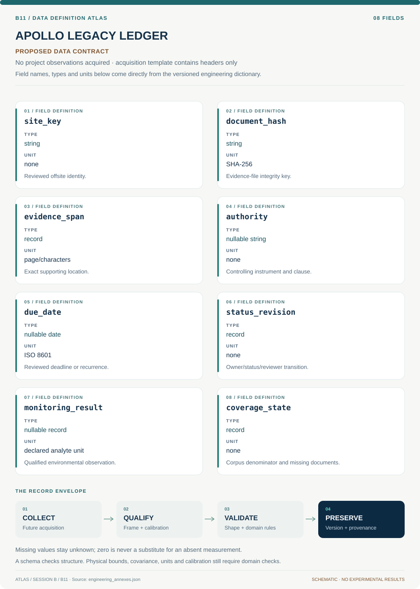

# B11 · Data blueprint

[APOLLO LEGACY LEDGER — Environmental Stewardship Knowledge System](../README.md) · [Figure gallery](../figures/README.md) · [Data atlas](../../../../data/README.md)

**PROPOSED CONTRACT · 8 fields · no project observations acquired.** The acquisition CSV contains column headers only. The diagram is a visual record specification, not measured data.

| Download | What it contains |
| --- | --- |
| [Acquisition CSV](acquisition.csv) | Empty columns ready for controlled acquisition |
| [Field dictionary](dictionary.csv) | Names, source types, units, meanings and quality rules |
| [JSON Schema](schema.json) | Nullable record structure with unit and quality metadata |

## Field reference

| Field | Type | Unit | Meaning | Quality / missingness |
| --- | --- | --- | --- | --- |
| site_key | string | none | Reviewed offsite identity. | Roster date/state/scope required. |
| document_hash | string | SHA-256 | Evidence-file integrity key. | Exact bytes and source URL retained. |
| evidence_span | record | page/characters | Exact supporting location. | OCR uncertainty and page numbering saved. |
| authority | nullable string | none | Controlling instrument and clause. | Reviewer confirmation mandatory. |
| due_date | nullable date | ISO 8601 | Reviewed deadline or recurrence. | Null remains unresolved. |
| status_revision | record | none | Owner/status/reviewer transition. | Append-only with supersedes link. |
| monitoring_result | nullable record | declared analyte unit | Qualified environmental observation. | Reporting limit and lab metadata retained. |
| coverage_state | record | none | Corpus denominator and missing documents. | Never implies all obligations known. |

## Acquisition and provenance

Null means missing or unknown; record its cause. Preserve product identifier, retrieval timestamp, source hash, calibration, coordinate and time frame, covariance basis, selection rules and every transformation. JSON Schema checks structure; physical bounds and the quality rules above require domain validation.

- [DOE Nevada Offsites Program Fact Sheet, March 2023](https://www.energy.gov/lm/articles/nevada-offsites-fact-sheet) — archive or acquisition resource; inclusion here does not assert that its data have been retrieved.
- [DOE Annual Site Environmental Reports](https://www.energy.gov/ehss/doe-annual-site-environmental-reports-aser) — archive or acquisition resource; inclusion here does not assert that its data have been retrieved.

[Controlled data-management procedure](../../../../engineering/DATA_MANAGEMENT.md)
