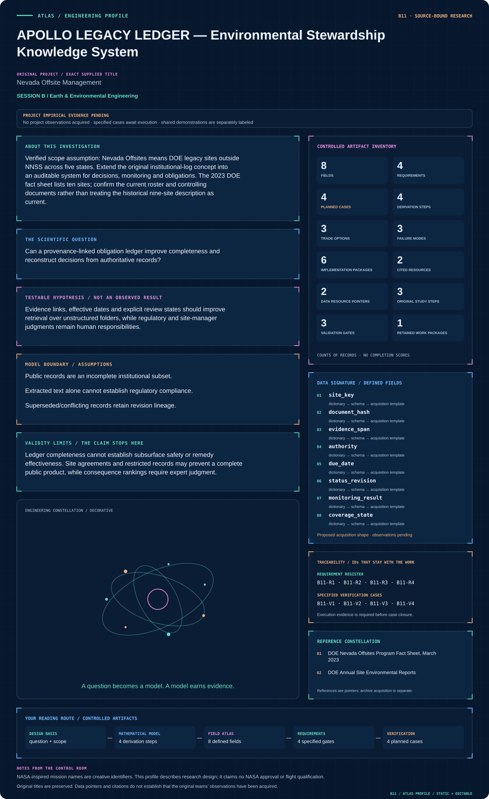

# B11 · Figure gallery

[APOLLO LEGACY LEDGER — Environmental Stewardship Knowledge System](../README.md) · [Data blueprint](../data/README.md) · [Data diagnostic gallery](../../../../data/figures/README.md)

## Engineering architecture

The diagram establishes authority review, immutable evidence and revision-aware stewardship views for Nevada Offsites. Corpus-relative coverage and administrative deadlines cannot certify regulatory compliance or environmental safety.

[SVG](architecture.svg) · [Editable Mermaid source](architecture.mmd)

## Data blueprint

**Proposed contract · observations pending.** Every field, type, unit and meaning comes from the controlled dictionary. [Open SVG](data-map.svg) · [Download dictionary](../data/dictionary.csv)

## Mission profile

The scientific question, hypothesis, model boundary and document metadata are drawn from controlled sources. Proposed work remains distinguished from acquired evidence. [Open SVG](mission-profile.svg)

## Planned scientific result

Display obligations, dates and source lineage; distinguish verified, superseded, disputed and unavailable evidence.

This final scientific result remains an execution deliverable; the design diagrams do not establish an empirical finding.
