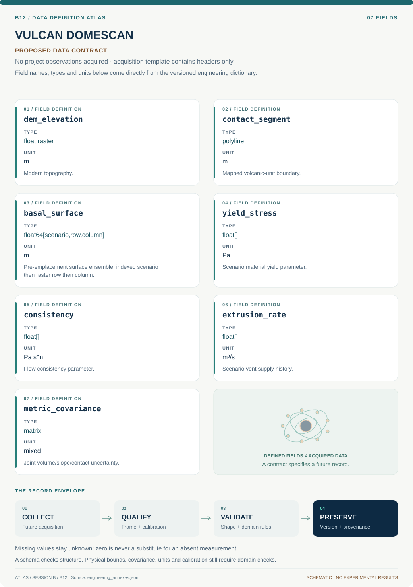

# B12 · Data blueprint

[VULCAN DOMESCAN — O’Leary Emplacement Reconstruction](../README.md) · [Figure gallery](../figures/README.md) · [Data atlas](../../../../data/README.md)

**PROPOSED CONTRACT · 7 fields · no project observations acquired.** The acquisition CSV contains column headers only. The diagram is a visual record specification, not measured data.

| Download | What it contains |
| --- | --- |
| [Acquisition CSV](acquisition.csv) | Empty columns ready for controlled acquisition |
| [Field dictionary](dictionary.csv) | Names, source types, units, meanings and quality rules |
| [JSON Schema](schema.json) | Nullable record structure with unit and quality metadata |

## Field reference

| Field | Type | Unit | Meaning | Quality / missingness |
| --- | --- | --- | --- | --- |
| dem_elevation | float raster | m | Modern topography. | Resolution/vertical datum required. |
| contact_segment | polyline | m | Mapped volcanic-unit boundary. | Digitization covariance and map key retained. |
| basal_surface | float64[scenario,row,column] | m | Pre-emplacement surface ensemble, indexed scenario then raster row then column. | Label inferred, not measured; scenarios share declared CRS, grid, nodata mask and row/column dimensions. |
| yield_stress | float[] | Pa | Scenario material yield parameter. | Positive; source range required. |
| consistency | float[] | Pa s^n | Flow consistency parameter. | Record n and regularization. |
| extrusion_rate | float[] | m³/s | Scenario vent supply history. | Nonnegative; chronology support explicit. |
| metric_covariance | matrix | mixed | Joint volume/slope/contact uncertainty. | Units per covariance block documented. |

## Acquisition and provenance

Null means missing or unknown; record its cause. Preserve product identifier, retrieval timestamp, source hash, calibration, coordinate and time frame, covariance basis, selection rules and every transformation. JSON Schema checks structure; physical bounds and the quality rules above require domain validation.

- [USGS geologic map of the east San Francisco Volcanic Field](https://pubs.usgs.gov/mf/1960/report.pdf) — archive or acquisition resource; inclusion here does not assert that its data have been retrieved.
- [Smithsonian Global Volcanism Program: San Francisco Volcanic Field](https://volcano.si.edu/volcano.cfm?vn=329020) — archive or acquisition resource; inclusion here does not assert that its data have been retrieved.

[Controlled data-management procedure](../../../../engineering/DATA_MANAGEMENT.md)
