# B12 · Figure gallery

[VULCAN DOMESCAN — O’Leary Emplacement Reconstruction](../README.md) · [Data blueprint](../data/README.md) · [Data diagnostic gallery](../../../../data/figures/README.md)

## Engineering architecture

The diagram separates modern terrain, inferred basal geometry, extrusion physics and post-emplacement alteration. It supports competing emplacement families while exposing the absence of unique rheology, discharge history or absolute chronology.

[SVG](architecture.svg) · [Editable Mermaid source](architecture.mmd)

## Data blueprint

**Proposed contract · observations pending.** Every field, type, unit and meaning comes from the controlled dictionary. [Open SVG](data-map.svg) · [Download dictionary](../data/dictionary.csv)

## Planned scientific result

Compare observed profiles/contacts with credible single/multipulse histories and highlight observationally indistinguishable regions.

This final scientific result remains an execution deliverable; the design diagrams do not establish an empirical finding.
