# B13 · GAIA PIXELSCOUT — Ecological Instance Mapping

**Original project:** Instance Segmentation for Biogeography

**Session B:** Earth & Environmental Engineering

**Document class:** engineering research design and analysis record · **Revision:** 3 · **Date:** 2026-10-02

**Evidence state:** design basis, mathematical formulation and verification plan documented. Project-specific empirical results remain to be acquired; executable shared model demonstrations have their own recorded checks.

[Session B](../README.md) · [All projects](../../../ENGINEERING_DOCUMENTATION.md) · [Session handbook](../../../handbooks/SESSION_B.md) · [← B12](../B12-vulcan-domescan-o-leary-emplacement-reconstruction/README.md) · [B14 →](../B14-phoenix-infiltration-postfire-soil-recovery-observatory/README.md)

| Proposed requirements | Specified verification cases | Defined data fields | Cited resources |
| ---: | ---: | ---: | ---: |
| 4 | 4 | 8 | 2 |

[Explore the data blueprint](data/README.md) · [Open the figure gallery](figures/README.md) · [Download acquisition template](data/acquisition.csv) · [Browse the data atlas](../../../data/README.md)

---

## Purpose and scientific objective

Build instance-level ecological mapping, beginning with individual tree crowns where benchmarks exist. Separate mask labels, boxes and biological identities. Detections become biogeographic data after quantifying omission, commission and boundary error; extension to other habitats needs domain-transfer tests and locally reviewed definitions rather than assuming one generic segmentation system.

**Question:** Can calibrated instances improve spatial abundance and size distributions across sites compared with pixel classifications or uncorrected box counts?

**Testable hypothesis:** Site-aware validation and ecological correction should improve abundance estimates; dense overlap and sensor changes will degrade boundaries and must enter the uncertainty model.

## 1. Design basis and analysis boundary

The ecological mapping system converts georeferenced imagery into candidate individual-tree-crown masks and then into abundance, crown area and spatial pattern estimates. Its boundary includes annotation audit, model inference, independent object validation and ecological error correction. A visible crown is not necessarily one biological tree, and a bounding box is not pixel-mask ground truth.

Begin with a simple detector and reviewed mask subset; introduce an instance architecture only where true mask labels support evaluation. NEON benchmark provenance provides a starting domain, while transfer to other habitats requires new locally reviewed definitions and withheld-site tests. Proposed abstention rules and count corrections are calibrated from independent validation rather than confidence scores alone.

## 2. Requirements and verification traceability

These are project design requirements or proposed analysis gates. A numerical target is not a NASA requirement unless its controlling source is explicitly identified. “TBD” identifies evidence required before a decision; it is not permission to assume a value. Verification evidence listed here is planned, unless a linked result explicitly records execution.

| ID | Requirement / gate | Engineering rationale | Verification method | Basis / required evidence |
| --- | --- | --- | --- | --- |
| B13-R1 | Each reference object shall declare box, polygon or raster-mask annotation type and biological instance definition. | Box overlap cannot validate mask boundaries. | Annotation/license audit. | NEON benchmark metadata. |
| B13-R2 | Tiles sharing crowns or acquisition/site context shall stay in the same split. | Adjacent tiles otherwise leak validation objects. | Spatial-object split audit. | Proposed evaluation requirement. |
| B13-R3 | Report instance precision/recall, mask IoU, centroid error m and ecological count bias separately by crown size/overlap. | Image averages conceal small-object omission. | Stratified object evaluation. | Proposed ecological score contract. |
| B13-R4 | Abundance correction shall use independently calibrated truth and detection probabilities with uncertainty; unfamiliar habitats shall support abstention. | Raw counts and model confidence are biased. | Holdout calibration and support tests. | Existing corrected-count model. |

## 3. Architecture and controlled interfaces

An image adapter preserves pixel-to-map transforms, CRS, ground resolution and acquisition identifiers. Annotation storage retains object identity, mask/box type, labeler disagreement and crown-sharing tile links. Training uses site-separated manifests; a matching adapter performs one-to-one object association under predeclared thresholds.

The inference engine emits masks, centroids, areas and calibrated instance-truth probabilities. Detection calibration uses reviewed true objects stratified by visibility and crown size. A count estimator applies commission and omission correction with shared calibration covariance, then exports ecological metrics with support masks. Understory invisibility and merged crowns remain biological interpretation limits, not errors fixable by cosmetic boundary smoothing.



The diagram separates annotation types, mask matching and ecological error correction. Its outputs represent supported visible crown instances, with calibration uncertainty and an explicit boundary on transfer to unfamiliar habitats.

[Editable engineering diagram source](figures/architecture.mmd)

## 4. Mathematical model and derivation

### Governing equations

```text
IoU(A,B)=|A∩B|/|A∪B|, for matched object masks.
```

```text
L=L_class+λ_mask L_mask+λ_boundary L_boundary; tune only within training data.
```

```text
N_hat=sum_detected_j P(true ecological instance_j | independent validation,features_j)/p_detect,j, propagating both truth-probability and detection-calibration uncertainty.
```

### Variables, units and conventions

- A/B: prediction/reference masks; area: georeferenced m².
- p_detect: probability conditional on size, overlap and sensor.
- N: ecological instance abundance; centroid error: m.
- Class/size definitions retain biological meaning and physical units.
- Truth probability is calibrated on independent labeled validation objects. Any false-positive correction must use the same inverse-detection weighting as the detections.

### Assumptions and boundary conditions

- Boxes are not full pixel-mask truth.
- Neighboring tiles may share crowns and require the same split.
- A visible crown may differ from a biological individual.

### Derivation step 1

```text
IoU(A,B)=area(A intersection B)/area(A union B).
```

Masks share a pixel/map grid; an empty union is undefined. Georeferenced area may differ from raw pixel count if resolution varies.

### Derivation step 2

```text
L=L_class+lambda_mask L_mask+lambda_boundary L_boundary.
```

Loss weights are dimensionless after defined normalizations and are selected inside training folds, not from withheld ecological outcomes.

### Derivation step 3

```text
N_hat=sum_(detected j) q_j/p_j.
```

q is calibrated probability the detection is a true instance; p is detection probability conditional on a true instance. The inverse-detection weighting applies equally to commission correction.

### Derivation step 4

```text
Var(N_hat) approximately J Sigma_(q,p) J^T+V_sampling.
```

Shared calibration parameters correlate corrected detections. The covariance term must include dependence among q and p, not merely sum object-level confidence variances.

### Inference or simulation procedure

Audit annotation types/licenses, create double-reviewed mask subsets if needed and freeze matching rules. Train a documented instance architecture with simple detection baselines; preserve coordinate systems and stratify evaluation by overlap/size. Calibrate uncertainty, correct abundance using validation-derived detection models and propagate errors into spatial clustering/size distributions. Publish support masks and an abstention rule for unfamiliar habitats rather than presenting every detection as trustworthy.

### Validity domain and fidelity limits

Visible canopy excludes many understory individuals. Annotation ambiguity limits performance; high image scores can still conceal biased ecological counts.

## 5. Data specifications and provenance


**Proposed data contract · observations pending.** This visual inventory shows the record fields to acquire or derive. It contains no project measurements. [Open the data blueprint and downloads](data/README.md).

| Field | Type | Unit | Physical / statistical meaning | Quality and missing-data rule |
| --- | --- | --- | --- | --- |
| image_key | string | none | Acquisition/site/tile identity. | Shared-crown links constrain splits. |
| annotation_type | enum | none | box, polygon or raster mask. | No box labeled mask truth. |
| instance_mask | geometry | pixel/m² | Predicted or reference crown support. | Grid transform and provenance required. |
| centroid_xy | float[2] | m | Mapped object center. | CRS and positional error saved. |
| truth_probability | float | 0–1 | Validation-calibrated true-instance probability. | Calibration split/version required. |
| detection_probability | float | 0–1 | Probability of detecting true instance. | Positive supported range; tiny p flagged. |
| count_covariance | matrix | instances² | Joint corrected-count uncertainty. | Include shared calibration and sampling. |
| domain_support | enum | none | supported, extrapolated or abstained. | Novel habitat cannot default supported. |

[Machine-readable record schema](data/schema.json) · [Empty acquisition CSV](data/acquisition.csv) · [Field dictionary CSV](data/dictionary.csv)

The CSV above contains column headers only. Its schema defines future records and does not establish that original-team data or a particular archive product have been acquired. Frame, timing, calibration, covariance, selection and provenance details must accompany populated records.

### NeonTreeEvaluation benchmark data

[Product, archive or reference](https://zenodo.org/records/5914554)

**Fields:** Annotations, imagery and benchmark splits.

**Access:** Public Zenodo release; check each label type and license.

**Role:** Independent evaluation observations.

### A remote sensing derived data set of 100 million individual tree crowns for NEON

[Product, archive or reference](https://elifesciences.org/articles/62922)

**Fields:** NEON crown products, methods and ecological evaluation.

**Access:** Open primary article with linked releases.

**Role:** Detection-to-ecology framework and scale limits.

## 6. Uncertainty, sensitivity and identifiability

Annotation ambiguity, overlapping crowns and acquisition resolution impose irreducible uncertainty. Use double-reviewed labels to estimate disagreement and evaluate size/overlap strata separately. A tree with multiple crowns or multiple trees within one crown breaks a simple biological identity assumption, so the released estimand is visible crown instances unless field evidence supports individuals.

Truth and detection probabilities are poorly identified in small strata, and inverse-probability weights explode near zero detection. Pool only defensible strata, profile calibration uncertainty and report effective support. Bootstrap sites and annotation blocks, retaining shared model/calibration variation. Domain shifts in species, illumination or canopy structure require abstention and local validation rather than a universal correction.

## 7. Engineering trade study

| Alternative | Benefit | Cost / limitation | Decision rule |
| --- | --- | --- | --- |
| Box detector baseline | Efficient available annotation use. | Does not yield validated masks. | Use when benchmark labels are boxes. |
| Reviewed instance-mask model | Supports area and boundary endpoints. | Costly annotation and overlap ambiguity. | Adopt where mask truth exists. |
| Sample-based crown inventory | Direct ecological review and calibration. | Sparse coverage and field cost. | Use as independent correction evidence. |

## 8. Verification and validation cases

| Case ID | Stimulus / condition | Expected result / criterion | Method | Evidence artifact |
| --- | --- | --- | --- | --- |
| B13-V1 | Identical/disjoint masks | IoU=1 and 0 respectively. | Condition/fixture: Compare equal masks and nonoverlapping masks. Verification procedure: Exact geometry fixtures.. | Exact geometry fixtures. |
| B13-V2 | Half-overlap masks | IoU=5/15=1/3. | Condition/fixture: Two equal-area masks of area 10 have intersection 5. Verification procedure: Analytic mask-area calculation.. | Analytic mask-area calculation. |
| B13-V3 | Perfect commission calibration | Corrected estimate is 20 instances under declared calibration. | Condition/fixture: Ten retained detections have q=1 and p=0.5. Verification procedure: Estimator unit check.. | Estimator unit check. |
| B13-V4 | Site holdout | Report calibration, omission and ecological bias by stratum. | Condition/fixture: Reserve complete sites, acquisitions and shared-crown blocks. Verification procedure: Spatial evaluation.. | Spatial evaluation. |

**Execution status:** these cases are specified, not claimed as executed. Close a case only with the versioned inputs, output, uncertainty, reviewer and pass/fail rationale.

### Additional scientific validation gates

- Hold out whole sites/flights; prohibit duplicate crowns across splits.
- Report mask AP/IoU, ecological count bias, size-distribution error and interval coverage.
- Measure annotator agreement and stratify sensor, lighting, size and habitat-shift failures; test calibrated abstention.

## 9. Implementation and reproducible work packages

1. Publish annotation definitions, licenses and linked-tile/site manifests.
2. Construct reviewed mask subsets and label-disagreement artifacts.
3. Train detector and mask alternatives with frozen spatial splits.
4. Implement one-to-one matching and size/overlap score reports.
5. Calibrate truth/detection probabilities and covariance-aware ecological corrections.
6. Release masks, support layers and visible-crown estimand limitations.

### Investigation sequence

1. Stage 1: define biological instances, audit labels and build reviewed references with site/flight splits.
2. Stage 2: train/calibrate models and propagate detection error into ecological summaries.
3. Stage 3: test a withheld site/sensor and release instances, model/data cards and failure envelopes.

### Resources and interfaces to expertise

- Ecologist, remote-sensing analyst and annotation reviewers.
- GPU, geospatial tools, versioned checkpoints and licensed data manifest.

## 10. Failure modes and interpretation controls

| Failure mode | Effect on result | Detection / evidence | Design response |
| --- | --- | --- | --- |
| Boxes treated as masks | Inflated segmentation claim. | Annotation-type audit. | Create reviewed masks or restrict endpoint. |
| Tile leakage | Overstated generalization. | Shared-object/site split check. | Group linked tiles. |
| Unstable inverse weights | Huge unreliable abundance estimates. | Inspect p support and intervals. | Abstain or report bounds in sparse strata. |

- Label leakage and box/mask confusion.
- Invisible understory and ambiguous individuals.
- Domain shift biasing abundance maps.

## 11. Required engineering outputs

- Annotation manifest and model package.
- Uncertainty-bearing instance geodatabase.
- Ecological correction notebook and transfer limits.

### Scientific result figures to produce during execution

Overlay reviewed/predicted crowns with uncertainty, then compare corrected counts and size distributions across withheld sites.

## 12. Cited technical and scientific resources

- [NeonTreeEvaluation benchmark data](https://zenodo.org/records/5914554) — Released remote-sensing annotations support benchmark testing; annotation type and licensing must be checked before claiming mask ground truth.
- [A remote sensing derived data set of 100 million individual tree crowns for NEON](https://elifesciences.org/articles/62922) — Primary tree-crown detection dataset and evaluation research supports ecological use with quantified detection error.

Framework and evidence rules: [engineering documentation standard](../../../engineering/ENGINEERING_STANDARD.md), [model assurance](../../../engineering/MODEL_ASSURANCE.md), [uncertainty procedure](../../../engineering/UNCERTAINTY_AND_DECISION_RULES.md), [data management](../../../engineering/DATA_MANAGEMENT.md). NASA-inspired names are creative identifiers; requirements and results are not NASA certification.
