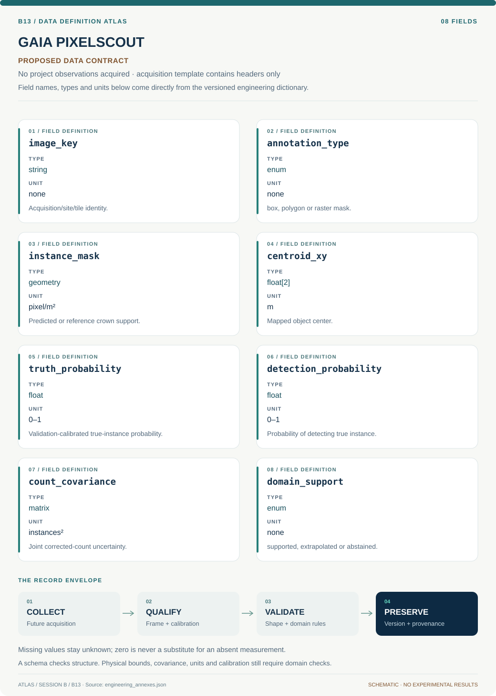

# B13 · Data blueprint

[GAIA PIXELSCOUT — Ecological Instance Mapping](../README.md) · [Figure gallery](../figures/README.md) · [Data atlas](../../../../data/README.md)

**PROPOSED CONTRACT · 8 fields · no project observations acquired.** The acquisition CSV contains column headers only. The diagram is a visual record specification, not measured data.

| Download | What it contains |
| --- | --- |
| [Acquisition CSV](acquisition.csv) | Empty columns ready for controlled acquisition |
| [Field dictionary](dictionary.csv) | Names, source types, units, meanings and quality rules |
| [JSON Schema](schema.json) | Nullable record structure with unit and quality metadata |

## Field reference

| Field | Type | Unit | Meaning | Quality / missingness |
| --- | --- | --- | --- | --- |
| image_key | string | none | Acquisition/site/tile identity. | Shared-crown links constrain splits. |
| annotation_type | enum | none | box, polygon or raster mask. | No box labeled mask truth. |
| instance_mask | geometry | pixel/m² | Predicted or reference crown support. | Grid transform and provenance required. |
| centroid_xy | float[2] | m | Mapped object center. | CRS and positional error saved. |
| truth_probability | float | 0–1 | Validation-calibrated true-instance probability. | Calibration split/version required. |
| detection_probability | float | 0–1 | Probability of detecting true instance. | Positive supported range; tiny p flagged. |
| count_covariance | matrix | instances² | Joint corrected-count uncertainty. | Include shared calibration and sampling. |
| domain_support | enum | none | supported, extrapolated or abstained. | Novel habitat cannot default supported. |

## Acquisition and provenance

Null means missing or unknown; record its cause. Preserve product identifier, retrieval timestamp, source hash, calibration, coordinate and time frame, covariance basis, selection rules and every transformation. JSON Schema checks structure; physical bounds and the quality rules above require domain validation.

- [NeonTreeEvaluation benchmark data](https://zenodo.org/records/5914554) — archive or acquisition resource; inclusion here does not assert that its data have been retrieved.
- [A remote sensing derived data set of 100 million individual tree crowns for NEON](https://elifesciences.org/articles/62922) — archive or acquisition resource; inclusion here does not assert that its data have been retrieved.

[Controlled data-management procedure](../../../../engineering/DATA_MANAGEMENT.md)
