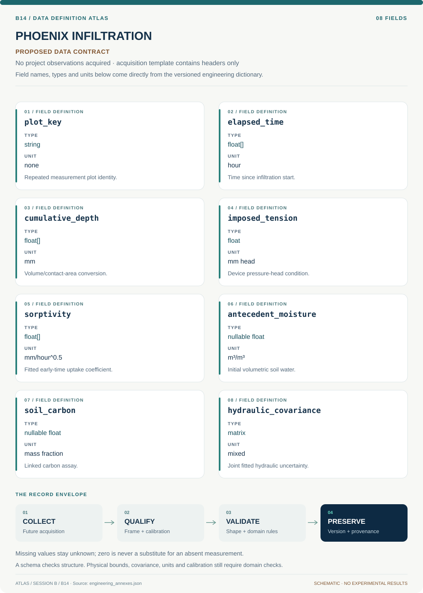
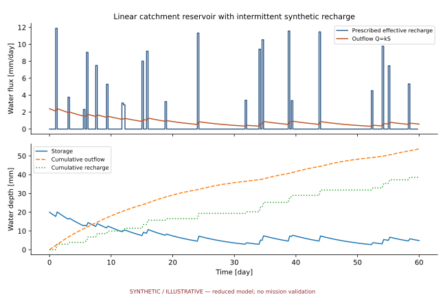

# B14 · PHOENIX INFILTRATION — Postfire Soil Recovery Observatory

**Original project:** Soil hydraulic properties three years after the Frye Fire on Mount Graham, Arizona

**Session B:** Earth & Environmental Engineering

**Document class:** engineering research design and analysis record · **Revision:** 3 · **Date:** 2026-10-02

**Evidence state:** design basis, mathematical formulation and verification plan documented. Project-specific empirical results remain to be acquired; executable shared model demonstrations have their own recorded checks.

[Session B](../README.md) · [All projects](../../../ENGINEERING_DOCUMENTATION.md) · [Session handbook](../../../handbooks/SESSION_B.md) · [← B13](../B13-gaia-pixelscout-ecological-instance-mapping/README.md) · [B15 →](../B15-tecton-orion-farallon-slab-reconstruction/README.md)

| Proposed requirements | Specified verification cases | Defined data fields | Cited resources |
| ---: | ---: | ---: | ---: |
| 4 | 4 | 8 | 2 |

[Explore the data blueprint](data/README.md) · [Open the figure gallery](figures/README.md) · [Download acquisition template](data/acquisition.csv) · [Browse the data atlas](../../../data/README.md)

---

## Purpose and scientific objective

Study three-year postfire hydraulics as heterogeneous recovery, without presuming burned soil always infiltrates less. The historical abstract reports the opposite direction in its sampled plots. Preserve that context and test litter, carbon, severity and spatial scaling as explanations; the abstract is not a replacement for raw measurements or new results.

**Question:** What explains burned/unburned infiltration and repellency differences, and how do point measurements translate into storm runoff?

**Testable hypothesis:** Litter/carbon and soil moisture may mediate contrasting responses; burn status alone should be incomplete, while rainfall intensity changes effective watershed parameters.

## 1. Design basis and analysis boundary

The postfire hydraulic reconstruction concerns the sampled Mount Graham plots approximately three years after the Frye Fire. The historical abstract reports higher infiltration in its burned plots, so the design tests that direction without generalizing it to all burned soils. Raw device readings, litter, carbon, texture, moisture, burn stratum and plot identity are required before a new quantitative conclusion.

Start with device-specific cumulative-infiltration fitting and hierarchical plot distributions. Advance to storm-runoff screening only after identifying the hydraulic meaning of the fitted parameters. Published postfire parameterization work informs scale limitations; the historical abstract is contextual evidence, not a substitute for raw observations. Cross-sectional differences do not uniquely reconstruct recovery or establish a carbon-mediated mechanism.

## 2. Requirements and verification traceability

These are project design requirements or proposed analysis gates. A numerical target is not a NASA requirement unless its controlling source is explicitly identified. “TBD” identifies evidence required before a decision; it is not permission to assume a value. Verification evidence listed here is planned, unless a linked result explicitly records execution.

| ID | Requirement / gate | Engineering rationale | Verification method | Basis / required evidence |
| --- | --- | --- | --- | --- |
| B14-R1 | Every infiltration series shall retain device geometry, imposed tension, contact protocol, elapsed time and cumulative volume. | Tension-device coefficients do not automatically equal saturated conductivity. | Metadata and device-equation audit. | Primary parameterization guidance. |
| B14-R2 | Preserve the historical greater-infiltration direction as a reported sampled-plot context, with all new effect estimates explicitly pending raw data. | A universal reduced-infiltration premise would reverse evidence. | Narrative/evidence lineage review. | Historical symposium abstract. |
| B14-R3 | Fit plot-level distributions and report burn contrasts conditional on moisture, litter, carbon and texture support. | Point measurements are heterogeneous. | Hierarchical residual and covariate support checks. | Proposed inference protocol. |
| B14-R4 | Watershed runoff products shall state spatial aggregation, rainfall intensity and tension-to-effective-parameter assumptions. | Point means may not represent storm infiltration. | Independent runoff ledger and scale-sensitivity test. | Existing scale limitation. |

## 3. Architecture and controlled interfaces

A device adapter converts measured volume and disk/contact area into cumulative depth mm while preserving imposed pressure head and elapsed time hours. Plot metadata includes burn severity, slope, texture, antecedent volumetric moisture and litter thickness. A sample adapter links carbon assays through plot/date identity and analytical uncertainty.

The local fitter estimates sorptivity and a device-specific late-time coefficient, then uses the validated geometry/tension relation only if required ancillary parameters exist. A hierarchical model estimates log hydraulic distributions across plots. The runoff screen accepts rainfall hyetographs and parameter ensembles; missing contact or tension metadata blocks conductivity interpretation while still allowing qualified descriptive infiltration curves.


The diagram distinguishes measured infiltration curves, device-specific parameters and watershed screening. It preserves the historical sampled-plot direction while requiring raw evidence before new effects or recovery mechanisms are quantified.

[Editable engineering diagram source](figures/architecture.mmd)

## 4. Mathematical model and derivation

### Governing equations

```text
f(F)=K_s[1+ψ_f(θ_s−θ_i)/F], a Green–Ampt screening approximation.
```

```text
I(t)=S sqrt(t)+A t; state the tension-infiltration interpretation.
```

```text
log K_ij=α+β burn_ij+γ litter_ij+δ carbon_ij+u_plot+ε_ij.
```

### Variables, units and conventions

- f/K_s: mm/hour; F: cumulative infiltration, mm.
- ψ_f: mm; θ: volumetric moisture, m³/m³.
- S: mm/hour^0.5; A: mm/hour.
- Litter: mm; carbon: mass fraction; repellency: documented time/score.

### Assumptions and boundary conditions

- Device-specific tension equations/contact checks are required.
- Burn strata may have differed in texture/topography before fire.
- Point averages need not describe intense-storm watershed response.

### Derivation step 1

```text
I(t)=V(t)/A_contact=S sqrt(t)+A_t t.
```

V in mm³ divided by contact area mm² gives mm. S has mm/hour^0.5 and A_t mm/hour; A_t is not automatically K_s for tension infiltration.

### Derivation step 2

```text
dI/dt=S/(2 sqrt(t))+A_t.
```

The derivative diverges as t approaches zero, so early contact/transient observations need a documented fitting window rather than literal extrapolation.

### Derivation step 3

```text
f(F)=K_s[1+psi_f Delta_theta/F].
```

This Green–Ampt screening model uses positive wetting-front suction magnitude psi_f in mm and cumulative infiltration F in mm; Delta_theta is dimensionless.

### Derivation step 4

```text
log K_ij=alpha+beta burn_ij+gamma litter_ij+delta carbon_ij+u_plot+epsilon.
```

The conditional burn contrast is exp(beta) as a conductivity ratio. Covariate adjustment is not proof of mediation or a recovered prefire baseline.

### Inference or simulation procedure

Recover authorized raw readings with dates, tensions, plot identities, litter, texture, moisture and carbon. Fit hierarchical hydraulic distributions and censored repellency responses where appropriate. Compare burn-only and covariate/mediation models without claiming carbon pathways from association alone. Drive runoff ensembles using observed rainfall and spatially variable parameters; compare arithmetic, geometric and effective summaries. Keep measurement, parameter-fitting and watershed-scaling uncertainty separate in the report.

### Validity domain and fidelity limits

Original raw data may be unavailable. Cross-sectional comparisons cannot uniquely reconstruct recovery or prefire conditions, and hydraulic nonuniqueness limits mechanistic conclusions.

## 5. Data specifications and provenance



**Proposed data contract · observations pending.** This visual inventory shows the record fields to acquire or derive. It contains no project measurements. [Open the data blueprint and downloads](data/README.md).

| Field | Type | Unit | Physical / statistical meaning | Quality and missing-data rule |
| --- | --- | --- | --- | --- |
| plot_key | string | none | Repeated measurement plot identity. | Burn/terrain provenance required. |
| elapsed_time | float[] | hour | Time since infiltration start. | Monotone; transient window recorded. |
| cumulative_depth | float[] | mm | Volume/contact-area conversion. | Monotone within error; area uncertainty saved. |
| imposed_tension | float | mm head | Device pressure-head condition. | Sign convention and geometry required. |
| sorptivity | float[] | mm/hour^0.5 | Fitted early-time uptake coefficient. | Covariance with late-time coefficient retained. |
| antecedent_moisture | nullable float | m³/m³ | Initial volumetric soil water. | Bounds and measurement method required. |
| soil_carbon | nullable float | mass fraction | Linked carbon assay. | Date/method covariance saved. |
| hydraulic_covariance | matrix | mixed | Joint fitted hydraulic uncertainty. | Separate device, plot and scale terms. |

[Machine-readable record schema](data/schema.json) · [Empty acquisition CSV](data/acquisition.csv) · [Field dictionary CSV](data/dictionary.csv)

The CSV above contains column headers only. Its schema defines future records and does not establish that original-team data or a particular archive product have been acquired. Frame, timing, calibration, covariance, selection and provenance details must accompany populated records.

### 2021 Arizona NASA Space Grant symposium booklet

[Product, archive or reference](https://spacegrant.arizona.edu/sites/spacegrant.arizona.edu/files/AZSGC%20Symposium%20Booklet%202021_website.pdf)

**Fields:** Original title and limited historical abstract.

**Access:** Public 2021 booklet; request measurements from investigators.

**Role:** Provenance and two-sided hypothesis.

### Guidance for parameterizing post-fire hydrologic models with in situ infiltration measurements

[Product, archive or reference](https://experts.arizona.edu/en/publications/guidance-for-parameterizing-post-fire-hydrologic-models-with-in-s/)

**Fields:** Point-to-watershed upscaling and hydraulic distributions.

**Access:** Primary university publication record; raw data/code require its access statement.

**Role:** External methodological comparison.

## 6. Uncertainty, sensitivity and identifiability

Contact quality, imposed tension and antecedent moisture influence fitted infiltration, while litter and carbon may differ by prefire landscape. Model repeated readings within plots and compare burn-only versus covariate-adjusted effects. Treat absent raw measurements as a genuine evidence gap; the abstract's direction cannot supply variance or device parameters.

Sorptivity and late-time slope trade off in short records. Profile them over fitting windows, inspect covariance and compare device-consistent alternatives. Effective runoff parameters also depend on spatial connectivity and rainfall intensity; vary geometric/arithmetic summaries and retain scale discrepancy separately. A larger mean infiltration does not guarantee lower watershed runoff or a monotonic recovery trajectory.

## 7. Engineering trade study

| Alternative | Benefit | Cost / limitation | Decision rule |
| --- | --- | --- | --- |
| Direct cumulative-curve comparison | Requires few conversion assumptions. | Does not identify conductivity mechanism. | Use when device metadata is incomplete. |
| Device-specific hydraulic inversion | Produces interpretable local parameters. | Needs geometry/tension and ancillary properties. | Adopt only after equation verification. |
| Distributed storm-runoff screening | Connects plot uncertainty to decisions. | Upscaling dominates some scenarios. | Use with explicit spatial/rainfall sensitivity. |

## 8. Verification and validation cases

| Case ID | Stimulus / condition | Expected result / criterion | Method | Evidence artifact |
| --- | --- | --- | --- | --- |
| B14-V1 | Volume conversion | I=10 mm. | Condition/fixture: 1000 mm³ over 100 mm² contact area. Verification procedure: Exact adapter calculation.. | Exact adapter calculation. |
| B14-V2 | Known infiltration curve | I=8 mm and instantaneous rate=1.5 mm/hour. | Condition/fixture: S=2 mm/hour^0.5, A_t=1 mm/hour, t=4 hours. Verification procedure: Compare fitter/derivative with analytic values.. | Compare fitter/derivative with analytic values. |
| B14-V3 | Green–Ampt wet limit | f approaches K_s. | Condition/fixture: Delta_theta=0 or F grows much larger than psi_f Delta_theta. Verification procedure: Analytic parameter sweep.. | Analytic parameter sweep. |
| B14-V4 | Plot holdout | Report hydraulic predictive coverage and burn-effect sensitivity. | Condition/fixture: Reserve whole plots rather than individual readings. Verification procedure: Hierarchical blocked evaluation.. | Hierarchical blocked evaluation. |

**Execution status:** these cases are specified, not claimed as executed. Close a case only with the versioned inputs, output, uncertainty, reviewer and pass/fail rationale.

### Additional scientific validation gates

- Hold out plots and storms; keep technical replicates together.
- Test device calibration and parameter identifiability using synthetic observations.
- Compare runoff volume/peak/timing with independent observations and report unresolved scaling alternatives.

## 9. Implementation and reproducible work packages

1. Recover authorized raw curves and document unavailable measurements explicitly.
2. Create device geometry/tension and plot/covariate schemas with unit conversions.
3. Implement cumulative-curve fitting and contact/window diagnostics.
4. Fit plot-level hydraulic distributions and profile covariate-supported burn contrasts.
5. Build rainfall/runoff screening artifacts with explicit parameter-upscaling alternatives.
6. Publish historical context, raw-data-dependent estimates and scale limitations together.

### Investigation sequence

1. Stage 1: inventory data/instrument access, match soil strata and preregister two-sided comparisons.
2. Stage 2: estimate hydraulic distributions and covariate effects; construct rainfall-dependent runoff ensembles.
3. Stage 3: validate independent plots/storms and report recovery interpretation with point/watershed uncertainty separated.

### Resources and interfaces to expertise

- Soil physicist, postfire hydrologist and original data custodian.
- Instrument metadata, rainfall histories and spatial runoff solver.

## 10. Failure modes and interpretation controls

| Failure mode | Effect on result | Detection / evidence | Design response |
| --- | --- | --- | --- |
| Late-time coefficient called K_s | Wrong hydraulic interpretation. | Device geometry/equation audit. | Use verified tension-specific conversion. |
| Burn effect direction assumed | Evidence reversal or confirmation bias. | Compare abstract and raw estimator. | Keep bidirectional hypotheses. |
| Point mean used watershed-wide | Misleading runoff response. | Scale and connectivity sensitivity. | Distributed ensemble and limitation labels. |

- Assumed burn-effect direction.
- Contact artifacts and unmatched soils.
- Unsupported debris-flow warning from plot results.

## 11. Required engineering outputs

- Hydraulic/repellency quality report and dictionary.
- Soil-response and runoff notebooks.
- Recovery uncertainty map and monitoring priorities.

### Scientific result figures to produce during execution

Compare burn strata across litter/carbon distributions and show observed/predicted storm hydrographs with propagated uncertainty.

### Included shared numerical starting point



[Executable formulation, parameters, tabular outputs, provenance and verification](../../../models/README.md). This shared demonstration has a narrower domain than the project model above. Its own caption and methods identify synthetic parameters or the separately retrieved public catalog; it is not a completed result of the original project.

## 12. Cited technical and scientific resources

- [2021 Arizona NASA Space Grant symposium booklet](https://spacegrant.arizona.edu/sites/spacegrant.arizona.edu/files/AZSGC%20Symposium%20Booklet%202021_website.pdf) — Original-title provenance only; historical abstracts are not new measurements or evidence of project completion.
- [Guidance for parameterizing post-fire hydrologic models with in situ infiltration measurements](https://experts.arizona.edu/en/publications/guidance-for-parameterizing-post-fire-hydrologic-models-with-in-s/) — Primary modeling study addresses the gap between point infiltration measurements and effective watershed parameters.

Framework and evidence rules: [engineering documentation standard](../../../engineering/ENGINEERING_STANDARD.md), [model assurance](../../../engineering/MODEL_ASSURANCE.md), [uncertainty procedure](../../../engineering/UNCERTAINTY_AND_DECISION_RULES.md), [data management](../../../engineering/DATA_MANAGEMENT.md). NASA-inspired names are creative identifiers; requirements and results are not NASA certification.
