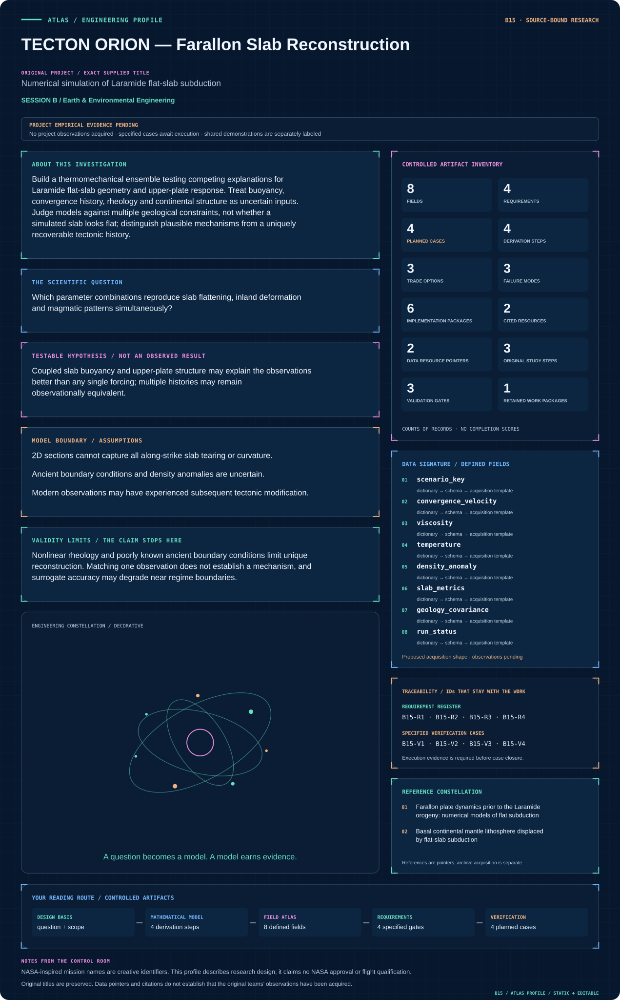

# B15 · TECTON ORION — Farallon Slab Reconstruction

**Original project:** Numerical simulation of Laramide flat-slab subduction

**Session B:** Earth & Environmental Engineering

**Document class:** engineering research design and analysis record · **Revision:** 4 · **Date:** 2026-10-02

**Evidence state:** design basis, mathematical formulation and verification plan documented. Project-specific empirical results remain to be acquired; executable shared model demonstrations have their own recorded checks.

[Session B](../README.md) · [All projects](../../../ENGINEERING_DOCUMENTATION.md) · [Session handbook](../../../handbooks/SESSION_B.md) · [← B14](../B14-phoenix-infiltration-postfire-soil-recovery-observatory/README.md) · [B16 →](../B16-iss-bioguard-retrospective-microgravity-health-evidence/README.md)

| Proposed requirements | Specified verification cases | Defined data fields | Cited resources |
| ---: | ---: | ---: | ---: |
| 4 | 4 | 8 | 2 |

[Explore the data blueprint](data/README.md) · [Open the figure gallery](figures/README.md) · [Download acquisition template](data/acquisition.csv) · [Browse the data atlas](../../../data/README.md)

---

## Mission profile



| Profile panel | Engineering signal | Open the evidence |
| --- | --- | --- |
| Mission identity | Numerical simulation of Laramide flat-slab subduction | [Scientific objective](#purpose-and-scientific-objective) |
| Model cockpit | 3 governing expressions; 4 derivation steps; declared assumptions and validity envelope | [Mathematical formulation](#4-mathematical-model-and-derivation) |
| Data blueprint | 8 proposed fields with types, units and quality rules | [Field map & downloads](data/README.md) |
| Verification queue | 4 proposed requirements; 4 specified cases; project execution evidence pending | [Case definitions](#8-verification-and-validation-cases) |
| Figure wall | Architecture, field map, planned result description | [Open full gallery](figures/README.md) |
| Resource library | 2 cited primary resources with support statements | [Cited resources](#12-cited-technical-and-scientific-resources) |

### Model cockpit

**Analysis method:** Reproduce a published benchmark, then vary physically justified input ranges through designed ensembles. Compare buoyant-slab, convergence and continental-root scenarios using thermal structure, slab geometry and upper-plate stresses. Build a fast surrogate only after verifying numerical solutions; propagate prior/observation uncertainty and identify parameter tradeoffs. Add 3D cases selectively when along-strike effects could change the inference. Keep all failed or unstable model runs in the audit trail.

**Operating envelope:** Nonlinear rheology and poorly known ancient boundary conditions limit unique reconstruction. Matching one observation does not establish a mechanism, and surrogate accuracy may degrade near regime boundaries.

**Variables and conventions**

- u: m/s; p: Pa; η: Pa·s; ρ: kg/m³.
- T: K; k: W/m/K; H: W/m³; c_p: J/kg/K.
- θ: buoyancy, convergence, viscosity and lithospheric-thickness parameters.
- Slab dip: degrees; deformation/arc position: km; geologic time: Ma.

### Artifact wall


The model diagram couples mechanical and thermal physics while gating inference on numerical verification and independent geological groups. It exposes ancient-boundary and dimensionality uncertainty rather than claiming one recovered tectonic history.

**Scientific result to produce:** Animate temperature/slab sections and compare geological constraints; show credible mechanism regions rather than one preferred image.

### Investigation feed · planned work

The feed records proposed work packages. A row becomes executed evidence only with versioned inputs, outputs and a reviewed result.

| Sequence | Evidence state | Engineering work package |
| --- | --- | --- |
| 01 | Planned | Freeze boundary-history, rheology and geological constraint manifests. |
| 02 | Planned | Implement Stokes/thermal benchmark and independent residual/energy ledgers. |
| 03 | Planned | Generate designed 2D ensembles and retain all failure configurations. |
| 04 | Planned | Extract geometry, thermal and upper-plate metrics with covariance. |
| 05 | Planned | Train supported surrogates and verify withheld direct solutions. |
| 06 | Planned | Run targeted 3D sensitivity cases and publish compatible mechanism families. |

### Mission connections

Connections are reading routes based on actual shared resources, supplied sessions or included illustrations. They do not establish physical dependencies, team collaborations or validated results.

| Connected mission | Original investigation | Recorded connection basis |
| --- | --- | --- |
| [B14 · PHOENIX INFILTRATION — Postfire Soil Recovery Observatory](../B14-phoenix-infiltration-postfire-soil-recovery-observatory/README.md) | Soil hydraulic properties three years after the Frye Fire on Mount Graham, Arizona | Session B |
| [B16 · ISS BIOGUARD — Retrospective Microgravity Health Evidence](../B16-iss-bioguard-retrospective-microgravity-health-evidence/README.md) | Multi-drug Resistance of Pseudomonas aeruginosa Under Microgravity Growth Conditions | Session B |
| [B13 · GAIA PIXELSCOUT — Ecological Instance Mapping](../B13-gaia-pixelscout-ecological-instance-mapping/README.md) | Instance Segmentation for Biogeography | Session B |
| [B17 · AQUARIUS LIFELINE — Inland Fisheries Resilience](../B17-aquarius-lifeline-inland-fisheries-resilience/README.md) | Off the Hook: Assessing the Vulnerability of Inland Subsistence Fisheries to Climate Change | Session B |
| [B12 · VULCAN DOMESCAN — O’Leary Emplacement Reconstruction](../B12-vulcan-domescan-o-leary-emplacement-reconstruction/README.md) | Identifying unique emplacement characteristics of O'Leary Peak: a volcanic dome in the San Francisco Volcanic Field | Session B |
| [B18 · POSEIDON WINDCARBON — Southern Ocean Carbon Mission](../B18-poseidon-windcarbon-southern-ocean-carbon-mission/README.md) | Assessing the Role of the Winds in the Biogeochemical Cycling and Carbon Budget of the Southern Ocean | Session B |

[Machine-readable connection register and ranking rule](../../../registry/mission_connections.json)

### Reading playlist

| Route | Start here | Continue to |
| --- | --- | --- |
| Understand the idea | [Scientific objective](#purpose-and-scientific-objective) | [Design boundary](#1-design-basis-and-analysis-boundary) → [Mathematics](#4-mathematical-model-and-derivation) |
| Inspect the data | [Visual blueprint](data/README.md) | [Provenance](#5-data-specifications-and-provenance) → [Uncertainty](#6-uncertainty-sensitivity-and-identifiability) |
| Make a design decision | [Trade study](#7-engineering-trade-study) | [Failure modes](#10-failure-modes-and-interpretation-controls) → [Required outputs](#11-required-engineering-outputs) |
| Prepare execution | [Requirements](#2-requirements-and-verification-traceability) | [Verification](#8-verification-and-validation-cases) → [Implementation](#9-implementation-and-reproducible-work-packages) |

## Complete engineering dossier

The profile above is a browsing layer. The full design basis, equations, derivations, data contract, uncertainty, trades and controlled case definitions follow.

## Purpose and scientific objective

Build a thermomechanical ensemble testing competing explanations for Laramide flat-slab geometry and upper-plate response. Treat buoyancy, convergence history, rheology and continental structure as uncertain inputs. Judge models against multiple geological constraints, not whether a simulated slab looks flat; distinguish plausible mechanisms from a uniquely recoverable tectonic history.

**Question:** Which parameter combinations reproduce slab flattening, inland deformation and magmatic patterns simultaneously?

**Testable hypothesis:** Coupled slab buoyancy and upper-plate structure may explain the observations better than any single forcing; multiple histories may remain observationally equivalent.

## 1. Design basis and analysis boundary

The numerical reconstruction explores whether uncertain Farallon slab buoyancy, convergence history and continental structure can jointly explain flat geometry and upper-plate response during the Laramide interval. Inputs are literature-constrained boundary histories and geological observation groups, with explicit uncertainty. A flat-looking slab is an intermediate model state, not sufficient validation of a tectonic mechanism.

Begin with a reproduced incompressible thermomechanical benchmark and two-dimensional screening ensembles. Add nonlinear rheology and selected three-dimensional tests only after conservation and convergence checks. Published models motivate competing mechanisms; viscosity ranges, density anomalies and ancient boundary histories remain uncertain scenario choices. The deliverable is a family of compatible mechanisms and observables that could discriminate them.

## 2. Requirements and verification traceability

These are project design requirements or proposed analysis gates. A numerical target is not a NASA requirement unless its controlling source is explicitly identified. “TBD” identifies evidence required before a decision; it is not permission to assume a value. Verification evidence listed here is planned, unless a linked result explicitly records execution.

| ID | Requirement / gate | Engineering rationale | Verification method | Basis / required evidence |
| --- | --- | --- | --- | --- |
| B15-R1 | Each run shall freeze force/thermal boundaries, rheology, density law, time conversion and mesh configuration. | Different boundary histories invalidate comparisons. | Manifest and dimensional audit. | Proposed reproducibility contract. |
| B15-R2 | Proposed solver target: discrete normalized divergence and energy-balance residuals below 10^-5, subject to demonstrated mesh convergence. | Numerical artifacts must not mimic flattening. | Independent residual calculator. | Proposed numerical target, not geologic threshold. |
| B15-R3 | Score slab geometry and at least one independent upper-plate/thermal observation group with covariance. | One shape cannot identify a mechanism. | Observation-group score audit. | Primary modeling context. |
| B15-R4 | Surrogates shall flag outside-ensemble inputs and retain failed/unstable runs in the audit trail. | Regime boundaries can defeat interpolation. | Held-out and failure-envelope review. | Proposed emulator contract. |

## 3. Architecture and controlled interfaces

A scenario registry stores convergence in m/s, geologic epochs with stated Ma convention, mantle/lithosphere density kg/m³ and thermal/rheological laws. The mesh adapter records length m and boundary labels. Geological constraints use separately named dip, arc position, deformation and thermal groups with age and spatial covariance.

The Stokes solver produces velocity/pressure coupled to advective-diffusive heat transport. Derived metrics include slab dip, flattening extent and upper-plate stress proxies. A convergence controller rejects unresolved runs before emulator training. The inverse comparator combines independent observation groups while preserving shared age uncertainty; 3D promotion evaluates along-strike sensitivity instead of automatically increasing confidence.


The model diagram couples mechanical and thermal physics while gating inference on numerical verification and independent geological groups. It exposes ancient-boundary and dimensionality uncertainty rather than claiming one recovered tectonic history.

[Editable engineering diagram source](figures/architecture.mmd)

## 4. Mathematical model and derivation

### Governing equations

```text
∇·u=0; −∇p+∇·[η(T,P,ε̇)(∇u+∇uᵀ)]+ρg=0.
```

```text
ρc_p(∂T/∂t+u·∇T)=∇·(k∇T)+H.
```

```text
J(θ)=Σ_k residual_kᵀ Σ_k⁻¹ residual_k, with independent geological groups.
```

### Variables, units and conventions

- u: m/s; p: Pa; η: Pa·s; ρ: kg/m³.
- T: K; k: W/m/K; H: W/m³; c_p: J/kg/K.
- θ: buoyancy, convergence, viscosity and lithospheric-thickness parameters.
- Slab dip: degrees; deformation/arc position: km; geologic time: Ma.

### Assumptions and boundary conditions

- 2D sections cannot capture all along-strike slab tearing or curvature.
- Ancient boundary conditions and density anomalies are uncertain.
- Modern observations may have experienced subsequent tectonic modification.

### Derivation step 1

```text
div u=0; -grad p+div(2 eta epsilon(u))+rho g=0.
```

Stokes force terms have N/m³ units; epsilon is the symmetric strain-rate tensor s^-1 and eta is Pa s.

### Derivation step 2

```text
rho c_p(DT/Dt)=div(k grad T)+H.
```

Both sides are W/m³. Boundary heat flux and internal heating enter the integrated energy ledger.

### Derivation step 3

```text
Pe=U L/kappa; kappa=k/(rho c_p); Ra=Delta rho g L^3/(eta kappa).
```

Peclet and buoyancy Rayleigh numbers are dimensionless screening groups; declared reference scales permit consistent scenario comparisons.

### Derivation step 4

```text
J=sum_g r_g^T Sigma_g^-1 r_g.
```

Residuals use group-specific physical units and covariance. Correlated geological ages cannot be counted as independent constraints across groups.

### Inference or simulation procedure

Reproduce a published benchmark, then vary physically justified input ranges through designed ensembles. Compare buoyant-slab, convergence and continental-root scenarios using thermal structure, slab geometry and upper-plate stresses. Build a fast surrogate only after verifying numerical solutions; propagate prior/observation uncertainty and identify parameter tradeoffs. Add 3D cases selectively when along-strike effects could change the inference. Keep all failed or unstable model runs in the audit trail.

### Validity domain and fidelity limits

Nonlinear rheology and poorly known ancient boundary conditions limit unique reconstruction. Matching one observation does not establish a mechanism, and surrogate accuracy may degrade near regime boundaries.

## 5. Data specifications and provenance


**Proposed data contract · observations pending.** This visual inventory shows the record fields to acquire or derive. It contains no project measurements. [Open the data blueprint and downloads](data/README.md).

| Field | Type | Unit | Physical / statistical meaning | Quality and missing-data rule |
| --- | --- | --- | --- | --- |
| scenario_key | string | none | Boundary/rheology ensemble identity. | Hash complete configuration. |
| convergence_velocity | float[] | m/s | Prescribed plate history. | Ma-to-second conversion explicit. |
| viscosity | float field | Pa s | Temperature/pressure/strain dependent rheology. | Positive; cutoff provenance retained. |
| temperature | float field | K | Thermal model state. | Boundary and initial condition keys required. |
| density_anomaly | float field | kg/m³ | Buoyancy relative to reference. | Reference density and composition law explicit. |
| slab_metrics | float vector | degrees km | Dip and flattening/arc descriptors. | Extraction method/version retained. |
| geology_covariance | matrix | mixed | Joint observation-group uncertainty. | Age/spatial correlations documented. |
| run_status | enum | none | converged, failed or unsupported. | Failed runs never silently discarded. |

[Machine-readable record schema](data/schema.json) · [Empty acquisition CSV](data/acquisition.csv) · [Field dictionary CSV](data/dictionary.csv)

The CSV above contains column headers only. Its schema defines future records and does not establish that original-team data or a particular archive product have been acquired. Frame, timing, calibration, covariance, selection and provenance details must accompany populated records.

### Farallon plate dynamics prior to the Laramide orogeny: numerical models of flat subduction

[Product, archive or reference](https://www.sciencedirect.com/science/article/abs/pii/S0040195115005594)

**Fields:** Published flat-subduction scenarios, geometry and boundary-condition descriptions.

**Access:** Primary publisher record; full text/model files may need institutional or author access.

**Role:** Benchmark and mechanism hypotheses.

### Basal continental mantle lithosphere displaced by flat-slab subduction

[Product, archive or reference](https://www.nature.com/articles/s41561-018-0263-9)

**Fields:** Thermomechanical upper-plate deformation predictions and geological context.

**Access:** Primary Nature paper; consult its data/code statement.

**Role:** Independent discriminator and alternative scenario.

## 6. Uncertainty, sensitivity and identifiability

Ancient convergence, density anomalies and lithospheric structure have broad uncertainty, while later tectonics modifies surviving observations. Separate these uncertainties from numerical discretization. Vary observation age assignments jointly, and compare models with and without potentially reworked constraints rather than giving every point equal authority.

Buoyancy and viscosity can trade off with convergence in producing slab geometry. Use designed ensembles, Sobol or local sensitivity diagnostics and profile compatible parameter combinations across multiple observation groups. Inspect surrogate error near transitions and reserve direct numerical runs there. Along-strike structure may invalidate 2D inference; selected 3D cases quantify that discrepancy without claiming a unique reconstruction.

## 7. Engineering trade study

| Alternative | Benefit | Cost / limitation | Decision rule |
| --- | --- | --- | --- |
| Two-dimensional linear-rheology screen | Affordable transparent mechanism comparison. | Omits nonlinear and along-strike effects. | Use for benchmark and coarse exploration. |
| Nonlinear thermomechanical sections | Represents feedback and upper-plate response. | More parameter dependence and solver difficulty. | Adopt after residual/mesh verification. |
| Selected three-dimensional cases | Tests curvature and slab tearing sensitivity. | High cost and uncertain geometry. | Use where along-strike evidence can change ranking. |

## 8. Verification and validation cases

| Case ID | Stimulus / condition | Expected result / criterion | Method | Evidence artifact |
| --- | --- | --- | --- | --- |
| B15-V1 | Hydrostatic rest | u=0 with grad p=rho g. | Condition/fixture: Uniform density, zero imposed velocity and isothermal boundaries. Verification procedure: Compare solver to analytic equilibrium.. | Compare solver to analytic equilibrium. |
| B15-V2 | Pure thermal diffusion | Recover documented one-dimensional diffusion solution and energy balance. | Condition/fixture: No velocity/heating; fixed boundary temperatures. Verification procedure: Independent analytic benchmark.. | Independent analytic benchmark. |
| B15-V3 | Mesh/time refinement | Metrics converge within declared target; otherwise inference is withheld. | Condition/fixture: Repeat a synthetic scenario with finer mesh and steps. Verification procedure: Richardson/residual analysis.. | Richardson/residual analysis. |
| B15-V4 | Withheld observation group | Report predictive residuals and mechanism rank reversals. | Condition/fixture: Fit geometry while reserving upper-plate/thermal evidence. Verification procedure: Group holdout comparison.. | Group holdout comparison. |

**Execution status:** these cases are specified, not claimed as executed. Close a case only with the versioned inputs, output, uncertainty, reviewer and pass/fail rationale.

### Additional scientific validation gates

- Demonstrate mesh/time-step convergence and heat/mass balance.
- Hold out entire geological constraint groups; do not tune and score on identical arc positions.
- Use synthetic inverse tests and alternative priors to show which parameters are recoverable; verify surrogate predictions on new solver runs.

## 9. Implementation and reproducible work packages

1. Freeze boundary-history, rheology and geological constraint manifests.
2. Implement Stokes/thermal benchmark and independent residual/energy ledgers.
3. Generate designed 2D ensembles and retain all failure configurations.
4. Extract geometry, thermal and upper-plate metrics with covariance.
5. Train supported surrogates and verify withheld direct solutions.
6. Run targeted 3D sensitivity cases and publish compatible mechanism families.

### Investigation sequence

1. Stage 1: reproduce reference conservation/geometry benchmarks and compile dated geological constraints with errors.
2. Stage 2: run an auditable design of experiments and characterize mechanism/parameter nonuniqueness.
3. Stage 3: test withheld geological regions or constraint groups and release a ranked ensemble with applicability limits.

### Resources and interfaces to expertise

- Geodynamicist, structural geologist and high-performance computing access.
- Thermomechanical solver, rheology documentation and geological-age crosswalk.

## 10. Failure modes and interpretation controls

| Failure mode | Effect on result | Detection / evidence | Design response |
| --- | --- | --- | --- |
| Numerical flattening | False mechanism success. | Mesh, viscosity cutoff and residual sweep. | Reject unresolved runs. |
| One-observable fit | Nonunique mechanism presented certain. | Independent-group holdout failures. | Joint compatible-family reporting. |
| Surrogate boundary failure | Misranked scenarios near transitions. | Direct-run discrepancy and support flag. | Adaptive direct solves near transitions. |

- Boundary-condition overfitting.
- Missing 3D physics or rheological nonuniqueness.
- Geological dates treated as exact points.

## 11. Required engineering outputs

- Reproduced benchmark and solver configuration.
- Parameter/geometry/stress ensemble archive.
- Evidence-ranked tectonic reconstruction with uncertainty.

### Scientific result figures to produce during execution

Animate temperature/slab sections and compare geological constraints; show credible mechanism regions rather than one preferred image.

## 12. Cited technical and scientific resources

- [Farallon plate dynamics prior to the Laramide orogeny: numerical models of flat subduction](https://www.sciencedirect.com/science/article/abs/pii/S0040195115005594) — Primary numerical research motivates competing slab-flattening mechanisms and model comparison.
- [Basal continental mantle lithosphere displaced by flat-slab subduction](https://www.nature.com/articles/s41561-018-0263-9) — Primary thermomechanical modeling supports upper-plate response as an additional discriminator.

Framework and evidence rules: [engineering documentation standard](../../../engineering/ENGINEERING_STANDARD.md), [model assurance](../../../engineering/MODEL_ASSURANCE.md), [uncertainty procedure](../../../engineering/UNCERTAINTY_AND_DECISION_RULES.md), [data management](../../../engineering/DATA_MANAGEMENT.md). NASA-inspired names are creative identifiers; requirements and results are not NASA certification.
