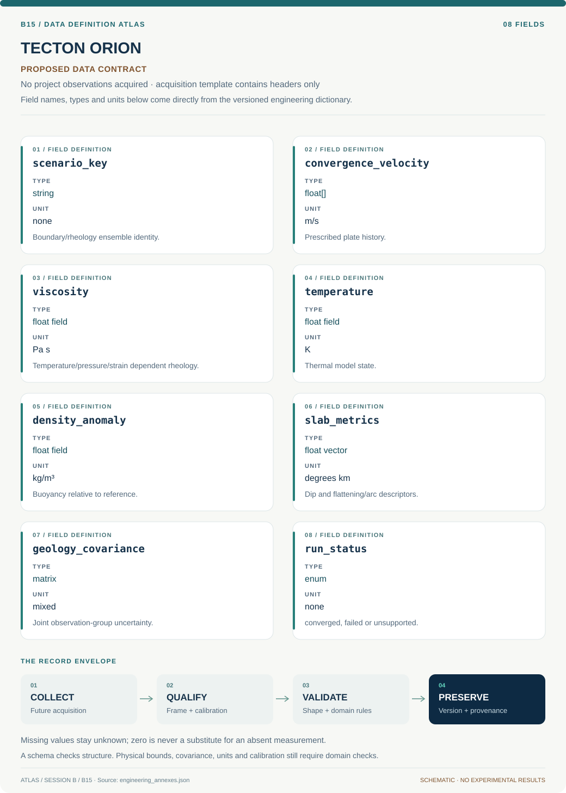

# B15 · Figure gallery

[TECTON ORION — Farallon Slab Reconstruction](../README.md) · [Data blueprint](../data/README.md) · [Data diagnostic gallery](../../../../data/figures/README.md)

## Engineering architecture

The model diagram couples mechanical and thermal physics while gating inference on numerical verification and independent geological groups. It exposes ancient-boundary and dimensionality uncertainty rather than claiming one recovered tectonic history.

[SVG](architecture.svg) · [Editable Mermaid source](architecture.mmd)

## Data blueprint

**Proposed contract · observations pending.** Every field, type, unit and meaning comes from the controlled dictionary. [Open SVG](data-map.svg) · [Download dictionary](../data/dictionary.csv)

## Planned scientific result

Animate temperature/slab sections and compare geological constraints; show credible mechanism regions rather than one preferred image.

This final scientific result remains an execution deliverable; the design diagrams do not establish an empirical finding.
