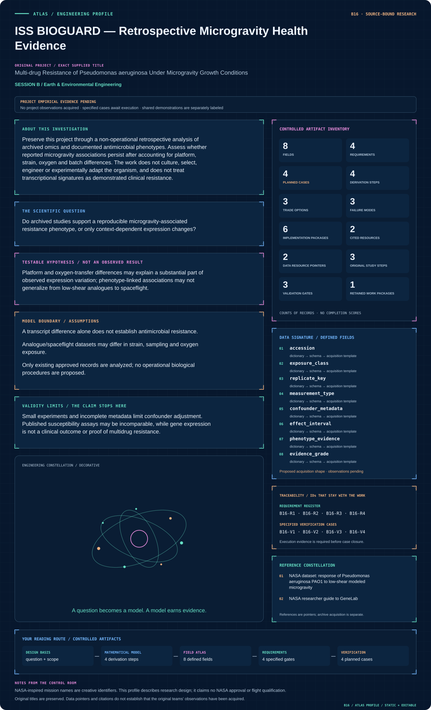
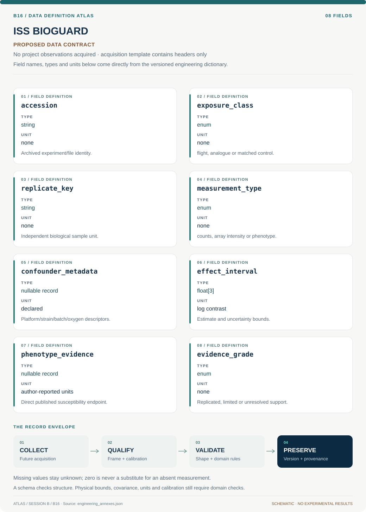

# B16 · ISS BIOGUARD — Retrospective Microgravity Health Evidence

**Original project:** Multi-drug Resistance of Pseudomonas aeruginosa Under Microgravity Growth Conditions

**Session B:** Earth & Environmental Engineering

**Document class:** engineering research design and analysis record · **Revision:** 4 · **Date:** 2026-10-02

**Evidence state:** design basis, mathematical formulation and verification plan documented. Project-specific empirical results remain to be acquired; executable shared model demonstrations have their own recorded checks.

[Session B](../README.md) · [All projects](../../../ENGINEERING_DOCUMENTATION.md) · [Session handbook](../../../handbooks/SESSION_B.md) · [← B15](../B15-tecton-orion-farallon-slab-reconstruction/README.md) · [B17 →](../B17-aquarius-lifeline-inland-fisheries-resilience/README.md)

| Proposed requirements | Specified verification cases | Defined data fields | Cited resources |
| ---: | ---: | ---: | ---: |
| 4 | 4 | 8 | 2 |

[Explore the data blueprint](data/README.md) · [Open the figure gallery](figures/README.md) · [Download acquisition template](data/acquisition.csv) · [Browse the data atlas](../../../data/README.md)

---

## Mission profile



| Profile panel | Engineering signal | Open the evidence |
| --- | --- | --- |
| Mission identity | Multi-drug Resistance of Pseudomonas aeruginosa Under Microgravity Growth Conditions | [Scientific objective](#purpose-and-scientific-objective) |
| Model cockpit | 3 governing expressions; 4 derivation steps; declared assumptions and validity envelope | [Mathematical formulation](#4-mathematical-model-and-derivation) |
| Data blueprint | 8 proposed fields with types, units and quality rules | [Field map & downloads](data/README.md) |
| Verification queue | 4 proposed requirements; 4 specified cases; project execution evidence pending | [Case definitions](#8-verification-and-validation-cases) |
| Figure wall | Architecture, field map, planned result description | [Open full gallery](figures/README.md) |
| Resource library | 2 cited primary resources with support statements | [Cited resources](#12-cited-technical-and-scientific-resources) |

### Model cockpit

**Analysis method:** Audit archived experiment metadata, control matching and biological-replicate counts before analysis. Apply a documented omics pipeline with batch/platform covariates, false-discovery control and sensitivity to oxygen/strain confounding. Connect findings only to directly reported phenotype evidence using an evidence matrix; where phenotypes are absent, retain the claim as unresolved. Cross-study meta-analysis emphasizes broad health-risk evidence and replication rather than ranking actionable resistance targets.

**Operating envelope:** Small experiments and incomplete metadata limit confounder adjustment. Published susceptibility assays may be incomparable, while gene expression is not a clinical outcome or proof of multidrug resistance.

**Variables and conventions**

- Counts: reads per gene/sample; offsets: library normalization.
- β: log-expression contrast; φ: dispersion; uncertainty retained.
- Exposure: documented flight/analogue/control category, not assumed equivalent.
- Phenotypes: author-reported susceptibility measures with units and test standards.

### Artifact wall



The diagram confines the project to archived retrospective analysis and separates expression from directly reported phenotype evidence. Confounding and absent endpoints remain explicit limits, with no organism manipulation or treatment interpretation.

**Scientific result to produce:** Display studies by platform and endpoint, separating measured susceptibility from expression associations, with confidence intervals and metadata gaps.

### Investigation feed · planned work

The feed records proposed work packages. A row becomes executed evidence only with versioned inputs, outputs and a reviewed result.

| Sequence | Evidence state | Engineering work package |
| --- | --- | --- |
| 01 | Planned | Create an accession/availability manifest and a nonoperational scope statement. |
| 02 | Planned | Audit control matching, replicate identity and design-matrix rank. |
| 03 | Planned | Implement compatible retrospective measurement branches with versioned normalization. |
| 04 | Planned | Save aggregate effects, multiplicity control and confounder sensitivity artifacts. |
| 05 | Planned | Build a separate phenotype evidence matrix and study-heterogeneity report. |
| 06 | Planned | Release reproducible analytical provenance and unresolved health-evidence conclusions. |

### Mission connections

Connections are reading routes based on actual shared resources, supplied sessions or included illustrations. They do not establish physical dependencies, team collaborations or validated results.

| Connected mission | Original investigation | Recorded connection basis |
| --- | --- | --- |
| [B15 · TECTON ORION — Farallon Slab Reconstruction](../B15-tecton-orion-farallon-slab-reconstruction/README.md) | Numerical simulation of Laramide flat-slab subduction | Session B |
| [B17 · AQUARIUS LIFELINE — Inland Fisheries Resilience](../B17-aquarius-lifeline-inland-fisheries-resilience/README.md) | Off the Hook: Assessing the Vulnerability of Inland Subsistence Fisheries to Climate Change | Session B |
| [B14 · PHOENIX INFILTRATION — Postfire Soil Recovery Observatory](../B14-phoenix-infiltration-postfire-soil-recovery-observatory/README.md) | Soil hydraulic properties three years after the Frye Fire on Mount Graham, Arizona | Session B |
| [B18 · POSEIDON WINDCARBON — Southern Ocean Carbon Mission](../B18-poseidon-windcarbon-southern-ocean-carbon-mission/README.md) | Assessing the Role of the Winds in the Biogeochemical Cycling and Carbon Budget of the Southern Ocean | Session B |
| [B13 · GAIA PIXELSCOUT — Ecological Instance Mapping](../B13-gaia-pixelscout-ecological-instance-mapping/README.md) | Instance Segmentation for Biogeography | Session B |
| [B19 · PARKER PLASMA WHISPER — Electron Structure Observatory](../B19-parker-plasma-whisper-electron-structure-observatory/README.md) | Investigation of Electron Parameters and Association with Structures using Quasi-thermal Noise Spectroscopy (QTN) | Session B |

[Machine-readable connection register and ranking rule](../../../registry/mission_connections.json)

### Reading playlist

| Route | Start here | Continue to |
| --- | --- | --- |
| Understand the idea | [Scientific objective](#purpose-and-scientific-objective) | [Design boundary](#1-design-basis-and-analysis-boundary) → [Mathematics](#4-mathematical-model-and-derivation) |
| Inspect the data | [Visual blueprint](data/README.md) | [Provenance](#5-data-specifications-and-provenance) → [Uncertainty](#6-uncertainty-sensitivity-and-identifiability) |
| Make a design decision | [Trade study](#7-engineering-trade-study) | [Failure modes](#10-failure-modes-and-interpretation-controls) → [Required outputs](#11-required-engineering-outputs) |
| Prepare execution | [Requirements](#2-requirements-and-verification-traceability) | [Verification](#8-verification-and-validation-cases) → [Implementation](#9-implementation-and-reproducible-work-packages) |

## Complete engineering dossier

The profile above is a browsing layer. The full design basis, equations, derivations, data contract, uncertainty, trades and controlled case definitions follow.

## Purpose and scientific objective

Preserve this project through a non-operational retrospective analysis of archived omics and documented antimicrobial phenotypes. Assess whether reported microgravity associations persist after accounting for platform, strain, oxygen and batch differences. The work does not culture, select, engineer or experimentally adapt the organism, and does not treat transcriptional signatures as demonstrated clinical resistance.

**Question:** Do archived studies support a reproducible microgravity-associated resistance phenotype, or only context-dependent expression changes?

**Testable hypothesis:** Platform and oxygen-transfer differences may explain a substantial part of observed expression variation; phenotype-linked associations may not generalize from low-shear analogues to spaceflight.

## 1. Design basis and analysis boundary

The retained project is a nonclinical, nonoperational analysis of existing archived omics and author-reported antimicrobial phenotypes. It evaluates whether published microgravity associations survive platform, strain, oxygen and batch confounding. The boundary excludes organism growth, selection, adaptation, genetic construction and any operational instructions; outputs concern evidence quality and reproducibility rather than actionable resistance targets.

Begin with an archive metadata/control-matching audit, then standardized retrospective expression contrasts and cross-study heterogeneity. NASA records provide an analogue-study access route, not proof that analogue exposure equals spaceflight or that expression establishes multidrug resistance. Phenotype evidence is included only when directly reported with assay definitions. Missing phenotypes remain unresolved and no clinical treatment recommendation follows.

## 2. Requirements and verification traceability

These are project design requirements or proposed analysis gates. A numerical target is not a NASA requirement unless its controlling source is explicitly identified. “TBD” identifies evidence required before a decision; it is not permission to assume a value. Verification evidence listed here is planned, unless a linked result explicitly records execution.

| ID | Requirement / gate | Engineering rationale | Verification method | Basis / required evidence |
| --- | --- | --- | --- | --- |
| B16-R1 | Every sample shall retain study, exposure platform, strain label, biological-replicate identity and available batch/oxygen metadata. | Exposure confounding can overwhelm a small study. | Metadata matrix and design-rank audit. | NASA archive provenance. |
| B16-R2 | Classify evidence separately as author-reported susceptibility, expression association or mechanistic speculation. | Transcripts cannot establish resistance. | Evidence-table lineage review. | Existing scope distinction. |
| B16-R3 | Proposed inferential reporting uses Benjamini–Hochberg adjusted q<=0.05 for declared expression families, alongside effect intervals and replication. | Multiple comparisons need transparent control. | Recompute adjusted values on synthetic p-values. | Proposed analysis convention. |
| B16-R4 | Release only retrospective aggregate evidence and pipeline provenance; no prioritized enhancement targets or biological procedures. | Keeps the work within its authorized analytical scope. | Deliverable content review. | Nonoperational project boundary. |

## 3. Architecture and controlled interfaces

A metadata adapter resolves archived sample/control groups, library or platform measurements, replicate units and exposure categories. An assay registry distinguishes RNA sequencing counts from array intensities and phenotype measures; unsupported platform mixing is blocked. Public accession and checksum manifests specify which files are actually available.

The analysis branch models broad retrospective expression contrasts with batch covariates only when identifiable. A separate evidence matrix links published phenotype definitions without imputing resistance from expression. Study-level effects and standard errors feed heterogeneity analysis. Missing oxygen/strain metadata, rank-deficient designs and noncomparable phenotypes propagate uncertainty grades, rather than being repaired through guessed values.


The diagram confines the project to archived retrospective analysis and separates expression from directly reported phenotype evidence. Confounding and absent endpoints remain explicit limits, with no organism manipulation or treatment interpretation.

[Editable engineering diagram source](figures/architecture.mmd)

## 4. Mathematical model and derivation

### Governing equations

```text
Count_gs∼NegativeBinomial(μ_gs,φ_g); log μ_gs=offset_s+β_g exposure_s+γ_gᵀ metadata_s.
```

```text
Effect_study=β_common+u_study, with heterogeneity estimated across datasets.
```

```text
Evidence_grade separates measured susceptibility, expression association and mechanistic speculation.
```

### Variables, units and conventions

- Counts: reads per gene/sample; offsets: library normalization.
- β: log-expression contrast; φ: dispersion; uncertainty retained.
- Exposure: documented flight/analogue/control category, not assumed equivalent.
- Phenotypes: author-reported susceptibility measures with units and test standards.

### Assumptions and boundary conditions

- A transcript difference alone does not establish antimicrobial resistance.
- Analogue/spaceflight datasets may differ in strain, sampling and oxygen exposure.
- Only existing approved records are analyzed; no operational biological procedures are proposed.

### Derivation step 1

```text
Y_gs~NB(mu_gs,phi_g); log mu_gs=log L_s+beta_g X_s+gamma_g^T Z_s.
```

L is a documented library normalization offset. Counts are dimensionless; beta is a log-expression contrast and requires exposure not perfectly confounded with batch.

### Derivation step 2

```text
rank([X Z])<number_of_columns implies nonidentifiable coefficients.
```

A metadata audit can show that platform or strain perfectly predicts exposure; in that case no adjusted microgravity-specific effect is estimated.

### Derivation step 3

```text
beta_hat_k=beta_common+u_k+epsilon_k; Var=u_variance+s_k².
```

Study-level sampling error and between-study heterogeneity are separate. Noncomparable endpoints remain separate analyses.

### Derivation step 4

```text
I^2=max(0,(Q-df)/Q) for Q>0; q=BH(p). For Q=0 report the adopted I^2=0 convention, and separately mark heterogeneity unestimable when the number of comparable studies is insufficient.
```

Heterogeneity and multiplicity summaries describe statistical evidence, not clinical resistance, causal mechanism or operational biological performance.

### Inference or simulation procedure

Audit archived experiment metadata, control matching and biological-replicate counts before analysis. Apply a documented omics pipeline with batch/platform covariates, false-discovery control and sensitivity to oxygen/strain confounding. Connect findings only to directly reported phenotype evidence using an evidence matrix; where phenotypes are absent, retain the claim as unresolved. Cross-study meta-analysis emphasizes broad health-risk evidence and replication rather than ranking actionable resistance targets.

### Validity domain and fidelity limits

Small experiments and incomplete metadata limit confounder adjustment. Published susceptibility assays may be incomparable, while gene expression is not a clinical outcome or proof of multidrug resistance.

## 5. Data specifications and provenance



**Proposed data contract · observations pending.** This visual inventory shows the record fields to acquire or derive. It contains no project measurements. [Open the data blueprint and downloads](data/README.md).

| Field | Type | Unit | Physical / statistical meaning | Quality and missing-data rule |
| --- | --- | --- | --- | --- |
| accession | string | none | Archived experiment/file identity. | Actual availability and checksums recorded. |
| exposure_class | enum | none | flight, analogue or matched control. | Categories never assumed equivalent. |
| replicate_key | string | none | Independent biological sample unit. | Technical replicates linked, not independent. |
| measurement_type | enum | none | counts, array intensity or phenotype. | Select compatible analysis branch. |
| confounder_metadata | nullable record | declared | Platform/strain/batch/oxygen descriptors. | Unknown remains null. |
| effect_interval | float[3] | log contrast | Estimate and uncertainty bounds. | Design rank and family recorded. |
| phenotype_evidence | nullable record | author-reported units | Direct published susceptibility endpoint. | No inference from expression alone. |
| evidence_grade | enum | none | Replicated, limited or unresolved support. | Reasons and source links retained. |

[Machine-readable record schema](data/schema.json) · [Empty acquisition CSV](data/acquisition.csv) · [Field dictionary CSV](data/dictionary.csv)

The CSV above contains column headers only. Its schema defines future records and does not establish that original-team data or a particular archive product have been acquired. Frame, timing, calibration, covariance, selection and provenance details must accompany populated records.

### NASA dataset: response of Pseudomonas aeruginosa PAO1 to low-shear modeled microgravity

[Product, archive or reference](https://data.nasa.gov/dataset/response-of-pseudomonas-aeruginosa-pao1-to-low-shear-modeled-microgravity-ff431)

**Fields:** Archived expression data, platform/strain metadata and controls.

**Access:** Public NASA catalog; follow its linked repository and record exact accession/version before use.

**Role:** Retrospective observations and platform audit.

### NASA researcher guide to GeneLab

[Product, archive or reference](https://www.nasa.gov/science-research/for-researchers/researchers-guide-to-genelab/)

**Fields:** Space-biology archive access and experiment metadata guidance.

**Access:** Public NASA guide; dataset-level licenses and access may vary.

**Role:** Reproducible reuse framework.

## 6. Uncertainty, sensitivity and identifiability

Small experiments, incomplete oxygen/strain metadata and platform differences restrict adjustment. Examine design rank before fitting; a confounded factor cannot be rescued by adding more coefficients. Use sensitivity analyses that omit unsupported contrasts and report the resulting evidence gap. Technical replicates do not increase independent biological sample size.

Normalization, dispersion and study heterogeneity affect expression intervals. Compare documented compatible analysis choices and leave one study out, while keeping broad endpoint-level reporting. Phenotype assay incompatibility contributes a separate evidence uncertainty that meta-analysis cannot erase. A reproducible association is still neither clinical multidrug resistance nor proof of a gravity-specific mechanism.

## 7. Engineering trade study

| Alternative | Benefit | Cost / limitation | Decision rule |
| --- | --- | --- | --- |
| Metadata-only evidence audit | Safest inference when raw files/confounders are incomplete. | Cannot estimate adjusted effects. | Default for unavailable or rank-deficient studies. |
| Compatible-platform retrospective model | Quantifies expression association with uncertainty. | Small samples and residual confounding remain. | Use only with identified design contrasts. |
| Study-level evidence synthesis | Tests consistency across existing reports. | Endpoint/platform heterogeneity limits pooling. | Pool only genuinely comparable aggregate endpoints. |

## 8. Verification and validation cases

| Case ID | Stimulus / condition | Expected result / criterion | Method | Evidence artifact |
| --- | --- | --- | --- | --- |
| B16-V1 | Null contrast | Effect centers on zero with nominal uncertainty; no resistance conclusion. | Condition/fixture: Synthetic matched data have identical group distributions. Verification procedure: Known-null statistical fixture.. | Known-null statistical fixture. |
| B16-V2 | Perfect batch confounding | Design is rank deficient and adjusted effect is blocked. | Condition/fixture: Exposure column equals batch column. Verification procedure: Linear-algebra rank check.. | Linear-algebra rank check. |
| B16-V3 | Duplicate technical replicate | Independent sample count remains unchanged. | Condition/fixture: Add a duplicate measurement of one biological sample. Verification procedure: Metadata/pipeline integration test.. | Metadata/pipeline integration test. |
| B16-V4 | Study holdout | Report prediction/contrast consistency and unresolved metadata limits. | Condition/fixture: Reserve a complete archived study. Verification procedure: Leave-study-out synthesis.. | Leave-study-out synthesis. |

**Execution status:** these cases are specified, not claimed as executed. Close a case only with the versioned inputs, output, uncertainty, reviewer and pass/fail rationale.

### Additional scientific validation gates

- Hold out studies/platforms, not technical replicates.
- Require measured phenotype evidence for resistance claims and report assay comparability.
- Use negative-control contrasts, batch diagnostics and confounder sensitivity; publish null/unstable findings and interval coverage.

## 9. Implementation and reproducible work packages

1. Create an accession/availability manifest and a nonoperational scope statement.
2. Audit control matching, replicate identity and design-matrix rank.
3. Implement compatible retrospective measurement branches with versioned normalization.
4. Save aggregate effects, multiplicity control and confounder sensitivity artifacts.
5. Build a separate phenotype evidence matrix and study-heterogeneity report.
6. Release reproducible analytical provenance and unresolved health-evidence conclusions.

### Investigation sequence

1. Stage 1: inventory accessible studies and metadata, specify comparison eligibility and separate phenotype from omics endpoints.
2. Stage 2: estimate adjusted study-level associations with false-discovery and heterogeneity analyses.
3. Stage 3: test an independent archived study and deliver an evidence-gap report for spacecraft health research.

### Resources and interfaces to expertise

- Space-biology bioinformatician and clinical-microbiology evidence reviewer.
- Read-only public omics pipeline, accession manifest and approved phenotype literature.

## 10. Failure modes and interpretation controls

| Failure mode | Effect on result | Detection / evidence | Design response |
| --- | --- | --- | --- |
| Expression called resistance | Unsupported clinical claim. | Evidence-grade audit. | Require direct reported phenotype. |
| Analogue equated flight | Overgeneralized gravity association. | Exposure-category review. | Separate platform effects. |
| Confounded adjusted estimate | Spurious causal contrast. | Rank and sensitivity diagnostics. | Report nonidentifiability. |

- Operationalizing results into resistance enhancement.
- Confusing low-shear analogues with true microgravity.
- Overclaiming phenotype from omics or incomplete controls.

## 11. Required engineering outputs

- Metadata/comparability audit and reproducible analysis.
- Phenotype-versus-expression evidence matrix.
- Replication and crew-health research-gap report.

### Scientific result figures to produce during execution

Display studies by platform and endpoint, separating measured susceptibility from expression associations, with confidence intervals and metadata gaps.

## 12. Cited technical and scientific resources

- [NASA dataset: response of Pseudomonas aeruginosa PAO1 to low-shear modeled microgravity](https://data.nasa.gov/dataset/response-of-pseudomonas-aeruginosa-pao1-to-low-shear-modeled-microgravity-ff431) — Archived microgravity-analogue dataset supports retrospective omics analysis; analogue exposure is not equivalent to true spaceflight.
- [NASA researcher guide to GeneLab](https://www.nasa.gov/science-research/for-researchers/researchers-guide-to-genelab/) — Explains public space-biology omics reuse and associated experiment metadata.

Framework and evidence rules: [engineering documentation standard](../../../engineering/ENGINEERING_STANDARD.md), [model assurance](../../../engineering/MODEL_ASSURANCE.md), [uncertainty procedure](../../../engineering/UNCERTAINTY_AND_DECISION_RULES.md), [data management](../../../engineering/DATA_MANAGEMENT.md). NASA-inspired names are creative identifiers; requirements and results are not NASA certification.
