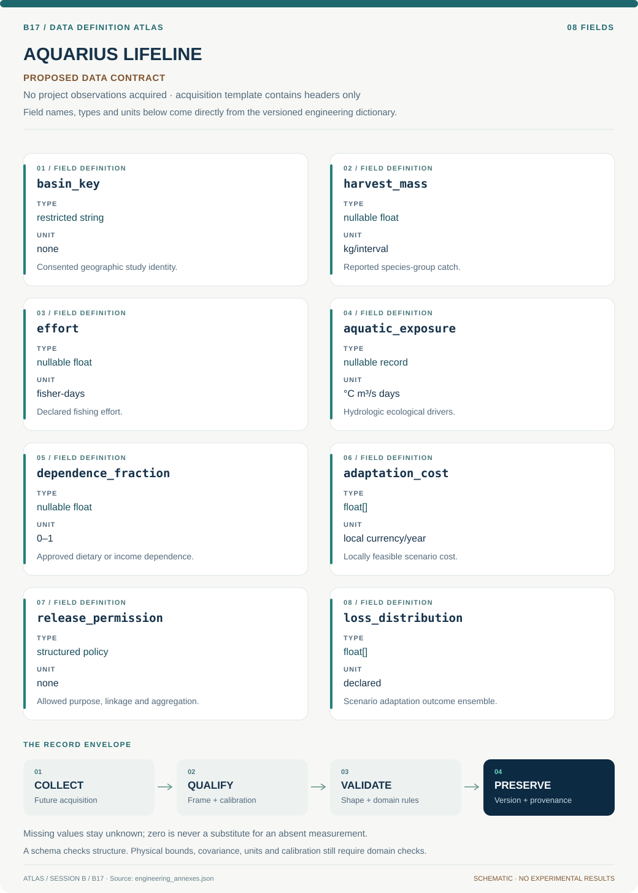

# B17 · AQUARIUS LIFELINE — Inland Fisheries Resilience

**Original project:** Off the Hook: Assessing the Vulnerability of Inland Subsistence Fisheries to Climate Change

**Session B:** Earth & Environmental Engineering

**Document class:** engineering research design and analysis record · **Revision:** 3 · **Date:** 2026-10-02

**Evidence state:** design basis, mathematical formulation and verification plan documented. Project-specific empirical results remain to be acquired; executable shared model demonstrations have their own recorded checks.

[Session B](../README.md) · [All projects](../../../ENGINEERING_DOCUMENTATION.md) · [Session handbook](../../../handbooks/SESSION_B.md) · [← B16](../B16-iss-bioguard-retrospective-microgravity-health-evidence/README.md) · [B18 →](../B18-poseidon-windcarbon-southern-ocean-carbon-mission/README.md)

| Proposed requirements | Specified verification cases | Defined data fields | Cited resources |
| ---: | ---: | ---: | ---: |
| 4 | 4 | 8 | 3 |

[Explore the data blueprint](data/README.md) · [Open the figure gallery](figures/README.md) · [Download acquisition template](data/acquisition.csv) · [Browse the data atlas](../../../data/README.md)

---

## Purpose and scientific objective

Assess climate vulnerability as the interaction of aquatic exposure, ecological sensitivity and household dependence, with local knowledge and governance central to interpretation. Build a transparent scenario model for one consented basin before scaling. Avoid reducing communities to a universal vulnerability score or equating fishery-production changes with measured food insecurity.

**Question:** Which climate and access stresses most threaten dependable subsistence harvest, and which feasible adaptations reduce downside risk?

**Testable hypothesis:** Seasonal hydrologic extremes combined with high dietary dependence and constrained alternatives may matter more than annual mean warming alone; adaptation effects will differ among households and governance systems.

## 1. Design basis and analysis boundary

The fisheries system is a basin-specific, community-governed scenario analysis joining consented catch/effort histories, aquatic exposure and household dependence. Basin identity, species groups and permissions are TBD until an actual partnership defines them. The engineering decision is comparison of locally feasible adaptations under ecological and access uncertainty, rather than a universal vulnerability ranking or inferred food-insecurity diagnosis.

Begin with a transparent exposure/dependence inventory and missing-harvest bounds. Promote to a biomass/harvest state model only where effort and ecological records identify it. FAO assessments motivate separate exposure, sensitivity and adaptive-capacity pathways; local weights and adaptation losses remain participatory choices. CARE governance complements, and does not replace, community-specific authority over knowledge, linkage and release.

## 2. Requirements and verification traceability

These are project design requirements or proposed analysis gates. A numerical target is not a NASA requirement unless its controlling source is explicitly identified. “TBD” identifies evidence required before a decision; it is not permission to assume a value. Verification evidence listed here is planned, unless a linked result explicitly records execution.

| ID | Requirement / gate | Engineering rationale | Verification method | Basis / required evidence |
| --- | --- | --- | --- | --- |
| B17-R1 | No household/harvest linkage or public release shall occur without recorded community data authority, permitted purpose and aggregation rules. | Subsistence knowledge is not automatically public data. | Governance-policy and export audit. | CARE framework and local rules. |
| B17-R2 | Catch shall retain species, period, effort unit, gear/access context and reporting coverage; informal harvest is not assigned zero. | Recorded catch may omit subsistence activity. | Completeness and missing-harvest review. | FAO context; proposed contract. |
| B17-R3 | Model ecological biomass change, access restriction and household dependence as separate pathways. | A smaller catch may reflect effort or access. | Endpoint/model-structure review. | Existing vulnerability distinction. |
| B17-R4 | Adaptation rankings shall publish scenario distributions and sensitivity to locally selected weights/costs. | Values and uncertain futures shape priorities. | Independent multiobjective recomputation. | Participatory design requirement. |

## 3. Architecture and controlled interfaces

A restricted catch table records harvest kg per interval, effort fisher-days and species/gear metadata. Hydrologic adapters supply temperature °C, discharge m³/s and flood duration days with coverage. A community knowledge layer stores access rules and observations under its own permission policy rather than flattening narrative evidence into an assumed numeric score.

The ecological model emits biomass/availability ensembles; an access module determines feasible harvest opportunity. A household dependence adapter uses approved dietary/income fractions with survey uncertainty. Adaptation scenarios change specified access, exposure or livelihood terms and retain costs in stated local currency/year. The release service aggregates only permitted products and exposes omitted knowledge instead of claiming that a public table captures all community experience.



The architecture preserves community authority and separates ecological, access and livelihood pathways. It supports basin-specific adaptation comparison while exposing missing harvest, uncertain catchability and the value choices behind any score.

[Editable engineering diagram source](figures/architecture.mmd)

## 4. Mathematical model and derivation

### Governing equations

```text
Harvest_st=Effort_st×Catchability_st×Biomass_st+ε_st.
```

```text
Biomass_(t+1)=Biomass_t+Recruitment_t−NaturalLoss_t−Harvest_t.
```

```text
V_g=f(Exposure_g,Sensitivity_g,AdaptiveCapacity_g); weights are participatory/scenario-defined.
```

### Variables, units and conventions

- Harvest/biomass: kg; effort: fisher-days or documented gear effort.
- Water temperature: °C; discharge: m³/s; flood duration: days.
- Dependence: dietary/income fractions; adaptation costs: local currency.
- V: transparent scenario index, not a clinical or universal causal metric.

### Assumptions and boundary conditions

- Recorded catch may omit informal/subsistence harvest.
- Effort and catchability change with climate, access and gear.
- Community/Indigenous data rights govern collection, linkage and release.

### Derivation step 1

```text
H_t=E_t q_t B_t+epsilon_t.
```

Harvest H is kg per interval, effort E is fisher-days, biomass B is kg and q has fisher-day^-1 units. Catchability is not constant when gear or habitat availability changes.

### Derivation step 2

```text
B_(t+1)=B_t+R_t-M_t-H_t.
```

All additions/losses are kg over the same interval. Negative states trigger infeasibility or a constrained model, not plausible negative fish biomass.

### Derivation step 3

```text
d_g=H_subsistence,g/food_or_income_total,g.
```

Numerator and denominator require the same dietary mass/energy or income basis; monetary and nutrition dependence remain separate variables.

### Derivation step 4

```text
L_g(a,omega)=w_E L_ecology+w_A L_access+w_D L_dependence+C_g(a).
```

Loss components must be normalized or share units before combination. Weights are approved preferences, and scenario omega includes climate/nonclimate stresses.

### Inference or simulation procedure

Combine consented catch/effort histories, hydrology, fish ecological tolerances and participatory household dependence assessments. Fit a state-space harvest/biomass model or simpler exposure-response model where data are limited. Separate ecological, access and livelihood pathways; propagate alternative climate/hydrologic scenarios and missing harvest into downside-risk estimates. Compare locally feasible adaptations using distributions of benefits, costs and access consequences, without presenting assumed capacity as measured resilience.

### Validity domain and fidelity limits

Species composition and informal catch may be poorly observed. Scenario uncertainty and nonclimate stresses such as dams or access restrictions can dominate; composite weights reflect values as well as evidence.

## 5. Data specifications and provenance



**Proposed data contract · observations pending.** This visual inventory shows the record fields to acquire or derive. It contains no project measurements. [Open the data blueprint and downloads](data/README.md).

| Field | Type | Unit | Physical / statistical meaning | Quality and missing-data rule |
| --- | --- | --- | --- | --- |
| basin_key | restricted string | none | Consented geographic study identity. | Partner authority and scope required. |
| harvest_mass | nullable float | kg/interval | Reported species-group catch. | Coverage and informal-catch uncertainty retained. |
| effort | nullable float | fisher-days | Declared fishing effort. | Gear and access changes documented. |
| aquatic_exposure | nullable record | °C m³/s days | Hydrologic ecological drivers. | Covariance and seasonal support saved. |
| dependence_fraction | nullable float | 0–1 | Approved dietary or income dependence. | Basis/time period explicit. |
| adaptation_cost | float[] | local currency/year | Locally feasible scenario cost. | Price year and distribution retained. |
| release_permission | structured policy | none | Allowed purpose, linkage and aggregation. | Revocation and local standards honored. |
| loss_distribution | float[] | declared | Scenario adaptation outcome ensemble. | Weights and unavailable pathways disclosed. |

[Machine-readable record schema](data/schema.json) · [Empty acquisition CSV](data/acquisition.csv) · [Field dictionary CSV](data/dictionary.csv)

The CSV above contains column headers only. Its schema defines future records and does not establish that original-team data or a particular archive product have been acquired. Frame, timing, calibration, covariance, selection and provenance details must accompany populated records.

### FAO impacts of climate change on fisheries and aquaculture

[Product, archive or reference](https://www.fao.org/family-farming/detail/en/c/1145404/)

**Fields:** Official climate-impact framework for inland fisheries and dependence.

**Access:** Public FAO report; local basin data are additional, permission-dependent inputs.

**Role:** Exposure/sensitivity framing.

### FAO vulnerability of fishing-dependent economies to disasters

[Product, archive or reference](https://www.fao.org/4/i3328e/i3328e00.htm)

**Fields:** Fishing-dependent vulnerability and disaster context.

**Access:** Public FAO circular; no guarantee of household microdata.

**Role:** Adaptive-capacity and livelihood endpoint design.

## 6. Uncertainty, sensitivity and identifiability

Informal harvest, changing effort and catchability confound biomass inference. Bound missing catch using community-approved evidence and compare constant versus time-varying catchability. If effort histories are absent, retain exposure-response scenarios rather than identify biomass from catch alone. Hydrologic gaps and species shifts add ecological model discrepancy.

Climate scenarios, dam operations, access rules and household dependence can all change together. Preserve their joint scenarios and report adaptation rank reversals across locally chosen weights. Use withheld seasons/basins only where sharing permissions allow it. Composite uncertainty includes values as well as data; no single confidence interval converts a participatory index into objective universal vulnerability.

## 7. Engineering trade study

| Alternative | Benefit | Cost / limitation | Decision rule |
| --- | --- | --- | --- |
| Exposure/dependence dashboard | Transparent with limited records. | Cannot infer fish biomass or causal livelihood loss. | Default when catch/effort support is weak. |
| State-space harvest model | Separates observation and population dynamics. | Catchability and unreported harvest may confound. | Adopt only with independent ecological/effort evidence. |
| Participatory adaptation scenarios | Includes feasibility and local priorities. | Requires ongoing governance and value choices. | Preferred decision layer across model fidelities. |

## 8. Verification and validation cases

| Case ID | Stimulus / condition | Expected result / criterion | Method | Evidence artifact |
| --- | --- | --- | --- | --- |
| B17-V1 | Zero effort | Expected modeled harvest is zero. | Condition/fixture: Set E=0 with finite B and q. Verification procedure: Analytic observation fixture.. | Analytic observation fixture. |
| B17-V2 | Closed stock balance | Next biomass is 105 kg. | Condition/fixture: B=100, R=20, M=5, H=10 kg/interval. Verification procedure: Independent mass-ledger test.. | Independent mass-ledger test. |
| B17-V3 | Catchability ambiguity | Expected catch is identical, exposing nonidentifiability. | Condition/fixture: Two scenarios double B and halve q. Verification procedure: Likelihood/sensitivity fixture.. | Likelihood/sensitivity fixture. |
| B17-V4 | Permission revoked | Export is blocked while governed internal provenance is retained per policy. | Condition/fixture: Synthetic partner policy withdraws public linkage. Verification procedure: Access-control integration test.. | Access-control integration test. |

**Execution status:** these cases are specified, not claimed as executed. Close a case only with the versioned inputs, output, uncertainty, reviewer and pass/fail rationale.

### Additional scientific validation gates

- Hold out seasons or river reaches; compare with persistence and hydrology-only baselines.
- Validate catch/effort definitions through consenting independent records and local review.
- Report ecological prediction error separately from livelihood assessment, with scenario-weight sensitivity and distributional effects.

## 9. Implementation and reproducible work packages

1. Establish basin partnership, data authority and locally defined decision endpoints.
2. Create catch/effort, hydrology and restricted knowledge schemas with permitted uses.
3. Audit missing harvest and identifiability before choosing ecological model fidelity.
4. Build joint climate/access/nonclimate scenario ensembles and household dependence intervals.
5. Compare locally feasible adaptations with independent loss/weight sensitivity calculations.
6. Release approved aggregated products, unresolved evidence and community review records.

### Investigation sequence

1. Stage 1: choose a basin with community partners, establish data governance and map ecological/access/livelihood pathways.
2. Stage 2: fit transparent models and climate/hydrology ensembles; compare participatory adaptation alternatives and missing-data sensitivity.
3. Stage 3: validate withheld seasons/locations and return accessible results with ownership, uncertainties and decision triggers.

### Resources and interfaces to expertise

- Fisheries ecologist, hydrologist, community/Indigenous representatives and social researcher.
- Consent-governed catch records, climate ensembles and participatory decision tools.

## 10. Failure modes and interpretation controls

| Failure mode | Effect on result | Detection / evidence | Design response |
| --- | --- | --- | --- |
| Unreported catch coded zero | False low dependence or abundance. | Coverage/knowledge review. | Missing-harvest bounds. |
| Access loss called ecological decline | Wrong adaptation response. | Compare effort/access histories. | Separate model pathways. |
| Universal score imposed | Misrepresented community priorities. | Weight and consent review. | Participatory distributions and governance. |

- Extractive data collection or disclosure of sensitive fishing locations.
- Underreported subsistence catch and value-dependent scoring.
- Adaptations transferring costs to vulnerable households.

## 11. Required engineering outputs

- Basin-specific vulnerability/evidence atlas.
- Harvest/hydrology ensemble and adaptation comparison.
- Community-owned monitoring indicators and data governance.

### Scientific result figures to produce during execution

Show habitat/flow scenarios alongside community-defined dependence and access indicators; compare adaptation outcomes with uncertainty and agreed aggregation.

## 12. Cited technical and scientific resources

- [FAO impacts of climate change on fisheries and aquaculture](https://www.fao.org/family-farming/detail/en/c/1145404/) — Authoritative sector assessment supports exposure, dependence and adaptive-capacity distinctions.
- [FAO vulnerability of fishing-dependent economies to disasters](https://www.fao.org/4/i3328e/i3328e00.htm) — Fisheries vulnerability framework supports household and community dimensions beyond ecological exposure.
- [Global Indigenous Data Alliance, CARE Principles for Indigenous Data Governance](https://www.gida-global.org/careprinciples) — Primary governance framework supporting collective benefit, authority to control, responsibility and ethics; local community standards and permissions govern actual linkage and release.

Framework and evidence rules: [engineering documentation standard](../../../engineering/ENGINEERING_STANDARD.md), [model assurance](../../../engineering/MODEL_ASSURANCE.md), [uncertainty procedure](../../../engineering/UNCERTAINTY_AND_DECISION_RULES.md), [data management](../../../engineering/DATA_MANAGEMENT.md). NASA-inspired names are creative identifiers; requirements and results are not NASA certification.
