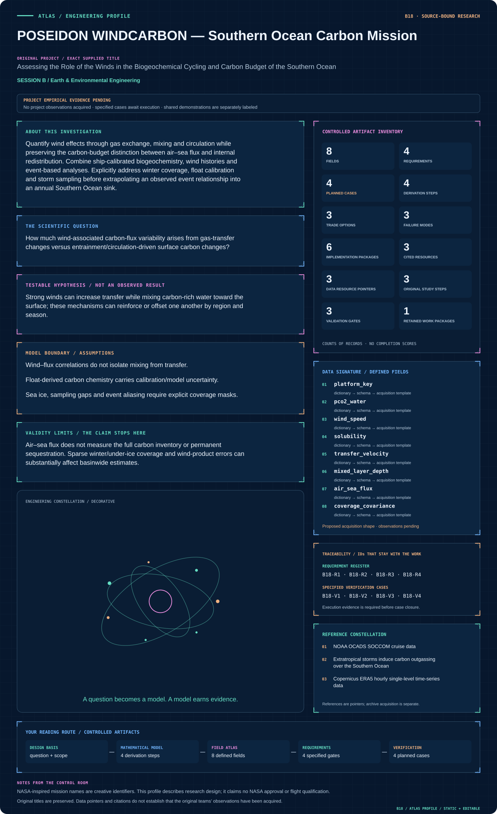
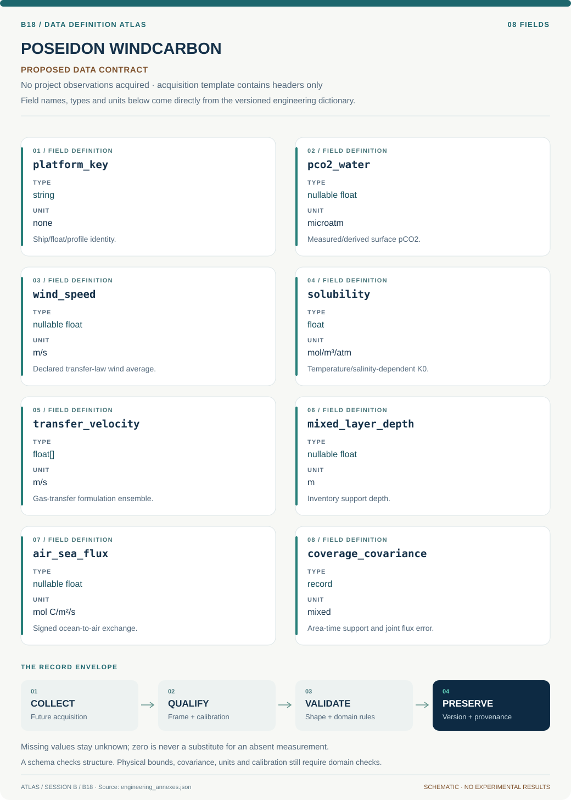

# B18 · POSEIDON WINDCARBON — Southern Ocean Carbon Mission

**Original project:** Assessing the Role of the Winds in the Biogeochemical Cycling and Carbon Budget of the Southern Ocean

**Session B:** Earth & Environmental Engineering

**Document class:** engineering research design and analysis record · **Revision:** 4 · **Date:** 2026-10-02

**Evidence state:** design basis, mathematical formulation and verification plan documented. Project-specific empirical results remain to be acquired; executable shared model demonstrations have their own recorded checks.

[Session B](../README.md) · [All projects](../../../ENGINEERING_DOCUMENTATION.md) · [Session handbook](../../../handbooks/SESSION_B.md) · [← B17](../B17-aquarius-lifeline-inland-fisheries-resilience/README.md) · [B19 →](../B19-parker-plasma-whisper-electron-structure-observatory/README.md)

| Proposed requirements | Specified verification cases | Defined data fields | Cited resources |
| ---: | ---: | ---: | ---: |
| 4 | 4 | 8 | 3 |

[Explore the data blueprint](data/README.md) · [Open the figure gallery](figures/README.md) · [Download acquisition template](data/acquisition.csv) · [Browse the data atlas](../../../data/README.md)

---

## Mission profile



| Profile panel | Engineering signal | Open the evidence |
| --- | --- | --- |
| Mission identity | Assessing the Role of the Winds in the Biogeochemical Cycling and Carbon Budget of the Southern Ocean | [Scientific objective](#purpose-and-scientific-objective) |
| Model cockpit | 3 governing expressions; 4 derivation steps; declared assumptions and validity envelope | [Mathematical formulation](#4-mathematical-model-and-derivation) |
| Data blueprint | 8 proposed fields with types, units and quality rules | [Field map & downloads](data/README.md) |
| Verification queue | 4 proposed requirements; 4 specified cases; project execution evidence pending | [Case definitions](#8-verification-and-validation-cases) |
| Figure wall | Architecture, field map, planned result description | [Open full gallery](figures/README.md) |
| Resource library | 3 cited primary resources with support statements | [Cited resources](#12-cited-technical-and-scientific-resources) |

### Model cockpit

**Analysis method:** Use quality-controlled float/ship carbon observations and matched winds to build regional seasonal budgets. Decompose transfer and surface-chemistry effects with counterfactual terms, evaluate storm composites against matched nonstorm conditions and examine lagged mixing/biological responses. Bootstrap whole floats/events, propagate carbonate-system uncertainty and compare alternate gas-transfer formulations. Integrate regional flux only over supported space/time before presenting gap-filled estimates with their extrapolation variance.

**Operating envelope:** Air–sea flux does not measure the full carbon inventory or permanent sequestration. Sparse winter/under-ice coverage and wind-product errors can substantially affect basinwide estimates.

**Variables and conventions**

- F: mol C/m²/s; k: m/s; K0: mol/m³/atm.
- pCO2: atm after conversion from μatm; U: m/s.
- C: dissolved inorganic carbon, mol/m³; h: mixed-layer depth, m.
- Sc: dimensionless Schmidt number; sign convention retained in every product.

### Artifact wall



The diagram separates transfer, carbon chemistry and mixed-layer accounting with a fixed ocean-to-air sign. Supported integration and labeled gap filling remain distinct, and neither flux product alone establishes permanent carbon sequestration.

**Scientific result to produce:** Map regional flux and data support; show event timelines and transfer/mixing/biology terms with sign conventions and uncertainty.

### Investigation feed · planned work

The feed records proposed work packages. A row becomes executed evidence only with versioned inputs, outputs and a reviewed result.

| Sequence | Evidence state | Engineering work package |
| --- | --- | --- |
| 01 | Planned | Freeze ship/float, wind and ice product manifests with calibration levels. |
| 02 | Planned | Implement carbonate-input covariance and pressure/sign unit adapters. |
| 03 | Planned | Build gas-transfer alternatives and a mixed-layer inventory ledger. |
| 04 | Planned | Define storm/matched-background intervals and whole-event/float folds. |
| 05 | Planned | Compute exact transfer/chemistry decomposition and supported regional integrals. |
| 06 | Planned | Publish gap-filled budgets separately with covariance, seasonal coverage and sequestration limits. |

### Mission connections

Connections are reading routes based on actual shared resources, supplied sessions or included illustrations. They do not establish physical dependencies, team collaborations or validated results.

| Connected mission | Original investigation | Recorded connection basis |
| --- | --- | --- |
| [B17 · AQUARIUS LIFELINE — Inland Fisheries Resilience](../B17-aquarius-lifeline-inland-fisheries-resilience/README.md) | Off the Hook: Assessing the Vulnerability of Inland Subsistence Fisheries to Climate Change | Session B |
| [B19 · PARKER PLASMA WHISPER — Electron Structure Observatory](../B19-parker-plasma-whisper-electron-structure-observatory/README.md) | Investigation of Electron Parameters and Association with Structures using Quasi-thermal Noise Spectroscopy (QTN) | Session B |
| [B16 · ISS BIOGUARD — Retrospective Microgravity Health Evidence](../B16-iss-bioguard-retrospective-microgravity-health-evidence/README.md) | Multi-drug Resistance of Pseudomonas aeruginosa Under Microgravity Growth Conditions | Session B |
| [B20 · LUNAR RECLAIMER — Algal Rare-Earth Recovery](../B20-lunar-reclaimer-algal-rare-earth-recovery/README.md) | Rare Earth Metal Recovery from Waste Stream Using Algae | Session B |
| [B15 · TECTON ORION — Farallon Slab Reconstruction](../B15-tecton-orion-farallon-slab-reconstruction/README.md) | Numerical simulation of Laramide flat-slab subduction | Session B |
| [B21 · PROTEUS DRIFTSCAPE — Evolutionary Protein Disorder](../B21-proteus-driftscape-evolutionary-protein-disorder/README.md) | More Effectively Selective Species Have Greater Protein Structural Disorder | Session B |

[Machine-readable connection register and ranking rule](../../../registry/mission_connections.json)

### Reading playlist

| Route | Start here | Continue to |
| --- | --- | --- |
| Understand the idea | [Scientific objective](#purpose-and-scientific-objective) | [Design boundary](#1-design-basis-and-analysis-boundary) → [Mathematics](#4-mathematical-model-and-derivation) |
| Inspect the data | [Visual blueprint](data/README.md) | [Provenance](#5-data-specifications-and-provenance) → [Uncertainty](#6-uncertainty-sensitivity-and-identifiability) |
| Make a design decision | [Trade study](#7-engineering-trade-study) | [Failure modes](#10-failure-modes-and-interpretation-controls) → [Required outputs](#11-required-engineering-outputs) |
| Prepare execution | [Requirements](#2-requirements-and-verification-traceability) | [Verification](#8-verification-and-validation-cases) → [Implementation](#9-implementation-and-reproducible-work-packages) |

## Complete engineering dossier

The profile above is a browsing layer. The full design basis, equations, derivations, data contract, uncertainty, trades and controlled case definitions follow.

## Purpose and scientific objective

Quantify wind effects through gas exchange, mixing and circulation while preserving the carbon-budget distinction between air–sea flux and internal redistribution. Combine ship-calibrated biogeochemistry, wind histories and event-based analyses. Explicitly address winter coverage, float calibration and storm sampling before extrapolating an observed event relationship into an annual Southern Ocean sink.

**Question:** How much wind-associated carbon-flux variability arises from gas-transfer changes versus entrainment/circulation-driven surface carbon changes?

**Testable hypothesis:** Strong winds can increase transfer while mixing carbon-rich water toward the surface; these mechanisms can reinforce or offset one another by region and season.

## 1. Design basis and analysis boundary

The carbon system estimates wind-linked air-sea CO2 exchange and mixed-layer inventory changes over supported Southern Ocean regions and seasons. Inputs include quality-controlled ship/float carbon chemistry, wind histories, mixed-layer depth and sea-ice coverage. Flux is positive ocean-to-air throughout; internal redistribution and permanent sequestration are separate quantities.

Start with matched observations and transfer/chemistry decomposition, then event composites and regional budget integration. Promote to gap-filled annual estimates only after winter/under-ice support and extrapolation uncertainty are documented. SOCCOM ship records supply calibration context, while gas-transfer formulations and storm definitions are competing proposed choices. A storm correlation does not by itself isolate mixing from transfer or establish the basinwide annual sink.

## 2. Requirements and verification traceability

These are project design requirements or proposed analysis gates. A numerical target is not a NASA requirement unless its controlling source is explicitly identified. “TBD” identifies evidence required before a decision; it is not permission to assume a value. Verification evidence listed here is planned, unless a linked result explicitly records execution.

| ID | Requirement / gate | Engineering rationale | Verification method | Basis / required evidence |
| --- | --- | --- | --- | --- |
| B18-R1 | Every carbon estimate shall retain observation platform, calibration/QC flags, carbonate-system inputs and covariance. | Derived float pCO2 has shared model uncertainty. | Provenance and carbonate-input audit. | SOCCOM reference documentation. |
| B18-R2 | Preserve positive ocean-to-air sign and convert microatmospheres to atmospheres before multiplying by solubility. | Sign/unit errors reverse carbon-budget interpretation. | Known-gradient flux tests. | Existing flux equation. |
| B18-R3 | Separate measured-support integration from gap-filled regional/annual estimates with explicit area-time coverage. | Winter sampling is uneven. | Independent coverage ledger. | Proposed budget contract. |
| B18-R4 | Storm comparisons shall hold out whole events/floats and use matched seasonal/background intervals. | Repeated profiles are correlated. | Event/float split audit. | Primary storm study context. |

## 3. Architecture and controlled interfaces

A calibration adapter stores ship/reference and float-derived fields separately, including pH/DIC/alkalinity inputs when available. Wind joins provide vector components m/s and an agreed time average; sea-ice masks define open-water support without assuming unobserved under-ice flux is zero. Mixed-layer depth m and temperature/salinity align to stated spatiotemporal tolerances.

The carbonate and transfer branches produce surface-water pCO2, solubility and k with covariance. A flux engine performs signed multiplication, while an inventory ledger accounts for entrainment, advection and biology separately. Event decomposition compares counterfactual transfer and chemistry terms. Regional integration retains coverage masks, cell areas and calendar seconds; inaccessible seasons remain explicit gaps or labeled extrapolations.


The diagram separates transfer, carbon chemistry and mixed-layer accounting with a fixed ocean-to-air sign. Supported integration and labeled gap filling remain distinct, and neither flux product alone establishes permanent carbon sequestration.

[Editable engineering diagram source](figures/architecture.mmd)

## 4. Mathematical model and derivation

### Governing equations

```text
F_CO2=k(U,Sc) K0(T,S)(pCO2_water−pCO2_air), positive ocean-to-air.
```

```text
d(C h)/dt=−F_CO2+Entrainment+Advection+Biology, with consistent area/time units.
```

```text
ΔF=Δk K0 ΔpCO2_baseline+k_baseline Δ(K0 ΔpCO2)+interaction.
```

### Variables, units and conventions

- F: mol C/m²/s; k: m/s; K0: mol/m³/atm.
- pCO2: atm after conversion from μatm; U: m/s.
- C: dissolved inorganic carbon, mol/m³; h: mixed-layer depth, m.
- Sc: dimensionless Schmidt number; sign convention retained in every product.

### Assumptions and boundary conditions

- Wind–flux correlations do not isolate mixing from transfer.
- Float-derived carbon chemistry carries calibration/model uncertainty.
- Sea ice, sampling gaps and event aliasing require explicit coverage masks.

### Derivation step 1

```text
F=k K0(p_w-p_a); p_atm=p_microatm*10^-6.
```

k m/s times K0 mol/m³/atm times pressure atm gives mol C/m²/s; positive gradient produces outgassing.

### Derivation step 2

```text
Delta F=Delta k G0+k0 Delta G+Delta k Delta G; G=K0(p_w-p_a).
```

This exact finite-difference decomposition includes the interaction omitted by a purely additive transfer-versus-chemistry attribution.

### Derivation step 3

```text
d(C h)/dt=-F+E+A+B.
```

Mixed-layer carbon inventory C h is mol/m²; entrainment, advection and biological terms share mol/m²/s. Changing depth contributes C dh/dt.

### Derivation step 4

```text
M_region=sum_(supported cells,time) F_jt A_j Delta t.
```

Integrated exchange is mol C; conversion to mass uses carbon molar mass. Gap-filled cells are separately tagged and their covariance contributes to total uncertainty.

### Inference or simulation procedure

Use quality-controlled float/ship carbon observations and matched winds to build regional seasonal budgets. Decompose transfer and surface-chemistry effects with counterfactual terms, evaluate storm composites against matched nonstorm conditions and examine lagged mixing/biological responses. Bootstrap whole floats/events, propagate carbonate-system uncertainty and compare alternate gas-transfer formulations. Integrate regional flux only over supported space/time before presenting gap-filled estimates with their extrapolation variance.

### Validity domain and fidelity limits

Air–sea flux does not measure the full carbon inventory or permanent sequestration. Sparse winter/under-ice coverage and wind-product errors can substantially affect basinwide estimates.

## 5. Data specifications and provenance



**Proposed data contract · observations pending.** This visual inventory shows the record fields to acquire or derive. It contains no project measurements. [Open the data blueprint and downloads](data/README.md).

| Field | Type | Unit | Physical / statistical meaning | Quality and missing-data rule |
| --- | --- | --- | --- | --- |
| platform_key | string | none | Ship/float/profile identity. | Calibration and data-level provenance required. |
| pco2_water | nullable float | microatm | Measured/derived surface pCO2. | Input covariance and method retained. |
| wind_speed | nullable float | m/s | Declared transfer-law wind average. | Vector averaging/cadence explicit. |
| solubility | float | mol/m³/atm | Temperature/salinity-dependent K0. | Formula/version and covariance saved. |
| transfer_velocity | float[] | m/s | Gas-transfer formulation ensemble. | Validity domain and wind source retained. |
| mixed_layer_depth | nullable float | m | Inventory support depth. | Definition and profile uncertainty required. |
| air_sea_flux | nullable float | mol C/m²/s | Signed ocean-to-air exchange. | No sign inversion during integration. |
| coverage_covariance | record | mixed | Area-time support and joint flux error. | Gap-fill covariance separate from observations. |

[Machine-readable record schema](data/schema.json) · [Empty acquisition CSV](data/acquisition.csv) · [Field dictionary CSV](data/dictionary.csv)

The CSV above contains column headers only. Its schema defines future records and does not establish that original-team data or a particular archive product have been acquired. Frame, timing, calibration, covariance, selection and provenance details must accompany populated records.

### NOAA OCADS SOCCOM cruise data

[Product, archive or reference](https://www.ncei.noaa.gov/access/ocean-carbon-acidification-data-system/oceans/SOCCOM/SOCCOM.html)

**Fields:** Ship reference carbonate chemistry, nutrients, temperature and salinity.

**Access:** Public NOAA OCADS; follow linked float releases and quality flags.

**Role:** Calibration and biogeochemical constraints.

### Extratropical storms induce carbon outgassing over the Southern Ocean

[Product, archive or reference](https://www.nature.com/articles/s41612-024-00657-7)

**Fields:** Storm/carbon observations and primary methods.

**Access:** Open primary paper; event datasets depend on linked release.

**Role:** Event mechanism comparison.

### Copernicus ERA5 hourly single-level time-series data

[Product, archive or reference](https://cds.climate.copernicus.eu/datasets/reanalysis-era5-single-levels-timeseries?tab=download)

**Fields:** Hourly wind and related meteorological fields.

**Access:** Copernicus registration/terms may apply; record product/version.

**Role:** Independent meteorological forcing.

## 6. Uncertainty, sensitivity and identifiability

Carbonate chemistry, float calibration and gas-transfer laws share correlated uncertainties. Propagate carbonate-input covariance through the nonlinear solver and compare transfer formulations under identical winds. Wind averaging and storm aliasing affect k, while changing surface pCO2 can lag mixing; event timing sensitivity is retained rather than absorbed into one regression coefficient.

Transfer enhancement and entrainment may be difficult to separate from coincident storm sampling. Use matched nonstorm intervals, counterfactual decomposition and float/event block bootstrap. Under-ice/winter gaps dominate some annual estimates, so present supported integrals before extrapolations. The full carbon inventory also depends on advection/biology, and air-sea uptake cannot establish permanent sequestration.

## 7. Engineering trade study

| Alternative | Benefit | Cost / limitation | Decision rule |
| --- | --- | --- | --- |
| Observation-supported regional flux | Minimal extrapolation and clear support. | Leaves seasonal/geographic gaps. | Primary reported budget product. |
| Storm counterfactual decomposition | Separates transfer and chemistry interactions. | Needs matched baseline and lag choices. | Use for event-scale mechanism screening. |
| Gap-filled annual carbon model | Enables broader budget scenarios. | Winter/ice and structural uncertainty increase. | Publish separately with coverage and discrepancy. |

## 8. Verification and validation cases

| Case ID | Stimulus / condition | Expected result / criterion | Method | Evidence artifact |
| --- | --- | --- | --- | --- |
| B18-V1 | Zero gradient | F=0. | Condition/fixture: p_w=p_a at arbitrary valid k and K0. Verification procedure: Exact flux identity.. | Exact flux identity. |
| B18-V2 | Signed flux fixture | F=3x10^-8 mol/m²/s outward. | Condition/fixture: k=10^-5 m/s, K0=30 mol/m³/atm, gradient=100 microatm. Verification procedure: Independent unit calculation.. | Independent unit calculation. |
| B18-V3 | Decomposition closure | Delta F=15, matching (3*7)-(2*3). | Condition/fixture: Choose k0=2, G0=3, Delta k=1, Delta G=4 in consistent abstract units. Verification procedure: Exact factorial arithmetic.. | Exact factorial arithmetic. |
| B18-V4 | Float/event holdout | Report flux and chemistry prediction coverage plus supported area-time fraction. | Condition/fixture: Withhold entire storms and floats. Verification procedure: Blocked validation.. | Blocked validation. |

**Execution status:** these cases are specified, not claimed as executed. Close a case only with the versioned inputs, output, uncertainty, reviewer and pass/fail rationale.

### Additional scientific validation gates

- Hold out floats, seasons and storm events; avoid splitting repeated profiles randomly.
- Compare carbonate variables with independent ship references and propagate calibration residuals.
- Report budget closure, flux interval coverage and sensitivity to gas transfer, mixed-layer depth and winter gaps.

## 9. Implementation and reproducible work packages

1. Freeze ship/float, wind and ice product manifests with calibration levels.
2. Implement carbonate-input covariance and pressure/sign unit adapters.
3. Build gas-transfer alternatives and a mixed-layer inventory ledger.
4. Define storm/matched-background intervals and whole-event/float folds.
5. Compute exact transfer/chemistry decomposition and supported regional integrals.
6. Publish gap-filled budgets separately with covariance, seasonal coverage and sequestration limits.

### Investigation sequence

1. Stage 1: assemble coverage/calibration audit and sign/unit-consistent carbon tables; define regional seasons/events.
2. Stage 2: decompose mechanisms and test gas-transfer/mixing alternatives with uncertainty propagation.
3. Stage 3: validate withheld floats/storms and issue supported regional flux budgets plus explicitly uncertain gap filling.

### Resources and interfaces to expertise

- Ocean biogeochemist, physical oceanographer and carbonate-system expertise.
- Float/ship QA tools, carbonate solver and climate reanalysis access.

## 10. Failure modes and interpretation controls

| Failure mode | Effect on result | Detection / evidence | Design response |
| --- | --- | --- | --- |
| Microatm not converted | Millionfold flux error. | Dimensional/scale audit. | Explicit pressure converter. |
| Outgassing sign reversed | Wrong sink/source interpretation. | Known-gradient test. | One sign convention throughout. |
| Winter gaps hidden | Overprecise annual sink. | Coverage ledger review. | Separate supported and extrapolated totals. |

- False causal attribution from storm co-variation.
- Calibration drift and winter aliasing.
- Confusing outgassing, internal transport and permanent sequestration.

## 11. Required engineering outputs

- Calibrated regional biogeochemical data cube.
- Wind mechanism/flux decomposition notebook.
- Carbon-budget atlas and coverage uncertainty.

### Scientific result figures to produce during execution

Map regional flux and data support; show event timelines and transfer/mixing/biology terms with sign conventions and uncertainty.

## 12. Cited technical and scientific resources

- [NOAA OCADS SOCCOM cruise data](https://www.ncei.noaa.gov/access/ocean-carbon-acidification-data-system/oceans/SOCCOM/SOCCOM.html) — Shipboard reference observations support float biogeochemical calibration and carbon assessment.
- [Extratropical storms induce carbon outgassing over the Southern Ocean](https://www.nature.com/articles/s41612-024-00657-7) — Primary storm–carbon study motivates competing gas-transfer and mixed-layer pathways, with event sampling limitations.
- [Copernicus ERA5 hourly single-level time-series data](https://cds.climate.copernicus.eu/datasets/reanalysis-era5-single-levels-timeseries?tab=download) — Official reanalysis winds and meteorological fields provide independent forcing, with model/resolution uncertainty.

Framework and evidence rules: [engineering documentation standard](../../../engineering/ENGINEERING_STANDARD.md), [model assurance](../../../engineering/MODEL_ASSURANCE.md), [uncertainty procedure](../../../engineering/UNCERTAINTY_AND_DECISION_RULES.md), [data management](../../../engineering/DATA_MANAGEMENT.md). NASA-inspired names are creative identifiers; requirements and results are not NASA certification.
