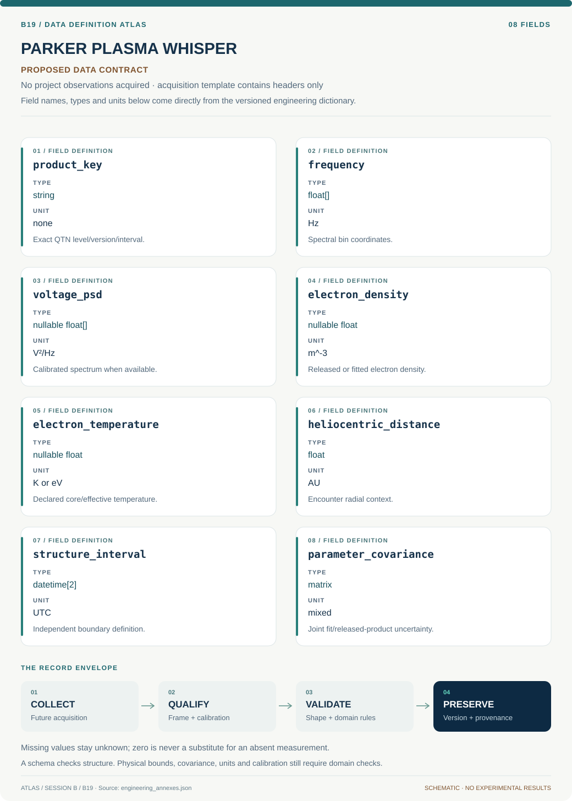

# B19 · Figure gallery

[PARKER PLASMA WHISPER — Electron Structure Observatory](../README.md) · [Data blueprint](../data/README.md) · [Data diagnostic gallery](../../../../data/figures/README.md)

## Engineering architecture

The diagram distinguishes released QTN products from conditional spectral refitting and independent structure selection. Radial matching and covariance gates support association estimates without implying unique electron distributions or three-dimensional structure reconstruction.

[SVG](architecture.svg) · [Editable Mermaid source](architecture.mmd)

## Data blueprint

**Proposed contract · observations pending.** Every field, type, unit and meaning comes from the controlled dictionary. [Open SVG](data-map.svg) · [Download dictionary](../data/dictionary.csv)

## Planned scientific result

Show QTN spectra/fits, electron intervals and independently defined boundaries; compare radial-adjusted event stacks with shifted controls.

This final scientific result remains an execution deliverable; the design diagrams do not establish an empirical finding.
