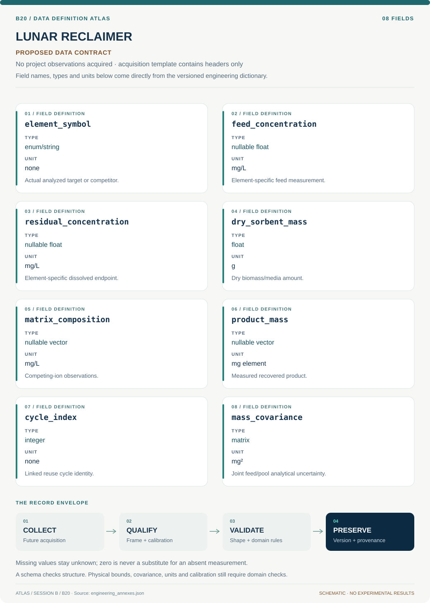

# B20 · Figure gallery

[LUNAR RECLAIMER — Algal Rare-Earth Recovery](../README.md) · [Data blueprint](../data/README.md) · [Data diagnostic gallery](../../../../data/figures/README.md)

## Engineering architecture

The architecture makes actual target-element assays and recovered-product evidence mandatory for rare-earth claims. Aluminum surrogate records remain separate, and removal, sorption, recovery and purity retain distinct uncertainty.

[SVG](architecture.svg) · [Editable Mermaid source](architecture.mmd)

## Data blueprint

**Proposed contract · observations pending.** Every field, type, unit and meaning comes from the controlled dictionary. [Open SVG](data-map.svg) · [Download dictionary](../data/dictionary.csv)

## Planned scientific result

Display feed-to-product element flows, selectivity across competing ions and capacity/purity decay across documented cycles.

This final scientific result remains an execution deliverable; the design diagrams do not establish an empirical finding.
