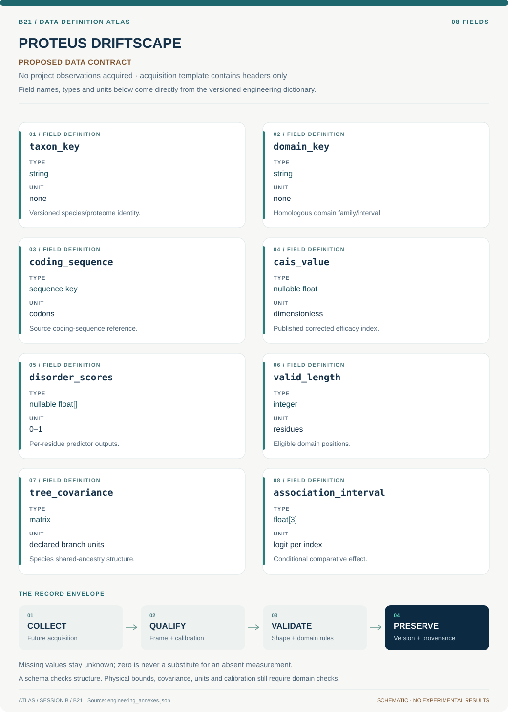

# B21 · Data blueprint

[PROTEUS DRIFTSCAPE — Evolutionary Protein Disorder](../README.md) · [Figure gallery](../figures/README.md) · [Data atlas](../../../../data/README.md)

**PROPOSED CONTRACT · 8 fields · no project observations acquired.** The acquisition CSV contains column headers only. The diagram is a visual record specification, not measured data.

| Download | What it contains |
| --- | --- |
| [Acquisition CSV](acquisition.csv) | Empty columns ready for controlled acquisition |
| [Field dictionary](dictionary.csv) | Names, source types, units, meanings and quality rules |
| [JSON Schema](schema.json) | Nullable record structure with unit and quality metadata |

## Field reference

| Field | Type | Unit | Meaning | Quality / missingness |
| --- | --- | --- | --- | --- |
| taxon_key | string | none | Versioned species/proteome identity. | Stable crosswalk and release required. |
| domain_key | string | none | Homologous domain family/interval. | Paralog and boundary uncertainty saved. |
| coding_sequence | sequence key | codons | Source coding-sequence reference. | Translation and frame consistency checked. |
| cais_value | nullable float | dimensionless | Published corrected efficacy index. | Exact method/intermediates retained. |
| disorder_scores | nullable float[] | 0–1 | Per-residue predictor outputs. | Predictor version and invalid masks required. |
| valid_length | integer | residues | Eligible domain positions. | Gaps/unknowns excluded consistently. |
| tree_covariance | matrix | declared branch units | Species shared-ancestry structure. | Taxon order and PSD check required. |
| association_interval | float[3] | logit per index | Conditional comparative effect. | Include clade/predictor uncertainty. |

## Acquisition and provenance

Null means missing or unknown; record its cause. Preserve product identifier, retrieval timestamp, source hash, calibration, coordinate and time frame, covariance basis, selection rules and every transformation. JSON Schema checks structure; physical bounds and the quality rules above require domain validation.

- [Protein domains in vertebrate species with more effective selection have greater intrinsic disorder](https://pmc.ncbi.nlm.nih.gov/articles/PMC11379457/) — archive or acquisition resource; inclusion here does not assert that its data have been retrieved.
- [UniProt proteome documentation](https://www.uniprot.org/help/proteome) — archive or acquisition resource; inclusion here does not assert that its data have been retrieved.

[Controlled data-management procedure](../../../../engineering/DATA_MANAGEMENT.md)
