# B21 · Figure gallery

[PROTEUS DRIFTSCAPE — Evolutionary Protein Disorder](../README.md) · [Data blueprint](../data/README.md) · [Data diagnostic gallery](../../../../data/figures/README.md)

## Engineering architecture

The diagram establishes sequence lineage, faithful efficacy-index calculation and homologous-domain comparison with phylogenetic covariance. Its endpoint is predicted disorder association, not measured structure or causal evolutionary advantage.

[SVG](architecture.svg) · [Editable Mermaid source](architecture.mmd)

## Data blueprint

**Proposed contract · observations pending.** Every field, type, unit and meaning comes from the controlled dictionary. [Open SVG](data-map.svg) · [Download dictionary](../data/dictionary.csv)

## Planned scientific result

Show domain-matched disorder contrasts on a phylogeny and effect intervals across predictors, clades and negative controls.

This final scientific result remains an execution deliverable; the design diagrams do not establish an empirical finding.
