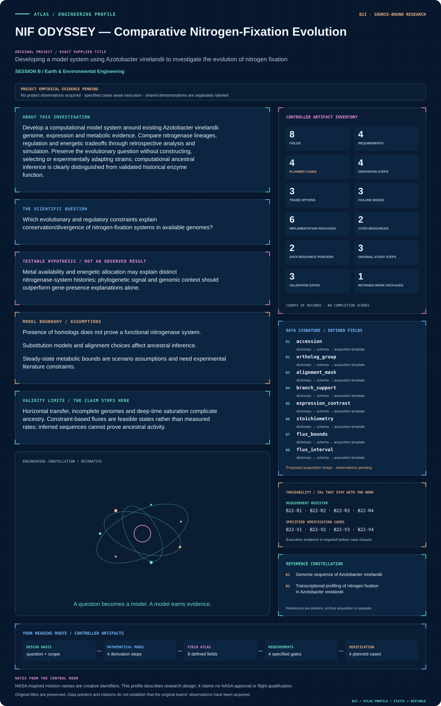
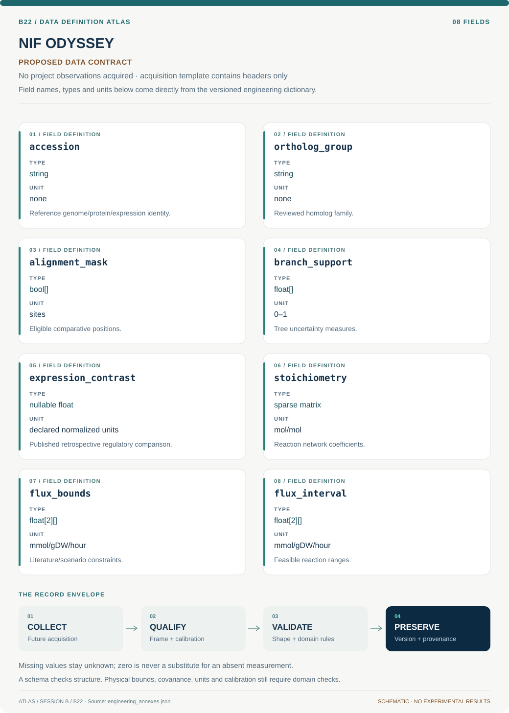

# B22 · NIF ODYSSEY — Comparative Nitrogen-Fixation Evolution

**Original project:** Developing a model system using Azotobacter vinelandii to investigate the evolution of nitrogen fixation

**Session B:** Earth & Environmental Engineering

**Document class:** engineering research design and analysis record · **Revision:** 4 · **Date:** 2026-10-02

**Evidence state:** design basis, mathematical formulation and verification plan documented. Project-specific empirical results remain to be acquired; executable shared model demonstrations have their own recorded checks.

[Session B](../README.md) · [All projects](../../../ENGINEERING_DOCUMENTATION.md) · [Session handbook](../../../handbooks/SESSION_B.md) · [← B21](../B21-proteus-driftscape-evolutionary-protein-disorder/README.md) · [B23 →](../B23-hydra-mission-control-watershed-decisions-under-uncertainty/README.md)

| Proposed requirements | Specified verification cases | Defined data fields | Cited resources |
| ---: | ---: | ---: | ---: |
| 4 | 4 | 8 | 2 |

[Explore the data blueprint](data/README.md) · [Open the figure gallery](figures/README.md) · [Download acquisition template](data/acquisition.csv) · [Browse the data atlas](../../../data/README.md)

---

## Mission profile



| Profile panel | Engineering signal | Open the evidence |
| --- | --- | --- |
| Mission identity | Developing a model system using Azotobacter vinelandii to investigate the evolution of nitrogen fixation | [Scientific objective](#purpose-and-scientific-objective) |
| Model cockpit | 3 governing expressions; 4 derivation steps; declared assumptions and validity envelope | [Mathematical formulation](#4-mathematical-model-and-derivation) |
| Data blueprint | 8 proposed fields with types, units and quality rules | [Field map & downloads](data/README.md) |
| Verification queue | 4 proposed requirements; 4 specified cases; project execution evidence pending | [Case definitions](#8-verification-and-validation-cases) |
| Figure wall | Architecture, field map, planned result description | [Open full gallery](figures/README.md) |
| Resource library | 2 cited primary resources with support statements | [Cited resources](#12-cited-technical-and-scientific-resources) |

### Model cockpit

**Analysis method:** Audit reference genomes and published expression metadata, define orthologs and compare alternative phylogenies with recombination/duplication sensitivity. Integrate regulatory expression contrasts with genome-scale or reduced stoichiometric models to test metal/energy scenarios. Infer candidate ancestral sequence distributions computationally, without treating point reconstructions as actual ancient sequences. Compare predictions with existing published phenotypes only, and release uncertainty rather than operational genetic designs.

**Operating envelope:** Horizontal transfer, incomplete genomes and deep-time saturation complicate ancestry. Constraint-based fluxes are feasible states rather than measured rates; inferred sequences cannot prove ancestral activity.

**Variables and conventions**

- S: stoichiometric matrix; v: flux, mmol/g dry weight/hour.
- Evolutionary branches: substitutions/site; support: bootstrap/posterior probability.
- Expression: normalized counts with sample/batch metadata.
- ATP/electron costs: reaction-level accounting, not direct organismal fitness.

### Artifact wall


The architecture separates comparative ancestry from constrained energetic feasibility and existing phenotype evidence. All ancestry and flux results are computational hypotheses, with no organism construction or experimentally evolved system implied.

**Scientific result to produce:** Compare supported nitrogenase phylogenies with ATP/electron feasibility across literature-bounded scenarios, keeping inferred and observed quantities distinct.

### Investigation feed · planned work

The feed records proposed work packages. A row becomes executed evidence only with versioned inputs, outputs and a reviewed result.

| Sequence | Evidence state | Engineering work package |
| --- | --- | --- |
| 01 | Planned | Create accession, orthology and published-expression metadata manifests. |
| 02 | Planned | Review alignments and alternative transfer/duplication-aware phylogenies. |
| 03 | Planned | Implement balanced reduced nitrogen/ATP/electron reaction accounting. |
| 04 | Planned | Curate supported flux bounds and run variability/loop diagnostics. |
| 05 | Planned | Compare computational scenarios with held-out existing phenotype records. |
| 06 | Planned | Release evolutionary/energetic uncertainty artifacts within the retrospective scope. |

### Mission connections

Connections are reading routes based on actual shared resources, supplied sessions or included illustrations. They do not establish physical dependencies, team collaborations or validated results.

| Connected mission | Original investigation | Recorded connection basis |
| --- | --- | --- |
| [B21 · PROTEUS DRIFTSCAPE — Evolutionary Protein Disorder](../B21-proteus-driftscape-evolutionary-protein-disorder/README.md) | More Effectively Selective Species Have Greater Protein Structural Disorder | Session B |
| [B23 · HYDRA MISSION CONTROL — Watershed Decisions Under Uncertainty](../B23-hydra-mission-control-watershed-decisions-under-uncertainty/README.md) | Modeling to Make a Difference: Hydrologic Analysis for Improved Decision Support | Session B |
| [B20 · LUNAR RECLAIMER — Algal Rare-Earth Recovery](../B20-lunar-reclaimer-algal-rare-earth-recovery/README.md) | Rare Earth Metal Recovery from Waste Stream Using Algae | Session B |
| [B24 · VIPER VOYAGER — Urban Movement and Habitat Connectivity](../B24-viper-voyager-urban-movement-and-habitat-connectivity/README.md) | Using GIS to Quantify Effects of Land Cover Change on Movement Patterns of Tiger Rattlesnakes in an Urbanizing Environment | Session B |
| [B19 · PARKER PLASMA WHISPER — Electron Structure Observatory](../B19-parker-plasma-whisper-electron-structure-observatory/README.md) | Investigation of Electron Parameters and Association with Structures using Quasi-thermal Noise Spectroscopy (QTN) | Session B |
| [B25 · SEEDSTAR GENESIS — Dryland Establishment Forecasting](../B25-seedstar-genesis-dryland-establishment-forecasting/README.md) | Can We Predict Germination Success in Seed Pellets Using Seed Traits? | Session B |

[Machine-readable connection register and ranking rule](../../../registry/mission_connections.json)

### Reading playlist

| Route | Start here | Continue to |
| --- | --- | --- |
| Understand the idea | [Scientific objective](#purpose-and-scientific-objective) | [Design boundary](#1-design-basis-and-analysis-boundary) → [Mathematics](#4-mathematical-model-and-derivation) |
| Inspect the data | [Visual blueprint](data/README.md) | [Provenance](#5-data-specifications-and-provenance) → [Uncertainty](#6-uncertainty-sensitivity-and-identifiability) |
| Make a design decision | [Trade study](#7-engineering-trade-study) | [Failure modes](#10-failure-modes-and-interpretation-controls) → [Required outputs](#11-required-engineering-outputs) |
| Prepare execution | [Requirements](#2-requirements-and-verification-traceability) | [Verification](#8-verification-and-validation-cases) → [Implementation](#9-implementation-and-reproducible-work-packages) |

## Complete engineering dossier

The profile above is a browsing layer. The full design basis, equations, derivations, data contract, uncertainty, trades and controlled case definitions follow.

## Purpose and scientific objective

Develop a computational model system around existing Azotobacter vinelandii genome, expression and metabolic evidence. Compare nitrogenase lineages, regulation and energetic tradeoffs through retrospective analysis and simulation. Preserve the evolutionary question without constructing, selecting or experimentally adapting strains; computational ancestral inference is clearly distinguished from validated historical enzyme function.

**Question:** Which evolutionary and regulatory constraints explain conservation/divergence of nitrogen-fixation systems in available genomes?

**Testable hypothesis:** Metal availability and energetic allocation may explain distinct nitrogenase-system histories; phylogenetic signal and genomic context should outperform gene-presence explanations alone.

## 1. Design basis and analysis boundary

The Azotobacter vinelandii model system is computational and retrospective: versioned reference genomes, published expression and documented metabolic reactions support comparative nitrogenase evolution and energetic-feasibility scenarios. The boundary excludes strain construction, selection and experimental adaptation. Phylogenetic histories and ancestral distributions are hypotheses, not validated ancient enzymes.

Begin with orthology/alignment review and a reduced stoichiometric ATP/electron ledger, then compare supported trees, expression contrasts and flux scenarios. Published genome and transcription studies provide source context. A feasible steady-state flux is not a measured growth or fixation rate, and metal/oxygen constraints require literature support. Added complexity is justified only when existing phenotypes can discriminate it.

## 2. Requirements and verification traceability

These are project design requirements or proposed analysis gates. A numerical target is not a NASA requirement unless its controlling source is explicitly identified. “TBD” identifies evidence required before a decision; it is not permission to assume a value. Verification evidence listed here is planned, unless a linked result explicitly records execution.

| ID | Requirement / gate | Engineering rationale | Verification method | Basis / required evidence |
| --- | --- | --- | --- | --- |
| B22-R1 | Each sequence/expression record shall retain accession, genome release, ortholog/paralog status and sample/batch metadata. | Duplications and annotation shifts alter evolutionary conclusions. | Identifier/alignment audit. | Primary genome and expression sources. |
| B22-R2 | Stoichiometric models shall conserve atoms/charge and explicitly account for ATP and electron requirements. | Unbalanced reactions create false energetic feasibility. | Element/charge matrix checks. | Canonical nitrogenase accounting. |
| B22-R3 | Tree and ancestral outputs shall retain model/branch uncertainty; point reconstructions shall not be called historical sequences. | Deep-time alternatives are nonunique. | Alternative-tree and posterior-support review. | Proposed computational contract. |
| B22-R4 | Compare predictions only with existing published phenotypes; deliverables shall contain no operational genetic or adaptation design. | Keeps the original evolutionary question within retrospective scope. | Artifact/scope review. | Nonexperimental project boundary. |

## 3. Architecture and controlled interfaces

A genomic registry stores accession-linked sequence references, ortholog groups and alignment masks. The phylogeny branch records substitution model, branch lengths substitutions/site and bootstrap/posterior support. An expression adapter uses published sample metadata and keeps normalized contrasts separate from raw abundance interpretations.

A reaction registry defines stoichiometric coefficients and literature-constrained flux bounds in mmol/g dry weight/hour. The constraint solver emits feasible ranges and ATP/electron shadow prices under explicitly labeled scenarios. A phenotype comparison module uses only existing study measurements. Missing homolog context, poorly supported branches or unbounded fluxes propagate unresolved states; inferred ancestral distributions remain computational uncertainty artifacts.


The architecture separates comparative ancestry from constrained energetic feasibility and existing phenotype evidence. All ancestry and flux results are computational hypotheses, with no organism construction or experimentally evolved system implied.

[Editable engineering diagram source](figures/architecture.mmd)

## 4. Mathematical model and derivation

### Governing equations

```text
Likelihood(tree,model)=P(alignment|tree,substitution_model), with model/branch uncertainty.
```

```text
N2+8H+ +8e− → 2NH3+H2, exact redox ledger; canonical ATP consumption ledger: 16 ATP per N2. ATP hydrolysis requires explicit water/protonation/counter-species for an atom/charge-balanced S column.
```

```text
S v=0; maximize objective subject to documented flux bounds and ATP/electron accounting.
```

### Variables, units and conventions

- S: stoichiometric matrix; v: flux, mmol/g dry weight/hour.
- Evolutionary branches: substitutions/site; support: bootstrap/posterior probability.
- Expression: normalized counts with sample/batch metadata.
- ATP/electron costs: reaction-level accounting, not direct organismal fitness.

### Assumptions and boundary conditions

- Presence of homologs does not prove a functional nitrogenase system.
- Substitution models and alignment choices affect ancestral inference.
- Steady-state metabolic bounds are scenario assumptions and need experimental literature constraints.

### Derivation step 1

```text
L(tree,model)=P(alignment|tree,substitution_model).
```

Alignment sites and branch lengths determine the likelihood; gene trees can differ from species history through transfer or duplication.

### Derivation step 2

```text
N2 + 8 H+ + 8 e- -> 2 NH3 + H2; coupled ATP accounting: 16 ATP consumed per canonical reaction turnover, represented separately from the redox balance.
```

The written redox reaction balances nitrogen, hydrogen and net charge. The ATP count is biochemical energy bookkeeping, not an atom/charge-balanced hydrolysis equation. A stoichiometric S column must separately specify ATP/ADP/phosphate protonation, water and proton terms for the chosen biochemical convention before element/charge checking; cellular energetic cost can exceed the canonical count.

### Derivation step 3

```text
S v=0; l<=v<=u.
```

S contains signed molar coefficients and v is mmol/g dry weight/hour. Steady-state constraints indicate feasibility under chosen bounds, not observed flux.

### Derivation step 4

```text
v_min,j=min v_j; v_max,j=max v_j subject to S v=0 and objective support.
```

Flux-variability intervals expose alternate feasible pathways. Unbounded ranges indicate a model/bound problem and require correction before interpretation.

### Inference or simulation procedure

Audit reference genomes and published expression metadata, define orthologs and compare alternative phylogenies with recombination/duplication sensitivity. Integrate regulatory expression contrasts with genome-scale or reduced stoichiometric models to test metal/energy scenarios. Infer candidate ancestral sequence distributions computationally, without treating point reconstructions as actual ancient sequences. Compare predictions with existing published phenotypes only, and release uncertainty rather than operational genetic designs.

### Validity domain and fidelity limits

Horizontal transfer, incomplete genomes and deep-time saturation complicate ancestry. Constraint-based fluxes are feasible states rather than measured rates; inferred sequences cannot prove ancestral activity.

## 5. Data specifications and provenance



**Proposed data contract · observations pending.** This visual inventory shows the record fields to acquire or derive. It contains no project measurements. [Open the data blueprint and downloads](data/README.md).

| Field | Type | Unit | Physical / statistical meaning | Quality and missing-data rule |
| --- | --- | --- | --- | --- |
| accession | string | none | Reference genome/protein/expression identity. | Release and source checksum retained. |
| ortholog_group | string | none | Reviewed homolog family. | Paralog/transfer ambiguity flagged. |
| alignment_mask | bool[] | sites | Eligible comparative positions. | Gap/coverage exclusions recorded. |
| branch_support | float[] | 0–1 | Tree uncertainty measures. | Support type and resampling method explicit. |
| expression_contrast | nullable float | declared normalized units | Published retrospective regulatory comparison. | Batch/replicate metadata retained. |
| stoichiometry | sparse matrix | mol/mol | Reaction network coefficients. | Atom/charge and cofactor checks required. |
| flux_bounds | float[2][] | mmol/gDW/hour | Literature/scenario constraints. | Measured versus assumed bounds labeled. |
| flux_interval | float[2][] | mmol/gDW/hour | Feasible reaction ranges. | Solver status and unbounded flags saved. |

[Machine-readable record schema](data/schema.json) · [Empty acquisition CSV](data/acquisition.csv) · [Field dictionary CSV](data/dictionary.csv)

The CSV above contains column headers only. Its schema defines future records and does not establish that original-team data or a particular archive product have been acquired. Frame, timing, calibration, covariance, selection and provenance details must accompany populated records.

### Genome sequence of Azotobacter vinelandii

[Product, archive or reference](https://pmc.ncbi.nlm.nih.gov/articles/PMC2704721/)

**Fields:** Reference genome, nitrogen-fixation gene context and published accessions.

**Access:** Open primary article; retrieve referenced public sequences with exact accession/version.

**Role:** Comparative genome anchor.

### Transcriptional profiling of nitrogen fixation in Azotobacter vinelandii

[Product, archive or reference](https://pmc.ncbi.nlm.nih.gov/articles/PMC3165507/)

**Fields:** Existing expression contrasts and regulation metadata.

**Access:** Open primary paper; follow its deposited data accessions.

**Role:** Retrospective regulatory constraints.

## 6. Uncertainty, sensitivity and identifiability

Alignment, orthology and deep-time saturation determine much of evolutionary uncertainty. Compare alternative masked alignments and duplication/transfer-aware histories; preserve branch-support distributions rather than choose one visually simple tree. Existing expression contrasts may be batch-confounded, so metadata limitations remain in regulatory interpretation.

Flux bounds and biomass/objective choices can dominate energetic predictions. Compare reduced and supported genome-scale networks, profile ATP/electron constraints and use flux variability to identify alternate feasible solutions. Structural reaction uncertainty is separate from solver tolerance. Agreement with a published phenotype constrains a scenario but does not validate reconstructed ancestral function or a whole evolutionary mechanism.

## 7. Engineering trade study

| Alternative | Benefit | Cost / limitation | Decision rule |
| --- | --- | --- | --- |
| Orthology/phylogeny evidence map | Directly addresses evolutionary relationships. | Transfer and duplication remain ambiguous. | Primary comparative baseline. |
| Reduced energetic network | Transparent ATP/electron accounting. | Omits organism-wide regulation and costs. | Use for analytic scenario screening. |
| Supported genome-scale model | Represents broader metabolic alternatives. | Bounds/objective uncertainty and curation burden. | Adopt when existing evidence constrains it. |

## 8. Verification and validation cases

| Case ID | Stimulus / condition | Expected result / criterion | Method | Evidence artifact |
| --- | --- | --- | --- | --- |
| B22-V1 | Zero-flux feasibility | v=0 satisfies S v=0. | Condition/fixture: All bounds include zero and no compulsory demand. Verification procedure: Independent linear-constraint check.. | Independent linear-constraint check. |
| B22-V2 | Canonical reaction ledger | Consumes 16 mol ATP and 8 mol electrons; forms 2 mol NH3 and 1 mol H2. | Condition/fixture: One mol N2 reduced under the stated idealized reaction. Verification procedure: Reaction accounting fixture.. | Reaction accounting fixture. |
| B22-V3 | Element imbalance | Atom/charge checker rejects the model. | Condition/fixture: Inject one deliberately unbalanced synthetic reaction. Verification procedure: Network integration test.. | Network integration test. |
| B22-V4 | Existing phenotype holdout | Report feasible-range compatibility and unresolved discrepancies. | Condition/fixture: Reserve published conditions from fitting bounds. Verification procedure: Retrospective holdout comparison.. | Retrospective holdout comparison. |

**Execution status:** these cases are specified, not claimed as executed. Close a case only with the versioned inputs, output, uncertainty, reviewer and pass/fail rationale.

### Additional scientific validation gates

- Hold out taxa and expression conditions; do not reuse normalization/model-fitting data as final validation.
- Compare alternative gene trees, alignment trims and substitution models.
- Verify mass/charge/ATP bookkeeping and test predictions against independent published phenotypes; distinguish feasible from observed flux.

## 9. Implementation and reproducible work packages

1. Create accession, orthology and published-expression metadata manifests.
2. Review alignments and alternative transfer/duplication-aware phylogenies.
3. Implement balanced reduced nitrogen/ATP/electron reaction accounting.
4. Curate supported flux bounds and run variability/loop diagnostics.
5. Compare computational scenarios with held-out existing phenotype records.
6. Release evolutionary/energetic uncertainty artifacts within the retrospective scope.

### Investigation sequence

1. Stage 1: assemble versioned reference/ortholog/expression records and reproduce one published comparison.
2. Stage 2: evaluate phylogenetic and metabolic scenarios with alignment, model and flux-bound uncertainty.
3. Stage 3: test withheld taxa/conditions against published observations and deliver a computational evolution framework with unresolved mechanisms.

### Resources and interfaces to expertise

- Evolutionary microbiologist, bioinformatician and metabolic-model specialist.
- Public sequences, alignment/phylogeny tools and constraint-based modeling software.

## 10. Failure modes and interpretation controls

| Failure mode | Effect on result | Detection / evidence | Design response |
| --- | --- | --- | --- |
| Homolog presence called function | Unsupported nitrogenase activity claim. | Context/phenotype evidence audit. | Separate sequence and functional evidence. |
| Unbounded energy loop | Artificial fixation feasibility. | Flux-variability and cycle checks. | Curate reactions and supported bounds. |
| Ancestral point called fact | Overconfident historical mechanism. | Tree/alignment sensitivity. | Publish distributions and alternatives. |

- Computational inference overclaimed as ancient function.
- Horizontal-transfer/annotation artifacts.
- Unconstrained energetic models or operationalization into organism engineering.

## 11. Required engineering outputs

- Genome/expression provenance manifest.
- Phylogenetic and energetic scenario notebooks.
- Evolutionary uncertainty atlas and evidence-gap report.

### Scientific result figures to produce during execution

Compare supported nitrogenase phylogenies with ATP/electron feasibility across literature-bounded scenarios, keeping inferred and observed quantities distinct.

## 12. Cited technical and scientific resources

- [Genome sequence of Azotobacter vinelandii](https://pmc.ncbi.nlm.nih.gov/articles/PMC2704721/) — Primary reference genome supports comparative study of nitrogen-fixation systems.
- [Transcriptional profiling of nitrogen fixation in Azotobacter vinelandii](https://pmc.ncbi.nlm.nih.gov/articles/PMC3165507/) — Primary expression study supports retrospective regulation analysis without constructing or evolving organisms.

Framework and evidence rules: [engineering documentation standard](../../../engineering/ENGINEERING_STANDARD.md), [model assurance](../../../engineering/MODEL_ASSURANCE.md), [uncertainty procedure](../../../engineering/UNCERTAINTY_AND_DECISION_RULES.md), [data management](../../../engineering/DATA_MANAGEMENT.md). NASA-inspired names are creative identifiers; requirements and results are not NASA certification.
