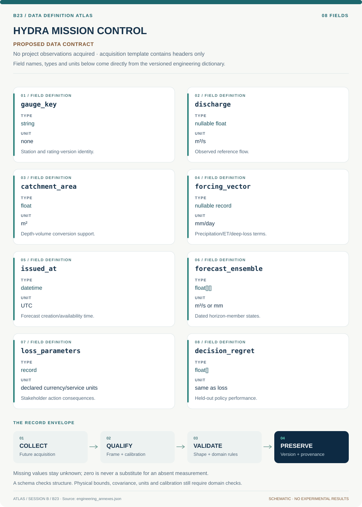
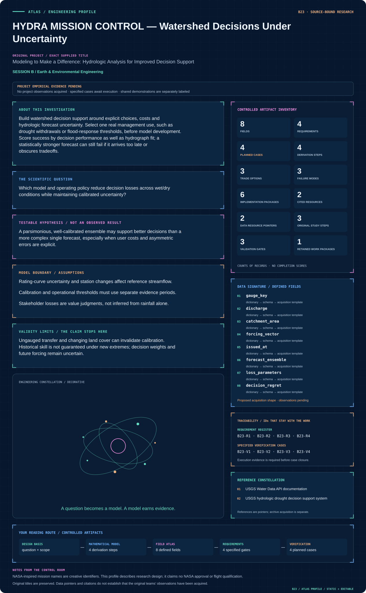

# B23 · Figure gallery

[HYDRA MISSION CONTROL — Watershed Decisions Under Uncertainty](../README.md) · [Data blueprint](../data/README.md) · [Data diagnostic gallery](../../../../data/figures/README.md)

## Engineering architecture

The diagram links hydrologic ensembles to an explicit stakeholder action and historical information cutoff. Its acceptance evidence includes decision regret and latency, while the real basin and operational policy remain to be defined.

[SVG](architecture.svg) · [Editable Mermaid source](architecture.mmd)

## Data blueprint

**Proposed contract · observations pending.** Every field, type, unit and meaning comes from the controlled dictionary. [Open SVG](data-map.svg) · [Download dictionary](../data/dictionary.csv)

## Mission profile

The scientific question, hypothesis, model boundary and document metadata are drawn from controlled sources. Proposed work remains distinguished from acquired evidence. [Open SVG](mission-profile.svg)

## Data diagnostic

Synthetic reservoir fluxes and cumulative water accounting. Recharge means effective water entering storage, rather than rainfall. Panel B decomposes all accounted water into cumulative release and remaining storage, bounded by initial storage plus accumulated recharge. The tiny arithmetic residual verifies this implementation's conservation, not watershed predictive accuracy.

[SVG](../../../../data/figures/12_hydrologic_water_ledger.svg) · [PNG](../../../../data/figures/12_hydrologic_water_ledger.png) · [Figure provenance](../../../../data/figures/12_hydrologic_water_ledger.provenance.json)

## Original numerical view

[Model formulation, data, assumptions and executed numerical checks](../../../../models/README.md)

## Planned scientific result

Display observed/forecast flows and intervals, policy actions and accumulated loss for withheld events; allow transparent scenario/weight comparisons.

This final scientific result remains an execution deliverable; the design diagrams do not establish an empirical finding.
