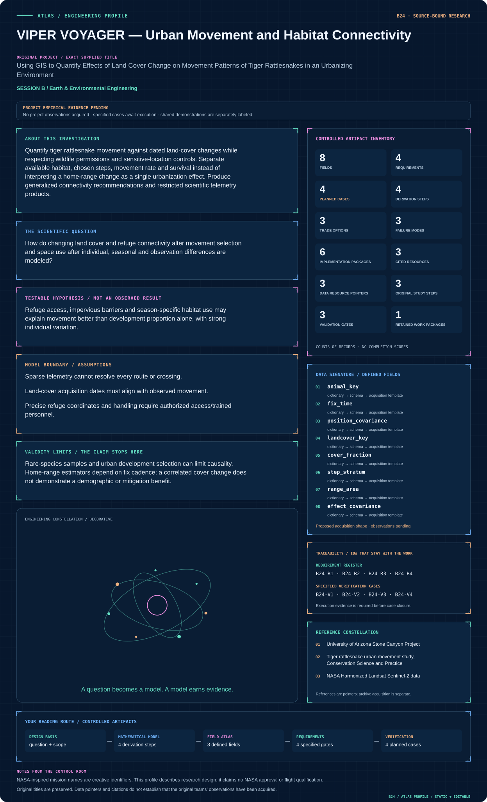
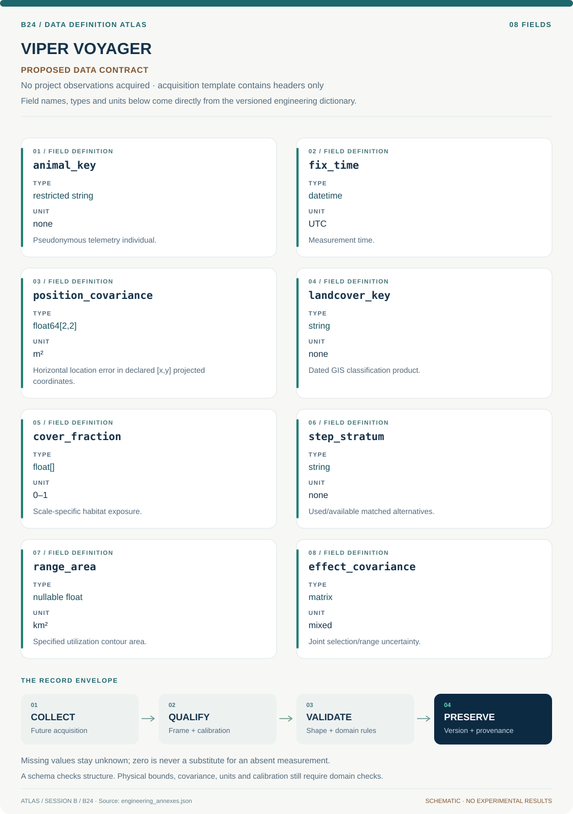

# B24 · VIPER VOYAGER — Urban Movement and Habitat Connectivity

**Original project:** Using GIS to Quantify Effects of Land Cover Change on Movement Patterns of Tiger Rattlesnakes in an Urbanizing Environment

**Session B:** Earth & Environmental Engineering

**Document class:** engineering research design and analysis record · **Revision:** 4 · **Date:** 2026-10-02

**Evidence state:** design basis, mathematical formulation and verification plan documented. Project-specific empirical results remain to be acquired; executable shared model demonstrations have their own recorded checks.

[Session B](../README.md) · [All projects](../../../ENGINEERING_DOCUMENTATION.md) · [Session handbook](../../../handbooks/SESSION_B.md) · [← B23](../B23-hydra-mission-control-watershed-decisions-under-uncertainty/README.md) · [B25 →](../B25-seedstar-genesis-dryland-establishment-forecasting/README.md)

| Proposed requirements | Specified verification cases | Defined data fields | Cited resources |
| ---: | ---: | ---: | ---: |
| 4 | 4 | 8 | 3 |

[Explore the data blueprint](data/README.md) · [Open the figure gallery](figures/README.md) · [Download acquisition template](data/acquisition.csv) · [Browse the data atlas](../../../data/README.md)

---

## Mission profile



| Profile panel | Engineering signal | Open the evidence |
| --- | --- | --- |
| Mission identity | Using GIS to Quantify Effects of Land Cover Change on Movement Patterns of Tiger Rattlesnakes in an Urbanizing Environment | [Scientific objective](#purpose-and-scientific-objective) |
| Model cockpit | 3 governing expressions; 4 derivation steps; declared assumptions and validity envelope | [Mathematical formulation](#4-mathematical-model-and-derivation) |
| Data blueprint | 8 proposed fields with types, units and quality rules | [Field map & downloads](data/README.md) |
| Verification queue | 4 proposed requirements; 4 specified cases; project execution evidence pending | [Case definitions](#8-verification-and-validation-cases) |
| Figure wall | Architecture, field map, planned result description | [Open full gallery](figures/README.md) |
| Resource library | 3 cited primary resources with support statements | [Cited resources](#12-cited-technical-and-scientific-resources) |

### Model cockpit

**Analysis method:** Use authorized telemetry and independently dated GIS cover histories, propagating location error and fix gaps. Generate matched available steps from individual movement distributions; fit integrated step-selection and hierarchical movement models. Evaluate cover transitions and connectivity at multiple defensible scales, comparing road/development-only and refuge-aware explanations. Keep core-use and range-area estimates separate. Apply spatial aggregation and suppression before sharing maps outside the research team.

**Operating envelope:** Rare-species samples and urban development selection can limit causality. Home-range estimators depend on fix cadence; a correlated cover change does not demonstrate a demographic or mitigation benefit.

**Variables and conventions**

- Step lengths/road distances: m; fix interval: hours or days.
- Land cover: dated fractions/classes at stated pixel resolution.
- Home range: km² under documented estimator/settings.
- Resistance: relative cost, not a measured physical energy without calibration.

### Artifact wall



The architecture separates dated cover exposure, conditional movement choice and utilization-area endpoints. Restricted refuges and sparse-cadence limits remain visible, and observed associations do not establish demographic or mitigation effects.

**Scientific result to produce:** Show aggregated habitat transitions and corridor uncertainty publicly; reserve individual tracks/refuges for approved access.

### Investigation feed · planned work

The feed records proposed work packages. A row becomes executed evidence only with versioned inputs, outputs and a reviewed result.

| Sequence | Evidence state | Engineering work package |
| --- | --- | --- |
| 01 | Planned | Confirm investigator data access and a restricted/public layer policy. |
| 02 | Planned | Freeze telemetry and dated GIS manifests with CRS/resolution metadata. |
| 03 | Planned | Implement cadence, location-error and multi-scale exposure adapters. |
| 04 | Planned | Build individual-blocked matched-step models with availability diagnostics. |
| 05 | Planned | Compute separate core/range products and cadence-subsampling sensitivity. |
| 06 | Planned | Release governed movement evidence with causal and habitat-resolution limits. |

### Mission connections

Connections are reading routes based on actual shared resources, supplied sessions or included illustrations. They do not establish physical dependencies, team collaborations or validated results.

| Connected mission | Original investigation | Recorded connection basis |
| --- | --- | --- |
| [B10 · LANDSAT EQUITY — Community Canopy Mission](../B10-landsat-equity-community-canopy-mission/README.md) | Using Remote Sensing to Determine Vegetation Change and Impacts to Communities | Session B; [NASA Harmonized Landsat Sentinel-2 data](https://hls.gsfc.nasa.gov/hls-data/) |
| [B08 · TERRAFORM TERRACES — Dryland Conservation Observatory](../B08-terraform-terraces-dryland-conservation-observatory/README.md) | The Influence of Conservation Structures on Rangeland Vegetation Patterns | Session B; [NASA Harmonized Landsat Sentinel-2 data](https://hls.gsfc.nasa.gov/hls-data/) |
| [B03 · ORION CROSSINGS — Gila Monster Road Ecology](../B03-orion-crossings-gila-monster-road-ecology/README.md) | Potential Road Impacts on Gila Monsters in an Urbanizing Environment | Session B; [NASA Harmonized Landsat Sentinel-2 data](https://hls.gsfc.nasa.gov/hls-data/) |
| [B23 · HYDRA MISSION CONTROL — Watershed Decisions Under Uncertainty](../B23-hydra-mission-control-watershed-decisions-under-uncertainty/README.md) | Modeling to Make a Difference: Hydrologic Analysis for Improved Decision Support | Session B |
| [B25 · SEEDSTAR GENESIS — Dryland Establishment Forecasting](../B25-seedstar-genesis-dryland-establishment-forecasting/README.md) | Can We Predict Germination Success in Seed Pellets Using Seed Traits? | Session B |
| [B22 · NIF ODYSSEY — Comparative Nitrogen-Fixation Evolution](../B22-nif-odyssey-comparative-nitrogen-fixation-evolution/README.md) | Developing a model system using Azotobacter vinelandii to investigate the evolution of nitrogen fixation | Session B |

[Machine-readable connection register and ranking rule](../../../registry/mission_connections.json)

### Reading playlist

| Route | Start here | Continue to |
| --- | --- | --- |
| Understand the idea | [Scientific objective](#purpose-and-scientific-objective) | [Design boundary](#1-design-basis-and-analysis-boundary) → [Mathematics](#4-mathematical-model-and-derivation) |
| Inspect the data | [Visual blueprint](data/README.md) | [Provenance](#5-data-specifications-and-provenance) → [Uncertainty](#6-uncertainty-sensitivity-and-identifiability) |
| Make a design decision | [Trade study](#7-engineering-trade-study) | [Failure modes](#10-failure-modes-and-interpretation-controls) → [Required outputs](#11-required-engineering-outputs) |
| Prepare execution | [Requirements](#2-requirements-and-verification-traceability) | [Verification](#8-verification-and-validation-cases) → [Implementation](#9-implementation-and-reproducible-work-packages) |

## Complete engineering dossier

The profile above is a browsing layer. The full design basis, equations, derivations, data contract, uncertainty, trades and controlled case definitions follow.

## Purpose and scientific objective

Quantify tiger rattlesnake movement against dated land-cover changes while respecting wildlife permissions and sensitive-location controls. Separate available habitat, chosen steps, movement rate and survival instead of interpreting a home-range change as a single urbanization effect. Produce generalized connectivity recommendations and restricted scientific telemetry products.

**Question:** How do changing land cover and refuge connectivity alter movement selection and space use after individual, seasonal and observation differences are modeled?

**Testable hypothesis:** Refuge access, impervious barriers and season-specific habitat use may explain movement better than development proportion alone, with strong individual variation.

## 1. Design basis and analysis boundary

The movement system combines authorized tiger-rattlesnake telemetry with independently dated land-cover and urban-development histories in the Stone Canyon study context. It estimates step selection, core use and range extent as distinct endpoints. The engineering question is how documented cover transitions relate to movement under fix-cadence and location uncertainty, without converting correlation into demographic or mitigation benefit.

Start with timestamped GIS exposure and descriptive cadence-aware movement summaries. Promote to integrated step selection and uncertainty-aware range estimators where observation support permits. Investigator/publisher sources establish study identity and existing endpoints; raw telemetry access is separate. Precise refuges remain governed, and vegetation imagery alone cannot resolve every small rocky shelter.

## 2. Requirements and verification traceability

These are project design requirements or proposed analysis gates. A numerical target is not a NASA requirement unless its controlling source is explicitly identified. “TBD” identifies evidence required before a decision; it is not permission to assume a value. Verification evidence listed here is planned, unless a linked result explicitly records execution.

| ID | Requirement / gate | Engineering rationale | Verification method | Basis / required evidence |
| --- | --- | --- | --- | --- |
| B24-R1 | Every land-cover exposure shall use a map effective/acquisition date appropriate to the telemetry interval. | Modern cover can mislabel historical movement. | Temporal GIS join audit. | HLS and study provenance. |
| B24-R2 | Fix records shall retain individual, UTC time, error and transmitter status; long-gap steps shall be flagged. | Sparse fixes cannot reveal exact paths. | Cadence/location-error diagnostics. | Authorized telemetry contract. |
| B24-R3 | Report core-use area and home-range extent with estimator/cadence settings, separately from step-selection effects. | Space-use endpoints are not interchangeable. | Independent metric and label audit. | Primary movement study. |
| B24-R4 | Public outputs shall suppress exact refuge coordinates and individual tracks under investigator-approved rules. | Sensitive habitat requires controlled release. | Spatial export-policy check. | Study permissions. |

## 3. Architecture and controlled interfaces

A restricted telemetry adapter produces projected metre coordinates with location covariance and gap flags. Dated GIS layers preserve categorical cover, vegetation fraction, road/development geometry and resolution. A multi-scale extraction engine records each exposure's radius/support instead of assuming one biologically correct scale.

The matched-step generator conditions available movements on individual cadence and observed movement distribution. A conditional selection model estimates cover/refuge effects with individual variation. A separate continuous-time or supported range estimator computes utilization distributions and core contours. Spatial release aggregation is applied after uncertainty propagation; unobserved refuge features remain a discrepancy, not a guessed high-resolution map.


The architecture separates dated cover exposure, conditional movement choice and utilization-area endpoints. Restricted refuges and sparse-cadence limits remain visible, and observed associations do not establish demographic or mitigation effects.

[Editable engineering diagram source](figures/architecture.mmd)

## 4. Mathematical model and derivation

### Governing equations

```text
P(step k chosen)=exp(βᵀX_k)/Σ_j exp(βᵀX_j).
```

```text
log step_length_it=α_i+β land_change_it+season_t+γ weather_t+ε_it.
```

```text
R_path=Σ_edges resistance_e×length_e; resistance learned or sensitivity-tested.
```

### Variables, units and conventions

- Step lengths/road distances: m; fix interval: hours or days.
- Land cover: dated fractions/classes at stated pixel resolution.
- Home range: km² under documented estimator/settings.
- Resistance: relative cost, not a measured physical energy without calibration.

### Assumptions and boundary conditions

- Sparse telemetry cannot resolve every route or crossing.
- Land-cover acquisition dates must align with observed movement.
- Precise refuge coordinates and handling require authorized access/trained personnel.

### Derivation step 1

```text
L_k=norm(s_(k+1)-s_k); speed_k=L_k/Delta t_k.
```

Distance is m and time hours or seconds with explicit conversion. A displacement over a gap is a lower-resolution movement observation, not full route length.

### Derivation step 2

```text
P(k chosen)=exp(beta^T X_k)/sum_j exp(beta^T X_j).
```

Matched alternatives share start/time context; cover fractions and distances use declared scaling so coefficients are interpretable.

### Derivation step 3

```text
UD(s)>=0; integral UD(s)ds=1; A_c=area{region containing c probability}.
```

A core contour and a broad range contour correspond to different c values and estimator assumptions; their km² areas are separately labeled.

### Derivation step 4

```text
X_k^(b)=extract(cover_date,k,position_draw^(b),scale).
```

Location covariance and map date/classification uncertainty propagate through exposure before fitting, rather than only widening the final coefficient.

### Inference or simulation procedure

Use authorized telemetry and independently dated GIS cover histories, propagating location error and fix gaps. Generate matched available steps from individual movement distributions; fit integrated step-selection and hierarchical movement models. Evaluate cover transitions and connectivity at multiple defensible scales, comparing road/development-only and refuge-aware explanations. Keep core-use and range-area estimates separate. Apply spatial aggregation and suppression before sharing maps outside the research team.

### Validity domain and fidelity limits

Rare-species samples and urban development selection can limit causality. Home-range estimators depend on fix cadence; a correlated cover change does not demonstrate a demographic or mitigation benefit.

## 5. Data specifications and provenance



**Proposed data contract · observations pending.** This visual inventory shows the record fields to acquire or derive. It contains no project measurements. [Open the data blueprint and downloads](data/README.md).

| Field | Type | Unit | Physical / statistical meaning | Quality and missing-data rule |
| --- | --- | --- | --- | --- |
| animal_key | restricted string | none | Pseudonymous telemetry individual. | Not exported with refuge coordinates. |
| fix_time | datetime | UTC | Measurement time. | Cadence/gap flags preserved. |
| position_covariance | float64[2,2] | m² | Horizontal location error in declared [x,y] projected coordinates. | Exactly 2x2, symmetric PSD; CRS and covariance basis required. |
| landcover_key | string | none | Dated GIS classification product. | Acquisition/effective date retained. |
| cover_fraction | float[] | 0–1 | Scale-specific habitat exposure. | Class covariance/resolution saved. |
| step_stratum | string | none | Used/available matched alternatives. | Shared start/cadence audited. |
| range_area | nullable float | km² | Specified utilization contour area. | Contour/estimator/cadence recorded. |
| effect_covariance | matrix | mixed | Joint selection/range uncertainty. | Individual and GIS terms included. |

[Machine-readable record schema](data/schema.json) · [Empty acquisition CSV](data/acquisition.csv) · [Field dictionary CSV](data/dictionary.csv)

The CSV above contains column headers only. Its schema defines future records and does not establish that original-team data or a particular archive product have been acquired. Frame, timing, calibration, covariance, selection and provenance details must accompany populated records.

### University of Arizona Stone Canyon Project

[Product, archive or reference](https://herpetology.arizona.edu/content/stone-canyon-project.html)

**Fields:** Investigator-defined urban study context and telemetry project scope.

**Access:** Public project page; raw telemetry requires investigator permission and governance.

**Role:** Study identity and access route.

### Tiger rattlesnake urban movement study, Conservation Science and Practice

[Product, archive or reference](https://conbio.onlinelibrary.wiley.com/doi/10.1111/csp2.70313)

**Fields:** Published movement/space-use endpoints and field context.

**Access:** Primary publisher paper; follow its data availability restrictions.

**Role:** Independent design/benchmark.

### NASA Harmonized Landsat Sentinel-2 data

[Product, archive or reference](https://hls.gsfc.nasa.gov/hls-data/)

**Fields:** Dated reflectance and vegetation-quality layers.

**Access:** Public NASA imagery; small refuges may require finer permitted mapping.

**Role:** Land-change context.

## 6. Uncertainty, sensitivity and identifiability

Location error and cadence gaps blur cover exposure and routes, while small refuges may be invisible to satellite pixels. Draw exposure ensembles from documented errors and compare scales no finer than supported imagery or permitted mapping. Separate displacement uncertainty from estimator uncertainty and inspect seasonal missingness/transmitter failures.

Roads, development and vegetation loss covary, making their coefficients weakly separable. Profile effect combinations, hold out complete animals and compare road-only with refuge-aware explanations. Range estimates respond to fix cadence and sampling duration; subsampling sensitivity is essential. A movement association alone cannot establish survival, population change or the benefit of a proposed corridor.

## 7. Engineering trade study

| Alternative | Benefit | Cost / limitation | Decision rule |
| --- | --- | --- | --- |
| Dated descriptive GIS overlay | Transparent evidence with sparse fixes. | Cannot infer behavioral selection. | Baseline and access-limited product. |
| Integrated step selection | Conditions choices on available movement. | Sensitive to availability and covariate support. | Preferred for adequate cadence/individual coverage. |
| Continuous-time range estimator | Accounts for movement autocorrelation. | Model assumptions and duration affect areas. | Use separately for range/core endpoints. |

## 8. Verification and validation cases

| Case ID | Stimulus / condition | Expected result / criterion | Method | Evidence artifact |
| --- | --- | --- | --- | --- |
| B24-V1 | Step displacement | L=5 m and displacement speed=5 m/hour. | Condition/fixture: Synthetic positions (0,0) and (3,4) m over one hour. Verification procedure: Exact geometry/unit check.. | Exact geometry/unit check. |
| B24-V2 | Equal choice covariates | Each probability is 0.25. | Condition/fixture: Four alternatives have identical X. Verification procedure: Conditional-likelihood symmetry test.. | Conditional-likelihood symmetry test. |
| B24-V3 | Normalized utilization | Integral equals one; full support area is 1 km². | Condition/fixture: Synthetic uniform UD over 1 km². Verification procedure: Independent density integration.. | Independent density integration. |
| B24-V4 | Animal/date holdout | Report movement prediction and range-cadence sensitivity. | Condition/fixture: Reserve individuals and dated cover transitions. Verification procedure: Blocked evaluation.. | Blocked evaluation. |

**Execution status:** these cases are specified, not claimed as executed. Close a case only with the versioned inputs, output, uncertainty, reviewer and pass/fail rationale.

### Additional scientific validation gates

- Hold out animals and areas; retain dependent fixes within folds.
- Validate GIS classes independently and test location-error/missing-fix sensitivity.
- Compare range estimates across defensible cadence/settings; report confidence intervals and distinguish prediction from causal intervention effects.

## 9. Implementation and reproducible work packages

1. Confirm investigator data access and a restricted/public layer policy.
2. Freeze telemetry and dated GIS manifests with CRS/resolution metadata.
3. Implement cadence, location-error and multi-scale exposure adapters.
4. Build individual-blocked matched-step models with availability diagnostics.
5. Compute separate core/range products and cadence-subsampling sensitivity.
6. Release governed movement evidence with causal and habitat-resolution limits.

### Investigation sequence

1. Stage 1: establish telemetry permissions, align dates and audit fix errors/land-cover resolution.
2. Stage 2: fit selection/movement models and uncertainty-aware connectivity across scales.
3. Stage 3: validate withheld animals/areas and publish generalized mitigation candidates with a prospective monitoring design.

### Resources and interfaces to expertise

- Herpetologist, GIS/movement analyst and land-planning partner.
- Restricted telemetry repository, GIS classification and step-selection tools.

## 10. Failure modes and interpretation controls

| Failure mode | Effect on result | Detection / evidence | Design response |
| --- | --- | --- | --- |
| Future cover assigned | False urbanization effect. | Map-date mismatch report. | Temporal GIS joins. |
| Core area called home range | Misinterpreted space-use change. | Contour/estimator label audit. | Separate endpoints. |
| Refuge locations leaked | Habitat/wildlife exposure. | Export geometry review. | Approved aggregation and suppression. |

- Sensitive refuge exposure or wildlife disturbance.
- Cadence/individual bias and inaccurate small-habitat mapping.
- Connectivity scores overinterpreted as survival gains.

## 11. Required engineering outputs

- Dated habitat/telemetry crosswalk and quality report.
- Movement/connectivity models with uncertainty.
- Aggregated planning map and data-governance rules.

### Scientific result figures to produce during execution

Show aggregated habitat transitions and corridor uncertainty publicly; reserve individual tracks/refuges for approved access.

## 12. Cited technical and scientific resources

- [University of Arizona Stone Canyon Project](https://herpetology.arizona.edu/content/stone-canyon-project.html) — Investigator description establishes the urban herpetofauna study context; telemetry access and permissions are separate requirements.
- [Tiger rattlesnake urban movement study, Conservation Science and Practice](https://conbio.onlinelibrary.wiley.com/doi/10.1111/csp2.70313) — Primary Stone Canyon research supports movement and space-use endpoints in an urbanizing landscape.
- [NASA Harmonized Landsat Sentinel-2 data](https://hls.gsfc.nasa.gov/hls-data/) — Surface reflectance and quality layers support reproducible landscape and vegetation monitoring.

Framework and evidence rules: [engineering documentation standard](../../../engineering/ENGINEERING_STANDARD.md), [model assurance](../../../engineering/MODEL_ASSURANCE.md), [uncertainty procedure](../../../engineering/UNCERTAINTY_AND_DECISION_RULES.md), [data management](../../../engineering/DATA_MANAGEMENT.md). NASA-inspired names are creative identifiers; requirements and results are not NASA certification.
