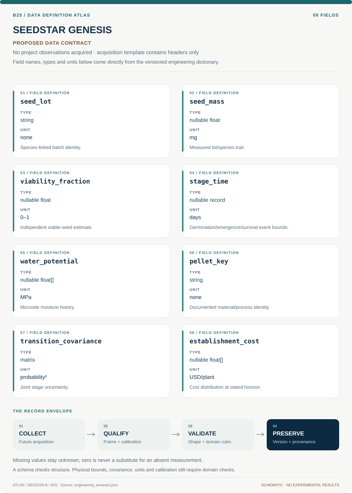
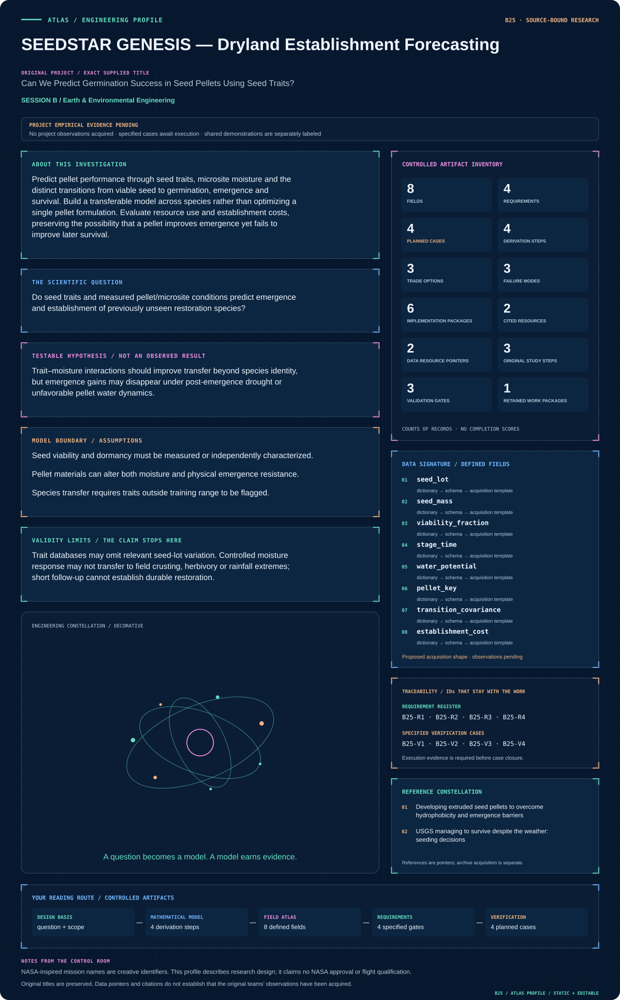

# B25 · Figure gallery

[SEEDSTAR GENESIS — Dryland Establishment Forecasting](../README.md) · [Data blueprint](../data/README.md) · [Data diagnostic gallery](../../../../data/figures/README.md)

## Engineering architecture

The diagram preserves viability, germination, emergence and survival as separate transitions and exposes moisture/sign conventions. Its final establishment and cost predictions carry lot, field-transfer and unfinished-follow-up uncertainty.

[SVG](architecture.svg) · [Editable Mermaid source](architecture.mmd)

## Data blueprint

**Proposed contract · observations pending.** Every field, type, unit and meaning comes from the controlled dictionary. [Open SVG](data-map.svg) · [Download dictionary](../data/dictionary.csv)

## Mission profile

The scientific question, hypothesis, model boundary and document metadata are drawn from controlled sources. Proposed work remains distinguished from acquired evidence. [Open SVG](mission-profile.svg)

## Planned scientific result

Show viable-to-established transitions by species/traits, with uncertainty and pellet versus control outcomes across moisture scenarios.

This final scientific result remains an execution deliverable; the design diagrams do not establish an empirical finding.
