# B26 · HELIOS POWERLOOP — Solar Electrolysis Dispatch

**Original project:** Electrolytic Application of Load-Managing Photovoltaic System

**Session B:** Earth & Environmental Engineering

**Document class:** engineering research design and analysis record · **Revision:** 3 · **Date:** 2026-10-02

**Evidence state:** design basis, mathematical formulation and verification plan documented. Project-specific empirical results remain to be acquired; executable shared model demonstrations have their own recorded checks.

[Session B](../README.md) · [All projects](../../../ENGINEERING_DOCUMENTATION.md) · [Session handbook](../../../handbooks/SESSION_B.md) · [← B25](../B25-seedstar-genesis-dryland-establishment-forecasting/README.md) · [B27 →](../B27-triton-waterwatch-autonomous-aquatic-observatory/README.md)

| Proposed requirements | Specified verification cases | Defined data fields | Cited resources |
| ---: | ---: | ---: | ---: |
| 4 | 4 | 8 | 2 |

[Explore the data blueprint](data/README.md) · [Open the figure gallery](figures/README.md) · [Download acquisition template](data/acquisition.csv) · [Browse the data atlas](../../../data/README.md)

---

## Purpose and scientific objective

Create a simulation-based design for photovoltaic electricity allocated among fixed loads, an electrolyzer, storage and curtailment. Optimize useful hydrogen and grid/load performance while accounting for cycling, degradation and water. Treat dispatch as a constrained engineering model; no hardware safety or operating envelope is inferred from an unconstrained optimum.

**Question:** Which dispatch policy balances curtailed solar, hydrogen cost, load service and electrolyzer lifetime across weather and demand uncertainty?

**Testable hypothesis:** A degradation-aware controller may reduce costly cycling with modest loss of immediate hydrogen output; batteries help only where avoided wear/curtailment exceeds their cost and losses.

## 1. Design basis and analysis boundary

The power-system design is a simulator allocating photovoltaic production among fixed loads, an electrolyzer, optional battery, grid exchange and curtailment. It optimizes hydrogen and load service under equipment-specific limits and uncertain weather/tariffs. The boundary is a dispatch analysis with vendor/literature operating maps, not a connected controller or proof of hardware readiness.

Begin with surplus-only and fixed dispatch, then constrained optimization and rolling forecasts. NSRDB forcing supports PV scenarios at its available cadence, while stack limits, wear coefficients and water inventories are TBD until documented. Faraday accounting gives electrochemical production but excludes auxiliaries and losses from total efficiency. Carbon, water, reliability and cost are reported as separate tradeoffs.

## 2. Requirements and verification traceability

These are project design requirements or proposed analysis gates. A numerical target is not a NASA requirement unless its controlling source is explicitly identified. “TBD” identifies evidence required before a decision; it is not permission to assume a value. Verification evidence listed here is planned, unless a linked result explicitly records execution.

| ID | Requirement / gate | Engineering rationale | Verification method | Basis / required evidence |
| --- | --- | --- | --- | --- |
| B26-R1 | Enforce power balance each interval and battery bounds using consistent kW/kWh/hour units; proposed relative residual target is 10^-8 in synthetic solver checks. | Hidden energy creation invalidates economics. | Independent dispatch-ledger residuals. | Proposed numerical target. |
| B26-R2 | Electrolyzer minimum load, ramp, start/stop and auxiliary limits shall come from the selected supported equipment map or remain TBD. | Generic unconstrained output is infeasible. | Constraint-source and feasibility audit. | Primary dispatch context. |
| B26-R3 | Evaluate policies with imperfect forecast scenarios and a chronological holdout; perfect-hindsight optimum is labeled an upper benchmark. | Forecast error changes cycling and reliability. | Rolling-horizon replay. | Proposed dispatch protocol. |
| B26-R4 | Report hydrogen kg, unserved load kWh, water inventory and wear/cost distributions separately. | Hydrogen value alone hides resource losses. | Unit/economic scenario review. | Existing multiobjective model. |

## 3. Architecture and controlled interfaces

A solar adapter stores irradiance W/m², weather and timezone, with cadence and source version. A PV conversion module produces available AC power kW using a documented efficiency/loss model. Load/tariff streams remain dated and separate from generation assumptions.

The electrolyzer map relates electrical power, current, auxiliary consumption and supported operating states; stack geometry specifies series-cell current accounting. The battery state uses stored energy kWh and directional efficiencies. A rolling dispatch optimizer emits simulator actions, while an independent checker enforces power, state, ramp and source limits. Unspecified equipment envelopes block hardware-applicability claims and remain visible in scenario outputs.



The diagram establishes a constrained simulation boundary with independent energy checks and explicit stack geometry. Dispatch results compare forecast-aware policies and resource tradeoffs without implying a connected controller or verified hardware envelope.

[Editable engineering diagram source](figures/architecture.mmd)

## 4. Mathematical model and derivation

### Governing equations

```text
P_PV+P_grid+P_discharge=P_load+P_electrolyzer+P_charge+P_curtail.
```

```text
mH2_dot=η_F I N_cells M_H2/(2F), with verified stack geometry/conventions.
```

```text
E_batt,(t+1)=E_batt,t+η_charge P_charge Δt−P_discharge Δt/η_discharge.
```

```text
min Σ_t[electricity_cost+wear_cost+unserved_load_penalty]−hydrogen_value, subject to equipment bounds.
```

### Variables, units and conventions

- P: kW; E_batt: stored battery energy, kWh; Δt: hours.
- I: A; F: C/mol; mH2_dot: kg/s after conversion.
- η_F: Faradaic efficiency; water demand: L/kg hydrogen.
- Costs: USD; lifetime terms require literature/vendor uncertainty.

### Assumptions and boundary conditions

- Faraday relation does not determine total system efficiency or auxiliary loads.
- Minimum load, ramping and start/stop bounds are equipment-specific.
- Grid carbon, tariffs and water scarcity vary by place/time.

### Derivation step 1

```text
P_PV+P_grid+P_dis=P_load+P_el+P_charge+P_curtail.
```

All terms are kW at the same interval. Grid export requires a separately signed convention; unserved demand is an explicit slack, not concealed imbalance.

### Derivation step 2

```text
dot m_H2=eta_F I N_cells M_H2/(2F).
```

Current A=C/s, molar mass kg/mol and Faraday constant C/mol yield kg/s. N_cells assumes the documented series-stack/current convention.

### Derivation step 3

```text
E_(t+1)=E_t+eta_c P_c Delta t-P_d Delta t/eta_d.
```

Power kW and time hours give kWh. Simultaneous charging/discharging is excluded by a declared state constraint, not rewarded through price artifacts.

### Derivation step 4

```text
J=sum_t(cost_energy+cost_wear+penalty_unserved-value_H2).
```

All objective terms use USD over the horizon. Wear and hydrogen-value coefficients are uncertain assumptions, while water/carbon objectives can be handled as separate constraints/frontiers.

### Inference or simulation procedure

Generate PV scenarios from documented irradiance/weather and a validated PV model. Use published or vendor-characterized electrolyzer power/efficiency maps and explicit startup/degradation penalties. Compare fixed, surplus-only and model-predictive dispatch; evaluate storage sizing under forecast error rather than perfect hindsight. Separate levelized-cost, carbon, water and load-reliability objectives, producing a Pareto frontier with equipment-bound and price uncertainty.

### Validity domain and fidelity limits

Generic wear models may not transfer to a particular stack. Tariff/market access and water availability can dominate economics; simulations cannot establish hardware readiness or safe operating limits.

## 5. Data specifications and provenance


**Proposed data contract · observations pending.** This visual inventory shows the record fields to acquire or derive. It contains no project measurements. [Open the data blueprint and downloads](data/README.md).

| Field | Type | Unit | Physical / statistical meaning | Quality and missing-data rule |
| --- | --- | --- | --- | --- |
| solar_resource | nullable record | W/m² °C m/s | NSRDB forcing and time convention. | Cadence/version/coverage retained. |
| pv_available | float[] | kW | Scenario AC PV power. | Loss-model provenance required. |
| load_demand | float[] | kW | Fixed service requirement. | Measured versus synthetic label explicit. |
| electrolyzer_state | record | kW A enum | Supported simulator stack state. | Vendor/literature bounds linked. |
| battery_energy | float[] | kWh | Stored-energy trajectory. | Capacity/efficiency covariance saved. |
| forecast_issue_time | datetime | UTC | Rolling prediction availability. | No future forcing in replay. |
| hydrogen_mass | float[] | kg | Integrated Faradaic/system production. | Cell convention and auxiliaries retained. |
| resource_cost | record | USD L kgCO2e | Cost/water/carbon scenario totals. | Boundary, price year and uncertainty explicit. |

[Machine-readable record schema](data/schema.json) · [Empty acquisition CSV](data/acquisition.csv) · [Field dictionary CSV](data/dictionary.csv)

The CSV above contains column headers only. Its schema defines future records and does not establish that original-team data or a particular archive product have been acquired. Frame, timing, calibration, covariance, selection and provenance details must accompany populated records.

### National Solar Radiation Database API

[Product, archive or reference](https://developer.nlr.gov/docs/solar/nsrdb/)

**Fields:** Irradiance, ambient temperature, wind and time metadata.

**Access:** Official NSRDB API; key/terms and coverage apply; archive selected version.

**Role:** PV resource forcing.

### Operating strategies for dispatchable PEM electrolyzers

[Product, archive or reference](https://research-hub.nlr.gov/en/publications/operating-strategies-for-dispatchable-pem-electrolyzers-that-enab/)

**Fields:** Dispatch/cycling/durability research and study assumptions.

**Access:** Public national-laboratory record and linked presentation.

**Role:** Policy/technoeconomic benchmark.

## 6. Uncertainty, sensitivity and identifiability

Irradiance, PV temperature losses and load forecast errors are temporally correlated. Use weather-year/episode scenarios and retain common errors across policies. Electrolyzer efficiency and auxiliary maps need operating-range support; their uncertainty is distinct from Faradaic efficiency. No dispatch simulation can establish the selected equipment's undocumented envelope.

Battery efficiency, stack cycling wear and tariffs can trade off in optimizer choices. Profile cost coefficients and compare forecast-error-aware policies with hindsight and simple baselines under equal inputs. Unknown lifetime degradation may dominate levelized economics; report break-even regions rather than one optimum. Water/carbon inventories depend on site and electricity source and retain those scenario labels.

## 7. Engineering trade study

| Alternative | Benefit | Cost / limitation | Decision rule |
| --- | --- | --- | --- |
| Surplus-only dispatch | Simple low-control-burden baseline. | May sacrifice utilization and load flexibility. | Required comparator. |
| Perfect-hindsight optimization | Computes a conditional upper performance bound. | Uses unavailable future information. | Benchmark only, clearly labeled. |
| Rolling model-predictive dispatch | Accounts for forecasts and equipment states. | Complexity and wear-model uncertainty increase. | Adopt if holdout service/cost benefit is robust. |

## 8. Verification and validation cases

| Case ID | Stimulus / condition | Expected result / criterion | Method | Evidence artifact |
| --- | --- | --- | --- | --- |
| B26-V1 | PV conversion | P=2 kW. | Condition/fixture: G=1000 W/m², area=10 m², efficiency=0.2, no other loss. Verification procedure: Independent unit calculation.. | Independent unit calculation. |
| B26-V2 | Faraday charge | Produces one mol H2 before system losses. | Condition/fixture: One ideal cell, eta_F=1, charge=2F C. Verification procedure: Exact electrochemical accounting.. | Exact electrochemical accounting. |
| B26-V3 | Battery round trip | Delivered energy=0.81 kWh. | Condition/fixture: Charge 1 kWh at eta_c=eta_d=0.9 then discharge stored increment. Verification procedure: Independent state-ledger test.. | Independent state-ledger test. |
| B26-V4 | Weather holdout | Report balance, unserved energy, cycling and cost distributions. | Condition/fixture: Reserve complete weather/load periods and inject forecast error. Verification procedure: Rolling-policy replay.. | Rolling-policy replay. |

**Execution status:** these cases are specified, not claimed as executed. Close a case only with the versioned inputs, output, uncertainty, reviewer and pass/fail rationale.

### Additional scientific validation gates

- Verify electrical mass/energy balance and numerical constraint satisfaction.
- Hold out weather years and benchmark dispatch against fixed/surplus-only policies.
- Stress forecast errors, startup losses, efficiency curves and degradation costs; report load failures and cost confidence intervals.

## 9. Implementation and reproducible work packages

1. Freeze location/resource, load and tariff manifests with time/cadence conventions.
2. Implement PV and Faradaic conversion calculators with equipment-map metadata.
3. Create power/battery/state feasibility checkers independent of optimization.
4. Build simple, hindsight and rolling dispatch policy artifacts.
5. Replay holdout weather/load scenarios with forecast and wear uncertainty.
6. Publish reliability, hydrogen, cost, water and carbon frontiers with applicability limits.

### Investigation sequence

1. Stage 1: define site/load/equipment constraints and data sources; verify units and PV/electrolyzer baselines.
2. Stage 2: optimize dispatch/storage under weather, forecast, wear and price ensembles.
3. Stage 3: validate withheld years/operating traces and deliver a reviewable design trade study before any hardware implementation.

### Resources and interfaces to expertise

- Power-systems engineer, electrolyzer specialist and energy-economics reviewer.
- NSRDB/PV simulation, constrained optimizer and documented efficiency/wear data.

## 10. Failure modes and interpretation controls

| Failure mode | Effect on result | Detection / evidence | Design response |
| --- | --- | --- | --- |
| Cell count/current mismatch | Wrong hydrogen production. | Stack topology/unit audit. | Document series/parallel convention. |
| Perfect future used operationally | Inflated dispatch benefit. | Forecast availability audit. | Rolling replay. |
| Wear omitted | False economical cycling. | Start/stop and coefficient sensitivity. | Include uncertain degradation scenarios. |

- Perfect-forecast optimism and unvalidated stack wear.
- Auxiliary loads or water costs omitted.
- Simulated optimum applied outside equipment-approved bounds.

## 11. Required engineering outputs

- PV/load/electrolysis simulator with unit tests.
- Dispatch/storage Pareto frontier and uncertainty ledger.
- Site-specific cost/carbon/water trade study.

### Scientific result figures to produce during execution

Plot power allocation, storage and starts over withheld days, with hydrogen/cost/carbon/water Pareto comparisons and constraint violations.

## 12. Cited technical and scientific resources

- [National Solar Radiation Database API](https://developer.nlr.gov/docs/solar/nsrdb/) — Official solar-resource fields and access instructions support hourly/subhourly generation scenarios; formerly NREL.
- [Operating strategies for dispatchable PEM electrolyzers](https://research-hub.nlr.gov/en/publications/operating-strategies-for-dispatchable-pem-electrolyzers-that-enab/) — National-laboratory research supports dispatch/cycling/durability tradeoffs.

Framework and evidence rules: [engineering documentation standard](../../../engineering/ENGINEERING_STANDARD.md), [model assurance](../../../engineering/MODEL_ASSURANCE.md), [uncertainty procedure](../../../engineering/UNCERTAINTY_AND_DECISION_RULES.md), [data management](../../../engineering/DATA_MANAGEMENT.md). NASA-inspired names are creative identifiers; requirements and results are not NASA certification.
