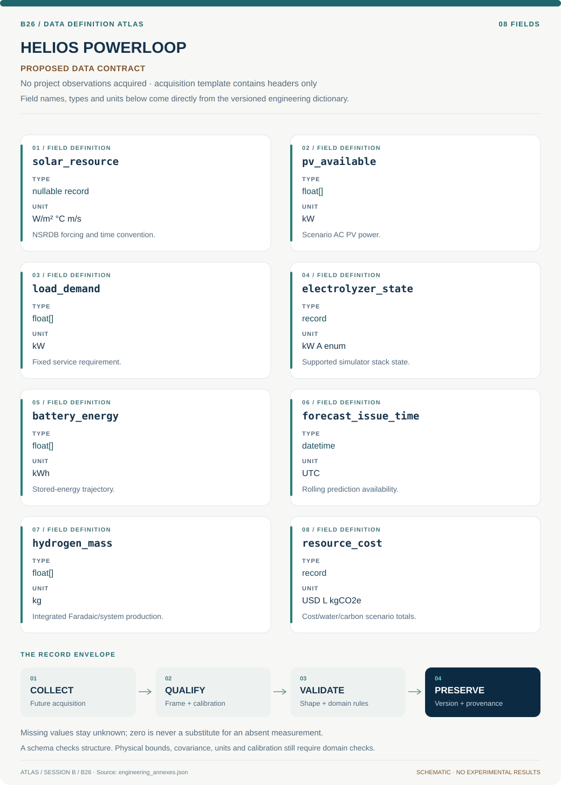

# B26 · Data blueprint

[HELIOS POWERLOOP — Solar Electrolysis Dispatch](../README.md) · [Figure gallery](../figures/README.md) · [Data atlas](../../../../data/README.md)

**PROPOSED CONTRACT · 8 fields · no project observations acquired.** The acquisition CSV contains column headers only. The diagram is a visual record specification, not measured data.

| Download | What it contains |
| --- | --- |
| [Acquisition CSV](acquisition.csv) | Empty columns ready for controlled acquisition |
| [Field dictionary](dictionary.csv) | Names, source types, units, meanings and quality rules |
| [JSON Schema](schema.json) | Nullable record structure with unit and quality metadata |

## Field reference

| Field | Type | Unit | Meaning | Quality / missingness |
| --- | --- | --- | --- | --- |
| solar_resource | nullable record | W/m² °C m/s | NSRDB forcing and time convention. | Cadence/version/coverage retained. |
| pv_available | float[] | kW | Scenario AC PV power. | Loss-model provenance required. |
| load_demand | float[] | kW | Fixed service requirement. | Measured versus synthetic label explicit. |
| electrolyzer_state | record | kW A enum | Supported simulator stack state. | Vendor/literature bounds linked. |
| battery_energy | float[] | kWh | Stored-energy trajectory. | Capacity/efficiency covariance saved. |
| forecast_issue_time | datetime | UTC | Rolling prediction availability. | No future forcing in replay. |
| hydrogen_mass | float[] | kg | Integrated Faradaic/system production. | Cell convention and auxiliaries retained. |
| resource_cost | record | USD L kgCO2e | Cost/water/carbon scenario totals. | Boundary, price year and uncertainty explicit. |

## Acquisition and provenance

Null means missing or unknown; record its cause. Preserve product identifier, retrieval timestamp, source hash, calibration, coordinate and time frame, covariance basis, selection rules and every transformation. JSON Schema checks structure; physical bounds and the quality rules above require domain validation.

- [National Solar Radiation Database API](https://developer.nlr.gov/docs/solar/nsrdb/) — archive or acquisition resource; inclusion here does not assert that its data have been retrieved.
- [Operating strategies for dispatchable PEM electrolyzers](https://research-hub.nlr.gov/en/publications/operating-strategies-for-dispatchable-pem-electrolyzers-that-enab/) — archive or acquisition resource; inclusion here does not assert that its data have been retrieved.

[Controlled data-management procedure](../../../../engineering/DATA_MANAGEMENT.md)
