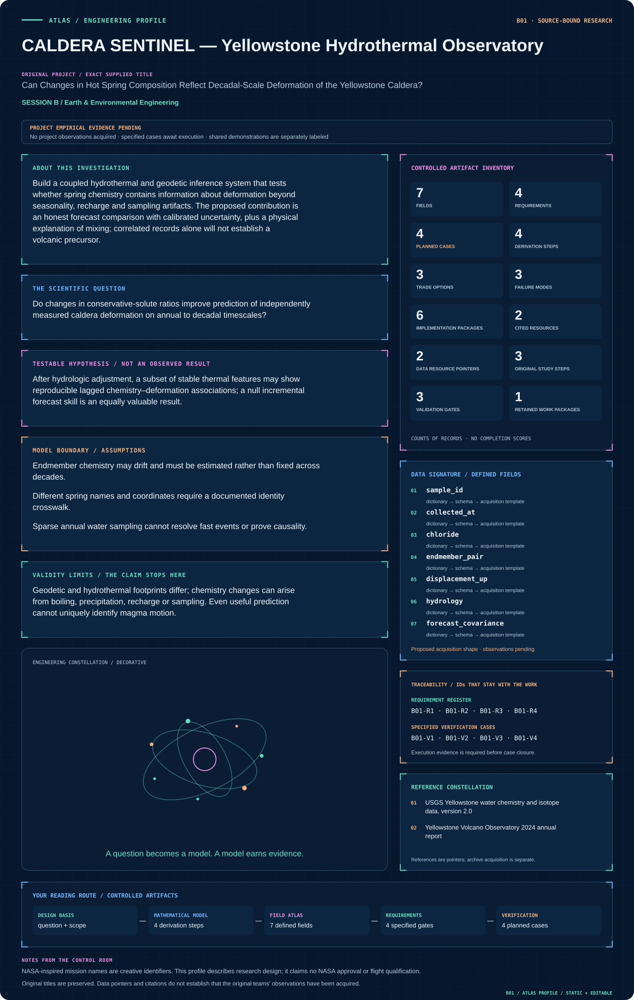

# Session B · Earth & Environmental Engineering

[Continuous handbook](../../handbooks/SESSION_B.md) · [All sessions](../README.md) · [Data atlas](../../data/README.md)

**28 projects · 213 defined fields · 112 proposed requirements · 112 specified cases.** All projects retain their supplied order. Data maps describe proposed acquisition, while included numerical plots carry their own evidence labels.

| ID | Mission profile & engineering record | Original investigation | Explore |
| --- | --- | --- | --- |
| B01 | [CALDERA SENTINEL — Yellowstone Hydrothermal Observatory](B01-caldera-sentinel-yellowstone-hydrothermal-observatory/README.md) | Can Changes in Hot Spring Composition Reflect Decadal-Scale Deformation of the Yellowstone Caldera? | [Profile](B01-caldera-sentinel-yellowstone-hydrothermal-observatory/figures/mission-profile.svg) · [Data](B01-caldera-sentinel-yellowstone-hydrothermal-observatory/data/README.md) · [Figures](B01-caldera-sentinel-yellowstone-hydrothermal-observatory/figures/README.md) |
| B02 | [ARTEMIS LIFE RAFTS — Urban Pollinator Constellation](B02-artemis-life-rafts-urban-pollinator-constellation/README.md) | Urban Biodiversity Life Rafts: A Way to Conserve our Pollinators | [Profile](B02-artemis-life-rafts-urban-pollinator-constellation/figures/mission-profile.svg) · [Data](B02-artemis-life-rafts-urban-pollinator-constellation/data/README.md) · [Figures](B02-artemis-life-rafts-urban-pollinator-constellation/figures/README.md) |
| B03 | [ORION CROSSINGS — Gila Monster Road Ecology](B03-orion-crossings-gila-monster-road-ecology/README.md) | Potential Road Impacts on Gila Monsters in an Urbanizing Environment | [Profile](B03-orion-crossings-gila-monster-road-ecology/figures/mission-profile.svg) · [Data](B03-orion-crossings-gila-monster-road-ecology/data/README.md) · [Figures](B03-orion-crossings-gila-monster-road-ecology/figures/README.md) |
| B04 | [AURORA VEIL — Ionospheric Absorption Atlas](B04-aurora-veil-ionospheric-absorption-atlas/README.md) | Analysis of Space-based Riometer Measurement Data for Characterization of Radio Propagation Disturbance in the Ionosphere | [Profile](B04-aurora-veil-ionospheric-absorption-atlas/figures/mission-profile.svg) · [Data](B04-aurora-veil-ionospheric-absorption-atlas/data/README.md) · [Figures](B04-aurora-veil-ionospheric-absorption-atlas/figures/README.md) |
| B05 | [KEPLER BLOOMCLOCK — Restoration Timing Observatory](B05-kepler-bloomclock-restoration-timing-observatory/README.md) | Phenology Data to Aid Pollinator Restoration | [Profile](B05-kepler-bloomclock-restoration-timing-observatory/figures/mission-profile.svg) · [Data](B05-kepler-bloomclock-restoration-timing-observatory/data/README.md) · [Figures](B05-kepler-bloomclock-restoration-timing-observatory/figures/README.md) |
| B06 | [SOLSTICE CHEMISTRY — Tucson Ozone Digital Observatory](B06-solstice-chemistry-tucson-ozone-digital-observatory/README.md) | The Contribution of Plants and Pollution to Tucson's Urban Ozone Problem | [Profile](B06-solstice-chemistry-tucson-ozone-digital-observatory/figures/mission-profile.svg) · [Data](B06-solstice-chemistry-tucson-ozone-digital-observatory/data/README.md) · [Figures](B06-solstice-chemistry-tucson-ozone-digital-observatory/figures/README.md) |
| B07 | [REGENESIS CLEANFLOW — Environmental Fate and Remediation Model](B07-regenesis-cleanflow-environmental-fate-and-remediation-model/README.md) | Bioremediation of Insensitive Munitions Compounds | [Profile](B07-regenesis-cleanflow-environmental-fate-and-remediation-model/figures/mission-profile.svg) · [Data](B07-regenesis-cleanflow-environmental-fate-and-remediation-model/data/README.md) · [Figures](B07-regenesis-cleanflow-environmental-fate-and-remediation-model/figures/README.md) |
| B08 | [TERRAFORM TERRACES — Dryland Conservation Observatory](B08-terraform-terraces-dryland-conservation-observatory/README.md) | The Influence of Conservation Structures on Rangeland Vegetation Patterns | [Profile](B08-terraform-terraces-dryland-conservation-observatory/figures/mission-profile.svg) · [Data](B08-terraform-terraces-dryland-conservation-observatory/data/README.md) · [Figures](B08-terraform-terraces-dryland-conservation-observatory/figures/README.md) |
| B09 | [EUROPA CHEMGRID — Yellowstone Geochemical Atlas](B09-europa-chemgrid-yellowstone-geochemical-atlas/README.md) | Mapping Hot Spring Geochemistry in Yellowstone | [Profile](B09-europa-chemgrid-yellowstone-geochemical-atlas/figures/mission-profile.svg) · [Data](B09-europa-chemgrid-yellowstone-geochemical-atlas/data/README.md) · [Figures](B09-europa-chemgrid-yellowstone-geochemical-atlas/figures/README.md) |
| B10 | [LANDSAT EQUITY — Community Canopy Mission](B10-landsat-equity-community-canopy-mission/README.md) | Using Remote Sensing to Determine Vegetation Change and Impacts to Communities | [Profile](B10-landsat-equity-community-canopy-mission/figures/mission-profile.svg) · [Data](B10-landsat-equity-community-canopy-mission/data/README.md) · [Figures](B10-landsat-equity-community-canopy-mission/figures/README.md) |
| B11 | [APOLLO LEGACY LEDGER — Environmental Stewardship Knowledge System](B11-apollo-legacy-ledger-environmental-stewardship-knowledge-system/README.md) | Nevada Offsite Management | [Profile](B11-apollo-legacy-ledger-environmental-stewardship-knowledge-system/figures/mission-profile.svg) · [Data](B11-apollo-legacy-ledger-environmental-stewardship-knowledge-system/data/README.md) · [Figures](B11-apollo-legacy-ledger-environmental-stewardship-knowledge-system/figures/README.md) |
| B12 | [VULCAN DOMESCAN — O’Leary Emplacement Reconstruction](B12-vulcan-domescan-o-leary-emplacement-reconstruction/README.md) | Identifying unique emplacement characteristics of O'Leary Peak: a volcanic dome in the San Francisco Volcanic Field | [Profile](B12-vulcan-domescan-o-leary-emplacement-reconstruction/figures/mission-profile.svg) · [Data](B12-vulcan-domescan-o-leary-emplacement-reconstruction/data/README.md) · [Figures](B12-vulcan-domescan-o-leary-emplacement-reconstruction/figures/README.md) |
| B13 | [GAIA PIXELSCOUT — Ecological Instance Mapping](B13-gaia-pixelscout-ecological-instance-mapping/README.md) | Instance Segmentation for Biogeography | [Profile](B13-gaia-pixelscout-ecological-instance-mapping/figures/mission-profile.svg) · [Data](B13-gaia-pixelscout-ecological-instance-mapping/data/README.md) · [Figures](B13-gaia-pixelscout-ecological-instance-mapping/figures/README.md) |
| B14 | [PHOENIX INFILTRATION — Postfire Soil Recovery Observatory](B14-phoenix-infiltration-postfire-soil-recovery-observatory/README.md) | Soil hydraulic properties three years after the Frye Fire on Mount Graham, Arizona | [Profile](B14-phoenix-infiltration-postfire-soil-recovery-observatory/figures/mission-profile.svg) · [Data](B14-phoenix-infiltration-postfire-soil-recovery-observatory/data/README.md) · [Figures](B14-phoenix-infiltration-postfire-soil-recovery-observatory/figures/README.md) |
| B15 | [TECTON ORION — Farallon Slab Reconstruction](B15-tecton-orion-farallon-slab-reconstruction/README.md) | Numerical simulation of Laramide flat-slab subduction | [Profile](B15-tecton-orion-farallon-slab-reconstruction/figures/mission-profile.svg) · [Data](B15-tecton-orion-farallon-slab-reconstruction/data/README.md) · [Figures](B15-tecton-orion-farallon-slab-reconstruction/figures/README.md) |
| B16 | [ISS BIOGUARD — Retrospective Microgravity Health Evidence](B16-iss-bioguard-retrospective-microgravity-health-evidence/README.md) | Multi-drug Resistance of Pseudomonas aeruginosa Under Microgravity Growth Conditions | [Profile](B16-iss-bioguard-retrospective-microgravity-health-evidence/figures/mission-profile.svg) · [Data](B16-iss-bioguard-retrospective-microgravity-health-evidence/data/README.md) · [Figures](B16-iss-bioguard-retrospective-microgravity-health-evidence/figures/README.md) |
| B17 | [AQUARIUS LIFELINE — Inland Fisheries Resilience](B17-aquarius-lifeline-inland-fisheries-resilience/README.md) | Off the Hook: Assessing the Vulnerability of Inland Subsistence Fisheries to Climate Change | [Profile](B17-aquarius-lifeline-inland-fisheries-resilience/figures/mission-profile.svg) · [Data](B17-aquarius-lifeline-inland-fisheries-resilience/data/README.md) · [Figures](B17-aquarius-lifeline-inland-fisheries-resilience/figures/README.md) |
| B18 | [POSEIDON WINDCARBON — Southern Ocean Carbon Mission](B18-poseidon-windcarbon-southern-ocean-carbon-mission/README.md) | Assessing the Role of the Winds in the Biogeochemical Cycling and Carbon Budget of the Southern Ocean | [Profile](B18-poseidon-windcarbon-southern-ocean-carbon-mission/figures/mission-profile.svg) · [Data](B18-poseidon-windcarbon-southern-ocean-carbon-mission/data/README.md) · [Figures](B18-poseidon-windcarbon-southern-ocean-carbon-mission/figures/README.md) |
| B19 | [PARKER PLASMA WHISPER — Electron Structure Observatory](B19-parker-plasma-whisper-electron-structure-observatory/README.md) | Investigation of Electron Parameters and Association with Structures using Quasi-thermal Noise Spectroscopy (QTN) | [Profile](B19-parker-plasma-whisper-electron-structure-observatory/figures/mission-profile.svg) · [Data](B19-parker-plasma-whisper-electron-structure-observatory/data/README.md) · [Figures](B19-parker-plasma-whisper-electron-structure-observatory/figures/README.md) |
| B20 | [LUNAR RECLAIMER — Algal Rare-Earth Recovery](B20-lunar-reclaimer-algal-rare-earth-recovery/README.md) | Rare Earth Metal Recovery from Waste Stream Using Algae | [Profile](B20-lunar-reclaimer-algal-rare-earth-recovery/figures/mission-profile.svg) · [Data](B20-lunar-reclaimer-algal-rare-earth-recovery/data/README.md) · [Figures](B20-lunar-reclaimer-algal-rare-earth-recovery/figures/README.md) |
| B21 | [PROTEUS DRIFTSCAPE — Evolutionary Protein Disorder](B21-proteus-driftscape-evolutionary-protein-disorder/README.md) | More Effectively Selective Species Have Greater Protein Structural Disorder | [Profile](B21-proteus-driftscape-evolutionary-protein-disorder/figures/mission-profile.svg) · [Data](B21-proteus-driftscape-evolutionary-protein-disorder/data/README.md) · [Figures](B21-proteus-driftscape-evolutionary-protein-disorder/figures/README.md) |
| B22 | [NIF ODYSSEY — Comparative Nitrogen-Fixation Evolution](B22-nif-odyssey-comparative-nitrogen-fixation-evolution/README.md) | Developing a model system using Azotobacter vinelandii to investigate the evolution of nitrogen fixation | [Profile](B22-nif-odyssey-comparative-nitrogen-fixation-evolution/figures/mission-profile.svg) · [Data](B22-nif-odyssey-comparative-nitrogen-fixation-evolution/data/README.md) · [Figures](B22-nif-odyssey-comparative-nitrogen-fixation-evolution/figures/README.md) |
| B23 | [HYDRA MISSION CONTROL — Watershed Decisions Under Uncertainty](B23-hydra-mission-control-watershed-decisions-under-uncertainty/README.md) | Modeling to Make a Difference: Hydrologic Analysis for Improved Decision Support | [Profile](B23-hydra-mission-control-watershed-decisions-under-uncertainty/figures/mission-profile.svg) · [Data](B23-hydra-mission-control-watershed-decisions-under-uncertainty/data/README.md) · [Figures](B23-hydra-mission-control-watershed-decisions-under-uncertainty/figures/README.md) |
| B24 | [VIPER VOYAGER — Urban Movement and Habitat Connectivity](B24-viper-voyager-urban-movement-and-habitat-connectivity/README.md) | Using GIS to Quantify Effects of Land Cover Change on Movement Patterns of Tiger Rattlesnakes in an Urbanizing Environment | [Profile](B24-viper-voyager-urban-movement-and-habitat-connectivity/figures/mission-profile.svg) · [Data](B24-viper-voyager-urban-movement-and-habitat-connectivity/data/README.md) · [Figures](B24-viper-voyager-urban-movement-and-habitat-connectivity/figures/README.md) |
| B25 | [SEEDSTAR GENESIS — Dryland Establishment Forecasting](B25-seedstar-genesis-dryland-establishment-forecasting/README.md) | Can We Predict Germination Success in Seed Pellets Using Seed Traits? | [Profile](B25-seedstar-genesis-dryland-establishment-forecasting/figures/mission-profile.svg) · [Data](B25-seedstar-genesis-dryland-establishment-forecasting/data/README.md) · [Figures](B25-seedstar-genesis-dryland-establishment-forecasting/figures/README.md) |
| B26 | [HELIOS POWERLOOP — Solar Electrolysis Dispatch](B26-helios-powerloop-solar-electrolysis-dispatch/README.md) | Electrolytic Application of Load-Managing Photovoltaic System | [Profile](B26-helios-powerloop-solar-electrolysis-dispatch/figures/mission-profile.svg) · [Data](B26-helios-powerloop-solar-electrolysis-dispatch/data/README.md) · [Figures](B26-helios-powerloop-solar-electrolysis-dispatch/figures/README.md) |
| B27 | [TRITON WATERWATCH — Autonomous Aquatic Observatory](B27-triton-waterwatch-autonomous-aquatic-observatory/README.md) | Aquatic Data Analysis from Deployable, Autonomous Boat | [Profile](B27-triton-waterwatch-autonomous-aquatic-observatory/figures/mission-profile.svg) · [Data](B27-triton-waterwatch-autonomous-aquatic-observatory/data/README.md) · [Figures](B27-triton-waterwatch-autonomous-aquatic-observatory/figures/README.md) |
| B28 | [ASTRA BIOCYCLE — Microalgal Methane and Net Energy](B28-astra-biocycle-microalgal-methane-and-net-energy/README.md) | Biogas Production from Microalgae following Freeze-Heat Pretreatment | [Profile](B28-astra-biocycle-microalgal-methane-and-net-energy/figures/mission-profile.svg) · [Data](B28-astra-biocycle-microalgal-methane-and-net-energy/data/README.md) · [Figures](B28-astra-biocycle-microalgal-methane-and-net-energy/figures/README.md) |

## Visual field guide

### B23 · HYDRA MISSION CONTROL — Watershed Decisions Under Uncertainty

Synthetic reservoir fluxes and cumulative water accounting. Recharge means effective water entering storage, rather than rainfall. Panel B decomposes all accounted water into cumulative release and remaining storage, bounded by initial storage plus accumulated recharge. The tiny arithmetic residual verifies this implementation's conservation, not watershed predictive accuracy.

## Mission profile spotlight

[Enter B01 engineering dossier](B01-caldera-sentinel-yellowstone-hydrothermal-observatory/README.md) · [Mission control: every profile and reading path](../../MISSION_CONTROL.md)
