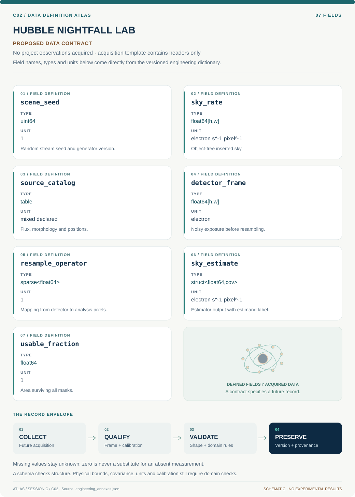

# C02 · HUBBLE NIGHTFALL LAB

**Original project:** Image Simulations for Testing the Fidelity of SKYSURF Background Measurement Algorithms

**Session C:** Astronomy & Space Physics

**Document class:** engineering research design and analysis record · **Revision:** 3 · **Date:** 2026-10-02

**Evidence state:** design basis, mathematical formulation and verification plan documented. Project-specific empirical results remain to be acquired; executable shared model demonstrations have their own recorded checks.

[Session C](../README.md) · [All projects](../../../ENGINEERING_DOCUMENTATION.md) · [Session handbook](../../../handbooks/SESSION_C.md) · [← C01](../C01-apollo-windwatch/README.md) · [C03 →](../C03-taurus-molecule-trail/README.md)

| Proposed requirements | Specified verification cases | Defined data fields | Cited resources |
| ---: | ---: | ---: | ---: |
| 4 | 4 | 7 | 3 |

[Explore the data blueprint](data/README.md) · [Open the figure gallery](figures/README.md) · [Download acquisition template](data/acquisition.csv) · [Browse the data atlas](../../../data/README.md)

---

## Purpose and scientific objective

Build a controlled image laboratory for absolute sky estimation in Hubble exposures. The scientific asset is a response surface showing where a sky algorithm becomes biased by faint galaxy wings, gradients, detector persistence, cosmic rays, or correlated resampling noise. Use published SKYSURF methods and released products as baselines; independently generated synthetic truth must remain distinct from archival sky measurements.

**Question:** Under which combinations of source crowding, sky gradient, detector noise, and masking does each estimator recover the inserted object-free sky within a declared uncertainty?

**Testable hypothesis:** An estimator selected by scene diagnostics and calibrated on independent synthetic families will outperform a single global estimator without introducing unreported scene-dependent bias.

## 1. Design basis and analysis boundary

The simulator defines truth in detector electron rate before exposure integration and resampling. Its principal product is an estimator response surface over source wings, source density, gradients and detector artifacts. The reference sky is B0 at a declared detector coordinate; spatial mean and minimum sky remain separately named estimands. SKYSURF release products provide realistic morphology and processing context, but archival pixels never become synthetic truth.

Begin with flat sky and point sources, then add extended profiles, detector defects and drizzle covariance. A final generator uses independently held-out morphologies rather than the same analytic galaxy family used to tune clipping. Proposed bias targets apply within a documented scene envelope; source populations below detection remain explicit assumptions. The architecture supports a failed-domain mask where no estimator meets the target.

## 2. Requirements and verification traceability

These are project design requirements or proposed analysis gates. A numerical target is not a NASA requirement unless its controlling source is explicitly identified. “TBD” identifies evidence required before a decision; it is not permission to assume a value. Verification evidence listed here is planned, unless a linked result explicitly records execution.

| ID | Requirement / gate | Engineering rationale | Verification method | Basis / required evidence |
| --- | --- | --- | --- | --- |
| C02-R1 | Every scene shall distinguish sky, source electron rate, dark current and read noise before resampling. | Adding noise after drizzle loses detector and covariance structure. | Component-sum and noise-placement audit. | Proposed truth contract. |
| C02-R2 | Flat-sky fractional bias shall remain below 1% in the preregistered benchmark envelope, a proposed target. | Absolute sky work needs bias control beyond pixel precision. | Monte Carlo confidence interval on mean recovered bias. | Proposed target informed by SKYSURF method context. |
| C02-R3 | Estimator output shall state whether it targets reference, minimum or spatial mean sky. | Gradient comparisons otherwise mix distinct truths. | Schema and gradient analytic fixtures. | Proposed estimand requirement. |
| C02-R4 | Holdout scenes shall use unseen morphology generators and detector configurations. | Tuning to one morphology can hide wing leakage. | Generator and configuration split manifest. | Proposed transferability requirement. |

## 3. Architecture and controlled interfaces

The scene contract contains sky-rate maps, catalog profiles, PSF kernels and detector parameters with units attached. A detector sampler generates Poisson electrons plus read noise, persistence and cosmic-ray components. Calibration and resampling receive those frames together with masks, gain and weights. A covariance adapter records the linear resampling matrix or a validated local covariance representation.

An estimator runner consumes exactly the same processed frame and mask for each method. It emits a scalar or spatial sky estimate, uncertainty, remaining area and diagnostic flags. The evaluation engine compares each output to the matching truth transformed through the same processing. An emulator receives scenario parameters and recovery errors, while a withheld-generator evaluator remains independent of fitting that emulator.

Synthetic truth enters before detector sampling; covariance and named sky estimands remain explicit through drizzle and estimator comparison.

[Editable engineering diagram source](figures/architecture.mmd)

## 4. Mathematical model and derivation

### Governing equations

$$
D_{ij}\sim\mathrm{Poisson}\{t[B_{ij}+\sum_s(F_s\otimes P)_{ij}+d_{ij}]\}+\mathcal N(0,\sigma_R^2)
$$

$$
B_{ij}=B_0+g_xx_i+g_yy_j+B_{\rm stray}(x_i,y_j)
$$

$$
b=(\hat B-B_0)/B_0;\quad \mathrm{RMSE}=\sqrt{\langle(\hat B-B_0)^2\rangle}
$$

### Variables, units and conventions

- D in electrons; t in seconds; B and dark current d in electrons s^-1 pixel^-1
- F_s is source electron-rate image; P is normalized point spread function
- g_x and g_y in electron-rate per pixel-coordinate unit
- sigma_R in electrons; covariance is added after resampling
- b is fractional bias; truth B0 is the designated minimum or reference sky, explicitly defined

### Assumptions and boundary conditions

- Simulate detector exposures before drizzling; account for gain and sky-preserving processing.
- The minimum estimated sky and spatial mean sky are different estimands when gradients exist.

### Derivation step 1

$$
\mu_{ij}=t(B_{ij}+S_{ij}+d_{ij})
$$

All terms are electron rates per pixel, giving dimensionless expected electron counts. Normalize PSF convolution so source counts are conserved at the declared image boundary.

### Derivation step 2

$$
\operatorname{Var}(D_{ij})=\mu_{ij}+\sigma_R^2
$$

Independent Poisson and read-noise variances add before calibration; persistence or shared electronics require additional covariance.

### Derivation step 3

$$
\Sigma_y=A\Sigma_DA^T
$$

A is the declared linear resampling operator including normalization. It changes covariance even when the uniform sky value is preserved.

### Derivation step 4

$$
b=(\widehat B-B_{\rm ref})/B_{\rm ref}
$$

Use fractional bias only for positive reference sky. Report absolute error separately when B_ref is zero or a gradient changes the relevant estimand.

### Inference or simulation procedure

Generate Latin-hypercube scenes spanning sky level, galaxy size and faint-end counts, PSF wings, detector position, and contamination. Propagate Poisson and read noise before applying the same resampling used for observations. Benchmark percentile clipping, ProFound-style masking, robust grid medians, and a preregistered adaptive combination. Fit a bias emulator with uncertainty rather than correcting every image by a point estimate. Keep unseen morphology generators and detector configurations exclusively for testing.

### Validity domain and fidelity limits

Synthetic truth depends on assumptions about undetected sources and artifacts. Algorithm precision can exceed absolute photometric accuracy; successful simulation recovery is not evidence for a cosmological diffuse component.

## 5. Data specifications and provenance

**Proposed data contract · observations pending.** This visual inventory shows the record fields to acquire or derive. It contains no project measurements. [Open the data blueprint and downloads](data/README.md).

| Field | Type | Unit | Physical / statistical meaning | Quality and missing-data rule |
| --- | --- | --- | --- | --- |
| scene_seed | uint64 | 1 | Random stream seed and generator version. | Unique scenario ID; preserve independent noise substreams. |
| sky_rate | float64[h,w] | electron s^-1 pixel^-1 | Object-free inserted sky. | Nonnegative; reference coordinate recorded. |
| source_catalog | table | mixed declared | Flux, morphology and positions. | Flux convention and truncated wings documented. |
| detector_frame | float64[h,w] | electron | Noisy exposure before resampling. | Missing pixels use mask, never sky-valued fill. |
| resample_operator | sparse<float64> | 1 | Mapping from detector to analysis pixels. | Row normalization checked for uniform sky. |
| sky_estimate | struct<float64,cov> | electron s^-1 pixel^-1 | Estimator output with estimand label. | Covariance must include resampling dependence. |
| usable_fraction | float64 | 1 | Area surviving all masks. | Bounded from zero to one; zero area invalidates estimate. |

[Machine-readable record schema](data/schema.json) · [Empty acquisition CSV](data/acquisition.csv) · [Field dictionary CSV](data/dictionary.csv)

The CSV above contains column headers only. Its schema defines future records and does not establish that original-team data or a particular archive product have been acquired. Frame, timing, calibration, covariance, selection and provenance details must accompany populated records.

### SKYSURF HLSP

[Product, archive or reference](https://archive.stsci.edu/hlsp/skysurf)

**Fields:** Calibrated mosaics, catalogs, masks or available product metadata

**Access:** Public product page; enumerate exact versions, filters, and downloadable files before ingestion.

**Role:** Realistic scene and comparison-product discovery.

### Independent synthetic detector scenes

[Product, archive or reference](https://arxiv.org/abs/2205.06214)

**Fields:** Inserted sky, source catalog, detector settings, random seed, estimator output

**Access:** Generate locally; release recipes and small fixtures with provenance.

**Role:** Known truth for algorithm validation.

## 6. Uncertainty, sensitivity and identifiability

Unresolved source counts, extended galaxy wings and persistence history determine whether simulated scenes span the observations. Treat those inputs as scenario uncertainty rather than reducing them through repeated noise draws. Separate variation between scene realizations from Monte Carlo variance within a fixed scene. Allocate enough noise replicates to resolve the proposed bias target, using estimated variance to determine sample count rather than assuming a fixed count proves precision.

Mask growth and estimator tuning can compensate for each other. Use factorial contrasts or Sobol-style sensitivities to locate dominant interactions between sky level, galaxy size and unmasked area. An uncertainty emulator must include held-out prediction error; outside its training envelope, return an unsupported-domain flag. A successful flat-sky test does not constrain bias from missing diffuse wings.

## 7. Engineering trade study

| Alternative | Benefit | Cost / limitation | Decision rule |
| --- | --- | --- | --- |
| Robust grid median | Fast, resistant to isolated bright pixels. | Wings contaminate many grid cells. | Choose where contamination occupies a minority of cells and gradient diagnostics pass. |
| Explicit source masking | Uses morphology to remove wings. | Mask incompleteness and area loss. | Choose when source models improve held-out bias without excessive lost area. |
| Low-percentile estimator | Can reject broad positive contamination. | Noise and minimum-versus-mean bias. | Calibrate through noiseless and noisy gradients; never compare to an unmatched mean. |

## 8. Verification and validation cases

| Case ID | Stimulus / condition | Expected result / criterion | Method | Evidence artifact |
| --- | --- | --- | --- | --- |
| C02-V1 | Uniform noiseless scene | Recovered sky equals B0 within floating-point/resampling error. | Pass a constant map through every pipeline stage. | Constant-preserving operator. |
| C02-V2 | Poisson/read-noise scene | Sample mean and variance approach mu and mu+sigma_R squared. | Independent replicated detector draws with convergence intervals. | Analytic count moments. |
| C02-V3 | Linear gradient | Reference and spatial-mean truths differ by the analytic coordinate average. | Inject a known slope and compare named estimands. | Specified B(x,y). |
| C02-V4 | Unknown galaxy wings | Bias and coverage are reported for a withheld profile generator. | Freeze tuning and evaluate independent scenes. | Proposed holdout requirement. |

**Execution status:** these cases are specified, not claimed as executed. Close a case only with the versioned inputs, output, uncertainty, reviewer and pass/fail rationale.

### Additional scientific validation gates

- Report signed bias, scatter, and interval coverage by sky gradient and crowding, including rare failure tails.
- Hold out galaxy morphology libraries and entire filters; test covariance-aware uncertainty against independent noise realizations.
- Compare pairs of real exposures for repeatability, recognizing that repeatability cannot establish absolute truth.

## 9. Implementation and reproducible work packages

1. Write scene and estimand manifests with explicit detector units.
2. Implement count-conserving source rendering and a component truth ledger.
3. Apply calibrated detector sampling and pinned resampling code.
4. Implement common-mask estimator adapters and diagnostic outputs.
5. Fit a scenario bias emulator with withheld morphology tests.
6. Release small deterministic fixtures, recovery tables and unsupported-domain maps.

### Investigation sequence

1. Define the required sky estimand and allocate separate budgets to estimator bias and absolute calibration.
2. Build exposure-level scenes and a common estimator interface; freeze test seeds before optimization.
3. Sweep scene complexity and masking dilation; store failure cases rather than removing them.
4. Choose operational quality flags from diagnostics whose thresholds are fixed using training scenes only.

### Resources and interfaces to expertise

- Python image simulation, Astropy, instrument PSF and detector references; moderate workstation or batch compute.

## 10. Failure modes and interpretation controls

| Failure mode | Effect on result | Detection / evidence | Design response |
| --- | --- | --- | --- |
| Sky subtracted during calibration | Target signal removed. | Uniform-scene end-to-end check. | Disable subtraction or preserve and restore its recorded map. |
| Noise added after drizzle | Underestimated estimator uncertainty. | Adjacent-pixel covariance mismatch. | Sample detector noise first and propagate weights. |
| Synthetic wing truncation | Optimistic faint-source rejection. | Bias changes with enlarged scene padding. | Increase padding and disclose source-envelope limits. |

- Unmodeled faint wings and persistence can look like diffuse sky. Correlated pixels invalidate naive pixel-count standard errors.

## 11. Required engineering outputs

- Versioned simulation catalog, estimator benchmark, bias surfaces, and deployable quality-flag specification.

### Scientific result figures to produce during execution

Estimator fractional bias versus crowding and gradient, with interval coverage and representative inserted-truth images.

## 12. Cited technical and scientific resources

- [Windhorst et al. (2022), SKYSURF overview and methods](https://arxiv.org/abs/2205.06214) — Simulation and sky-preservation design precedent.
- [OBrien et al. (2022), SKYSURF-4 methods](https://arxiv.org/abs/2210.08010) — Published background measurement comparator.
- [SKYSURF high-level science products](https://archive.stsci.edu/hlsp/skysurf) — Public release discovery and provenance.

Framework and evidence rules: [engineering documentation standard](../../../engineering/ENGINEERING_STANDARD.md), [model assurance](../../../engineering/MODEL_ASSURANCE.md), [uncertainty procedure](../../../engineering/UNCERTAINTY_AND_DECISION_RULES.md), [data management](../../../engineering/DATA_MANAGEMENT.md). NASA-inspired names are creative identifiers; requirements and results are not NASA certification.
