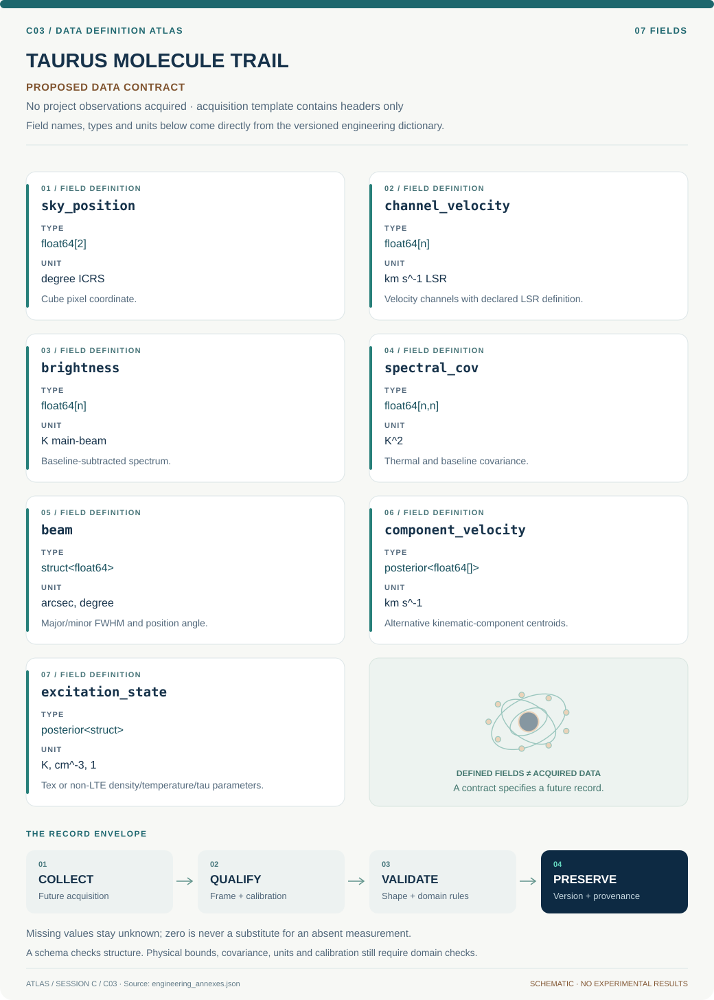

# C03 · Data blueprint

[TAURUS MOLECULE TRAIL](../README.md) · [Figure gallery](../figures/README.md) · [Data atlas](../../../../data/README.md)

**PROPOSED CONTRACT · 7 fields · no project observations acquired.** The acquisition CSV contains column headers only. The diagram is a visual record specification, not measured data.

| Download | What it contains |
| --- | --- |
| [Acquisition CSV](acquisition.csv) | Empty columns ready for controlled acquisition |
| [Field dictionary](dictionary.csv) | Names, source types, units, meanings and quality rules |
| [JSON Schema](schema.json) | Nullable record structure with unit and quality metadata |

## Field reference

| Field | Type | Unit | Meaning | Quality / missingness |
| --- | --- | --- | --- | --- |
| sky_position | float64[2] | degree ICRS | Cube pixel coordinate. | WCS and distance assumption required. |
| channel_velocity | float64[n] | km s^-1 LSR | Velocity channels with declared LSR definition. | Rest frequency and Doppler convention mandatory. |
| brightness | float64[n] | K main-beam | Baseline-subtracted spectrum. | Mask bad channels; preserve negative noise realizations. |
| spectral_cov | float64[n,n] | K^2 | Thermal and baseline covariance. | Do not infer independent channels after smoothing. |
| beam | struct<float64> | arcsec, degree | Major/minor FWHM and position angle. | Match before any cross-tracer ratio. |
| component_velocity | posterior<float64[]> | km s^-1 | Alternative kinematic-component centroids. | Ambiguous assignments retain probability weights. |
| excitation_state | posterior<struct> | K, cm^-3, 1 | Tex or non-LTE density/temperature/tau parameters. | Upper/lower bounds and prior dependence reported. |

## Acquisition and provenance

Null means missing or unknown; record its cause. Preserve product identifier, retrieval timestamp, source hash, calibration, coordinate and time frame, covariance basis, selection rules and every transformation. JSON Schema checks structure; physical bounds and the quality rules above require domain validation.

- [HCN anomaly survey publication](https://arxiv.org/abs/1305.1303) — archive or acquisition resource; inclusion here does not assert that its data have been retrieved.
- [Cologne spectroscopy laboratory data](https://cdms.astro.uni-koeln.de/classic/cologne_data) — archive or acquisition resource; inclusion here does not assert that its data have been retrieved.
- [New or recovered Taurus cube](https://baas.aas.org/pub/2025n4i414p05/release/1?readingCollection=db75f3fa) — archive or acquisition resource; inclusion here does not assert that its data have been retrieved.

[Controlled data-management procedure](../../../../engineering/DATA_MANAGEMENT.md)
