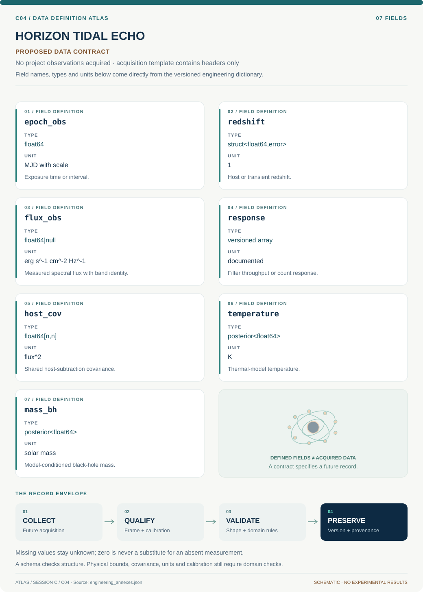

# C04 · HORIZON TIDAL ECHO

**Original project:** A Deep Look at the Nature of Black Holes: Using Tidal Disruption Events to See the Unseeable

**Session C:** Astronomy & Space Physics

**Document class:** engineering research design and analysis record · **Revision:** 3 · **Date:** 2026-10-02

**Evidence state:** design basis, mathematical formulation and verification plan documented. Project-specific empirical results remain to be acquired; executable shared model demonstrations have their own recorded checks.

[Session C](../README.md) · [All projects](../../../ENGINEERING_DOCUMENTATION.md) · [Session handbook](../../../handbooks/SESSION_C.md) · [← C03](../C03-taurus-molecule-trail/README.md) · [C05 →](../C05-kepler-worldforge/README.md)

| Proposed requirements | Specified verification cases | Defined data fields | Cited resources |
| ---: | ---: | ---: | ---: |
| 5 | 4 | 7 | 3 |

[Explore the data blueprint](data/README.md) · [Open the figure gallery](figures/README.md) · [Download acquisition template](data/acquisition.csv) · [Browse the data atlas](../../../data/README.md)

---

## Purpose and scientific objective

Use stellar tidal disruption flares as a measured probe of black-hole mass and accretion geometry. Build a multiwavelength inference system that distinguishes debris fallback from radiation reprocessing, survey selection, and host contamination. The proposal aims to quantify what the data identify; a power-law decline or blackbody radius is not treated as a direct image of the event horizon.

**Question:** Which combinations of UV, optical, and X-ray observations constrain black-hole mass robustly despite uncertain stellar structure and reprocessing physics?

**Testable hypothesis:** Joint modeling with an independent host-galaxy mass proxy will expose when optical-only masses are prior dominated and improve predictive performance on withheld wavebands.

## 1. Design basis and analysis boundary

The tidal-disruption pipeline ingests source-cited fluxes or photon counts, exposure responses and host measurements. It outputs rest-frame luminosity evolution and conditional black-hole-mass posteriors, without treating a photospheric radius as an event-horizon scale. Fallback and radiation reprocessing are separate modules; a late-time power law alone cannot validate the full physical chain.

Start with a time-dependent blackbody observation model, then connect it to a delayed fallback rate and finally a survey population likelihood. Host subtraction, extinction, redshift, distance and instrument responses are prerequisites. An event lacking UV coverage may support a phenomenological optical fit while failing temperature identifiability. Detection efficiency is required before event-level fits become population statements.

## 2. Requirements and verification traceability

These are project design requirements or proposed analysis gates. A numerical target is not a NASA requirement unless its controlling source is explicitly identified. “TBD” identifies evidence required before a decision; it is not permission to assume a value. Verification evidence listed here is planned, unless a linked result explicitly records execution.

| ID | Requirement / gate | Engineering rationale | Verification method | Basis / required evidence |
| --- | --- | --- | --- | --- |
| C04-R1 | All model fluxes shall be integrated through the actual filter or X-ray response. | Monochromatic substitutions bias temperature and luminosity. | Synthetic-spectrum response integration test. | Proposed response contract. |
| C04-R2 | Rest-frame epochs shall equal observed intervals divided by 1+z. | Fallback timescales otherwise acquire redshift bias. | Redshift-zero and finite-redshift timestamp fixtures. | Cosmological time-dilation relation. |
| C04-R3 | Nondetections shall enter a count or censored likelihood with exposure and background. | Dropping limits favors luminous, unabsorbed states. | Likelihood normalization and limit-injection tests. | Proposed censoring requirement. |
| C04-R4 | A black-hole mass result shall include a host-based comparison and sensitivity to stellar/reprocessing assumptions. | Luminosity does not uniquely identify mass. | Prior-sweep and independent host-comparator report. | Existing host-dispersion study supports comparator use. |
| C04-R5 | Population outputs shall include cadence and host-surface-brightness selection. | Detected flares are an incomplete population. | Forward survey recovery audit. | Proposed selection requirement. |

## 3. Architecture and controlled interfaces

Observation adapters distinguish count-domain X-ray measurements from calibrated optical/UV fluxes. A host model shares background and subtraction uncertainty across epochs. A rest-frame transformer applies time dilation, spectral redshift and distance with a stated cosmology. The thermal emitter predicts spectral luminosity; the response integrator produces comparable observed counts or fluxes.

A fallback engine emits mass rate, then a normalized delay kernel and efficiency prescription map it to radiation. Event inference retains ambiguous classifications and upper limits. A separate survey simulator maps these event populations through cadence, flux thresholds and host contamination. Common host and extinction errors propagate to every waveband; they cannot be averaged away through many epochs.

The flare emission chain is tested in observed response space; host mass information and discovery selection remain separate inputs.

[Editable engineering diagram source](figures/architecture.mmd)

## 4. Mathematical model and derivation

### Governing equations

$$
r_t=R_* (M_\bullet/M_*)^{1/3};\quad \beta=r_t/r_p
$$

$$
\dot M_{\rm fb}(t)\propto(t-t_D)^{-5/3}\quad\text{only in an appropriate late-time limit}
$$

$$
L_\nu(t)=4\pi^2R_{\rm ph}^2(t)B_\nu[T(t)];\quad L_{\rm bol}=4\pi R_{\rm ph}^2\sigma_{\rm SB}T^4
$$

### Variables, units and conventions

- Black-hole and stellar masses in solar masses; radii and pericenter in a common length unit
- tD and observed epochs converted to rest-frame days
- Photosphere temperature T in K; spectral luminosity Lnu in erg s^-1 Hz^-1
- Fallback rate in solar masses yr^-1; distance and extinction carry uncertainties
- Beta is penetration factor; blackbody radius is an emission scale, not horizon radius

### Assumptions and boundary conditions

- Select documented nuclear transients with probabilistic classifications; include ambiguous objects in sensitivity analyses.
- Convolve predictions with observed filter throughput and X-ray response rather than comparing monochromatic model points.

### Derivation step 1

$$
r_t=R_*(M_\bullet/M_*)^{1/3}
$$

Tidal radius follows by equating the black-hole tidal acceleration across the star with stellar self-gravity, up to the chosen order-unity structural convention.

### Derivation step 2

$$
\dot M_{acc}(t)=\int_0^\infty K(u)\dot M_{fb}(t-u)\,du
$$

A causal delay kernel has units inverse time and integral one. An exponential kernel is a proposed viscous comparator, not an observed fallback history.

### Derivation step 3

$$
L_{bol}=\eta\dot M_{acc}c^2=4\pi R_{ph}^2\sigma_{SB}T^4
$$

Energy conversion links mass rate to luminosity only under efficiency eta. Temperature and radius then describe the emitting photosphere.

### Derivation step 4

$$
F_{\nu_o}=\frac{(1+z)L_{\nu_e}[(1+z)\nu_o]}{4\pi D_L^2}
$$

Use luminosity distance with this frequency-density convention; integrating over observed frequency returns bolometric luminosity divided by 4 pi D_L squared.

### Inference or simulation procedure

Fit fallback-inspired and phenomenological reprocessing models to fluxes with host subtraction, heteroscedastic errors, upper-limit likelihoods, and time-dependent temperature. Introduce a viscous delay kernel and allow radiative efficiency or bolometric corrections to vary within physically motivated bounds. Compare posterior black-hole masses with stellar-velocity-dispersion or other external host estimates. Model detection probability as a function of peak flux, cadence, and host surface brightness before drawing population conclusions. Reserve late-time photometry and an entire waveband for validation.

### Validity domain and fidelity limits

Radiation transport, stellar mass-radius relations, and partial versus full disruptions create degeneracies. X-ray nondetection can reflect obscuration or delay; it does not establish black-hole absence.

## 5. Data specifications and provenance

**Proposed data contract · observations pending.** This visual inventory shows the record fields to acquire or derive. It contains no project measurements. [Open the data blueprint and downloads](data/README.md).

| Field | Type | Unit | Physical / statistical meaning | Quality and missing-data rule |
| --- | --- | --- | --- | --- |
| epoch_obs | float64 | MJD with scale | Exposure time or interval. | Time scale required before rest-frame conversion. |
| redshift | struct<float64,error> | 1 | Host or transient redshift. | Reference and uncertainty mandatory. |
| flux_obs | float64&#124;null | erg s^-1 cm^-2 Hz^-1 | Measured spectral flux with band identity. | A limit is a separate censoring record, never zero flux. |
| response | versioned array | documented | Filter throughput or count response. | Normalize with the declared count/flux convention. |
| host_cov | float64[n,n] | flux^2 | Shared host-subtraction covariance. | Keep cross-epoch covariance. |
| temperature | posterior<float64> | K | Thermal-model temperature. | Flag Rayleigh-Jeans-only unidentifiability. |
| mass_bh | posterior<float64> | solar mass | Model-conditioned black-hole mass. | Record stellar and efficiency prior versions. |

[Machine-readable record schema](data/schema.json) · [Empty acquisition CSV](data/acquisition.csv) · [Field dictionary CSV](data/dictionary.csv)

The CSV above contains column headers only. Its schema defines future records and does not establish that original-team data or a particular archive product have been acquired. Frame, timing, calibration, covariance, selection and provenance details must accompany populated records.

### HEASARC Swift archive

[Product, archive or reference](https://heasarc.gsfc.nasa.gov/docs/archive.html)

**Fields:** UVOT/XRT exposure IDs, count rates, response files, timing, quality

**Access:** Public archive discovery; verify event-specific coverage and reduction requirements.

**Role:** UV and X-ray constraints.

### Published TDE host measurements

[Product, archive or reference](https://academic.oup.com/mnras/article/471/2/1694/4056151)

**Fields:** Stellar dispersions, host mass estimates, uncertainties

**Access:** Publication access and underlying tables must be checked for selected events.

**Role:** Independent mass comparator.

## 6. Uncertainty, sensitivity and identifiability

Optical data on a Rayleigh-Jeans tail constrain approximately Rph squared times temperature, leaving bolometric luminosity highly sensitive to UV coverage. Shared host subtraction and extinction can create coherent color changes. Carry those uncertainties jointly with distance; independent per-epoch flux errors alone do not describe the mass error budget.

Fallback timescale, stellar mass/radius, penetration, disruption epoch, viscous delay and efficiency can compensate for each other. Profile the likelihood along these parameter combinations and test recovery over a simulation grid. Compare mass posteriors before and after host-dispersion information, identifying when the external prior dominates. Survey-level sensitivity must vary unobserved flare populations and host backgrounds rather than recycling fitted events as representative truth.

## 7. Engineering trade study

| Alternative | Benefit | Cost / limitation | Decision rule |
| --- | --- | --- | --- |
| Flexible thermal evolution | Directly fits observed colors. | Weak physical mass interpretation. | Use as the minimum valid event product. |
| Delayed fallback model | Connects timescale to disruption physics. | Stellar structure and delay degeneracies. | Adopt only when withheld waveband predictions improve. |
| Population hierarchy | Accounts for incomplete discovery. | Requires calibrated selection and classified denominator. | Run after survey injection-recovery is available. |

## 8. Verification and validation cases

| Case ID | Stimulus / condition | Expected result / criterion | Method | Evidence artifact |
| --- | --- | --- | --- | --- |
| C04-V1 | Blackbody integral | Integrated spectral luminosity equals 4 pi Rph squared sigma T to the fourth. | Numerical frequency integration over expanding bounds. | Planck/Stefan-Boltzmann identity. |
| C04-V2 | Zero-delay limit | A narrowing normalized kernel reproduces fallback away from discontinuities. | Compare quadrature with direct fallback function. | Causal convolution limit. |
| C04-V3 | Host-only observation | No flare amplitude is required when synthetic data contain only host and noise. | Count/flux-domain null fit. | Proposed false-flare check. |
| C04-V4 | Withheld UV or late epochs | Predictive intervals and residuals are reported with fixed model choices. | Waveband or time-block holdout. | Proposed independent validation. |

**Execution status:** these cases are specified, not claimed as executed. Close a case only with the versioned inputs, output, uncertainty, reviewer and pass/fail rationale.

### Additional scientific validation gates

- Predict held-out waveband and late-time observations; report calibration of predictive intervals.
- Use synthetic events spanning partial disruptions and reprocessing laws to measure mass bias.
- Perform leave-one-event-out analysis and compare masses with external host estimates without double counting shared priors.

## 9. Implementation and reproducible work packages

1. Build event manifests linking responses, host measurements and classifications.
2. Implement rest-frame and filter/count response transformations.
3. Fit thermal baseline with host/extinction covariance and censoring.
4. Implement normalized delay kernels and alternative stellar fallback prescriptions.
5. Create survey cadence/host injection-recovery artifact.
6. Release posterior sensitivity tables and frozen waveband holdout predictions.

### Investigation sequence

1. Freeze inclusion criteria and retrieve source-level provenance with spectra and imaging.
2. Implement count-space X-ray and band-integrated optical likelihoods with host uncertainty.
3. Fit and compare models; identify posterior quantities insensitive to reasonable prior changes.
4. Build survey injection/recovery estimates before constructing a mass distribution.

### Resources and interfaces to expertise

- Astrophysical sampler, spectral synthesis, HEASoft, time-domain survey expertise, multiwavelength mentor.

## 10. Failure modes and interpretation controls

| Failure mode | Effect on result | Detection / evidence | Design response |
| --- | --- | --- | --- |
| Host residual mistaken for cool flare | Biased radius and late-time slope. | Residual follows host aperture or seeing. | Use host templates and shared covariance. |
| Power law assumed at peak | Incorrect disruption timing and mass. | Peak-phase structured residuals. | Restrict asymptotic approximation and fit early physics separately. |
| Detected sample treated as complete | Biased population masses/rates. | Recovery varies with cadence and host brightness. | Use forward selection or limit conclusions to measured events. |

- Uncertain host subtraction and nonuniform follow-up can mimic a population trend; all synthetic results require clear labels.

## 11. Required engineering outputs

- TDE posterior atlas, identifiability report, selection-aware population model, and follow-up observing priorities.

### Scientific result figures to produce during execution

Rest-frame UV/optical/X-ray light curves with predicted held-out points, temperature-radius tracks, and a mass-degeneracy corner plot.

## 12. Cited technical and scientific resources

- [Gezari (2021), Tidal Disruption Events](https://arxiv.org/abs/2104.14580) — Multiwavelength phenomenology and interpretation limits.
- [TDE host black-hole mass study](https://academic.oup.com/mnras/article/471/2/1694/4056151) — Independent host-based mass constraints.
- [HEASARC archive](https://heasarc.gsfc.nasa.gov/docs/archive.html) — Mission data access route.

Framework and evidence rules: [engineering documentation standard](../../../engineering/ENGINEERING_STANDARD.md), [model assurance](../../../engineering/MODEL_ASSURANCE.md), [uncertainty procedure](../../../engineering/UNCERTAINTY_AND_DECISION_RULES.md), [data management](../../../engineering/DATA_MANAGEMENT.md). NASA-inspired names are creative identifiers; requirements and results are not NASA certification.
