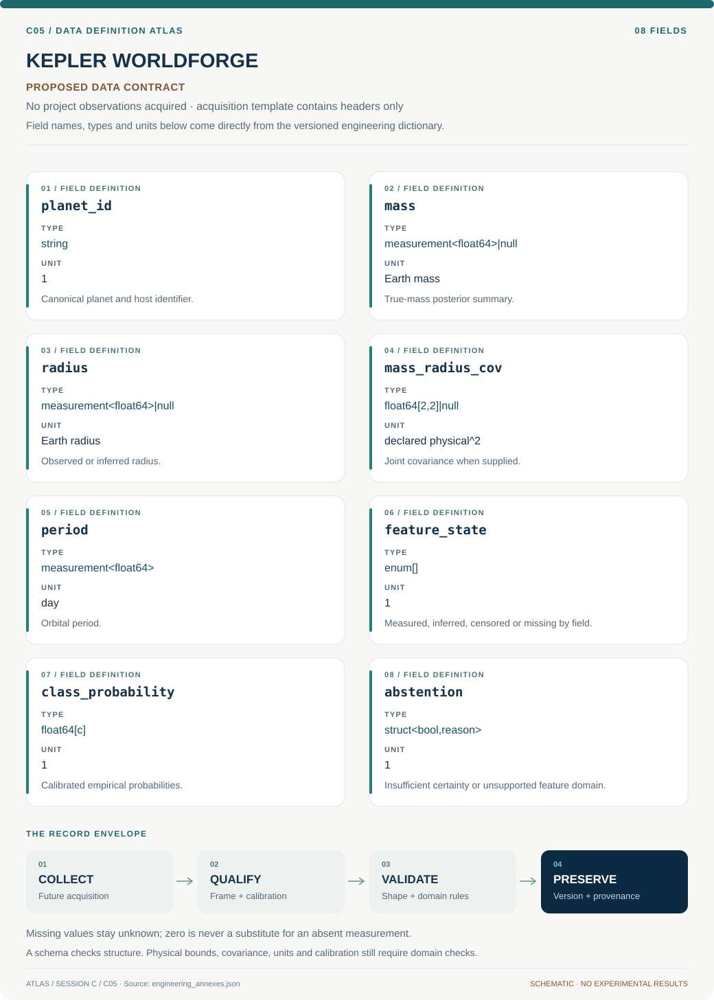

# C05 · Data blueprint

[KEPLER WORLDFORGE](../README.md) · [Figure gallery](../figures/README.md) · [Data atlas](../../../../data/README.md)

**PROPOSED CONTRACT · 8 fields · no project observations acquired.** The acquisition CSV contains column headers only. The diagram is a visual record specification, not measured data.

| Download | What it contains |
| --- | --- |
| [Acquisition CSV](acquisition.csv) | Empty columns ready for controlled acquisition |
| [Field dictionary](dictionary.csv) | Names, source types, units, meanings and quality rules |
| [JSON Schema](schema.json) | Nullable record structure with unit and quality metadata |

## Field reference

| Field | Type | Unit | Meaning | Quality / missingness |
| --- | --- | --- | --- | --- |
| planet_id | string | 1 | Canonical planet and host identifier. | Aliases resolved; host grouping immutable within split. |
| mass | measurement<float64>&#124;null | Earth mass | True-mass posterior summary. | Exclude minimum mass unless typed separately. |
| radius | measurement<float64>&#124;null | Earth radius | Observed or inferred radius. | Asymmetric errors and reference retained. |
| mass_radius_cov | float64[2,2]&#124;null | declared physical^2 | Joint covariance when supplied. | Unknown covariance is explicitly unknown, not assumed measured zero. |
| period | measurement<float64> | day | Orbital period. | Positive with provenance. |
| feature_state | enum[] | 1 | Measured, inferred, censored or missing by field. | No numeric placeholder for missingness. |
| class_probability | float64[c] | 1 | Calibrated empirical probabilities. | Nonnegative, sum one; class-definition version recorded. |
| abstention | struct<bool,reason> | 1 | Insufficient certainty or unsupported feature domain. | Reason survives catalog export. |

## Acquisition and provenance

Null means missing or unknown; record its cause. Preserve product identifier, retrieval timestamp, source hash, calibration, coordinate and time frame, covariance basis, selection rules and every transformation. JSON Schema checks structure; physical bounds and the quality rules above require domain validation.

- [NASA Exoplanet Archive PS/PSCompPars](https://exoplanetarchive.ipac.caltech.edu/docs/API_TD_columns.html) — archive or acquisition resource; inclusion here does not assert that its data have been retrieved.
- [Archive TAP documentation](https://exoplanet.ipac.caltech.edu/docs/TAP/usingTAP.html) — archive or acquisition resource; inclusion here does not assert that its data have been retrieved.

[Controlled data-management procedure](../../../../engineering/DATA_MANAGEMENT.md)

## Included evidence to explore

Real NASA Exoplanet Archive 200-row saved, query-ordered extract of rows with period and radius. The recorded request uses TOP 200 and ORDER BY pl_name; global first-200 ranking was not independently verified. Panel A preserves discovery-method categories and logarithmic scales; panel B makes the selected fields and nine missing host-metallicity values visible. This extract is not representative and cannot establish occurrence rates or physical class labels.

[Data atlas: tables, model definitions and provenance](../../../../data/README.md). Shared reduced-model evidence has a narrower domain than this project contract.
