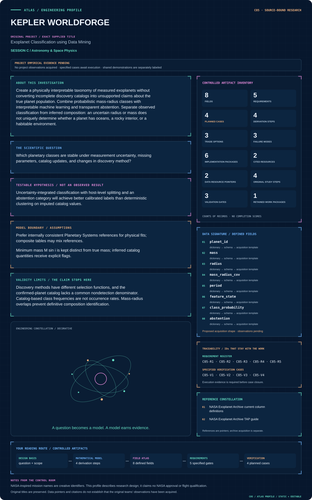

# C05 · Figure gallery

[KEPLER WORLDFORGE](../README.md) · [Data blueprint](../data/README.md) · [Data diagnostic gallery](../../../../data/figures/README.md)

## Engineering architecture

The classification path preserves measurement provenance and uncertainty before calibrated probabilities and abstention are exported.

[SVG](architecture.svg) · [Editable Mermaid source](architecture.mmd)

## Data blueprint

**Proposed contract · observations pending.** Every field, type, unit and meaning comes from the controlled dictionary. [Open SVG](data-map.svg) · [Download dictionary](../data/dictionary.csv)

## Mission profile

The scientific question, hypothesis, model boundary and document metadata are drawn from controlled sources. Proposed work remains distinguished from acquired evidence. [Open SVG](mission-profile.svg)

## Data diagnostic

Real NASA Exoplanet Archive 200-row saved, query-ordered extract of rows with period and radius. The recorded request uses TOP 200 and ORDER BY pl_name; global first-200 ranking was not independently verified. Panel A preserves discovery-method categories and logarithmic scales; panel B makes the selected fields and nine missing host-metallicity values visible. This extract is not representative and cannot establish occurrence rates or physical class labels.

[SVG](../../../../data/figures/10_catalog_values_and_coverage.svg) · [PNG](../../../../data/figures/10_catalog_values_and_coverage.png) · [Figure provenance](../../../../data/figures/10_catalog_values_and_coverage.provenance.json)

## Original numerical view

[Model formulation, data, assumptions and executed numerical checks](../../../../models/README.md)

## Planned scientific result

Interactive mass-radius chart with posterior density contours, class probabilities, missing-data flags, and discovery-method filters.

This final scientific result remains an execution deliverable; the design diagrams do not establish an empirical finding.
