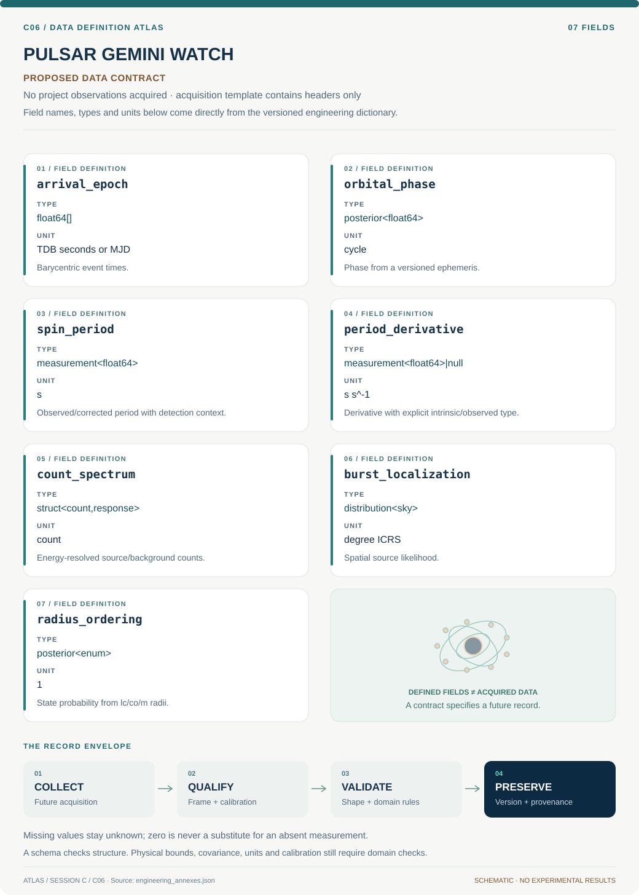

# C06 · Figure gallery

[PULSAR GEMINI WATCH](../README.md) · [Data blueprint](../data/README.md) · [Data diagnostic gallery](../../../../data/figures/README.md)

## Engineering architecture

Timing corrections, conditional radius states and burst association contribute distinct evidence; the graph does not equate pulsations with a confirmed magnetar.

[SVG](architecture.svg) · [Editable Mermaid source](architecture.mmd)

## Data blueprint

**Proposed contract · observations pending.** Every field, type, unit and meaning comes from the controlled dictionary. [Open SVG](data-map.svg) · [Download dictionary](../data/dictionary.csv)

## Planned scientific result

Orbital phase versus inferred emission state with radius-ordering bands, radio visibility, and uncertainty in burst association.

This final scientific result remains an execution deliverable; the design diagrams do not establish an empirical finding.
