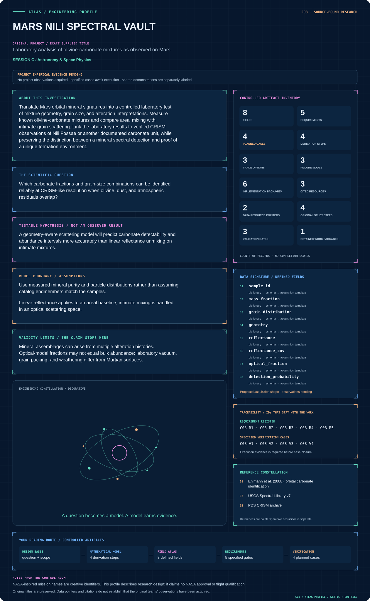
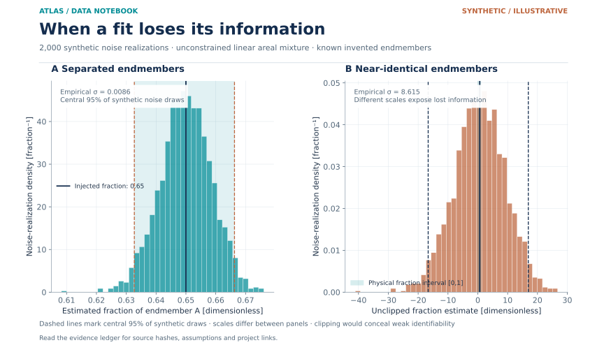
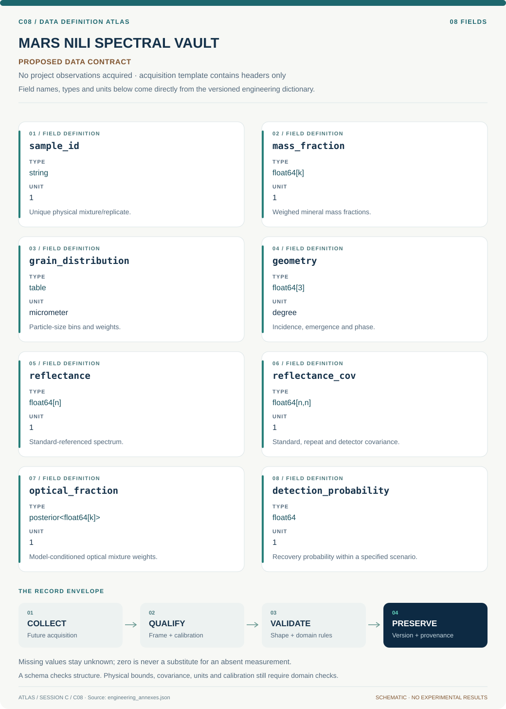
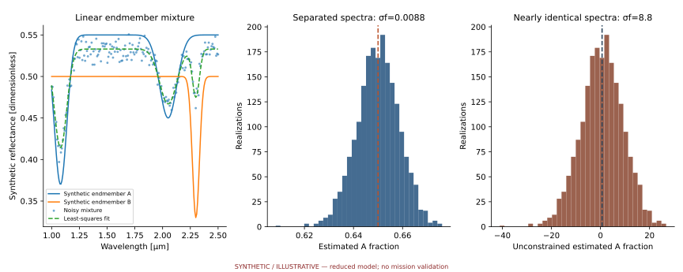

# C08 · MARS NILI SPECTRAL VAULT

**Original project:** Laboratory Analysis of olivine-carbonate mixtures as observed on Mars

**Session C:** Astronomy & Space Physics

**Document class:** engineering research design and analysis record · **Revision:** 4 · **Date:** 2026-10-02

**Evidence state:** design basis, mathematical formulation and verification plan documented. Project-specific empirical results remain to be acquired; executable shared model demonstrations have their own recorded checks.

[Session C](../README.md) · [All projects](../../../ENGINEERING_DOCUMENTATION.md) · [Session handbook](../../../handbooks/SESSION_C.md) · [← C07](../C07-artemis-memory-bridge/README.md) · [C09 →](../C09-eaglesat-cosmic-pixel/README.md)

| Proposed requirements | Specified verification cases | Defined data fields | Cited resources |
| ---: | ---: | ---: | ---: |
| 5 | 4 | 8 | 3 |

[Explore the data blueprint](data/README.md) · [Open the figure gallery](figures/README.md) · [Download acquisition template](data/acquisition.csv) · [Browse the data atlas](../../../data/README.md)

---

## Mission profile



| Profile panel | Engineering signal | Open the evidence |
| --- | --- | --- |
| Mission identity | Laboratory Analysis of olivine-carbonate mixtures as observed on Mars | [Scientific objective](#purpose-and-scientific-objective) |
| Model cockpit | 3 governing expressions; 4 derivation steps; declared assumptions and validity envelope | [Mathematical formulation](#4-mathematical-model-and-derivation) |
| Data blueprint | 8 proposed fields with types, units and quality rules | [Field map & downloads](data/README.md) |
| Verification queue | 5 proposed requirements; 4 specified cases; project execution evidence pending | [Case definitions](#8-verification-and-validation-cases) |
| Figure wall | Architecture, field map, planned result description; included shared illustration | [Open full gallery](figures/README.md) |
| Resource library | 3 cited primary resources with support statements | [Cited resources](#12-cited-technical-and-scientific-resources) |

### Model cockpit

**Analysis method:** Design replicated mixtures over carbonate fraction and sieved particle sizes, randomized by measurement order. Measure dry reflectance across carbonate and olivine diagnostic bands and include blind mixtures, dust coatings, and repeat standards. Fit areal and Hapke-style or equivalent radiative-transfer models with nuisance geometry and calibration terms. Convolve every prediction with CRISM band responses, add observed noise and atmospheric-residual covariance, and estimate detection probability. Analyze orbital regions through the same observation operator with spatial controls and alternate correction settings.

**Operating envelope:** Mineral assemblages can arise from multiple alteration histories. Optical-model fractions may not equal bulk abundance; laboratory vacuum, grain packing, and weathering differ from Martian surfaces.

**Variables and conventions**

- Reflectance R and single-scattering albedo w dimensionless
- Wavelength in micrometers; grain size in micrometers; mass fraction distinguished from area fraction
- i, e, g are incidence, emergence, and phase angles in degrees
- L_j is normalized instrument spectral response; epsilon includes correlated residuals
- Mixture densities and grain-size distributions are measured when translating optical fractions into mass fractions

### Artifact wall



Synthetic spectral-mixture estimator distributions under the same known band-noise level. Separated endmembers give narrow noise-driven fraction estimates; near-identical endmembers give a broad unconstrained distribution with unphysical values preserved as an identifiability diagnostic. Central 95% noise-realization intervals are descriptive simulation intervals, not posteriors or uncertainty bounds for measured Mars mineral abundance.

[Exact inputs, transformations and output hashes](../../../data/figures/15_spectral_information_and_noise.provenance.json)

**Scientific result to produce:** Measured and forward-modeled mixture spectra with carbonate-fraction versus grain-size detectability contours and masked orbital maps.

### Investigation feed · planned work

The feed records proposed work packages. A row becomes executed evidence only with versioned inputs, outputs and a reviewed result.

| Sequence | Evidence state | Engineering work package |
| --- | --- | --- |
| 01 | Planned | Create sample, grain-size and geometry manifests. |
| 02 | Planned | Acquire or ingest traceable endmember and standard spectra. |
| 03 | Planned | Implement areal and optical-scattering mixture branches. |
| 04 | Planned | Build normalized CRISM response/wavelength convolution artifacts. |
| 05 | Planned | Fit correlated-covariance inversions with blind sample IDs. |
| 06 | Planned | Release scenario detection maps, fraction-type conversions and orbital domain diagnostics. |

### Mission connections

Connections are reading routes based on actual shared resources, supplied sessions or included illustrations. They do not establish physical dependencies, team collaborations or validated results.

| Connected mission | Original investigation | Recorded connection basis |
| --- | --- | --- |
| [H09 · PERSEVERANCE LAKE ARCHIVE](../../H/H09-perseverance-lake-archive/README.md) | Trends in Mineralogy and Grain Size Distribution Across Paleolake Basins on Mars | Included illustration: 08_spectral_identifiability; [PDS CRISM archive](https://pds-geosciences.wustl.edu/missions/mro/crism.htm) |
| [C07 · ARTEMIS MEMORY BRIDGE](../C07-artemis-memory-bridge/README.md) | Taperings and Analytic Continuations of Supernova Gravitational Waves with Memory | Session C |
| [C09 · EAGLESAT COSMIC PIXEL](../C09-eaglesat-cosmic-pixel/README.md) | EagleSat Team: Determining Particle Energy Using CMOS Sensors | Session C |
| [C06 · PULSAR GEMINI WATCH](../C06-pulsar-gemini-watch/README.md) | The First Magnetar in a Binary System? | Session C |
| [C10 · VOYAGER LOCAL GROUP HALOS](../C10-voyager-local-group-halos/README.md) | MW-Andromeda Dark Matter Halo Velocity Dispersion Profiles | Session C |
| [C05 · KEPLER WORLDFORGE](../C05-kepler-worldforge/README.md) | Exoplanet Classification using Data Mining | Session C |

[Machine-readable connection register and ranking rule](../../../registry/mission_connections.json)

### Reading playlist

| Route | Start here | Continue to |
| --- | --- | --- |
| Understand the idea | [Scientific objective](#purpose-and-scientific-objective) | [Design boundary](#1-design-basis-and-analysis-boundary) → [Mathematics](#4-mathematical-model-and-derivation) |
| Inspect the data | [Visual blueprint](data/README.md) | [Provenance](#5-data-specifications-and-provenance) → [Uncertainty](#6-uncertainty-sensitivity-and-identifiability) |
| Make a design decision | [Trade study](#7-engineering-trade-study) | [Failure modes](#10-failure-modes-and-interpretation-controls) → [Required outputs](#11-required-engineering-outputs) |
| Prepare execution | [Requirements](#2-requirements-and-verification-traceability) | [Verification](#8-verification-and-validation-cases) → [Implementation](#9-implementation-and-reproducible-work-packages) |

## Complete engineering dossier

The profile above is a browsing layer. The full design basis, equations, derivations, data contract, uncertainty, trades and controlled case definitions follow.

## Purpose and scientific objective

Translate Mars orbital mineral signatures into a controlled laboratory test of mixture geometry, grain size, and alteration interpretations. Measure known olivine-carbonate mixtures and compare areal mixing with intimate-grain scattering. Link the laboratory results to verified CRISM observations of Nili Fossae or another documented carbonate unit, while preserving the distinction between a mineral spectral detection and proof of a unique formation environment.

**Question:** Which carbonate fractions and grain-size combinations can be identified reliably at CRISM-like resolution when olivine, dust, and atmospheric residuals overlap?

**Testable hypothesis:** A geometry-aware scattering model will predict carbonate detectability and abundance intervals more accurately than linear reflectance unmixing on intimate mixtures.

## 1. Design basis and analysis boundary

The laboratory system compares known olivine-carbonate mixtures with orbital-like spectral measurements. Its boundary includes sample purity, grain-size distributions, illumination/viewing geometry, standard measurements and spectral response. Outputs are detection probability and conditional optical fractions, not a unique geological formation history. USGS reference spectra and PDS CRISM products provide independent endmember and observation context.

Begin with areal mixtures of measured endmembers, then intimate-grain scattering, then dust-coated and orbital-response cases. Mass, area and optical fractions use distinct types. The experimental design randomizes measurement order and includes blind mixtures; no spectra or new sample results are assumed to exist. Exact instrument bandpass, sample packing and chosen CRISM observation IDs remain TBD.

## 2. Requirements and verification traceability

These are project design requirements or proposed analysis gates. A numerical target is not a NASA requirement unless its controlling source is explicitly identified. “TBD” identifies evidence required before a decision; it is not permission to assume a value. Verification evidence listed here is planned, unless a linked result explicitly records execution.

| ID | Requirement / gate | Engineering rationale | Verification method | Basis / required evidence |
| --- | --- | --- | --- | --- |
| C08-R1 | Every mixture shall distinguish weighed mass fraction, areal fraction and fitted optical fraction. | Optical abundance is not generally bulk mass abundance. | Sample manifest and conversion audit. | Proposed sample contract. |
| C08-R2 | Instrument kernels shall integrate to one and preserve constant reflectance to 0.1%, a proposed numerical target. | Band convolution must not introduce false absorption. | Constant-spectrum and grid-refinement fixtures. | Proposed operator target. |
| C08-R3 | Blind mixtures shall remain excluded from fitting endmember and scattering parameters. | Calibration on every mixture hides inversion failure. | Sample-ID split audit. | Proposed blind-validation requirement. |
| C08-R4 | A carbonate detection shall include competing dust/atmospheric residual models. | Overlapping residuals can imitate a diagnostic band. | Model comparison and zero-carbonate injection. | Proposed specificity requirement. |
| C08-R5 | Reported detection limits shall specify geometry, grain-size envelope and CRISM-like covariance. | One laboratory noise value cannot define orbital sensitivity. | Scenario-stratified recovery map. | Proposed domain requirement. |

## 3. Architecture and controlled interfaces

A sample ledger stores mineral identity, purity, weighed masses, particle-size distributions and packing history. A spectrometer adapter produces reflectance and standard-derived covariance at declared incidence, emergence and phase angles. Areal and intimate models receive common endmember spectra; only the intimate branch combines particle optical properties before mapping to reflectance.

A spectral-response operator maps continuous reflectance into CRISM-like channels. Orbital ingestion preserves observation geometry, wavelength shifts and atmospheric correction variants. The inference engine fits fraction and nuisance geometry with correlated errors, then evaluates blind-mixture recovery. A wavelength or standard error propagates to every band and cannot be hidden as independent channel scatter.


Distinct physical and optical mixture contracts feed a shared orbital response; blind labels test identifiability before abundance interpretations.

[Editable engineering diagram source](figures/architecture.mmd)

## 4. Mathematical model and derivation

### Governing equations

$$
R_{\rm areal}(\lambda)=\sum_k f_kR_k(\lambda);\quad f_k\ge0,\ \sum_k f_k=1
$$

$$
R_{\rm intimate}(\lambda)=\mathcal H[w_{\rm mix}(\lambda),g,i,e,\theta]
$$

$$
R_{{\rm obs},j}=\int L_j(\lambda)R(\lambda)d\lambda+\epsilon_j
$$

### Variables, units and conventions

- Reflectance R and single-scattering albedo w dimensionless
- Wavelength in micrometers; grain size in micrometers; mass fraction distinguished from area fraction
- i, e, g are incidence, emergence, and phase angles in degrees
- L_j is normalized instrument spectral response; epsilon includes correlated residuals
- Mixture densities and grain-size distributions are measured when translating optical fractions into mass fractions

### Assumptions and boundary conditions

- Use measured mineral purity and particle distributions rather than assuming catalog endmembers match the samples.
- Linear reflectance applies to an areal baseline; intimate mixing is handled in an optical scattering space.

### Derivation step 1

$$
R_{areal}(\lambda)=fR_{carb}(\lambda)+(1-f)R_{ol}(\lambda)
$$

For spatially separated patches under matched geometry, area-weighted reflectance is the linear baseline, with f between zero and one.

### Derivation step 2

$$
w_{mix}=\frac{\sum_k n_k C_{sca,k}}{\sum_k n_k C_{ext,k}}
$$

This optical mixture form combines scattering and extinction cross sections; particle number/size matter, so it is not a mass-weighted reflectance average.

### Derivation step 3

$$
R_j=\int L_j(\lambda)R(\lambda)\,d\lambda
$$

Normalized L_j has inverse-wavelength units. Compare both laboratory and model spectra only after the same response mapping.

### Derivation step 4

```text
D_j=1-R_j/R_{cont,j}
```

Band depth is dimensionless and inherits numerator-continuum covariance. Continuum windows and excluded absorption regions are part of the estimator.

### Inference or simulation procedure

Design replicated mixtures over carbonate fraction and sieved particle sizes, randomized by measurement order. Measure dry reflectance across carbonate and olivine diagnostic bands and include blind mixtures, dust coatings, and repeat standards. Fit areal and Hapke-style or equivalent radiative-transfer models with nuisance geometry and calibration terms. Convolve every prediction with CRISM band responses, add observed noise and atmospheric-residual covariance, and estimate detection probability. Analyze orbital regions through the same observation operator with spatial controls and alternate correction settings.

### Validity domain and fidelity limits

Mineral assemblages can arise from multiple alteration histories. Optical-model fractions may not equal bulk abundance; laboratory vacuum, grain packing, and weathering differ from Martian surfaces.

## 5. Data specifications and provenance



**Proposed data contract · observations pending.** This visual inventory shows the record fields to acquire or derive. It contains no project measurements. [Open the data blueprint and downloads](data/README.md).

| Field | Type | Unit | Physical / statistical meaning | Quality and missing-data rule |
| --- | --- | --- | --- | --- |
| sample_id | string | 1 | Unique physical mixture/replicate. | Blind identity hidden during calibration. |
| mass_fraction | float64[k] | 1 | Weighed mineral mass fractions. | Nonnegative and sum one within balance uncertainty. |
| grain_distribution | table | micrometer | Particle-size bins and weights. | Missing tails and sieve convention documented. |
| geometry | float64[3] | degree | Incidence, emergence and phase. | Record instrument frame and sample orientation. |
| reflectance | float64[n] | 1 | Standard-referenced spectrum. | Bad wavelengths remain masked; retain nonphysical noisy values for diagnosis. |
| reflectance_cov | float64[n,n] | 1 | Standard, repeat and detector covariance. | Shared standard uncertainty retained. |
| optical_fraction | posterior<float64[k]> | 1 | Model-conditioned optical mixture weights. | Do not relabel as mass fraction without a justified conversion. |
| detection_probability | float64 | 1 | Recovery probability within a specified scenario. | Use blind/injection uncertainty and state scenario domain. |

[Machine-readable record schema](data/schema.json) · [Empty acquisition CSV](data/acquisition.csv) · [Field dictionary CSV](data/dictionary.csv)

The CSV above contains column headers only. Its schema defines future records and does not establish that original-team data or a particular archive product have been acquired. Frame, timing, calibration, covariance, selection and provenance details must accompany populated records.

### USGS Spectral Library Version 7

[Product, archive or reference](https://www.usgs.gov/data/usgs-spectral-library-version-7-data)

**Fields:** Mineral spectra, mixture metadata, grain-size descriptions, measurement artifacts

**Access:** Public release, DOI 10.5066/F7RR1WDJ; verify chosen sample records.

**Role:** Reference endmembers and standards.

### PDS MRO CRISM archive

[Product, archive or reference](https://pds-geosciences.wustl.edu/missions/mro/crism.htm)

**Fields:** Radiance or reflectance cubes, wavelength calibration, geometry, quality metadata

**Access:** Public archive; select exact product level and observation identifiers before processing.

**Role:** Orbital comparison and noise characterization.

## 6. Uncertainty, sensitivity and identifiability

Grain size, packing, surface roughness and abundance can change band contrast similarly. Standard drift and wavelength uncertainty correlate broad parts of a spectrum; atmospheric residuals add another structured term in orbital comparisons. Model these as nuisance functions constrained by standards and alternate atmospheric reductions rather than treating each channel independently.

Explore identifiability through a grid of known mixtures and geometry, comparing posterior fraction intervals with blind labels. Compute sensitivities to grain-size and endmember purity, retaining degeneracy where response-convolved spectra are indistinguishable. An orbital fit outside the laboratory geometry/size envelope receives a domain flag. Formation history requires additional geological evidence beyond matching carbonate and olivine bands.

## 7. Engineering trade study

| Alternative | Benefit | Cost / limitation | Decision rule |
| --- | --- | --- | --- |
| Areal reflectance mixing | Simple and interpretable spatial patch model. | Incorrect for grains in contact. | Use on separated patches or as a declared baseline. |
| Intimate radiative transfer | Models grain-scale scattering. | Optical constants and packing uncertain. | Adopt when blind intimate mixtures improve and parameters remain identifiable. |
| Empirical library matching | Rapid identification of spectral similarity. | Library grain/geometry mismatch. | Use for candidate screening, followed by response-aware uncertainty fitting. |

## 8. Verification and validation cases

| Case ID | Stimulus / condition | Expected result / criterion | Method | Evidence artifact |
| --- | --- | --- | --- | --- |
| C08-V1 | Pure-endmember limits | At fraction zero/one the areal prediction equals the corresponding measured endmember. | Boundary fraction fixtures. | Linear mixture identity. |
| C08-V2 | Flat-spectrum convolution | A constant input remains constant across channels. | Apply every response kernel. | Normalized spectral-response identity. |
| C08-V3 | Zero-carbonate challenge | False detection rate is measured with dust and atmosphere-like residuals. | Blind zero-carbonate and synthetic residual cases. | Proposed specificity test. |
| C08-V4 | Blind mixture recovery | Coverage and bias are reported against weighed labels with fraction-type distinctions. | Fit preregistered blind replicates. | Proposed independent material validation. |

**Execution status:** these cases are specified, not claimed as executed. Close a case only with the versioned inputs, output, uncertainty, reviewer and pass/fail rationale.

### Additional scientific validation gates

- Recover blind known mixtures with intervals that include measured composition at stated coverage.
- Hold out entire grain-size families and dust conditions to test model transfer.
- Check orbital detections in repeated observations and nearby noncarbonate controls; report artifact-sensitive pixels.

## 9. Implementation and reproducible work packages

1. Create sample, grain-size and geometry manifests.
2. Acquire or ingest traceable endmember and standard spectra.
3. Implement areal and optical-scattering mixture branches.
4. Build normalized CRISM response/wavelength convolution artifacts.
5. Fit correlated-covariance inversions with blind sample IDs.
6. Release scenario detection maps, fraction-type conversions and orbital domain diagnostics.

### Investigation sequence

1. Specify sample purity, size bins, geometry, detection rule, and carbonate band convention.
2. Acquire replicated spectra and instrument blanks; include mixtures concealed from analysts.
3. Fit competing mixing models and convolve to the orbital instrument.
4. Produce abundance-identifiability and detection-completeness maps for selected Mars observations.

### Resources and interfaces to expertise

- VNIR spectrometer, particle-size measurement, mineral standards, CRISM expertise, radiative-transfer code.

## 10. Failure modes and interpretation controls

| Failure mode | Effect on result | Detection / evidence | Design response |
| --- | --- | --- | --- |
| Mass/area fraction conflation | Misreported abundance. | Type mismatch in sample/inference exports. | Store separate fractions and conversion assumptions. |
| Standard drift | False shallow bands. | Repeated reference measurement trends. | Interleave standards and propagate common scale error. |
| Orbital correction artifact | False carbonate candidate. | Detection changes across correction variants. | Require spectral/spatial controls and report conditional detection. |

- Carbonate dust, contaminants, and incorrect atmospheric correction can yield false signatures; laboratory handling requires ordinary mineral-dust controls.

## 11. Required engineering outputs

- Laboratory mixture library, model posterior tables, CRISM detectability atlas, and qualified geologic interpretation.

### Scientific result figures to produce during execution

Measured and forward-modeled mixture spectra with carbonate-fraction versus grain-size detectability contours and masked orbital maps.

### Included shared numerical starting point



[Executable formulation, parameters, tabular outputs, provenance and verification](../../../models/README.md). This shared demonstration has a narrower domain than the project model above. Its own caption and methods identify synthetic parameters or the separately retrieved public catalog; it is not a completed result of the original project.

### Data diagnostic


Synthetic spectral-mixture estimator distributions under the same known band-noise level. Separated endmembers give narrow noise-driven fraction estimates; near-identical endmembers give a broad unconstrained distribution with unphysical values preserved as an identifiability diagnostic. Central 95% noise-realization intervals are descriptive simulation intervals, not posteriors or uncertainty bounds for measured Mars mineral abundance.

[Inputs, downloadable figure and provenance](../../../data/figures/README.md)

## 12. Cited technical and scientific resources

- [Ehlmann et al. (2008), orbital carbonate identification](https://www.usgs.gov/publications/orbital-identification-carbonate-bearing-rocks-mars) — Observed Mars carbonate association and interpretation.
- [USGS Spectral Library v7](https://www.usgs.gov/data/usgs-spectral-library-version-7-data) — Reference spectra and sample metadata.
- [PDS CRISM archive](https://pds-geosciences.wustl.edu/missions/mro/crism.htm) — Instrument data discovery.

Framework and evidence rules: [engineering documentation standard](../../../engineering/ENGINEERING_STANDARD.md), [model assurance](../../../engineering/MODEL_ASSURANCE.md), [uncertainty procedure](../../../engineering/UNCERTAINTY_AND_DECISION_RULES.md), [data management](../../../engineering/DATA_MANAGEMENT.md). NASA-inspired names are creative identifiers; requirements and results are not NASA certification.
