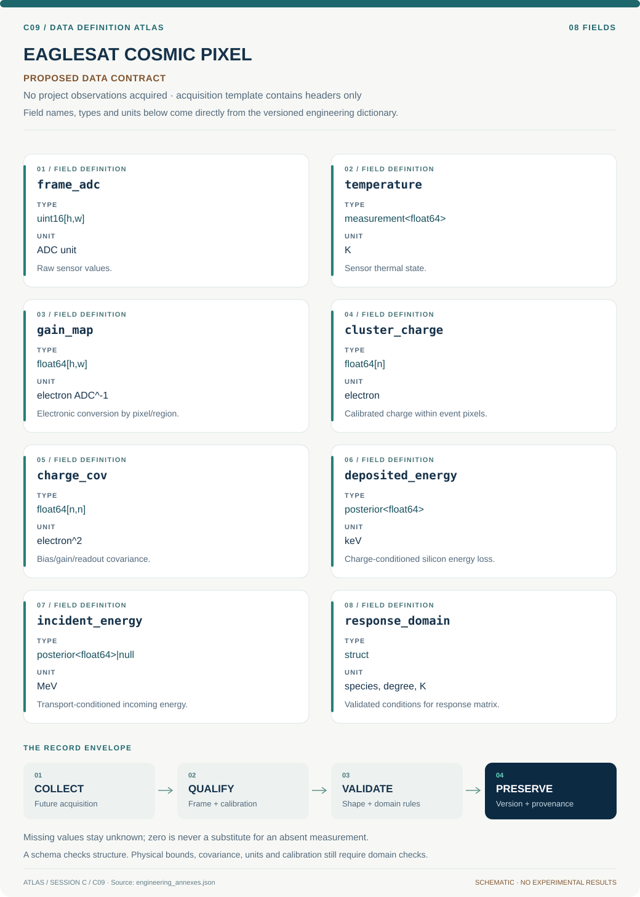

# C09 · EAGLESAT COSMIC PIXEL

**Original project:** EagleSat Team: Determining Particle Energy Using CMOS Sensors

**Session C:** Astronomy & Space Physics

**Document class:** engineering research design and analysis record · **Revision:** 3 · **Date:** 2026-10-02

**Evidence state:** design basis, mathematical formulation and verification plan documented. Project-specific empirical results remain to be acquired; executable shared model demonstrations have their own recorded checks.

[Session C](../README.md) · [All projects](../../../ENGINEERING_DOCUMENTATION.md) · [Session handbook](../../../handbooks/SESSION_C.md) · [← C08](../C08-mars-nili-spectral-vault/README.md) · [C10 →](../C10-voyager-local-group-halos/README.md)

| Proposed requirements | Specified verification cases | Defined data fields | Cited resources |
| ---: | ---: | ---: | ---: |
| 5 | 4 | 8 | 2 |

[Explore the data blueprint](data/README.md) · [Open the figure gallery](figures/README.md) · [Download acquisition template](data/acquisition.csv) · [Browse the data atlas](../../../data/README.md)

---

## Purpose and scientific objective

Develop a calibrated CMOS particle-response demonstrator for space radiation measurements. The key scientific correction is that charge collected in a thin silicon sensor measures deposited energy; a penetrating particle may retain most of its incident energy. Define useful energy or species inference only within a validated sensor geometry, detector response, and irradiation domain, while explicitly retaining ambiguous track classes.

**Question:** Under which particle species, angles, energies, and sensor temperatures can CMOS charge patterns constrain deposited energy or a calibrated incident-energy interval?

**Testable hypothesis:** Joint cluster morphology and charge inference with a sensor-response matrix will provide calibrated deposited-energy estimates, while incident-energy estimates will require stopping tracks or additional detector constraints.

## 1. Design basis and analysis boundary

The CMOS demonstrator is a forward response model from particle passage to collected pixel charge. Its primary calibrated quantity is deposited energy. Incident energy inference remains conditional on species, angle, active thickness and shielding; a penetrating particle generally deposits only part of its energy. NIST proton stopping powers support a first-order silicon loss model, not a completed sensor calibration.

Begin with electronic dark/gain characterization, add charge diffusion and track geometry, then compare stopping-power transport with qualified laboratory reference exposures. Hardware thickness, depletion depth, ADC response and irradiation-domain access remain TBD. Saturated or ambiguous events produce bounds or abstentions. Any onboard compression is evaluated through this same response model so discarded charge is reflected in energy completeness.

## 2. Requirements and verification traceability

These are project design requirements or proposed analysis gates. A numerical target is not a NASA requirement unless its controlling source is explicitly identified. “TBD” identifies evidence required before a decision; it is not permission to assume a value. Verification evidence listed here is planned, unless a linked result explicitly records execution.

| ID | Requirement / gate | Engineering rationale | Verification method | Basis / required evidence |
| --- | --- | --- | --- | --- |
| C09-R1 | Deposited and incident energy shall use separate named fields and likelihood targets. | Thin-sensor charge cannot uniquely measure incoming energy. | Schema and penetrating-particle fixture. | Existing physical correction and NIST loss context. |
| C09-R2 | Gain linearity shall be calibrated over the accepted ADC range; saturated pixels shall be flagged, never extrapolated. | Clipped charge biases energy low. | Measured electronic-response sweep and saturation mask audit. | Proposed calibration requirement. |
| C09-R3 | Charge-to-energy closure shall agree within 1% in noiseless synthetic fixtures, a proposed numerical target. | Unit and charge-sharing mistakes invalidate response inference. | Sum known charge over clusters before conversion. | Proposed algorithm target. |
| C09-R4 | Incident-energy intervals shall be reported only within the independently validated species/angle/temperature domain. | Response matrices extrapolate poorly. | Laboratory-condition holdout and domain checks. | Proposed inference-boundary requirement. |
| C09-R5 | Compression shall publish deposited-energy-dependent recovery and retained-charge fraction. | Small tracks may vanish under thresholds. | Replay uncompressed qualified frames through encoder. | Proposed onboard processing requirement. |

## 3. Architecture and controlled interfaces

A frame adapter carries ADC values, timestamps, shutter mode, temperature and detector configuration. Dark/gain calibration returns electrons with uncertainty, hot-pixel masks and nonlinearity flags. A cluster extractor emits pixel positions, collected charge and covariance; disconnected or saturated clusters retain diagnostic states.

A transport engine predicts loss through active silicon and dead layers, while a charge-collection module adds diffusion, trapping and threshold response. The response matrix conditions on species, angle and temperature. Deposited-energy inference uses charge first; a separate incident-energy branch adds the transport assumptions and priors. Compression replay runs before event extraction when that matches the proposed flight path.


Collected charge supports deposited-energy inference; geometry-conditioned transport is an additional interface required for incident-energy claims.

[Editable engineering diagram source](figures/architecture.mmd)

## 4. Mathematical model and derivation

### Governing equations

$$
E_{\rm dep}=\epsilon_{\rm pair}N_{eh};\quad\epsilon_{\rm pair}\approx3.6\ \mathrm{eV}\ \text{for silicon, with calibration uncertainty}
$$

$$
E_{\rm dep}\approx\int_{\rm track}(dE/dx)\,dx
$$

$$
p(q,m\mid E,s,\theta,T)=\mathcal R(q,m;E,s,\theta,T);\quad p(E\mid q,m)\propto p(q,m\mid E)p(E)
$$

### Variables, units and conventions

- Incident and deposited energies in keV or MeV, never interchanged
- Collected charge q in electrons after gain/ADC calibration
- m includes cluster extent, eccentricity, and per-pixel charge; geometry in micrometers
- theta is incidence angle; temperature T in K; s is species label
- R includes depletion thickness, charge diffusion, thresholds, saturation, shielding, and dead layers

### Assumptions and boundary conditions

- Dark frames and flat fields establish electronic gain and noise independently of particle irradiation.
- A consumer CMOS sensor may have undocumented active thickness and nonlinearity; infer these as calibration uncertainties.

### Derivation step 1

```text
q_i=g(ADC_i-b_i)
```

Gain g is electrons per ADC unit and b_i is bias. Apply a calibrated nonlinear mapping instead when linearity fails; dark subtraction uncertainty contributes shared covariance.

### Derivation step 2

$$
E_{dep}\approx\epsilon_{pair}\sum_i q_i/\eta_{coll}
$$

Energy is in eV if pair creation energy is eV/electron. Collection efficiency eta_coll is not silently assumed one when trapping or thresholds lose charge.

### Derivation step 3

$$
E_{dep}=\int_0^{\ell}(dE/dx)[E(x),s]dx
$$

Path length ell depends on active thickness and angle. Convert mass stopping power using silicon density before integrating physical length.

### Derivation step 4

$$
p(E_{inc},s,\theta\mid q,m)\propto\mathcal R(q,m\mid E_{inc},s,\theta,T)p(E_{inc},s,\theta)
$$

Charge morphology m can reduce ambiguity, but overlapping response distributions require marginalization or abstention rather than a deterministic energy label.

### Inference or simulation procedure

Construct a forward sensor model using stopping powers or particle transport plus measured charge sharing. Acquire dark and optically shielded frames over temperature; characterize hot pixels and electronic artifacts before classifying particle candidates. Calibrate with qualified reference exposures at a licensed facility or an established detector laboratory, using measured beam geometry and dosimetry. Estimate a response matrix and use likelihood-based energy bins with abstention for overlapping species/angle responses. Evaluate onboard event compression without silently changing low-charge completeness. Treat the EagleSat label as a project identity, not proof of prior hardware performance.

### Validity domain and fidelity limits

One thin detector generally cannot uniquely recover incident particle energy, species, and angle. Saturation, radiation damage, rolling shutters, and shielding introduce domain shift between laboratory and orbit.

## 5. Data specifications and provenance



**Proposed data contract · observations pending.** This visual inventory shows the record fields to acquire or derive. It contains no project measurements. [Open the data blueprint and downloads](data/README.md).

| Field | Type | Unit | Physical / statistical meaning | Quality and missing-data rule |
| --- | --- | --- | --- | --- |
| frame_adc | uint16[h,w] | ADC unit | Raw sensor values. | Preserve saturation codes and shutter metadata. |
| temperature | measurement<float64> | K | Sensor thermal state. | Missing temperature blocks domain-specific energy claims. |
| gain_map | float64[h,w] | electron ADC^-1 | Electronic conversion by pixel/region. | Versioned; nonlinearity envelope required. |
| cluster_charge | float64[n] | electron | Calibrated charge within event pixels. | Negative noise values retained before thresholding. |
| charge_cov | float64[n,n] | electron^2 | Bias/gain/readout covariance. | Shared bias/gain terms retained. |
| deposited_energy | posterior<float64> | keV | Charge-conditioned silicon energy loss. | Saturation yields lower-bound state. |
| incident_energy | posterior<float64>&#124;null | MeV | Transport-conditioned incoming energy. | Null or bound outside validated response domain. |
| response_domain | struct | species, degree, K | Validated conditions for response matrix. | Explicit extrapolation flag mandatory. |

[Machine-readable record schema](data/schema.json) · [Empty acquisition CSV](data/acquisition.csv) · [Field dictionary CSV](data/dictionary.csv)

The CSV above contains column headers only. Its schema defines future records and does not establish that original-team data or a particular archive product have been acquired. Frame, timing, calibration, covariance, selection and provenance details must accompany populated records.

### NIST PSTAR proton stopping powers

[Product, archive or reference](https://physics.nist.gov/PhysRefData/Star/Text/PSTAR.html)

**Fields:** Energy, electronic/nuclear stopping power, CSDA range for silicon

**Access:** Public reference; record selected material and energy grid.

**Role:** First-order proton energy-loss model.

### New calibration and dark-frame campaign

[Product, archive or reference](https://arxiv.org/abs/2607.02106)

**Fields:** Raw frames, temperature, ADC settings, reference irradiation conditions, event labels

**Access:** Generate through approved detector-lab access; no flight or calibration measurements supplied here.

**Role:** Ground truth and instrument characterization.

## 6. Uncertainty, sensitivity and identifiability

Active/depletion thickness, dead layers and incidence angle can exchange roles in path-length inference. Gain, charge collection, pair-creation energy and cluster threshold set the deposited-energy scale. Separate electronic uncertainty from transport uncertainty and retain correlations across pixels. Read noise affects cluster selection as well as charge sum, producing threshold-dependent bias at low deposit.

Test incident-energy identifiability by computing response overlap for species/angle bins and examining prior sensitivity. A high-energy penetrating particle can share the same deposit with a different incident energy; this is physical ambiguity rather than classifier failure. Hold out temperatures and illumination geometries only within independently calibrated bounds. Radiation damage introduces a new response domain requiring renewed calibration.

## 7. Engineering trade study

| Alternative | Benefit | Cost / limitation | Decision rule |
| --- | --- | --- | --- |
| Cluster-sum calorimetry | Transparent deposited-energy estimate. | Needs collection/threshold correction. | Use as primary calibrated quantity. |
| Morphology-conditioned response bins | Adds angle/species information. | Response overlaps and training-domain dependence. | Use only when held-out reference exposures improve interval coverage. |
| Transport-based incident inversion | Connects shielding and sensor physics. | One layer is often nonidentifying. | Return broad intervals or abstain when likelihood overlap persists. |

## 8. Verification and validation cases

| Case ID | Stimulus / condition | Expected result / criterion | Method | Evidence artifact |
| --- | --- | --- | --- | --- |
| C09-V1 | Known collected charge | A synthetic sum q maps to epsilon_pair times q for unit efficiency. | Noiseless unit/gain fixture. | Charge-energy dimensional identity. |
| C09-V2 | Charge diffusion conservation | Redistributing charge across pixels preserves total deposit before thresholding. | Inject normalized diffusion kernels. | Charge conservation. |
| C09-V3 | Penetrating track | Incident energy can exceed inferred deposit without contract violation. | Transport fixture with finite silicon thickness. | Finite-path stopping-power integral. |
| C09-V4 | Qualified reference holdout | Deposited/incident interval coverage and abstention are reported by species and angle. | Freeze response fit before laboratory holdout. | Proposed calibration validation. |

**Execution status:** these cases are specified, not claimed as executed. Close a case only with the versioned inputs, output, uncertainty, reviewer and pass/fail rationale.

### Additional scientific validation gates

- Use held-out beam energies, temperatures, and sensor units; report energy bias and interval coverage.
- Measure false-event rates on dark data and optical-leak controls.
- Compare reconstructed deposited energy with independent reference-detector measurements; separately report identifiable incident-energy domains.

## 9. Implementation and reproducible work packages

1. Inventory sensor geometry, readout and electronics metadata.
2. Build dark/gain/nonlinearity maps with covariance and flags.
3. Implement charge-conserving clustering and diffusion fixtures.
4. Create NIST-based or transport response tables with species/angle types.
5. Fit response matrices to approved qualified reference exposures.
6. Replay compression and publish deposited-energy recovery plus incident-domain abstentions.

### Investigation sequence

1. Freeze science requirements as deposited-energy resolution, event efficiency, and accepted false-event rate.
2. Measure electronics and noise before fitting any particle-response model.
3. Develop transport-informed response matrices and collect independent reference exposures.
4. Evaluate shielding, temperature, event compression, and damage sensitivity; retain a model-domain flag in telemetry.

### Resources and interfaces to expertise

- CMOS evaluation board, shielding fixture, thermal chamber, reference detector, qualified irradiation partner, transport code.

## 10. Failure modes and interpretation controls

| Failure mode | Effect on result | Detection / evidence | Design response |
| --- | --- | --- | --- |
| Saturation ignored | Energy systematically underestimated. | Maximum-code and nonlinear-response flags. | Return lower bound and reject unsupported inversion. |
| Hot pixel classified as particle | False event rate. | Dark-frame recurrence at fixed coordinates. | Version hot-pixel masks and temporal diagnostics. |
| Unvalidated geometry inverted | Overprecise incident energy. | Response-domain lookup failure. | Abstain or report conditional bounds. |

- Undocumented sensor physics may limit the project to particle counting and deposited-energy proxies; irradiation access is a real dependency.

## 11. Required engineering outputs

- Sensor calibration dossier, energy-response matrix, event classifier with abstention, and telemetry/data schema.

### Scientific result figures to produce during execution

Incident-energy versus deposited-charge response heatmaps linked to example clusters, saturation regions, and uncertainty-aware reconstructed energy.

## 12. Cited technical and scientific resources

- [NIST PSTAR](https://physics.nist.gov/PhysRefData/Star/Text/PSTAR.html) — Proton stopping power and range reference.
- [Takano et al. (2026), CMOS cosmic-ray demonstrator](https://arxiv.org/abs/2607.02106) — Feasibility precedent for event detection; not evidence of incident-energy accuracy.

Framework and evidence rules: [engineering documentation standard](../../../engineering/ENGINEERING_STANDARD.md), [model assurance](../../../engineering/MODEL_ASSURANCE.md), [uncertainty procedure](../../../engineering/UNCERTAINTY_AND_DECISION_RULES.md), [data management](../../../engineering/DATA_MANAGEMENT.md). NASA-inspired names are creative identifiers; requirements and results are not NASA certification.
