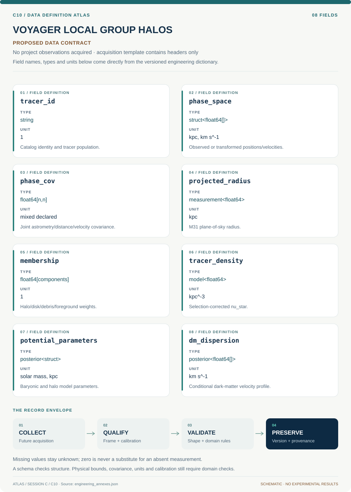

# C10 · Data blueprint

[VOYAGER LOCAL GROUP HALOS](../README.md) · [Figure gallery](../figures/README.md) · [Data atlas](../../../../data/README.md)

**PROPOSED CONTRACT · 8 fields · no project observations acquired.** The acquisition CSV contains column headers only. The diagram is a visual record specification, not measured data.

| Download | What it contains |
| --- | --- |
| [Acquisition CSV](acquisition.csv) | Empty columns ready for controlled acquisition |
| [Field dictionary](dictionary.csv) | Names, source types, units, meanings and quality rules |
| [JSON Schema](schema.json) | Nullable record structure with unit and quality metadata |

## Field reference

| Field | Type | Unit | Meaning | Quality / missingness |
| --- | --- | --- | --- | --- |
| tracer_id | string | 1 | Catalog identity and tracer population. | Duplicate crossmatches resolved. |
| phase_space | struct<float64[]> | kpc, km s^-1 | Observed or transformed positions/velocities. | Frame and available dimensions explicit. |
| phase_cov | float64[n,n] | mixed declared | Joint astrometry/distance/velocity covariance. | Missing velocity dimension stays absent. |
| projected_radius | measurement<float64> | kpc | M31 plane-of-sky radius. | Distance/system center uncertainty shared. |
| membership | float64[components] | 1 | Halo/disk/debris/foreground weights. | Nonnegative normalized probability vector. |
| tracer_density | model<float64> | kpc^-3 | Selection-corrected nu_star. | Radial support and extrapolation marked. |
| potential_parameters | posterior<struct> | solar mass, kpc | Baryonic and halo model parameters. | Model family and boundary conditions recorded. |
| dm_dispersion | posterior<float64[]> | km s^-1 | Conditional dark-matter velocity profile. | rho_DM/beta_DM assumptions accompany every export. |

## Acquisition and provenance

Null means missing or unknown; record its cause. Preserve product identifier, retrieval timestamp, source hash, calibration, coordinate and time frame, covariance basis, selection rules and every transformation. JSON Schema checks structure; physical bounds and the quality rules above require domain validation.

- [SPLASH stellar-halo dispersion publication](https://arxiv.org/abs/1711.02700) — archive or acquisition resource; inclusion here does not assert that its data have been retrieved.
- [M31 outer globular cluster kinematics](https://arxiv.org/abs/1406.0186) — archive or acquisition resource; inclusion here does not assert that its data have been retrieved.
- [ESA Gaia Archive](https://gea.esac.esa.int/archive/) — archive or acquisition resource; inclusion here does not assert that its data have been retrieved.

[Controlled data-management procedure](../../../../engineering/DATA_MANAGEMENT.md)
