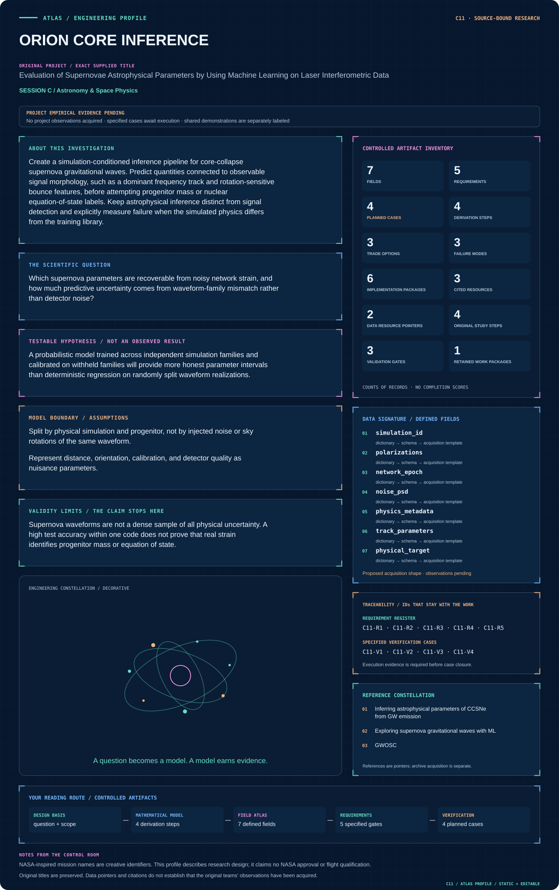
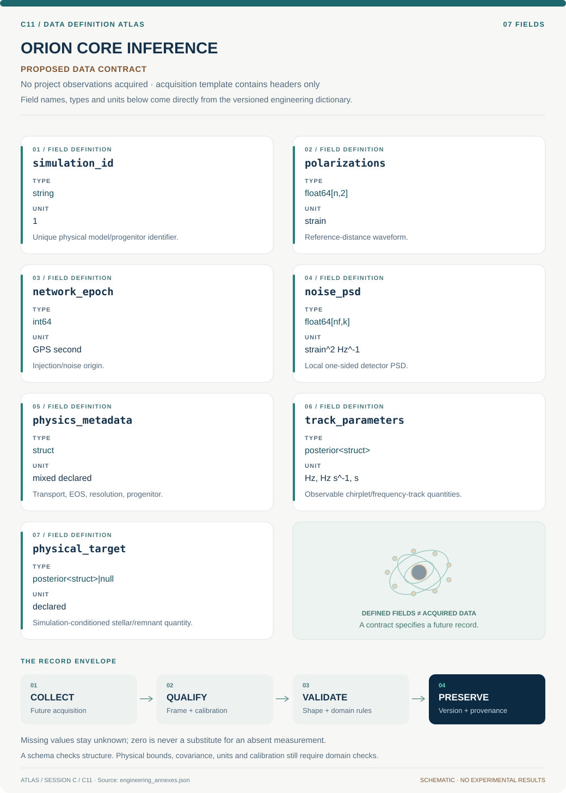

# C11 · ORION CORE INFERENCE

**Original project:** Evaluation of Supernovae Astrophysical Parameters by Using Machine Learning on Laser Interferometric Data

**Session C:** Astronomy & Space Physics

**Document class:** engineering research design and analysis record · **Revision:** 4 · **Date:** 2026-10-02

**Evidence state:** design basis, mathematical formulation and verification plan documented. Project-specific empirical results remain to be acquired; executable shared model demonstrations have their own recorded checks.

[Session C](../README.md) · [All projects](../../../ENGINEERING_DOCUMENTATION.md) · [Session handbook](../../../handbooks/SESSION_C.md) · [← C10](../C10-voyager-local-group-halos/README.md) · [C12 →](../C12-hubble-cosmic-glow/README.md)

| Proposed requirements | Specified verification cases | Defined data fields | Cited resources |
| ---: | ---: | ---: | ---: |
| 5 | 4 | 7 | 3 |

[Explore the data blueprint](data/README.md) · [Open the figure gallery](figures/README.md) · [Download acquisition template](data/acquisition.csv) · [Browse the data atlas](../../../data/README.md)

---

## Mission profile

| Profile panel | Engineering signal | Open the evidence |
| --- | --- | --- |
| Mission identity | Evaluation of Supernovae Astrophysical Parameters by Using Machine Learning on Laser Interferometric Data | [Scientific objective](#purpose-and-scientific-objective) |
| Model cockpit | 3 governing expressions; 4 derivation steps; declared assumptions and validity envelope | [Mathematical formulation](#4-mathematical-model-and-derivation) |
| Data blueprint | 7 proposed fields with types, units and quality rules | [Field map & downloads](data/README.md) |
| Verification queue | 5 proposed requirements; 4 specified cases; project execution evidence pending | [Case definitions](#8-verification-and-validation-cases) |
| Figure wall | Architecture, field map, planned result description | [Open full gallery](figures/README.md) |
| Resource library | 3 cited primary resources with support statements | [Cited resources](#12-cited-technical-and-scientific-resources) |

### Model cockpit

**Analysis method:** Build a waveform registry identifying dimensionality, transport approximations, equation of state, progenitor, resolution, and reference distance. Inject two polarizations into released real detector noise with network delays. Compare an interpretable chirplet or frequency-track fit with probabilistic neural inference. Train with domain randomization and explicit out-of-distribution checks; calibrate posteriors through simulation-based calibration. Measure which parameters correlate strongly with observable features and abstain from unsupported labels. Test noise PSD drift, glitches, and missing detectors without retuning test thresholds.

**Operating envelope:** Supernova waveforms are not a dense sample of all physical uncertainty. A high test accuracy within one code does not prove that real strain identifies progenitor mass or equation of state.

**Variables and conventions**

- d and detector strain dimensionless; normalized waveform distance convention must be explicit
- F antenna responses dimensionless; time delays tau in s; D in kpc
- Sn is one-sided strain power spectral density in Hz^-1
- theta includes rotation, waveform-morphology parameters, sky position, and polarization
- Progenitor mass or equation-of-state class is a simulation-conditioned target and may be nonidentifiable

### Artifact wall

Matched observation operators support both interpretable and learned morphology inference, while a domain gate conditions any physical-label export.

**Scientific result to produce:** Frequency tracks with posterior bands beside parameter interval coverage versus distance and a simulation-family generalization matrix.

### Investigation feed · planned work

The feed records proposed work packages. A row becomes executed evidence only with versioned inputs, outputs and a reviewed result.

| Sequence | Evidence state | Engineering work package |
| --- | --- | --- |
| 01 | Planned | Build physics-aware waveform registry with hashes and split keys. |
| 02 | Planned | Implement network projection and fractional-delay fixtures. |
| 03 | Planned | Freeze released-noise partitions and PSD estimation artifacts. |
| 04 | Planned | Fit chirplet baseline and posterior morphology exporter. |
| 05 | Planned | Train probabilistic inference with nuisance draws and calibration checks. |
| 06 | Planned | Release code/family holdouts and separated statistical/model error budgets. |

### Mission connections

Connections are reading routes based on actual shared resources, supplied sessions or included illustrations. They do not establish physical dependencies, team collaborations or validated results.

| Connected mission | Original investigation | Recorded connection basis |
| --- | --- | --- |
| [C16 · ORION STRAIN METROLOGY](../C16-orion-strain-metrology/README.md) | Gravitational Wave Calibration Error for Supernovae Core Collapse | Session C; [Inferring astrophysical parameters of CCSNe from GW emission](https://arxiv.org/abs/2201.01397) |
| [C25 · ORION BURST SENTINEL](../C25-orion-burst-sentinel/README.md) | Improving the Detection of Core-Collapse Supernova Through Experimentation | Session C; [GWOSC](https://gwosc.org/) |
| [C10 · VOYAGER LOCAL GROUP HALOS](../C10-voyager-local-group-halos/README.md) | MW-Andromeda Dark Matter Halo Velocity Dispersion Profiles | Session C |
| [C12 · HUBBLE COSMIC GLOW](../C12-hubble-cosmic-glow/README.md) | SKYSURF: Measuring the Brightness of the Sky | Session C |
| [C09 · EAGLESAT COSMIC PIXEL](../C09-eaglesat-cosmic-pixel/README.md) | EagleSat Team: Determining Particle Energy Using CMOS Sensors | Session C |
| [C13 · HORIZON RING ATLAS](../C13-horizon-ring-atlas/README.md) | Characterizing the Images of Black Hole Shadows | Session C |

[Machine-readable connection register and ranking rule](../../../registry/mission_connections.json)

### Reading playlist

| Route | Start here | Continue to |
| --- | --- | --- |
| Understand the idea | [Scientific objective](#purpose-and-scientific-objective) | [Design boundary](#1-design-basis-and-analysis-boundary) → [Mathematics](#4-mathematical-model-and-derivation) |
| Inspect the data | [Visual blueprint](data/README.md) | [Provenance](#5-data-specifications-and-provenance) → [Uncertainty](#6-uncertainty-sensitivity-and-identifiability) |
| Make a design decision | [Trade study](#7-engineering-trade-study) | [Failure modes](#10-failure-modes-and-interpretation-controls) → [Required outputs](#11-required-engineering-outputs) |
| Prepare execution | [Requirements](#2-requirements-and-verification-traceability) | [Verification](#8-verification-and-validation-cases) → [Implementation](#9-implementation-and-reproducible-work-packages) |

## Complete engineering dossier

The profile above is a browsing layer. The full design basis, equations, derivations, data contract, uncertainty, trades and controlled case definitions follow.

## Purpose and scientific objective

Create a simulation-conditioned inference pipeline for core-collapse supernova gravitational waves. Predict quantities connected to observable signal morphology, such as a dominant frequency track and rotation-sensitive bounce features, before attempting progenitor mass or nuclear equation-of-state labels. Keep astrophysical inference distinct from signal detection and explicitly measure failure when the simulated physics differs from the training library.

**Question:** Which supernova parameters are recoverable from noisy network strain, and how much predictive uncertainty comes from waveform-family mismatch rather than detector noise?

**Testable hypothesis:** A probabilistic model trained across independent simulation families and calibrated on withheld families will provide more honest parameter intervals than deterministic regression on randomly split waveform realizations.

## 1. Design basis and analysis boundary

The inference system begins with a versioned CCSN waveform library and released network strain, producing posteriors for observable morphology before attempting simulation-conditioned astrophysical labels. Detection is a separate gate. Powell and Müller provide a chirplet/frequency-track baseline; their use of simulation families motivates rather than proves recovery of a real supernova's progenitor properties.

The fidelity ladder moves from a parametric track fit to probabilistic learning and cross-code discrepancy testing. Each waveform records progenitor, transport, equation of state, resolution, dimensionality and reference-distance convention. Whole physical simulations are held out; repeated noise injections of one waveform never become independent astrophysical tests. Unavailable waveforms or metadata receive registry gaps, not fabricated entries.

## 2. Requirements and verification traceability

These are project design requirements or proposed analysis gates. A numerical target is not a NASA requirement unless its controlling source is explicitly identified. “TBD” identifies evidence required before a decision; it is not permission to assume a value. Verification evidence listed here is planned, unless a linked result explicitly records execution.

| ID | Requirement / gate | Engineering rationale | Verification method | Basis / required evidence |
| --- | --- | --- | --- | --- |
| C11-R1 | Training/test partitions shall separate physical simulations and progenitors. | Noise rotations of the same waveform leak morphology. | Registry split and hash audit. | Proposed leakage contract. |
| C11-R2 | Network injection shall include antenna response, arrival delay and declared distance normalization. | Unphysical coherence biases inference. | Known-direction timing and amplitude fixtures. | Existing detector observation model. |
| C11-R3 | Nominal 90% posterior intervals shall be assessed with coverage uncertainty across held-out simulations, a proposed validation target. | Point accuracy cannot establish uncertainty reliability. | Simulation-based calibration and interval coverage. | Proposed calibration level. |
| C11-R4 | Astrophysical labels shall include code/EOS-conditioned status and an abstention flag. | Libraries do not span all physics. | Leave-code/family-out evaluation. | Proposed scope requirement. |
| C11-R5 | Detector-quality and missing-detector configurations shall be reported separately. | Network information changes materially. | Configuration-stratified injection tables. | Proposed robustness requirement. |

## 3. Architecture and controlled interfaces

A waveform registry emits polarization time series and physical metadata. A network projector applies sky responses, geometric delays and inverse-distance scaling. A noise adapter loads released strain, quality masks, sample rates and local one-sided PSDs. Injection and whitening share explicit bandpass and Fourier conventions.

The baseline chirplet fitter estimates frequency track, duration and amplitude. A probabilistic learner receives either strain or declared time-frequency features with the same observation normalization. A calibrator and domain detector operate on independent validation sets; the posterior exporter separates directly modeled morphology from mapped physical parameters. PSD, calibration and sky uncertainty propagate as nuisance draws instead of fixed preprocessing constants.

Matched observation operators support both interpretable and learned morphology inference, while a domain gate conditions any physical-label export.

[Editable engineering diagram source](figures/architecture.mmd)

## 4. Mathematical model and derivation

### Governing equations

$$
d_k(t)=(D_0/D)[F_k^+h_+(t-\tau_k;\theta,D_0)+F_k^\times h_\times(t-\tau_k;\theta,D_0)]+n_k(t)
$$

$$
\log p(d\mid\theta)=-\frac12\sum_k(d_k-h_k\mid d_k-h_k)_k+\mathrm{const}
$$

$$
(a\mid b)=4\,\mathrm{Re}\int_{f_{\min}}^{f_{\max}}\widetilde a(f)\widetilde b^*(f)/S_n(f)\,df
$$

### Variables, units and conventions

- d and detector strain dimensionless; normalized waveform distance convention must be explicit
- F antenna responses dimensionless; time delays tau in s; D in kpc
- Sn is one-sided strain power spectral density in Hz^-1
- theta includes rotation, waveform-morphology parameters, sky position, and polarization
- Progenitor mass or equation-of-state class is a simulation-conditioned target and may be nonidentifiable

### Assumptions and boundary conditions

- Split by physical simulation and progenitor, not by injected noise or sky rotations of the same waveform.
- Represent distance, orientation, calibration, and detector quality as nuisance parameters.

### Derivation step 1

$$
h_k(t)=\frac{D_0}{D}[F_k^+h_+(t-\tau_k)+F_k^\times h_\times(t-\tau_k)]
$$

Dimensionless polarization strains at D0 are projected with dimensionless antenna factors; tau_k uses the declared sky/time convention.

### Derivation step 2

$$
\rho^2=4\sum_k\int|\widetilde h_k(f)|^2/S_{n,k}(f)\,df
$$

A one-sided PSD in strain squared per Hz gives dimensionless network squared SNR. Restrict to calibrated frequency support.

### Derivation step 3

$$
\log p(d\mid\theta)=-\frac12\sum_k(d_k-h_k\mid d_k-h_k)_k+C
$$

Stationary Gaussian noise provides the baseline likelihood, with glitches and PSD drift tested as discrepancy rather than silently assumed absent.

### Derivation step 4

$$
p(q\mid d)=\int p(q\mid m,\mathcal S)p(m\mid d)\,dm
$$

Morphology m maps to physical quantity q only through simulation assumptions S. Preserve this conditioning instead of treating a learned label as direct observation.

### Inference or simulation procedure

Build a waveform registry identifying dimensionality, transport approximations, equation of state, progenitor, resolution, and reference distance. Inject two polarizations into released real detector noise with network delays. Compare an interpretable chirplet or frequency-track fit with probabilistic neural inference. Train with domain randomization and explicit out-of-distribution checks; calibrate posteriors through simulation-based calibration. Measure which parameters correlate strongly with observable features and abstain from unsupported labels. Test noise PSD drift, glitches, and missing detectors without retuning test thresholds.

### Validity domain and fidelity limits

Supernova waveforms are not a dense sample of all physical uncertainty. A high test accuracy within one code does not prove that real strain identifies progenitor mass or equation of state.

## 5. Data specifications and provenance

**Proposed data contract · observations pending.** This visual inventory shows the record fields to acquire or derive. It contains no project measurements. [Open the data blueprint and downloads](data/README.md).

| Field | Type | Unit | Physical / statistical meaning | Quality and missing-data rule |
| --- | --- | --- | --- | --- |
| simulation_id | string | 1 | Unique physical model/progenitor identifier. | Independent of injection seed; required split key. |
| polarizations | float64[n,2] | strain | Reference-distance waveform. | Reference distance and extraction convention required. |
| network_epoch | int64 | GPS second | Injection/noise origin. | Time conversions pinned; gaps masked. |
| noise_psd | float64[nf,k] | strain^2 Hz^-1 | Local one-sided detector PSD. | Positive, frequency support recorded. |
| physics_metadata | struct | mixed declared | Transport, EOS, resolution, progenitor. | Unknown fields explicit; never inferred from file name. |
| track_parameters | posterior<struct> | Hz, Hz s^-1, s | Observable chirplet/frequency-track quantities. | Covariance and multimodality retained. |
| physical_target | posterior<struct>&#124;null | declared | Simulation-conditioned stellar/remnant quantity. | Null under unsupported-domain flag. |

[Machine-readable record schema](data/schema.json) · [Empty acquisition CSV](data/acquisition.csv) · [Field dictionary CSV](data/dictionary.csv)

The CSV above contains column headers only. Its schema defines future records and does not establish that original-team data or a particular archive product have been acquired. Frame, timing, calibration, covariance, selection and provenance details must accompany populated records.

### GWOSC released strain

[Product, archive or reference](https://gwosc.org/)

**Fields:** Detector strain, sample rate, quality flags, GPS intervals

**Access:** Public; use a frozen released run and document allowed calibrated band.

**Role:** Realistic training and untouched test noise.

### Published CCSN model studies

[Product, archive or reference](https://arxiv.org/abs/2201.01397)

**Fields:** Waveform family, frequency-track parameters, simulation provenance

**Access:** Open paper; follow waveform data links or request unavailable files.

**Role:** Physical baselines and model comparison.

## 6. Uncertainty, sensitivity and identifiability

Distance, orientation and intrinsic amplitude are degenerate, while frequency-track shape can carry more stable information. PSD estimates, calibration and glitch contamination affect timing and track uncertainty. Sample network nuisance parameters jointly and verify posterior calibration under the same search/detection conditioning used at inference; selecting loud injections can change coverage.

Simulation discrepancy includes hydrodynamics, transport approximations, resolution, EOS and progenitor diversity. Use leave-code-out predictions and compare with an observable-only baseline. Inspect sensitivity or Fisher directions for mappings from track parameters to physical labels; if different simulations share the same track, that label is nonidentifiable. Report uncertainty from library variation separately from detector-noise uncertainty.

## 7. Engineering trade study

| Alternative | Benefit | Cost / limitation | Decision rule |
| --- | --- | --- | --- |
| Chirplet/track fit | Interpretable observable posterior. | May miss stochastic multimode structure. | Use as required reference output. |
| Probabilistic neural inference | Handles complex morphology quickly after training. | Domain dependence and calibration burden. | Adopt only with cross-family coverage and abstention. |
| Direct simulation likelihood surrogate | Retains parameter conditioning. | Sparse physics library and expensive interpolation. | Use within documented support, with explicit discrepancy. |

## 8. Verification and validation cases

| Case ID | Stimulus / condition | Expected result / criterion | Method | Evidence artifact |
| --- | --- | --- | --- | --- |
| C11-V1 | Distance scaling | Halving distance doubles strain and SNR under fixed noise. | Project matched synthetic polarization. | Inverse-distance and inner-product relation. |
| C11-V2 | Arrival-delay consistency | Injected network timing matches the trial sky within sampling/interpolation tolerance. | Known sky fixture and fractional-delay refinement. | Geometric projector. |
| C11-V3 | Zero-signal baseline | Posterior does not claim precise track or physics without a signal. | Noise-only inference with detection gate. | Proposed hallucinated-parameter check. |
| C11-V4 | Unseen simulation code | Coverage, domain flags and morphology errors are reported without retraining. | Hold out an entire code/family. | Proposed physical generalization. |

**Execution status:** these cases are specified, not claimed as executed. Close a case only with the versioned inputs, output, uncertainty, reviewer and pass/fail rationale.

### Additional scientific validation gates

- Leave one hydrodynamics family and one equation-of-state family out of training.
- Report bias, 50/90% interval coverage, and posterior predictive residuals by signal-to-noise ratio.
- Perform glitch and noise-only tests, plus ablations that remove source-label proxies and repeated waveform copies.

## 9. Implementation and reproducible work packages

1. Build physics-aware waveform registry with hashes and split keys.
2. Implement network projection and fractional-delay fixtures.
3. Freeze released-noise partitions and PSD estimation artifacts.
4. Fit chirplet baseline and posterior morphology exporter.
5. Train probabilistic inference with nuisance draws and calibration checks.
6. Release code/family holdouts and separated statistical/model error budgets.

### Investigation sequence

1. Select a small, scientifically identifiable parameter set and freeze a waveform-family split.
2. Construct provenance-rich injections with measured noise and a reproducible observation operator.
3. Fit baseline and probabilistic ML models; calibrate uncertainties before reporting accuracy.
4. Publish sensitivity as a function of distance, orientation, waveform domain, and detector network.

### Resources and interfaces to expertise

- GWpy or equivalent, PyTorch, Bayesian inference tools, simulation collaborator, GPU optional.

## 10. Failure modes and interpretation controls

| Failure mode | Effect on result | Detection / evidence | Design response |
| --- | --- | --- | --- |
| Injection seed split only | Inflated astrophysical accuracy. | Shared simulation IDs across folds. | Split registry by physical origin. |
| PSD drift ignored | Miscalibrated intervals. | Off-source residual spectral checks. | Local PSD uncertainty and drift tests. |
| Mass/EOS forced despite mismatch | Unsupported astrophysical precision. | OOD response and conflicting baseline track fit. | Abstain and export morphology only. |

- Label leakage and simulator-specific morphology can create impressive but scientifically brittle predictions.

## 11. Required engineering outputs

- Waveform registry, calibrated parameter-estimation benchmark, domain-limit model card, and reproducible injection set.

### Scientific result figures to produce during execution

Frequency tracks with posterior bands beside parameter interval coverage versus distance and a simulation-family generalization matrix.

## 12. Cited technical and scientific resources

- [Inferring astrophysical parameters of CCSNe from GW emission](https://arxiv.org/abs/2201.01397) — Bayesian morphology-based parameter estimation precedent.
- [Exploring supernova gravitational waves with ML](https://academic.oup.com/mnras/article/520/2/2473/6989850) — Simulation-based astrophysical regression context.
- [GWOSC](https://gwosc.org/) — Released detector-noise discovery.

Framework and evidence rules: [engineering documentation standard](../../../engineering/ENGINEERING_STANDARD.md), [model assurance](../../../engineering/MODEL_ASSURANCE.md), [uncertainty procedure](../../../engineering/UNCERTAINTY_AND_DECISION_RULES.md), [data management](../../../engineering/DATA_MANAGEMENT.md). NASA-inspired names are creative identifiers; requirements and results are not NASA certification.
