# C12 · HUBBLE COSMIC GLOW

**Original project:** SKYSURF: Measuring the Brightness of the Sky

**Session C:** Astronomy & Space Physics

**Document class:** engineering research design and analysis record · **Revision:** 3 · **Date:** 2026-10-02

**Evidence state:** design basis, mathematical formulation and verification plan documented. Project-specific empirical results remain to be acquired; executable shared model demonstrations have their own recorded checks.

[Session C](../README.md) · [All projects](../../../ENGINEERING_DOCUMENTATION.md) · [Session handbook](../../../handbooks/SESSION_C.md) · [← C11](../C11-orion-core-inference/README.md) · [C13 →](../C13-horizon-ring-atlas/README.md)

| Proposed requirements | Specified verification cases | Defined data fields | Cited resources |
| ---: | ---: | ---: | ---: |
| 5 | 4 | 8 | 3 |

[Explore the data blueprint](data/README.md) · [Open the figure gallery](figures/README.md) · [Download acquisition template](data/acquisition.csv) · [Browse the data atlas](../../../data/README.md)

---

## Purpose and scientific objective

Measure absolute optical and near-infrared sky brightness from carefully screened Hubble data and quantify uncertainty in separating zodiacal, Galactic, instrumental, and extragalactic components. Complement the simulation project with an observational inference program. A residual above one foreground model is treated as a model-dependent limit or candidate component until alternative foreground and calibration explanations have been tested.

**Question:** Does a common diffuse residual remain after accounting for solar geometry, Galactic dust, detector thermal background, object wings, and calibration covariance?

**Testable hypothesis:** A hierarchical joint fit across visits and filters will reveal which residual spectral components are reproducible and which follow foreground geometry or instrumental nuisance variables.

## 1. Design basis and analysis boundary

The observational SKYSURF system measures sky brightness and fits its foreground and instrumental decomposition. It ingests sky-preserving Hubble exposures or documented released measurements. The measured sky, modeled zodiacal/Galactic/galaxy light and residual are separate outputs. A residual under one foreground model is a conditional component or limit, not automatically extragalactic emission.

Start with a manageable filter subset and reproduce the measurement operator, then jointly fit geometry and detector terms, then compare foreground families. Release provenance and sky-subtraction history are required. Calibration scale and additive offsets are shared nuisance terms. Increasing exposure count improves statistical precision but cannot resolve a degeneracy between an isotropic foreground offset and diffuse emission.

## 2. Requirements and verification traceability

These are project design requirements or proposed analysis gates. A numerical target is not a NASA requirement unless its controlling source is explicitly identified. “TBD” identifies evidence required before a decision; it is not permission to assume a value. Verification evidence listed here is planned, unless a linked result explicitly records execution.

| ID | Requirement / gate | Engineering rationale | Verification method | Basis / required evidence |
| --- | --- | --- | --- | --- |
| C12-R1 | Every accepted product shall preserve or reconstruct its absolute sky level. | Ordinary sky subtraction can erase the estimand. | Processing-history audit and uniform-sky replay. | Proposed absolute-level contract. |
| C12-R2 | Sky, foreground components and residual shall use distinct output columns and covariance. | A model residual is not the raw measurement. | Export-schema and reconstruction test. | Existing SKYSURF methodology. |
| C12-R3 | Calibration covariance shall retain correlations across visits and filters. | Common scale error does not average with pixel count. | Shared-error injection and ensemble variance test. | Proposed uncertainty requirement. |
| C12-R4 | Residual inference shall compare at least two documented zodiacal/foreground families, a proposed design requirement. | One foreground choice can determine the answer. | Frozen-model comparison and sensitivity report. | Proposed robustness choice. |
| C12-R5 | Object masking and integrated galaxy-light subtraction shall share one explicit population ledger. | Double subtraction biases diffuse residual. | Catalog/mask accounting audit. | Proposed light-budget requirement. |

## 3. Architecture and controlled interfaces

Exposure adapters emit measured electron-rate sky, masks, detector state and timing geometry. A photometric conversion module maps each filter to a stated band-averaged intensity definition and solid angle. The screening engine flags Earthshine, persistence, gradients and extended objects. Calibration nuisance parameters are attached to groups of related filters/visits rather than independent rows.

The component engine predicts zodiacal light from observing geometry, dust-correlated Galactic light and instrument thermal/dark offsets. A galaxy-light ledger ties unresolved extrapolation to actual masks. A joint likelihood estimates residual amplitudes and component covariance. A foreground-family comparator then produces conditional residual bounds; failure to distinguish additive instrumental and diffuse terms appears as broad correlated posteriors.

Absolute measurement and correlated component inference are explicit, enabling conditional residual bounds without assigning an emission origin.

[Editable engineering diagram source](figures/architecture.mmd)

## 4. Mathematical model and derivation

### Governing equations

$$
I_\nu=I_{\rm ZL}(\epsilon,\beta_{\rm ecl},t)+I_{\rm DGL}(N_{\rm dust})+I_{\rm gal}+I_{\rm diff}+I_{\rm inst}
$$

$$
y_{vf}=g_fI_{\nu,vf}+b_{vf}+\epsilon_{vf}
$$

$$
\Sigma_{\rm total}=J\Sigma_{\rm joint}J^T;\quad\Sigma_{\rm total}=\Sigma_{\rm stat}+\Sigma_{\rm calibration}+\Sigma_{\rm foreground}\text{ only when the propagated error groups are independent.}
$$

### Variables, units and conventions

- I in MJy sr^-1 or nW m^-2 sr^-1 with explicit band conversions
- v indexes visits and f filters; epsilon is solar elongation in degrees
- beta_ecl is ecliptic latitude; dust column proxy uses its documented map unit
- g is multiplicative calibration; b is an additive calibration offset, distinct from any separately retained physical I_inst component.
- Calibration covariance can correlate filters and visits and does not vanish by averaging pixels

### Assumptions and boundary conditions

- Preserve absolute sky levels through image combination; ordinary sky-subtracted products may erase the target signal.
- Masking faint-object wings and extrapolated integrated galaxy light must be treated consistently.

### Derivation step 1

$$
I_\nu=I_{ZL}+I_{DGL}+I_{gal}+I_{diff}+I_{inst}
$$

All components refer to the same band-averaged intensity convention. Separate detected masked sources from unresolved galaxy-light terms.

### Derivation step 2

$$
y_{vf}=g_f I_{vf}+b_{vf}+\epsilon_{vf}
$$

Multiplicative calibration g is dimensionless; b has intensity units. Shared g and offset groups create cross-visit covariance.

### Derivation step 3

$$
\nu I_\nu=10^{-11}\nu\,I_\nu[\mathrm{MJy\,sr^{-1}}]\ \mathrm{nW\,m^{-2}\,sr^{-1}}
$$

One MJy equals 10^-20 W m^-2 Hz^-1. This monochromatic conversion is valid only with an explicitly chosen effective frequency/SED convention.

### Derivation step 4

$$
I_{\rm res}=(y-b)/g-I_{ZL}-I_{DGL}-I_{gal}-I_{inst}
$$

Subtract the fitted additive calibration offset before dividing by gain. Distinguish this instrumental calibration offset from the physical I_inst term in the sky-component ledger to avoid either leaving b/g as a false diffuse residual or subtracting the same contribution twice. Propagate the full joint covariance, including fitted cross terms.

### Inference or simulation procedure

Retrieve released SKYSURF measurements and independently reproduce a manageable filter subset from suitable exposures. Screen for Earthshine, persistence, gradients, extended objects, and documented detector anomalies. Model zodiacal geometry and dust-correlated light jointly with additive thermal/dark terms. Compare multiple foreground model families and fit shared calibration parameters. Infer diffuse residual bounds with profile likelihood or posterior intervals, including correlated systematics. Evaluate integrated galaxy counts independently and avoid subtracting the same population twice. Separate measured sky, modeled components, and residual in every output.

### Validity domain and fidelity limits

Foreground degeneracy can dominate the result even with enormous exposure counts. A residual is not automatically extragalactic and does not identify a physical emission mechanism.

## 5. Data specifications and provenance

**Proposed data contract · observations pending.** This visual inventory shows the record fields to acquire or derive. It contains no project measurements. [Open the data blueprint and downloads](data/README.md).

| Field | Type | Unit | Physical / statistical meaning | Quality and missing-data rule |
| --- | --- | --- | --- | --- |
| visit_filter | string[2] | 1 | Exposure group and filter identity. | Versioned product IDs and sky history required. |
| sky_rate | measurement<float64> | electron s^-1 pixel^-1 | Measured object-free sky estimator. | Retain estimator quality and usable area. |
| solid_angle | measurement<float64> | sr pixel^-1 | Pixel area for intensity conversion. | Distortion-dependent area convention recorded. |
| solar_geometry | struct<float64> | degree | Solar elongation and ecliptic coordinates. | Computed at exposure epoch. |
| dust_proxy | measurement<float64> | map-documented | Galactic dust-column tracer. | Map version and beam recorded. |
| calibration_cov | float64[n,n] | mixed intensity^2 | Visit/filter systematic covariance. | Positive semidefinite; shared modes retained. |
| component_intensity | posterior<float64[components]> | MJy sr^-1 | Foreground/instrument decomposition. | All terms share bandpass convention. |
| diffuse_residual | posterior<float64> | MJy sr^-1 | Conditional residual or bound. | May be negative under noise/model; no forced detection. |

[Machine-readable record schema](data/schema.json) · [Empty acquisition CSV](data/acquisition.csv) · [Field dictionary CSV](data/dictionary.csv)

The CSV above contains column headers only. Its schema defines future records and does not establish that original-team data or a particular archive product have been acquired. Frame, timing, calibration, covariance, selection and provenance details must accompany populated records.

### SKYSURF release

[Product, archive or reference](https://archive.stsci.edu/hlsp/skysurf)

**Fields:** Sky measurements, product identifiers, filters, exposure and quality metadata

**Access:** Public high-level release; freeze version and enumerate files used.

**Role:** Observational measurements and provenance.

### SKYSURF-4 published measurement study

[Product, archive or reference](https://arxiv.org/abs/2210.08010)

**Fields:** Algorithm definitions, comparison curves, reported uncertainty terms

**Access:** Open paper; reconstruct only available quantities and identify missing corrections.

**Role:** Method reproduction baseline.

## 6. Uncertainty, sensitivity and identifiability

Zodiacal normalization, Galactic dust relation and additive detector background can correlate with a common diffuse term. Photometric calibration is multiplicative and shared, while thermal or dark offsets may group by detector state. Carry both structures and evaluate whether the observing-geometry range is sufficient to break component covariance. Large pixel counts cannot compensate for missing geometric leverage.

Use profile likelihood or posterior sensitivity across foreground families, dust maps and mask growth. Inspect near-null eigenvectors of the component design matrix to identify which linear combinations are constrained. Repeat fits excluding high-gradient or high-thermal subsets and evaluate held-out visit predictions. A residual that changes with these choices remains a model-dependent bound; physical emission interpretation needs additional evidence.

## 7. Engineering trade study

| Alternative | Benefit | Cost / limitation | Decision rule |
| --- | --- | --- | --- |
| Released measurements | Efficient broad coverage. | Processing details may restrict absolute-level reproduction. | Use only with documented estimator/calibration provenance. |
| Exposure subset remeasurement | Auditable screening and sky preservation. | Smaller sample and reduction effort. | Use as independent measurement benchmark. |
| Joint multiband decomposition | Shares geometry and calibration information. | Foreground spectral assumptions can dominate. | Adopt with explicit family sensitivities and covariance diagnostics. |

## 8. Verification and validation cases

| Case ID | Stimulus / condition | Expected result / criterion | Method | Evidence artifact |
| --- | --- | --- | --- | --- |
| C12-V1 | Component reconstruction | Sum of fitted terms reproduces total predicted sky in common units. | Round-trip likelihood/export fixture. | Additive light budget. |
| C12-V2 | Shared gain error | Increasing visit count does not remove imposed common calibration uncertainty. | Synthetic correlated-gain ensemble. | Covariance propagation. |
| C12-V3 | Zero diffuse injection | Pipeline reports coverage and false positive behavior for foreground-only skies. | Geometry-preserving simulated visit sample. | Proposed null-residual check. |
| C12-V4 | Withheld geometry | Predictions are assessed on visits at excluded solar/dust geometry. | Visit-block holdout with fixed screening. | Proposed foreground transfer test. |

**Execution status:** these cases are specified, not claimed as executed. Close a case only with the versioned inputs, output, uncertainty, reviewer and pass/fail rationale.

### Additional scientific validation gates

- Hold out sky regions and solar-geometry ranges to test foreground prediction.
- Cross-check independently calibrated detector/filter subsets and repeat visits.
- Inject known diffuse components into detector-level scenes and measure recovered intervals; report how limits move under alternative foreground models.

## 9. Implementation and reproducible work packages

1. Freeze release, filter subset and exposure sky histories.
2. Implement sky-preserving screening and unit/solid-angle conversion.
3. Create shared calibration and detector-state covariance artifacts.
4. Build zodiacal/dust/instrument component likelihoods and galaxy-light ledger.
5. Fit multiple documented foreground families with identifiability diagnostics.
6. Publish measured-sky tables, conditional residual bounds and geometry holdouts.

### Investigation sequence

1. Define an absolute-brightness convention and a complete component accounting ledger.
2. Select independent visits across solar elongation and Galactic latitude; freeze rejection flags.
3. Fit foreground and instrumental models, then compute residual limits with systematic covariance.
4. Compare independent filter and visit subsets and publish a fully traceable component budget.

### Resources and interfaces to expertise

- Photometric calibration references, sky-preserving image pipeline, foreground-map tools, hierarchical sampler.

## 10. Failure modes and interpretation controls

| Failure mode | Effect on result | Detection / evidence | Design response |
| --- | --- | --- | --- |
| Absolute sky erased | No valid diffuse estimate. | Missing sky-subtraction ledger. | Use suitable products or reconstruct known removed levels. |
| Galaxy light counted twice | Residual biased low. | Mask/population budget mismatch. | Maintain one light ledger through every correction. |
| Foreground degeneracy reported as detection | Overstated diffuse signal. | Near-singular covariance and family-dependent residual. | Report conditional bounds and unresolved modes. |

- Selection cuts can preferentially retain low backgrounds; masking and zero-point covariance can dominate an apparent diffuse component.

## 11. Required engineering outputs

- Absolute-sky atlas, component/covariance budget, robust residual bounds, and reproducible exposure manifest.

### Scientific result figures to produce during execution

Band-by-band absolute sky with stacked foreground components, correlated uncertainty bands, residual limits, and solar-geometry residual plots.

## 12. Cited technical and scientific resources

- [SKYSURF-4 measurement methods and results](https://arxiv.org/abs/2210.08010) — Published sky measurements and foreground comparisons.
- [SKYSURF X integrated-galaxy-light methods](https://arxiv.org/abs/2507.05323) — Later source-count and sky-preserving processing work.
- [SKYSURF HLSP](https://archive.stsci.edu/hlsp/skysurf) — Released measurement and image provenance.

Framework and evidence rules: [engineering documentation standard](../../../engineering/ENGINEERING_STANDARD.md), [model assurance](../../../engineering/MODEL_ASSURANCE.md), [uncertainty procedure](../../../engineering/UNCERTAINTY_AND_DECISION_RULES.md), [data management](../../../engineering/DATA_MANAGEMENT.md). NASA-inspired names are creative identifiers; requirements and results are not NASA certification.
