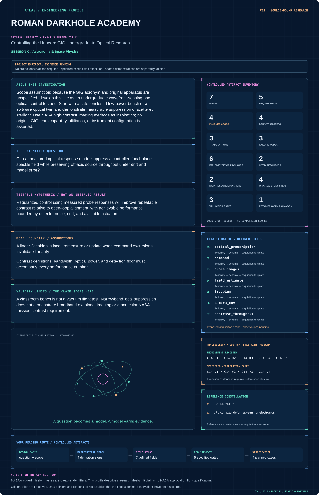
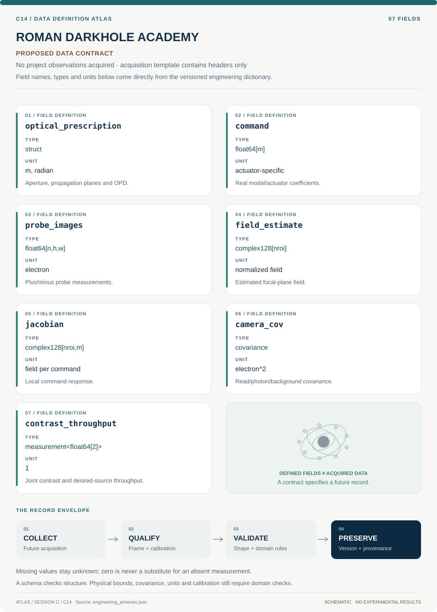

# C14 · ROMAN DARKHOLE ACADEMY

**Original project:** Controlling the Unseen: GIG Undergraduate Optical Research

**Session C:** Astronomy & Space Physics

**Document class:** engineering research design and analysis record · **Revision:** 4 · **Date:** 2026-10-02

**Evidence state:** design basis, mathematical formulation and verification plan documented. Project-specific empirical results remain to be acquired; executable shared model demonstrations have their own recorded checks.

[Session C](../README.md) · [All projects](../../../ENGINEERING_DOCUMENTATION.md) · [Session handbook](../../../handbooks/SESSION_C.md) · [← C13](../C13-horizon-ring-atlas/README.md) · [C15 →](../C15-webb-photon-truth/README.md)

| Proposed requirements | Specified verification cases | Defined data fields | Cited resources |
| ---: | ---: | ---: | ---: |
| 5 | 4 | 7 | 2 |

[Explore the data blueprint](data/README.md) · [Open the figure gallery](figures/README.md) · [Download acquisition template](data/acquisition.csv) · [Browse the data atlas](../../../data/README.md)

---

## Mission profile

| Profile panel | Engineering signal | Open the evidence |
| --- | --- | --- |
| Mission identity | Controlling the Unseen: GIG Undergraduate Optical Research | [Scientific objective](#purpose-and-scientific-objective) |
| Model cockpit | 3 governing expressions; 4 derivation steps; declared assumptions and validity envelope | [Mathematical formulation](#4-mathematical-model-and-derivation) |
| Data blueprint | 7 proposed fields with types, units and quality rules | [Field map & downloads](data/README.md) |
| Verification queue | 5 proposed requirements; 4 specified cases; project execution evidence pending | [Case definitions](#8-verification-and-validation-cases) |
| Figure wall | Architecture, field map, planned result description | [Open full gallery](figures/README.md) |
| Resource library | 2 cited primary resources with support statements | [Cited resources](#12-cited-technical-and-scientific-resources) |

### Model cockpit

**Analysis method:** Build a Fourier/Fresnel optical model with measured aperture, aberrations, and detector response, using PROPER or equivalent. Estimate the complex speckle field with controlled probes, compare a calibrated Jacobian against empirical response, and apply regularized electric-field control or a simpler modal nulling baseline. Allocate sensor noise, wavefront drift, alignment, and actuator error in a measured budget. Simulate actuator faults and drift before any hardware loop. If no deformable mirror exists, use a phase modulator or constrained modal simulation and label the demonstration accordingly.

**Operating envelope:** A classroom bench is not a vacuum flight test. Narrowband local suppression does not demonstrate broadband exoplanet imaging or a particular NASA mission contrast requirement.

**Variables and conventions**

- E is complex focal-plane field in normalized units; intensity is proportional to |E|^2
- u is actuator command or modal wavefront coefficient; G is its measured complex Jacobian
- lambda is regularization selected on independent validation runs
- C is normalized contrast over a declared region in lambda/D
- eta is off-axis throughput; wavefront optical path error in nm; drift rates in nm h^-1

### Artifact wall

The closed loop estimates complex response before bounded updates, while an independent off-axis branch measures the science-throughput cost.

**Scientific result to produce:** Optical layout and measured control-loop diagram beside before/after speckle fields, contrast convergence, and off-axis throughput.

### Investigation feed · planned work

The feed records proposed work packages. A row becomes executed evidence only with versioned inputs, outputs and a reviewed result.

| Sequence | Evidence state | Engineering work package |
| --- | --- | --- |
| 01 | Planned | Create verified bench/twin optical and command manifests. |
| 02 | Planned | Implement normalized propagation and camera noise model. |
| 03 | Planned | Generate or acquire pairwise probes with timing metadata. |
| 04 | Planned | Estimate quadrature field and local Jacobian covariance. |
| 05 | Planned | Implement bounded regularized controller and fault replay. |
| 06 | Planned | Publish contrast/throughput/noise-floor traces and held-out response tests. |

### Mission connections

Connections are reading routes based on actual shared resources, supplied sessions or included illustrations. They do not establish physical dependencies, team collaborations or validated results.

| Connected mission | Original investigation | Recorded connection basis |
| --- | --- | --- |
| [C13 · HORIZON RING ATLAS](../C13-horizon-ring-atlas/README.md) | Characterizing the Images of Black Hole Shadows | Session C |
| [C15 · WEBB PHOTON TRUTH](../C15-webb-photon-truth/README.md) | Assessing the Performance of the JWST/NIRCam Image Simulator PhoSim-NIRCam | Session C |
| [C12 · HUBBLE COSMIC GLOW](../C12-hubble-cosmic-glow/README.md) | SKYSURF: Measuring the Brightness of the Sky | Session C |
| [C16 · ORION STRAIN METROLOGY](../C16-orion-strain-metrology/README.md) | Gravitational Wave Calibration Error for Supernovae Core Collapse | Session C |
| [C11 · ORION CORE INFERENCE](../C11-orion-core-inference/README.md) | Evaluation of Supernovae Astrophysical Parameters by Using Machine Learning on Laser Interferometric Data | Session C |
| [C17 · GEMINI DISK SENTINEL](../C17-gemini-disk-sentinel/README.md) | Investigating the Planet Detection Limit in Debris Disk Images from the Gemini Planet Imager | Session C |

[Machine-readable connection register and ranking rule](../../../registry/mission_connections.json)

### Reading playlist

| Route | Start here | Continue to |
| --- | --- | --- |
| Understand the idea | [Scientific objective](#purpose-and-scientific-objective) | [Design boundary](#1-design-basis-and-analysis-boundary) → [Mathematics](#4-mathematical-model-and-derivation) |
| Inspect the data | [Visual blueprint](data/README.md) | [Provenance](#5-data-specifications-and-provenance) → [Uncertainty](#6-uncertainty-sensitivity-and-identifiability) |
| Make a design decision | [Trade study](#7-engineering-trade-study) | [Failure modes](#10-failure-modes-and-interpretation-controls) → [Required outputs](#11-required-engineering-outputs) |
| Prepare execution | [Requirements](#2-requirements-and-verification-traceability) | [Verification](#8-verification-and-validation-cases) → [Implementation](#9-implementation-and-reproducible-work-packages) |

## Complete engineering dossier

The profile above is a browsing layer. The full design basis, equations, derivations, data contract, uncertainty, trades and controlled case definitions follow.

## Purpose and scientific objective

Scope assumption: because the GIG acronym and original apparatus are unspecified, develop this title as an undergraduate wavefront-sensing and optical-control testbed. Start with a safe, enclosed low-power bench or a software optical twin and demonstrate measurable suppression of scattered starlight. Use NASA high-contrast imaging methods as inspiration; no original GIG team capability, affiliation, or instrument configuration is asserted.

**Question:** Can a measured optical-response model suppress a controlled focal-plane speckle field while preserving off-axis source throughput under drift and model error?

**Testable hypothesis:** Regularized control using measured probe responses will improve repeatable contrast relative to open-loop alignment, with achievable performance bounded by detector noise, drift, and available actuators.

## 1. Design basis and analysis boundary

The optical-control design is an undergraduate software twin or enclosed low-power bench whose actual GIG apparatus remains unspecified. The controlled quantity is a complex speckle field in a declared focal-plane region, with off-axis throughput measured separately. JPL PROPER supports propagation modeling; available deformable-mirror or phase-modulator hardware is not assumed.

Begin with scalar Fourier propagation, add Fresnel and measured detector behavior, then close a local electric-field control loop. Actuator basis, probe amplitudes, optical bandpass and dark-region coordinates are declared before optimization. A contrast reduction claim states reference PSF, bandwidth and detection floor. It establishes bench behavior rather than a flight mission's performance or requirement.

## 2. Requirements and verification traceability

These are project design requirements or proposed analysis gates. A numerical target is not a NASA requirement unless its controlling source is explicitly identified. “TBD” identifies evidence required before a decision; it is not permission to assume a value. Verification evidence listed here is planned, unless a linked result explicitly records execution.

| ID | Requirement / gate | Engineering rationale | Verification method | Basis / required evidence |
| --- | --- | --- | --- | --- |
| C14-R1 | Contrast shall use a declared dark-region area and unsaturated reference PSF peak. | Normalization and region changes can mimic improvement. | Reference-frame and region hash audit. | Proposed contrast contract. |
| C14-R2 | Linearization error shall stay below 5% of predicted probe-field change over accepted commands, a proposed target. | A local Jacobian fails under large excursions. | Independent positive/negative actuator probes. | Proposed model-validity target. |
| C14-R3 | Off-axis throughput shall retain at least 90% of its uncontrolled value in the selected synthetic pilot, a proposed design target. | Speckle suppression can also suppress desired sources. | Injected off-axis source replay. | Proposed throughput trade, not mission capability. |
| C14-R4 | Controller commands shall remain inside measured/calibrated actuator limits. | Unconstrained least squares may request unavailable states. | Command-bound and simulated actuator-fault tests. | Proposed control interface. |
| C14-R5 | The detector noise floor shall accompany every reported contrast. | An apparent dark hole can be read/background limited. | Dark/reference acquisition and uncertainty propagation. | Proposed measurement requirement. |

## 3. Architecture and controlled interfaces

An optical prescription emits pupil amplitude, optical-path error, wavelengths and propagation planes. A command adapter defines real actuator or modal coefficients and bounds. The propagation model provides the complex focal field; a camera adapter supplies counts, background, gain and covariance. Reference PSFs use the same flux normalization and exposure conventions.

Pairwise probes estimate the complex field and empirical Jacobian. A regularized optimizer uses a real-stacked field/Jacobian and enforces command limits. The loop checks prediction residuals before applying the next update in simulation or qualified bench conditions. An off-axis source evaluator receives the same optical command state, exposing throughput loss rather than burying it in a contrast-only metric.

The closed loop estimates complex response before bounded updates, while an independent off-axis branch measures the science-throughput cost.

[Editable engineering diagram source](figures/architecture.mmd)

## 4. Mathematical model and derivation

### Governing equations

$$
E(u+\Delta u)\approx E_0+G\Delta u
$$

$$
\Delta u=\arg\min_{\Delta u}\{\|W^{1/2}(E_0+G\Delta u)\|^2+\lambda\|\Delta u\|^2\}
$$

$$
C=\langle I_{\rm dark}\rangle/I_{\rm PSF,peak};\quad \eta=F_{\rm off-axis,out}/F_{\rm off-axis,in}
$$

### Variables, units and conventions

- E is complex focal-plane field in normalized units; intensity is proportional to |E|^2
- u is actuator command or modal wavefront coefficient; G is its measured complex Jacobian
- lambda is regularization selected on independent validation runs
- C is normalized contrast over a declared region in lambda/D
- eta is off-axis throughput; wavefront optical path error in nm; drift rates in nm h^-1

### Assumptions and boundary conditions

- A linear Jacobian is local; remeasure or update when command excursions invalidate linearity.
- Contrast definitions, bandwidth, optical power, and detection floor must accompany every performance number.

### Derivation step 1

$$
E(u+\Delta u)=E_0+G\Delta u+O(\|\Delta u\|^2)
$$

Commands are real; G is a complex field derivative per command unit. The remainder defines the allowed local operating envelope.

### Derivation step 2

$$
I_+-I_-\approx4\operatorname{Re}(E_0^*G p)
$$

For opposite small probes plus/minus p, quadratic probe intensity cancels. Multiple independent probes are needed to recover both field quadratures.

### Derivation step 3

$$
\Delta u=-(G_R^TWG_R+\lambda I)^{-1}G_R^TWE_R
$$

Stack real and imaginary field components into E_R and G_R. Positive regularization stabilizes poorly observed command modes; bounded optimization replaces this unconstrained formula when needed.

### Derivation step 4

$$
C=\langle|E|^2\rangle_{ROI}/I_{ref,peak},\quad\eta=F_{off,out}/F_{off,in}
$$

Both metrics are dimensionless. Specify whether field/intensity normalization includes exposure and bandwidth before comparing control states.

### Inference or simulation procedure

Build a Fourier/Fresnel optical model with measured aperture, aberrations, and detector response, using PROPER or equivalent. Estimate the complex speckle field with controlled probes, compare a calibrated Jacobian against empirical response, and apply regularized electric-field control or a simpler modal nulling baseline. Allocate sensor noise, wavefront drift, alignment, and actuator error in a measured budget. Simulate actuator faults and drift before any hardware loop. If no deformable mirror exists, use a phase modulator or constrained modal simulation and label the demonstration accordingly.

### Validity domain and fidelity limits

A classroom bench is not a vacuum flight test. Narrowband local suppression does not demonstrate broadband exoplanet imaging or a particular NASA mission contrast requirement.

## 5. Data specifications and provenance

**Proposed data contract · observations pending.** This visual inventory shows the record fields to acquire or derive. It contains no project measurements. [Open the data blueprint and downloads](data/README.md).

| Field | Type | Unit | Physical / statistical meaning | Quality and missing-data rule |
| --- | --- | --- | --- | --- |
| optical_prescription | struct | m, radian | Aperture, propagation planes and OPD. | Versioned geometry and wavelength grid. |
| command | float64[m] | actuator-specific | Real modal/actuator coefficients. | Bounds and calibration units required. |
| probe_images | float64[n,h,w] | electron | Plus/minus probe measurements. | Background, exposure and saturation flags retained. |
| field_estimate | complex128[nroi] | normalized field | Estimated focal-plane field. | Covariance on both quadratures required. |
| jacobian | complex128[nroi,m] | field per command | Local command response. | Calibration state and validity range attached. |
| camera_cov | covariance | electron^2 | Read/photon/background covariance. | Missing pixels masked, never assigned zero field. |
| contrast_throughput | measurement<float64[2]> | 1 | Joint contrast and desired-source throughput. | Reference/ROI/source offset and noise floor attached. |

[Machine-readable record schema](data/schema.json) · [Empty acquisition CSV](data/acquisition.csv) · [Field dictionary CSV](data/dictionary.csv)

The CSV above contains column headers only. Its schema defines future records and does not establish that original-team data or a particular archive product have been acquired. Frame, timing, calibration, covariance, selection and provenance details must accompany populated records.

### JPL PROPER software

[Product, archive or reference](https://science.jpl.nasa.gov/projects/proper/)

**Fields:** Propagation configuration, optical geometry, aberrations, simulated focal-plane field

**Access:** Public source/software discovery; inspect current license and version.

**Role:** Independent optical twin.

### New optical bench campaign

[Product, archive or reference](https://ao.jpl.nasa.gov/compact_dm_electronics.html)

**Fields:** Dark frames, reference PSFs, probe images, actuator commands, ambient conditions

**Access:** Generate locally after equipment and laser-safety review; NASA benchmark hardware is not assumed available.

**Role:** Measured controller and noise response.

## 6. Uncertainty, sensitivity and identifiability

Probe noise and Jacobian error interact with regularization: unobserved modes can yield large commands without reliable field suppression. Propagate field-estimation covariance into predicted improvement and check posterior or bootstrap command stability. Optical drift between probes introduces a correlated error that simple photon noise does not describe; record probe order and ambient state.

Alignment, actuator hysteresis, chromatic propagation and detector nonlinearity create model discrepancy. Sweep bandpass and command excursion in the twin, then compare withheld empirical probes with predicted complex response. Diagnose singular values of the real-stacked Jacobian to identify controllable modes. If hardware lacks enough quadrature information or command freedom, restrict the claimed dark region rather than increasing model complexity.

## 7. Engineering trade study

| Alternative | Benefit | Cost / limitation | Decision rule |
| --- | --- | --- | --- |
| Modal speckle nulling | Simple control with few modes. | Slow convergence and limited region. | Use first when hardware response is sparse. |
| Regularized electric-field control | Efficient multi-actuator updates. | Sensitive to Jacobian/probe accuracy. | Use within validated linear envelope and throughput constraint. |
| Broadband nonlinear optimization | Accounts for chromatic large excursions. | Higher computation and calibration demand. | Attempt after narrowband local control is independently verified. |

## 8. Verification and validation cases

| Case ID | Stimulus / condition | Expected result / criterion | Method | Evidence artifact |
| --- | --- | --- | --- | --- |
| C14-V1 | No-aberration propagation | Reference PSF matches the analytic aperture transform under the selected approximation. | Pupil-to-focal transform fixture. | Fourier optics identity. |
| C14-V2 | Opposite probes | Intensity difference matches four times the field/probe real product in the small-probe limit. | Refine probe magnitude and compare analytic expression. | Pairwise-probing derivation. |
| C14-V3 | Unavailable actuator | Faulted mode is removed or bounded without unstable commands. | Synthetic stuck-actuator replay. | Declared bounded-control interface. |
| C14-V4 | Withheld off-axis source | Suppression and throughput meet declared pilot targets or document failure. | Independent source offset and drift episode. | Proposed control/throughput validation. |

**Execution status:** these cases are specified, not claimed as executed. Close a case only with the versioned inputs, output, uncertainty, reviewer and pass/fail rationale.

### Additional scientific validation gates

- Reserve unseen aberration realizations and independent bench days for validation.
- Require suppressed-region improvement with confidence intervals and simultaneous throughput preservation.
- Measure detector saturation, drift, and loop stability; compare predicted versus measured command response.

## 9. Implementation and reproducible work packages

1. Create verified bench/twin optical and command manifests.
2. Implement normalized propagation and camera noise model.
3. Generate or acquire pairwise probes with timing metadata.
4. Estimate quadrature field and local Jacobian covariance.
5. Implement bounded regularized controller and fault replay.
6. Publish contrast/throughput/noise-floor traces and held-out response tests.

### Investigation sequence

1. Inventory the actual GIG apparatus and replace the stated scope assumption if team documentation becomes available.
2. Define an achievable contrast and throughput demonstration based on measured sensor floor.
3. Calibrate probes, fit the Jacobian, and compare open-loop, modal, and regularized control.
4. Demonstrate repeatability across independent realignments and deliberate thermal or phase perturbations.

### Resources and interfaces to expertise

- Enclosed optical bench, camera, low-power source, wavefront actuator if available, optics supervisor, PROPER.

## 10. Failure modes and interpretation controls

| Failure mode | Effect on result | Detection / evidence | Design response |
| --- | --- | --- | --- |
| Reference PSF saturation | Artificially low normalized contrast. | Peak clipping and exposure scaling mismatch. | Use unsaturated reference and uncertainty. |
| Jacobian stale after drift | Control worsens speckles. | Prediction residual and probe inconsistency. | Remeasure field/Jacobian or reduce update. |
| Throughput sacrificed | Useful source removed with speckles. | Off-axis replay flux loss. | Joint contrast/throughput decision rule. |

- Laser exposure and actuator limits require qualified local controls; the scientific risk is overclaiming flight-level performance.

## 11. Required engineering outputs

- Optical twin, measured error budget, control-loop notebook, reproducible bench protocol, and teaching modules.

### Scientific result figures to produce during execution

Optical layout and measured control-loop diagram beside before/after speckle fields, contrast convergence, and off-axis throughput.

## 12. Cited technical and scientific resources

- [JPL PROPER](https://science.jpl.nasa.gov/projects/proper/) — Fourier propagation and optical simulation capabilities.
- [JPL compact deformable-mirror electronics](https://ao.jpl.nasa.gov/compact_dm_electronics.html) — NASA high-contrast control benchmark and motivation.

Framework and evidence rules: [engineering documentation standard](../../../engineering/ENGINEERING_STANDARD.md), [model assurance](../../../engineering/MODEL_ASSURANCE.md), [uncertainty procedure](../../../engineering/UNCERTAINTY_AND_DECISION_RULES.md), [data management](../../../engineering/DATA_MANAGEMENT.md). NASA-inspired names are creative identifiers; requirements and results are not NASA certification.
