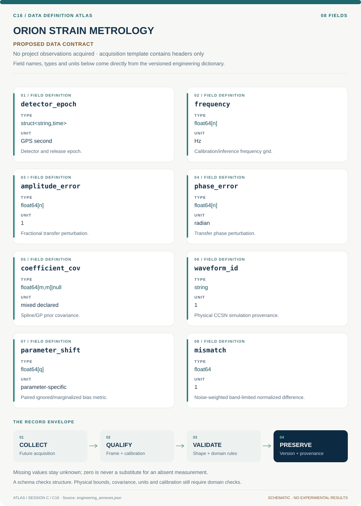
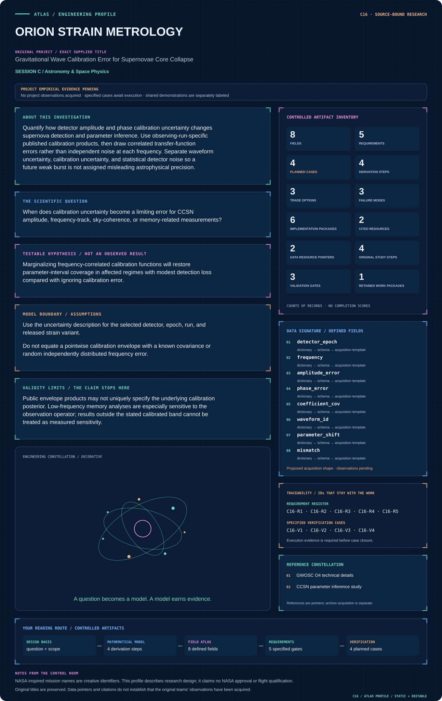

# C16 · Figure gallery

[ORION STRAIN METROLOGY](../README.md) · [Data blueprint](../data/README.md) · [Data diagnostic gallery](../../../../data/figures/README.md)

## Engineering architecture

Matched perturbations drive paired inference; the covariance generator is explicitly an assumption when public products provide only envelopes.

[SVG](architecture.svg) · [Editable Mermaid source](architecture.mmd)

## Data blueprint

**Proposed contract · observations pending.** Every field, type, unit and meaning comes from the controlled dictionary. [Open SVG](data-map.svg) · [Download dictionary](../data/dictionary.csv)

## Mission profile

The scientific question, hypothesis, model boundary and document metadata are drawn from controlled sources. Proposed work remains distinguished from acquired evidence. [Open SVG](mission-profile.svg)

## Planned scientific result

Amplitude/phase uncertainty curves with parameter bias and coverage versus signal strength, and separate statistical/model/calibration contributions.

This final scientific result remains an execution deliverable; the design diagrams do not establish an empirical finding.
