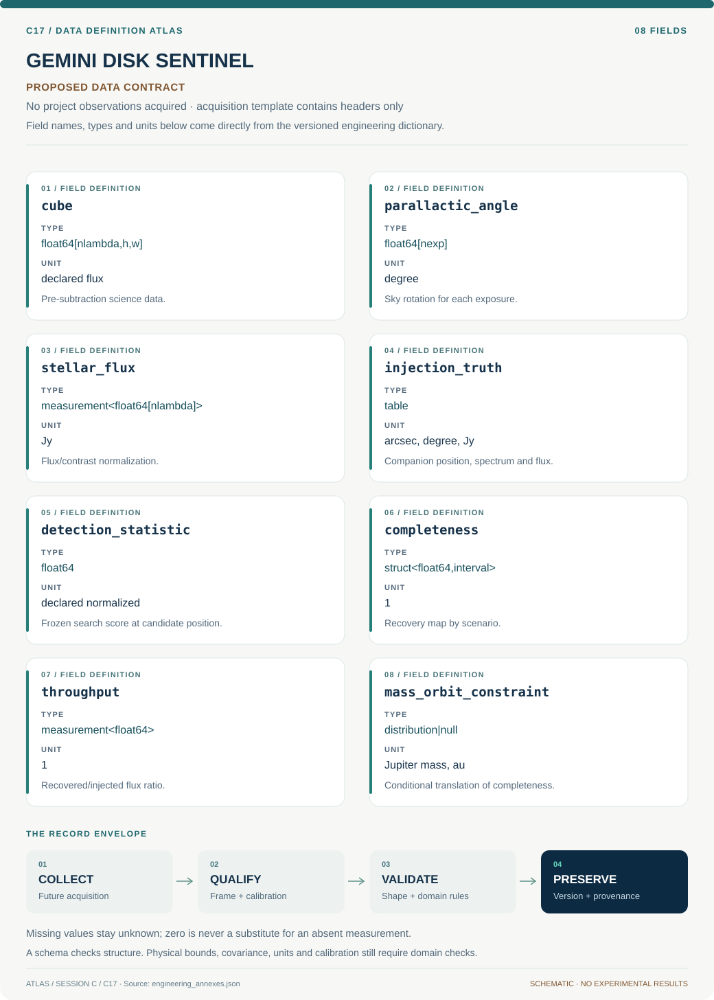

# C17 · Data blueprint

[GEMINI DISK SENTINEL](../README.md) · [Figure gallery](../figures/README.md) · [Data atlas](../../../../data/README.md)

**PROPOSED CONTRACT · 8 fields · no project observations acquired.** The acquisition CSV contains column headers only. The diagram is a visual record specification, not measured data.

| Download | What it contains |
| --- | --- |
| [Acquisition CSV](acquisition.csv) | Empty columns ready for controlled acquisition |
| [Field dictionary](dictionary.csv) | Names, source types, units, meanings and quality rules |
| [JSON Schema](schema.json) | Nullable record structure with unit and quality metadata |

## Field reference

| Field | Type | Unit | Meaning | Quality / missingness |
| --- | --- | --- | --- | --- |
| cube | float64[nlambda,h,w] | declared flux | Pre-subtraction science data. | Keep spectral/spatial masks; missing pixels are not zero background. |
| parallactic_angle | float64[nexp] | degree | Sky rotation for each exposure. | Time and angle convention attached. |
| stellar_flux | measurement<float64[nlambda]> | Jy | Flux/contrast normalization. | Shared covariance across wavelengths retained. |
| injection_truth | table | arcsec, degree, Jy | Companion position, spectrum and flux. | Record stage, seed and sparse-batch identity. |
| detection_statistic | float64 | declared normalized | Frozen search score at candidate position. | Threshold version and searched trials attached. |
| completeness | struct<float64,interval> | 1 | Recovery map by scenario. | Report n/k; empty cells remain missing. |
| throughput | measurement<float64> | 1 | Recovered/injected flux ratio. | Calibration and recovery covariance propagated. |
| mass_orbit_constraint | distribution&#124;null | Jupiter mass, au | Conditional translation of completeness. | Age/evolution/orbit versions mandatory. |

## Acquisition and provenance

Null means missing or unknown; record its cause. Preserve product identifier, retrieval timestamp, source hash, calibration, coordinate and time frame, covariance basis, selection rules and every transformation. JSON Schema checks structure; physical bounds and the quality rules above require domain validation.

- [Gemini Observatory Archive](https://archive.gemini.edu/searchform) — archive or acquisition resource; inclusion here does not assert that its data have been retrieved.
- [GPI debris-disk survey](https://authors.library.caltech.edu/records/pt03e-7pb38) — archive or acquisition resource; inclusion here does not assert that its data have been retrieved.

[Controlled data-management procedure](../../../../engineering/DATA_MANAGEMENT.md)
