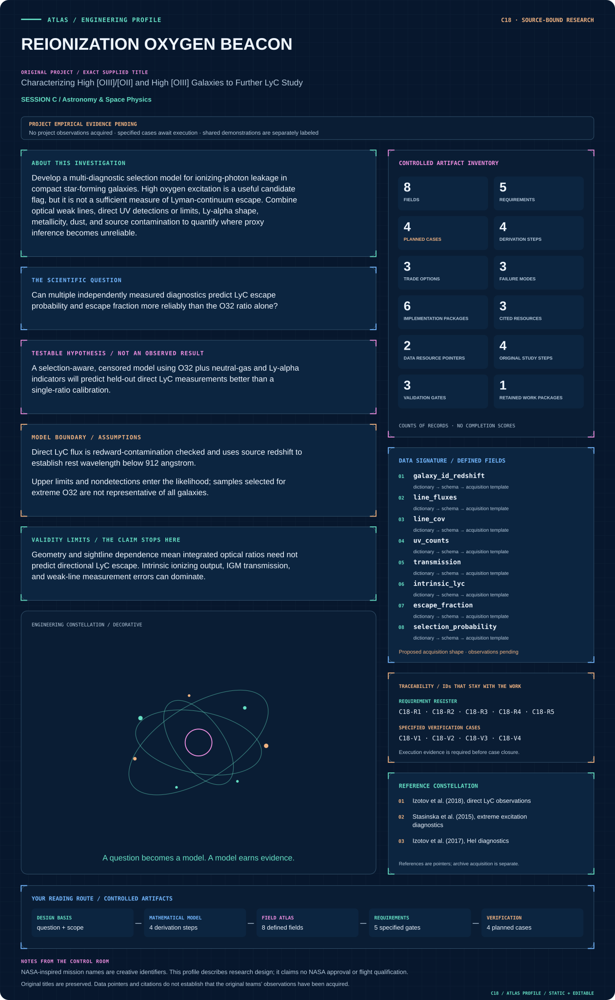

# C18 · REIONIZATION OXYGEN BEACON

**Original project:** Characterizing High [OIII]/[OII] and High [OIII] Galaxies to Further LyC Study

**Session C:** Astronomy & Space Physics

**Document class:** engineering research design and analysis record · **Revision:** 4 · **Date:** 2026-10-02

**Evidence state:** design basis, mathematical formulation and verification plan documented. Project-specific empirical results remain to be acquired; executable shared model demonstrations have their own recorded checks.

[Session C](../README.md) · [All projects](../../../ENGINEERING_DOCUMENTATION.md) · [Session handbook](../../../handbooks/SESSION_C.md) · [← C17](../C17-gemini-disk-sentinel/README.md) · [C19 →](../C19-webb-young-star-atmospheres/README.md)

| Proposed requirements | Specified verification cases | Defined data fields | Cited resources |
| ---: | ---: | ---: | ---: |
| 5 | 4 | 8 | 3 |

[Explore the data blueprint](data/README.md) · [Open the figure gallery](figures/README.md) · [Download acquisition template](data/acquisition.csv) · [Browse the data atlas](../../../data/README.md)

---

## Mission profile



| Profile panel | Engineering signal | Open the evidence |
| --- | --- | --- |
| Mission identity | Characterizing High [OIII]/[OII] and High [OIII] Galaxies to Further LyC Study | [Scientific objective](#purpose-and-scientific-objective) |
| Model cockpit | 3 governing expressions; 4 derivation steps; declared assumptions and validity envelope | [Mathematical formulation](#4-mathematical-model-and-derivation) |
| Data blueprint | 8 proposed fields with types, units and quality rules | [Field map & downloads](data/README.md) |
| Verification queue | 5 proposed requirements; 4 specified cases; project execution evidence pending | [Case definitions](#8-verification-and-validation-cases) |
| Figure wall | Architecture, field map, planned result description | [Open full gallery](figures/README.md) |
| Resource library | 3 cited primary resources with support statements | [Cited resources](#12-cited-technical-and-scientific-resources) |

### Model cockpit

**Analysis method:** Measure oxygen, Balmer, HeI, HeII, and OI lines using simultaneous continuum and line fits. Infer dust and metallicity with uncertainty and compare ionization-bounded, density-bounded, shock, and hard-spectrum photoionization models. Model UV count data or censored fluxes with instrumental backgrounds, foreground contamination, and uncertain intrinsic stellar SEDs. Fit escape predictors with galaxy-level splitting and a selection model tied to sample inclusion. Compare proxy probabilities to direct UV measurements and avoid extrapolating a low-redshift calibration to the early universe without a domain-shift assessment.

**Operating envelope:** Geometry and sightline dependence mean integrated optical ratios need not predict directional LyC escape. Intrinsic ionizing output, IGM transmission, and weak-line measurement errors can dominate.

**Variables and conventions**

- Line fluxes in erg s^-1 cm^-2 after specified extinction corrections
- O32 convention is explicit; publications using summed OIII require conversion
- Ly-alpha peak separation Delta v in km s^-1; metallicity Z as 12+log(O/H)
- Escape fraction dimensionless in [0,1]; intrinsic LyC flux is model predicted
- IGM and Milky Way transmissions dimensionless; internal attenuation is included in the absolute escaped fraction definition

### Artifact wall



Direct ionizing-photon likelihood and optical proxies enter with separate contracts, while transmission and sample selection condition any escape inference.

**Scientific result to produce:** O32 versus Ly-alpha separation colored by directly measured escape, with upper limits, selected-sample boundaries, and predicted probability contours.

### Investigation feed · planned work

The feed records proposed work packages. A row becomes executed evidence only with versioned inputs, outputs and a reviewed result.

| Sequence | Evidence state | Engineering work package |
| --- | --- | --- |
| 01 | Planned | Create optical/UV response and counterpart manifests. |
| 02 | Planned | Implement joint continuum/line fitting and ratio covariance. |
| 03 | Planned | Build UV count/background and contamination likelihoods. |
| 04 | Planned | Version intrinsic SED and transmission models with explicit escape convention. |
| 05 | Planned | Fit galaxy-grouped predictors and selection sensitivities. |
| 06 | Planned | Release direct/proxy-labeled fraction posteriors and domain holdouts. |

### Mission connections

Connections are reading routes based on actual shared resources, supplied sessions or included illustrations. They do not establish physical dependencies, team collaborations or validated results.

| Connected mission | Original investigation | Recorded connection basis |
| --- | --- | --- |
| [C17 · GEMINI DISK SENTINEL](../C17-gemini-disk-sentinel/README.md) | Investigating the Planet Detection Limit in Debris Disk Images from the Gemini Planet Imager | Session C |
| [C19 · WEBB YOUNG STAR ATMOSPHERES](../C19-webb-young-star-atmospheres/README.md) | Characterizing the Atmospheres of Low Surface Gravity M-dwarfs | Session C |
| [C16 · ORION STRAIN METROLOGY](../C16-orion-strain-metrology/README.md) | Gravitational Wave Calibration Error for Supernovae Core Collapse | Session C |
| [C20 · TRINITY ACCRETION ECHO](../C20-trinity-accretion-echo/README.md) | Predictions for the Observable Autocorrelations of Accreting Black Holes from the Trinity Theoretical Model | Session C |
| [C15 · WEBB PHOTON TRUTH](../C15-webb-photon-truth/README.md) | Assessing the Performance of the JWST/NIRCam Image Simulator PhoSim-NIRCam | Session C |
| [C21 · PARKER MAGNETIC TRAIL](../C21-parker-magnetic-trail/README.md) | Identification of Switchback Intervals in Parker Space Probe Data | Session C |

[Machine-readable connection register and ranking rule](../../../registry/mission_connections.json)

### Reading playlist

| Route | Start here | Continue to |
| --- | --- | --- |
| Understand the idea | [Scientific objective](#purpose-and-scientific-objective) | [Design boundary](#1-design-basis-and-analysis-boundary) → [Mathematics](#4-mathematical-model-and-derivation) |
| Inspect the data | [Visual blueprint](data/README.md) | [Provenance](#5-data-specifications-and-provenance) → [Uncertainty](#6-uncertainty-sensitivity-and-identifiability) |
| Make a design decision | [Trade study](#7-engineering-trade-study) | [Failure modes](#10-failure-modes-and-interpretation-controls) → [Required outputs](#11-required-engineering-outputs) |
| Prepare execution | [Requirements](#2-requirements-and-verification-traceability) | [Verification](#8-verification-and-validation-cases) → [Implementation](#9-implementation-and-reproducible-work-packages) |

## Complete engineering dossier

The profile above is a browsing layer. The full design basis, equations, derivations, data contract, uncertainty, trades and controlled case definitions follow.

## Purpose and scientific objective

Develop a multi-diagnostic selection model for ionizing-photon leakage in compact star-forming galaxies. High oxygen excitation is a useful candidate flag, but it is not a sufficient measure of Lyman-continuum escape. Combine optical weak lines, direct UV detections or limits, Ly-alpha shape, metallicity, dust, and source contamination to quantify where proxy inference becomes unreliable.

**Question:** Can multiple independently measured diagnostics predict LyC escape probability and escape fraction more reliably than the O32 ratio alone?

**Testable hypothesis:** A selection-aware, censored model using O32 plus neutral-gas and Ly-alpha indicators will predict held-out direct LyC measurements better than a single-ratio calibration.

## 1. Design basis and analysis boundary

The LyC system combines optical line measurements and direct UV photon/flux observations to estimate escape probability and an explicitly defined absolute escape fraction. High O32 is a candidate flag, not a direct escape measurement. The low-redshift leaking-galaxy primary study provides empirical comparison data with its sample selection and conventions preserved.

Begin with response-aware line/continuum fits, then a multi-diagnostic predictor, then a selection-aware population hierarchy. Intrinsic ionizing SED, Milky Way/IGM transmission and foreground contamination are separate modules. Low-redshift calibration is not automatically transferred to early galaxies. Direct UV nondetections remain likelihood terms, while directional escape and integrated optical diagnostics are distinct observables.

## 2. Requirements and verification traceability

These are project design requirements or proposed analysis gates. A numerical target is not a NASA requirement unless its controlling source is explicitly identified. “TBD” identifies evidence required before a decision; it is not permission to assume a value. Verification evidence listed here is planned, unless a linked result explicitly records execution.

| ID | Requirement / gate | Engineering rationale | Verification method | Basis / required evidence |
| --- | --- | --- | --- | --- |
| C18-R1 | O32 shall use the stated OIII 5007 divided by summed OII doublet convention. | Published alternate OIII sums differ numerically. | Line-ID/unit and ratio conversion fixtures. | Existing explicit ratio definition. |
| C18-R2 | Direct LyC windows shall lie below rest-frame 912 angstrom after redshift uncertainty is applied. | Redward flux is not escaping ionizing radiation. | Rest-wavelength range audit. | Physical LyC definition. |
| C18-R3 | Absolute escape shall correct Milky Way/IGM transmission once and retain internal attenuation in escaped flux. | Transmission conventions can double-correct photons. | Synthetic attenuation-chain fixture. | Existing escape-fraction definition. |
| C18-R4 | Nondetections and contaminated candidates shall retain likelihood or mixture states. | Dropping difficult objects biases leakage predictors. | Censored/count and contamination integration tests. | Proposed inclusion contract. |
| C18-R5 | Predictor validation shall hold out galaxies and assess O32-selection/domain shift. | Extreme selected samples lack population representativeness. | Galaxy-level and selection-stratified holdout. | Proposed generalization requirement. |

## 3. Architecture and controlled interfaces

A spectrum adapter emits observed wavelength, calibrated flux or counts, response and covariance. Optical fitting jointly estimates continuum, Balmer and oxygen/weak lines, retaining extinction and deblending covariance. UV fitting includes source/background counts, rest-frame windows and spatial contamination likelihood. Stellar SED predictions supply intrinsic ionizing flux with model uncertainty.

A transmission module separates Galactic and intervening attenuation from internal escape. The multi-diagnostic engine combines O32, Ly-alpha structure, dust and metallicity with censored UV constraints. A sample-inclusion model accounts for extreme-excitation targeting. Output probabilities and absolute fractions carry population/domain labels, so an optical-only prediction is never exported as a direct UV measurement.


Direct ionizing-photon likelihood and optical proxies enter with separate contracts, while transmission and sample selection condition any escape inference.

[Editable engineering diagram source](figures/architecture.mmd)

## 4. Mathematical model and derivation

### Governing equations

```text
O32=F([OIII]5007)/F([OII]3726+3729)
```

$$
f_{\rm esc,abs}=F_{\rm LyC,obs}/[F_{\rm LyC,int}T_{\rm IGM}T_{\rm MW}]
$$

$$
\mathrm{logit}\,p_{\rm leak}=a+b\log O32+c\Delta v_{\rm Ly\alpha}+dE(B-V)+eZ
$$

### Variables, units and conventions

- Line fluxes in erg s^-1 cm^-2 after specified extinction corrections
- O32 convention is explicit; publications using summed OIII require conversion
- Ly-alpha peak separation Delta v in km s^-1; metallicity Z as 12+log(O/H)
- Escape fraction dimensionless in [0,1]; intrinsic LyC flux is model predicted
- IGM and Milky Way transmissions dimensionless; internal attenuation is included in the absolute escaped fraction definition

### Assumptions and boundary conditions

- Direct LyC flux is redward-contamination checked and uses source redshift to establish rest wavelength below 912 angstrom.
- Upper limits and nondetections enter the likelihood; samples selected for extreme O32 are not representative of all galaxies.

### Derivation step 1

```text
O32=F_{5007}/(F_{3726}+F_{3729})
```

Use either consistently observed or specified corrected line fluxes; numerator-denominator covariance and OII deblending uncertainty enter the ratio.

### Derivation step 2

$$
F_{corr}(\lambda)=F_{obs}(\lambda)10^{0.4k(\lambda)E(B-V)}
$$

The extinction curve k and color excess are a shared nuisance model. Different line wavelengths receive different factors.

### Derivation step 3

```text
F_{LyC,obs}=f_{esc,abs}F_{LyC,int}T_{IGM}T_{MW}
```

The absolute escaped fraction includes internal losses. Both transmissions are dimensionless; intrinsic and observed flux definitions must share distance and spectral integration conventions.

### Derivation step 4

$$
\log\frac{p_{leak}}{1-p_{leak}}=a+b\log O32+c\Delta v_{Ly\alpha}+dE(B-V)+eZ
$$

Coefficients carry inverse units for dimensional predictors. This statistical proxy is a proposed calibration, not a universal radiative-transfer law.

### Inference or simulation procedure

Measure oxygen, Balmer, HeI, HeII, and OI lines using simultaneous continuum and line fits. Infer dust and metallicity with uncertainty and compare ionization-bounded, density-bounded, shock, and hard-spectrum photoionization models. Model UV count data or censored fluxes with instrumental backgrounds, foreground contamination, and uncertain intrinsic stellar SEDs. Fit escape predictors with galaxy-level splitting and a selection model tied to sample inclusion. Compare proxy probabilities to direct UV measurements and avoid extrapolating a low-redshift calibration to the early universe without a domain-shift assessment.

### Validity domain and fidelity limits

Geometry and sightline dependence mean integrated optical ratios need not predict directional LyC escape. Intrinsic ionizing output, IGM transmission, and weak-line measurement errors can dominate.

## 5. Data specifications and provenance


**Proposed data contract · observations pending.** This visual inventory shows the record fields to acquire or derive. It contains no project measurements. [Open the data blueprint and downloads](data/README.md).

| Field | Type | Unit | Physical / statistical meaning | Quality and missing-data rule |
| --- | --- | --- | --- | --- |
| galaxy_id_redshift | struct | 1 | Source identifier and redshift posterior. | UV contamination counterparts linked. |
| line_fluxes | measurement<float64[]> | erg s^-1 cm^-2 | Named oxygen/Balmer/weak-line integrals. | Line conventions and censoring flags retained. |
| line_cov | float64[n,n] | flux^2 | Continuum/deblend/extinction covariance. | Shared fit terms preserved. |
| uv_counts | struct<uint[],background,response> | count | Direct LyC source/background data. | Poisson count model with exposure and wavelength bounds. |
| transmission | posterior<float64[2]> | 1 | IGM and Milky Way factors. | Between zero and one; very low values imply weak fraction constraints. |
| intrinsic_lyc | posterior<float64> | same flux convention | Stellar-model ionizing output. | SED model and binary/age assumptions recorded. |
| escape_fraction | posterior<float64> | 1 | Absolute fraction within stated sightline/model. | Physical support zero to one; inconsistent data/model flagged. |
| selection_probability | float64&#124;null | 1 | Chance of sample inclusion. | Null prohibits representative population-rate claims. |

[Machine-readable record schema](data/schema.json) · [Empty acquisition CSV](data/acquisition.csv) · [Field dictionary CSV](data/dictionary.csv)

The CSV above contains column headers only. Its schema defines future records and does not establish that original-team data or a particular archive product have been acquired. Frame, timing, calibration, covariance, selection and provenance details must accompany populated records.

### Published low-redshift LyC sample

[Product, archive or reference](https://arxiv.org/abs/1805.09865)

**Fields:** COS fluxes, direct escape estimates, O32, Ly-alpha separations, galaxy properties

**Access:** Open paper; trace exact observations and model conventions.

**Role:** Direct-escape training/validation sample.

### MAST COS holdings

[Product, archive or reference](https://archive.stsci.edu/)

**Fields:** UV photon events or spectra, background, response, target/program metadata

**Access:** Public released observations; verify selected galaxies and exact observing modes.

**Role:** Independent reprocessing route.

## 6. Uncertainty, sensitivity and identifiability

Intrinsic ionizing flux depends on stellar age, metallicity, binaries and dust, while UV background and contamination control weak detections. Transmission uncertainty can dominate when the IGM is opaque. Carry optical line covariance into O32 and retain the distinction between a low-SNR ratio and a secure high-excitation classification.

Ionization parameter, density-bounded geometry, hard radiation and shocks can produce similar oxygen ratios. Use weak lines and Ly-alpha structure to test those alternatives, then examine predictor coefficients under galaxy holdout and selection weighting. Absolute fraction may remain nonidentifiable when intrinsic SED and transmission trade off. Early-universe application requires an explicit domain-shift model rather than extrapolating a low-redshift coefficient table.

## 7. Engineering trade study

| Alternative | Benefit | Cost / limitation | Decision rule |
| --- | --- | --- | --- |
| O32-only screening | Cheap candidate selection. | Nonunique leakage diagnostic. | Use to prioritize observations, not report measured escape. |
| Multi-diagnostic calibrated predictor | Uses partly independent information. | Selection and intrinsic-SED dependence. | Adopt with galaxy holdout and calibration uncertainty. |
| Direct UV count inference | Measures escaped photons in a defined window. | Background/contamination and transmission limits. | Prefer for direct fractions when response and source association are secure. |

## 8. Verification and validation cases

| Case ID | Stimulus / condition | Expected result / criterion | Method | Evidence artifact |
| --- | --- | --- | --- | --- |
| C18-V1 | Unit transmission and full escape | Observed LyC equals intrinsic LyC for f=1, T_IGM=T_MW=1. | Noiseless attenuation-chain fixture. | Flux-factorization identity. |
| C18-V2 | No escape | Source LyC counts reduce to background expectation. | Set f=0 and evaluate Poisson likelihood. | Null photon model. |
| C18-V3 | OII doublet conversion | Summed OII preserves ratio under identical repartition of its two components. | Line-integral fixture. | Declared O32 convention. |
| C18-V4 | Galaxy/domain holdout | Probability calibration and fraction coverage are reported without retuning. | Hold out galaxies and an excitation-selection subset. | Proposed proxy transfer validation. |

**Execution status:** these cases are specified, not claimed as executed. Close a case only with the versioned inputs, output, uncertainty, reviewer and pass/fail rationale.

### Additional scientific validation gates

- Hold out entire galaxies and observing programs; report Brier score, interval coverage, and predictive likelihood.
- Test blind synthetic spectra with shocks, leakage, and hard ionizing continua.
- Measure sensitivity to intrinsic SED, dust law, sample selection, and O32 convention.

## 9. Implementation and reproducible work packages

1. Create optical/UV response and counterpart manifests.
2. Implement joint continuum/line fitting and ratio covariance.
3. Build UV count/background and contamination likelihoods.
4. Version intrinsic SED and transmission models with explicit escape convention.
5. Fit galaxy-grouped predictors and selection sensitivities.
6. Release direct/proxy-labeled fraction posteriors and domain holdouts.

### Investigation sequence

1. Freeze oxygen-ratio conventions and direct-escape calculation before assembling the sample.
2. Reprocess optical and UV data with common quality and contamination rules.
3. Compare one-ratio, multi-diagnostic, and photoionization-informed models.
4. Rank follow-up targets by expected information gain, preserving nondetections as scientifically valuable outcomes.

### Resources and interfaces to expertise

- Spectral fitting, CLOUDY or equivalent, COS calibration expertise, hierarchical censored-model sampler.

## 10. Failure modes and interpretation controls

| Failure mode | Effect on result | Detection / evidence | Design response |
| --- | --- | --- | --- |
| Foreground UV source | False LyC leakage. | Spatial/redshift contamination likelihood. | Mixture model and independent counterpart checks. |
| Double attenuation correction | Escape fraction biased high. | Transmission-chain reconstruction. | Separate internal fraction from external transmissions. |
| O32 treated as sufficient | Unsupported leakage classification. | Proxy failures under held-out weak-line/UV data. | Retain multi-diagnostic uncertainty and optical-only labels. |

- High O32 alone can generate false leakage claims; source contamination is particularly consequential for faint LyC measurements.

## 11. Required engineering outputs

- Oxygen/LyC diagnostic atlas, calibrated candidate probabilities, direct-escape uncertainty ledger, and follow-up target list.

### Scientific result figures to produce during execution

O32 versus Ly-alpha separation colored by directly measured escape, with upper limits, selected-sample boundaries, and predicted probability contours.

## 12. Cited technical and scientific resources

- [Izotov et al. (2018), direct LyC observations](https://arxiv.org/abs/1805.09865) — Direct UV measurements and proxy scatter.
- [Stasinska et al. (2015), extreme excitation diagnostics](https://arxiv.org/abs/1503.00320) — Counterexamples and weak-line constraints.
- [Izotov et al. (2017), HeI diagnostics](https://arxiv.org/abs/1706.08769) — Additional diagnostics and limits of O32 alone.

Framework and evidence rules: [engineering documentation standard](../../../engineering/ENGINEERING_STANDARD.md), [model assurance](../../../engineering/MODEL_ASSURANCE.md), [uncertainty procedure](../../../engineering/UNCERTAINTY_AND_DECISION_RULES.md), [data management](../../../engineering/DATA_MANAGEMENT.md). NASA-inspired names are creative identifiers; requirements and results are not NASA certification.
