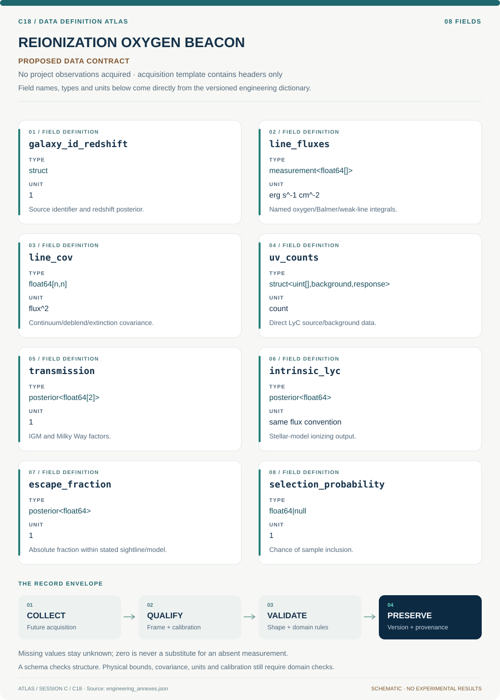

# C18 · Data blueprint

[REIONIZATION OXYGEN BEACON](../README.md) · [Figure gallery](../figures/README.md) · [Data atlas](../../../../data/README.md)

**PROPOSED CONTRACT · 8 fields · no project observations acquired.** The acquisition CSV contains column headers only. The diagram is a visual record specification, not measured data.

| Download | What it contains |
| --- | --- |
| [Acquisition CSV](acquisition.csv) | Empty columns ready for controlled acquisition |
| [Field dictionary](dictionary.csv) | Names, source types, units, meanings and quality rules |
| [JSON Schema](schema.json) | Nullable record structure with unit and quality metadata |

## Field reference

| Field | Type | Unit | Meaning | Quality / missingness |
| --- | --- | --- | --- | --- |
| galaxy_id_redshift | struct | 1 | Source identifier and redshift posterior. | UV contamination counterparts linked. |
| line_fluxes | measurement<float64[]> | erg s^-1 cm^-2 | Named oxygen/Balmer/weak-line integrals. | Line conventions and censoring flags retained. |
| line_cov | float64[n,n] | flux^2 | Continuum/deblend/extinction covariance. | Shared fit terms preserved. |
| uv_counts | struct<uint[],background,response> | count | Direct LyC source/background data. | Poisson count model with exposure and wavelength bounds. |
| transmission | posterior<float64[2]> | 1 | IGM and Milky Way factors. | Between zero and one; very low values imply weak fraction constraints. |
| intrinsic_lyc | posterior<float64> | same flux convention | Stellar-model ionizing output. | SED model and binary/age assumptions recorded. |
| escape_fraction | posterior<float64> | 1 | Absolute fraction within stated sightline/model. | Physical support zero to one; inconsistent data/model flagged. |
| selection_probability | float64&#124;null | 1 | Chance of sample inclusion. | Null prohibits representative population-rate claims. |

## Acquisition and provenance

Null means missing or unknown; record its cause. Preserve product identifier, retrieval timestamp, source hash, calibration, coordinate and time frame, covariance basis, selection rules and every transformation. JSON Schema checks structure; physical bounds and the quality rules above require domain validation.

- [Published low-redshift LyC sample](https://arxiv.org/abs/1805.09865) — archive or acquisition resource; inclusion here does not assert that its data have been retrieved.
- [MAST COS holdings](https://archive.stsci.edu/) — archive or acquisition resource; inclusion here does not assert that its data have been retrieved.

[Controlled data-management procedure](../../../../engineering/DATA_MANAGEMENT.md)
