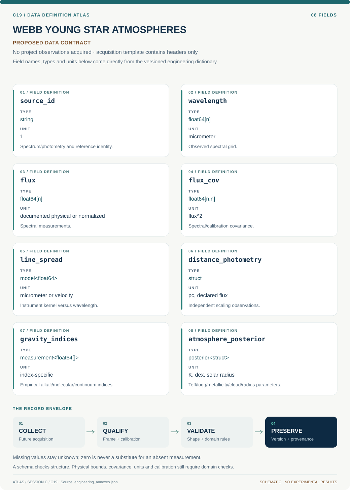

# C19 · Data blueprint

[WEBB YOUNG STAR ATMOSPHERES](../README.md) · [Figure gallery](../figures/README.md) · [Data atlas](../../../../data/README.md)

**PROPOSED CONTRACT · 8 fields · no project observations acquired.** The acquisition CSV contains column headers only. The diagram is a visual record specification, not measured data.

| Download | What it contains |
| --- | --- |
| [Acquisition CSV](acquisition.csv) | Empty columns ready for controlled acquisition |
| [Field dictionary](dictionary.csv) | Names, source types, units, meanings and quality rules |
| [JSON Schema](schema.json) | Nullable record structure with unit and quality metadata |

## Field reference

| Field | Type | Unit | Meaning | Quality / missingness |
| --- | --- | --- | --- | --- |
| source_id | string | 1 | Spectrum/photometry and reference identity. | Duplicate epochs and aliases resolved. |
| wavelength | float64[n] | micrometer | Observed spectral grid. | Air/vacuum and rest/observer frame declared. |
| flux | float64[n] | documented physical or normalized | Spectral measurements. | Normalization type explicit; bad/telluric pixels masked. |
| flux_cov | float64[n,n] | flux^2 | Spectral/calibration covariance. | Shared continuum and model terms stored separately. |
| line_spread | model<float64> | micrometer or velocity | Instrument kernel versus wavelength. | Measured or assumed status required. |
| distance_photometry | struct | pc, declared flux | Independent scaling observations. | Covariance and extinction assumptions retained. |
| gravity_indices | measurement<float64[]> | index-specific | Empirical alkali/molecular/continuum indices. | Window definition/version attached. |
| atmosphere_posterior | posterior<struct> | K, dex, solar radius | Teff/logg/metallicity/cloud/radius parameters. | Grid support and prior dependence reported. |

## Acquisition and provenance

Null means missing or unknown; record its cause. Preserve product identifier, retrieval timestamp, source hash, calibration, coordinate and time frame, covariance basis, selection rules and every transformation. JSON Schema checks structure; physical bounds and the quality rules above require domain validation.

- [SpeX Prism Library](https://www.cass.ucsd.edu/~ajb/browndwarfs/spexprism/library.html) — archive or acquisition resource; inclusion here does not assert that its data have been retrieved.
- [SPLAT modeling documentation](https://splat.physics.ucsd.edu/splat/splat_model.html) — archive or acquisition resource; inclusion here does not assert that its data have been retrieved.

[Controlled data-management procedure](../../../../engineering/DATA_MANAGEMENT.md)
