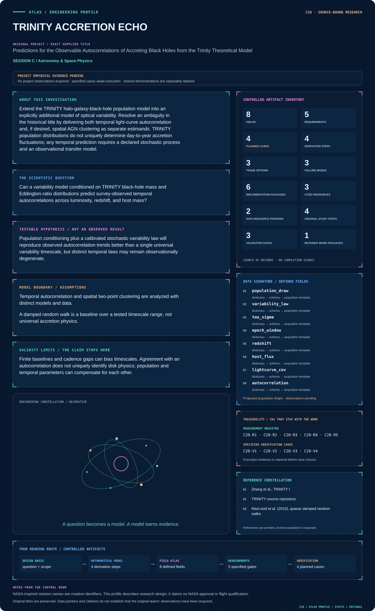
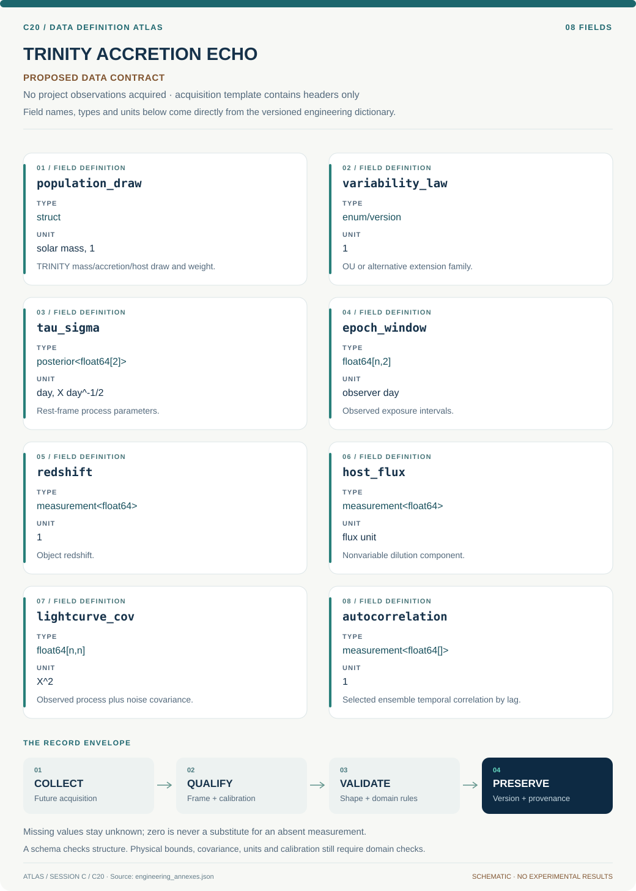

# C20 · TRINITY ACCRETION ECHO

**Original project:** Predictions for the Observable Autocorrelations of Accreting Black Holes from the Trinity Theoretical Model

**Session C:** Astronomy & Space Physics

**Document class:** engineering research design and analysis record · **Revision:** 4 · **Date:** 2026-10-02

**Evidence state:** design basis, mathematical formulation and verification plan documented. Project-specific empirical results remain to be acquired; executable shared model demonstrations have their own recorded checks.

[Session C](../README.md) · [All projects](../../../ENGINEERING_DOCUMENTATION.md) · [Session handbook](../../../handbooks/SESSION_C.md) · [← C19](../C19-webb-young-star-atmospheres/README.md) · [C21 →](../C21-parker-magnetic-trail/README.md)

| Proposed requirements | Specified verification cases | Defined data fields | Cited resources |
| ---: | ---: | ---: | ---: |
| 5 | 4 | 8 | 3 |

[Explore the data blueprint](data/README.md) · [Open the figure gallery](figures/README.md) · [Download acquisition template](data/acquisition.csv) · [Browse the data atlas](../../../data/README.md)

---

## Mission profile

| Profile panel | Engineering signal | Open the evidence |
| --- | --- | --- |
| Mission identity | Predictions for the Observable Autocorrelations of Accreting Black Holes from the Trinity Theoretical Model | [Scientific objective](#purpose-and-scientific-objective) |
| Model cockpit | 4 governing expressions; 4 derivation steps; declared assumptions and validity envelope | [Mathematical formulation](#4-mathematical-model-and-derivation) |
| Data blueprint | 8 proposed fields with types, units and quality rules | [Field map & downloads](data/README.md) |
| Verification queue | 5 proposed requirements; 4 specified cases; project execution evidence pending | [Case definitions](#8-verification-and-validation-cases) |
| Figure wall | Architecture, field map, planned result description | [Open full gallery](figures/README.md) |
| Resource library | 3 cited primary resources with support statements | [Cited resources](#12-cited-technical-and-scientific-resources) |

### Model cockpit

**Analysis method:** Pin a TRINITY code/data release and draw black-hole mass, host, luminosity, and Eddington-ratio populations with their uncertainties. Fit conditional variability amplitudes and timescales on a training light-curve survey using a likelihood that handles irregular cadence. Compare OU, broken-power-spectrum, and multi-timescale stochastic processes. Forward simulate flux-limited target selection, host dilution, redshift, cadence, and noise. Estimate ensemble covariance through likelihood methods rather than interpolating across gaps. Hold out luminosity-redshift bins and a second survey. If spatial autocorrelation is pursued, add halo bias and angular/redshift selection separately.

**Operating envelope:** Finite baselines and cadence gaps can bias timescales. Agreement with an autocorrelation does not uniquely identify disk physics; population and temporal parameters can compensate for each other.

**Variables and conventions**

- X is log flux or magnitude with a declared convention; tau in rest-frame days
- sigma has X units per square-root day; K has X-squared units
- z dimensionless; observed time intervals include cosmological dilation
- W maps latent light curves through cadence, exposure integration, and missing observations
- TRINITY supplies population conditions; the OU/damped-random-walk law is a proposed extension, not a native TRINITY result
- For spatial output, r is comoving Mpc, xi is dimensionless two-point correlation, b_h halo bias, n_h halo mass function, and N_AGN selected occupation; the displayed expression is a large-scale approximation

### Artifact wall

A separately calibrated temporal extension turns population draws into observed autocorrelation; native TRINITY and spatial clustering are not conflated with this module.

**Scientific result to produce:** TRINITY-conditioned population flow into stochastic curves and cadence sampling, with rest-frame and observed covariance comparisons.

### Investigation feed · planned work

The feed records proposed work packages. A row becomes executed evidence only with versioned inputs, outputs and a reviewed result.

| Sequence | Evidence state | Engineering work package |
| --- | --- | --- |
| 01 | Planned | Pin TRINITY population products and posterior provenance. |
| 02 | Planned | Version external conditional variability laws and calibration data. |
| 03 | Planned | Implement exact OU covariance/transition fixtures and alternatives. |
| 04 | Planned | Build redshift/exposure/host/noise selection operator. |
| 05 | Planned | Fit irregular-time likelihood with independent survey splits. |
| 06 | Planned | Publish identifiable lag ranges and separate population/temporal uncertainty budgets. |

### Mission connections

Connections are reading routes based on actual shared resources, supplied sessions or included illustrations. They do not establish physical dependencies, team collaborations or validated results.

| Connected mission | Original investigation | Recorded connection basis |
| --- | --- | --- |
| [C30 · ARTEMIS FIRST HORIZONS](../C30-artemis-first-horizons/README.md) | The Origins of Supermassive Black Holes | Session C; [TRINITY source repository](https://github.com/HaowenZhang/TRINITY) |
| [C19 · WEBB YOUNG STAR ATMOSPHERES](../C19-webb-young-star-atmospheres/README.md) | Characterizing the Atmospheres of Low Surface Gravity M-dwarfs | Session C |
| [C21 · PARKER MAGNETIC TRAIL](../C21-parker-magnetic-trail/README.md) | Identification of Switchback Intervals in Parker Space Probe Data | Session C |
| [C18 · REIONIZATION OXYGEN BEACON](../C18-reionization-oxygen-beacon/README.md) | Characterizing High [OIII]/[OII] and High [OIII] Galaxies to Further LyC Study | Session C |
| [C22 · HUBBLE GALACTIC EXHALE](../C22-hubble-galactic-exhale/README.md) | Measuring Galactic Wind Frequency and Strength as a Function of Environment | Session C |
| [C17 · GEMINI DISK SENTINEL](../C17-gemini-disk-sentinel/README.md) | Investigating the Planet Detection Limit in Debris Disk Images from the Gemini Planet Imager | Session C |

[Machine-readable connection register and ranking rule](../../../registry/mission_connections.json)

### Reading playlist

| Route | Start here | Continue to |
| --- | --- | --- |
| Understand the idea | [Scientific objective](#purpose-and-scientific-objective) | [Design boundary](#1-design-basis-and-analysis-boundary) → [Mathematics](#4-mathematical-model-and-derivation) |
| Inspect the data | [Visual blueprint](data/README.md) | [Provenance](#5-data-specifications-and-provenance) → [Uncertainty](#6-uncertainty-sensitivity-and-identifiability) |
| Make a design decision | [Trade study](#7-engineering-trade-study) | [Failure modes](#10-failure-modes-and-interpretation-controls) → [Required outputs](#11-required-engineering-outputs) |
| Prepare execution | [Requirements](#2-requirements-and-verification-traceability) | [Verification](#8-verification-and-validation-cases) → [Implementation](#9-implementation-and-reproducible-work-packages) |

## Complete engineering dossier

The profile above is a browsing layer. The full design basis, equations, derivations, data contract, uncertainty, trades and controlled case definitions follow.

## Purpose and scientific objective

Extend the TRINITY halo-galaxy-black-hole population model into an explicitly additional model of optical variability. Resolve an ambiguity in the historical title by delivering both temporal light-curve autocorrelation and, if desired, spatial AGN clustering as separate estimands. TRINITY population distributions do not uniquely determine day-to-year accretion fluctuations; any temporal prediction requires a declared stochastic process and an observational transfer model.

**Question:** Can a variability model conditioned on TRINITY black-hole mass and Eddington-ratio distributions predict survey-observed temporal autocorrelations across luminosity, redshift, and host mass?

**Testable hypothesis:** Population conditioning plus a calibrated stochastic variability law will reproduce observed autocorrelation trends better than a single universal variability timescale, but distinct temporal laws may remain observationally degenerate.

## 1. Design basis and analysis boundary

The project adds a stochastic temporal-variability layer to TRINITY population predictions. TRINITY conditions black-hole mass, host and accretion distributions; it does not natively specify day-to-year light curves. Temporal autocorrelation is the primary estimand here. Spatial AGN clustering, if pursued, requires a separate halo-bias/selection calculation and cannot be inferred from this covariance module.

Begin with an OU/damped-random-walk baseline calibrated from independent light curves, then compare multiple-timescale or broken-spectrum processes. The forward system includes redshift dilation, host dilution, irregular cadence, exposure integration, noise and flux-limited selection. A population draw and a temporal-law draw are separately versioned so changes in native TRINITY inputs cannot be confused with changes in the proposed extension.

## 2. Requirements and verification traceability

These are project design requirements or proposed analysis gates. A numerical target is not a NASA requirement unless its controlling source is explicitly identified. “TBD” identifies evidence required before a decision; it is not permission to assume a value. Verification evidence listed here is planned, unless a linked result explicitly records execution.

| ID | Requirement / gate | Engineering rationale | Verification method | Basis / required evidence |
| --- | --- | --- | --- | --- |
| C20-R1 | Temporal process parameters shall be stored outside native TRINITY configuration with explicit extension provenance. | Population predictions do not uniquely define variability. | Manifest and module-boundary audit. | TRINITY repository plus independent DRW study. |
| C20-R2 | Observed lag shall map to rest lag through division by 1+z. | Timescale-redshift trends can be artificial. | Redshifted covariance fixture. | Cosmological dilation relation. |
| C20-R3 | Covariance matrices shall remain positive semidefinite within numerical tolerance. | Invalid kernels produce unstable likelihoods. | Cholesky/eigenvalue and analytic-kernel checks. | Proposed covariance contract. |
| C20-R4 | Irregular-cadence likelihood shall avoid filling gaps with measured-looking samples. | Interpolation biases autocorrelation. | Gap-injection integration fixture. | Proposed cadence requirement. |
| C20-R5 | A second survey or held-out luminosity-redshift region shall test frozen variability laws. | Selection/cadence can imitate physical trends. | Domain holdout and forward-count comparison. | Proposed transferability requirement. |

## 3. Architecture and controlled interfaces

A pinned TRINITY adapter emits population samples with weights and native posterior identifiers. A variability-conditioner maps mass, Eddington ratio, wavelength and host information to externally calibrated temporal parameters. The stochastic generator uses a declared log-flux or magnitude convention. Host light is added in flux space before any magnitude transformation.

A survey operator applies cosmological time dilation, exposure integration, observing windows, noise and selection. The likelihood evaluates covariance directly at observed times rather than interpolating missing epochs. An ensemble autocorrelation module averages over selected population weights and retains between-object variance. An optional spatial branch would ingest halo occupation and bias separately and has no interface to the temporal lag estimator.

A separately calibrated temporal extension turns population draws into observed autocorrelation; native TRINITY and spatial clustering are not conflated with this module.

[Editable engineering diagram source](figures/architecture.mmd)

## 4. Mathematical model and derivation

### Governing equations

$$
dX=-(X-\mu)dt/\tau+\sigma\,dW_t
$$

$$
K(\Delta t)=\sigma_X^2e^{-|\Delta t|/\tau};\quad\sigma_X^2=\sigma^2\tau/2
$$

$$
K_{\rm obs}=\mathcal W\,K_{\rm rest}(\Delta t_{\rm obs}/(1+z))\,\mathcal W^T+\Sigma_{\rm noise}
$$

$$
\xi_{\rm AGN}(r)\simeq b_{\rm eff}^2\xi_m(r);\quad b_{\rm eff}=\int b_h(M)n_h(M)\langle N_{\rm AGN}|M\rangle dM/\int n_h(M)\langle N_{\rm AGN}|M\rangle dM
$$

### Variables, units and conventions

- X is log flux or magnitude with a declared convention; tau in rest-frame days
- sigma has X units per square-root day; K has X-squared units
- z dimensionless; observed time intervals include cosmological dilation
- W maps latent light curves through cadence, exposure integration, and missing observations
- TRINITY supplies population conditions; the OU/damped-random-walk law is a proposed extension, not a native TRINITY result
- For spatial output, r is comoving Mpc, xi is dimensionless two-point correlation, b_h halo bias, n_h halo mass function, and N_AGN selected occupation; the displayed expression is a large-scale approximation

### Assumptions and boundary conditions

- Temporal autocorrelation and spatial two-point clustering are analyzed with distinct models and data.
- A damped random walk is a baseline over a tested timescale range, not universal accretion physics.

### Derivation step 1

$$
dX=-(X-\mu)dt/\tau+\sigma dW_t
$$

X is the declared stochastic observable; sigma has X units per square-root rest-day and tau is positive.

### Derivation step 2

$$
\operatorname{Var}(X)=\sigma_X^2=\sigma^2\tau/2
$$

Setting the stationary variance evolution to zero gives the OU variance, connecting diffusion amplitude to measurable fluctuation amplitude.

### Derivation step 3

$$
K_{rest}(\Delta t)=\sigma_X^2e^{-|\Delta t|/\tau}
$$

Solving the OU conditional mean yields exponential stationary covariance. Its normalized autocorrelation is K divided by sigma_X squared.

### Derivation step 4

$$
K_{obs}=W K_{rest}[\Delta t_{obs}/(1+z)]W^T+\Sigma_{noise}
$$

W performs exposure integration/sampling. For nonlinear flux-to-magnitude or host transformations, generate in flux space instead of assuming this linear covariance formula remains exact.

### Inference or simulation procedure

Pin a TRINITY code/data release and draw black-hole mass, host, luminosity, and Eddington-ratio populations with their uncertainties. Fit conditional variability amplitudes and timescales on a training light-curve survey using a likelihood that handles irregular cadence. Compare OU, broken-power-spectrum, and multi-timescale stochastic processes. Forward simulate flux-limited target selection, host dilution, redshift, cadence, and noise. Estimate ensemble covariance through likelihood methods rather than interpolating across gaps. Hold out luminosity-redshift bins and a second survey. If spatial autocorrelation is pursued, add halo bias and angular/redshift selection separately.

### Validity domain and fidelity limits

Finite baselines and cadence gaps can bias timescales. Agreement with an autocorrelation does not uniquely identify disk physics; population and temporal parameters can compensate for each other.

## 5. Data specifications and provenance

**Proposed data contract · observations pending.** This visual inventory shows the record fields to acquire or derive. It contains no project measurements. [Open the data blueprint and downloads](data/README.md).

| Field | Type | Unit | Physical / statistical meaning | Quality and missing-data rule |
| --- | --- | --- | --- | --- |
| population_draw | struct | solar mass, 1 | TRINITY mass/accretion/host draw and weight. | Native posterior/commit identity attached. |
| variability_law | enum/version | 1 | OU or alternative extension family. | Never labeled native TRINITY time evolution. |
| tau_sigma | posterior<float64[2]> | day, X day^-1/2 | Rest-frame process parameters. | Positive timescale; convention of X explicit. |
| epoch_window | float64[n,2] | observer day | Observed exposure intervals. | Missing epochs absent; time origin/scale recorded. |
| redshift | measurement<float64> | 1 | Object redshift. | Positive 1+z and uncertainty retained. |
| host_flux | measurement<float64> | flux unit | Nonvariable dilution component. | Add in flux space with shared uncertainty. |
| lightcurve_cov | float64[n,n] | X^2 | Observed process plus noise covariance. | PSD and covariance validity checks required. |
| autocorrelation | measurement<float64[]> | 1 | Selected ensemble temporal correlation by lag. | Population weights and lag exposure recorded. |

[Machine-readable record schema](data/schema.json) · [Empty acquisition CSV](data/acquisition.csv) · [Field dictionary CSV](data/dictionary.csv)

The CSV above contains column headers only. Its schema defines future records and does not establish that original-team data or a particular archive product have been acquired. Frame, timing, calibration, covariance, selection and provenance details must accompany populated records.

### TRINITY public repository

[Product, archive or reference](https://github.com/HaowenZhang/TRINITY)

**Fields:** Posterior population products, halo/galaxy/SMBH relations, model configuration

**Access:** Public GPLv3 project; pin commit and inspect product documentation.

**Role:** Population conditioning and uncertainty.

### SDSS Stripe 82 variability study

[Product, archive or reference](https://arxiv.org/abs/1004.0276)

**Fields:** Quasar variability parameters, luminosity and black-hole dependence

**Access:** Open paper; obtain light-curve products through their stated data source before reproduction.

**Role:** Temporal baseline and independent calibration.

## 6. Uncertainty, sensitivity and identifiability

Finite baselines shorter than a relaxation timescale constrain combinations of tau and amplitude more strongly than either individually. Seasonal gaps and survey thresholds preferentially select variable luminous objects. Host dilution and uncertain black-hole masses introduce covariate error. Fit these terms jointly and report timescale posterior truncation or prior dominance.

TRINITY population uncertainty and temporal-law uncertainty are independent design layers, though their parameters can compensate in observed covariance. Perturb each separately and compare ensemble autocorrelation. Use synthetic cadence-preserving recovery to locate the identifiable lag range, then hold out a survey with different cadence. Matching one autocorrelation does not uniquely identify accretion-disk physics; alternative stochastic spectra remain realistic trades.

## 7. Engineering trade study

| Alternative | Benefit | Cost / limitation | Decision rule |
| --- | --- | --- | --- |
| OU process | Exact irregular-time covariance and few parameters. | Single relaxation timescale may fail. | Use baseline over validated lag support. |
| Sum of OU components | Flexible multiple timescales with PSD covariance. | Component amplitudes/timescales can be degenerate. | Adopt when independent-survey prediction improves. |
| Broken-power-spectrum process | Models broader fluctuation structure. | Finite-window spectral leakage and computational cost. | Use with forward cadence modeling and identifiable break frequencies. |

## 8. Verification and validation cases

| Case ID | Stimulus / condition | Expected result / criterion | Method | Evidence artifact |
| --- | --- | --- | --- | --- |
| C20-V1 | OU stationary variance | Long simulated series approaches sigma squared tau/2 within Monte Carlo uncertainty. | Exact OU transition sampler. | Stationary stochastic-process identity. |
| C20-V2 | Zero lag and long lag | Normalized correlation equals one at zero and approaches zero at lags much larger than tau. | Analytic covariance fixture. | OU kernel limits. |
| C20-V3 | Redshift dilation | An observed timescale is multiplied by 1+z for the same rest process. | Matched redshifted cadence simulations. | Time-dilation transformation. |
| C20-V4 | Different-survey holdout | Autocorrelation and selected flux distributions are predicted with frozen extension parameters. | Independent cadence/noise/selection replay. | Proposed temporal-domain validation. |

**Execution status:** these cases are specified, not claimed as executed. Close a case only with the versioned inputs, output, uncertainty, reviewer and pass/fail rationale.

### Additional scientific validation gates

- Test covariance recovery on synthetic curves spanning baseline/timescale ratios and gaps.
- Hold out a second survey and entire parameter bins, reporting predictive log likelihood and covariance residuals.
- Perform ablations using unconditional populations and alternate stochastic laws to expose nonidentifiability.

## 9. Implementation and reproducible work packages

1. Pin TRINITY population products and posterior provenance.
2. Version external conditional variability laws and calibration data.
3. Implement exact OU covariance/transition fixtures and alternatives.
4. Build redshift/exposure/host/noise selection operator.
5. Fit irregular-time likelihood with independent survey splits.
6. Publish identifiable lag ranges and separate population/temporal uncertainty budgets.

### Investigation sequence

1. Declare whether the primary autocorrelation is temporal; freeze optional spatial output as a distinct module.
2. Verify TRINITY product semantics and construct forward population draws.
3. Fit stochastic variability laws with an explicit survey observation operator.
4. Compare survey-level predictions on independent cadence and luminosity/redshift domains.

### Resources and interfaces to expertise

- TRINITY source, Gaussian-process/time-series tools, survey light curves, selection-function expertise.

## 10. Failure modes and interpretation controls

| Failure mode | Effect on result | Detection / evidence | Design response |
| --- | --- | --- | --- |
| Native variability attribution | Unsupported claim about TRINITY. | Extension provenance missing. | Separate population and temporal modules. |
| Gap interpolation | Artificial correlation structure. | Correlation changes with interpolation choice. | Use observed-time likelihood and exposure operator. |
| Host dilution ignored | Biased amplitude trends. | Residual correlates with host fraction. | Add host in flux space and propagate uncertainty. |

- Calling stochastic extensions native TRINITY predictions would overstate the model; interpolation and selection can manufacture autocorrelation trends.

## 11. Required engineering outputs

- Conditional variability extension, survey simulator, observable autocorrelation atlas, and assumption/identifiability report.

### Scientific result figures to produce during execution

TRINITY-conditioned population flow into stochastic curves and cadence sampling, with rest-frame and observed covariance comparisons.

## 12. Cited technical and scientific resources

- [Zhang et al., TRINITY I](https://arxiv.org/abs/2105.10474) — Empirical population connection and model outputs.
- [TRINITY source repository](https://github.com/HaowenZhang/TRINITY) — Code, products, and license.
- [MacLeod et al. (2010), quasar damped random walks](https://arxiv.org/abs/1004.0276) — Temporal stochastic-model precedent.

Framework and evidence rules: [engineering documentation standard](../../../engineering/ENGINEERING_STANDARD.md), [model assurance](../../../engineering/MODEL_ASSURANCE.md), [uncertainty procedure](../../../engineering/UNCERTAINTY_AND_DECISION_RULES.md), [data management](../../../engineering/DATA_MANAGEMENT.md). NASA-inspired names are creative identifiers; requirements and results are not NASA certification.
