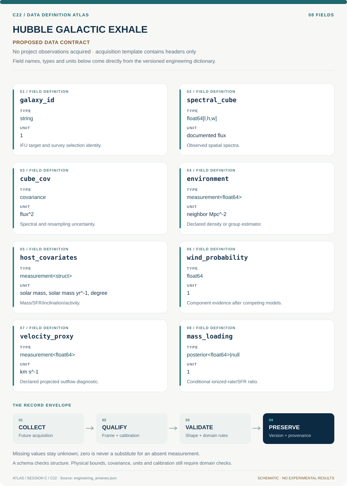

# C22 · Figure gallery

[HUBBLE GALACTIC EXHALE](../README.md) · [Data blueprint](../data/README.md) · [Data diagnostic gallery](../../../../data/figures/README.md)

## Engineering architecture

Competing rotation and detectability models condition wind evidence; environment associations and geometry-dependent mass loading remain separate products.

[SVG](architecture.svg) · [Editable Mermaid source](architecture.mmd)

## Data blueprint

**Proposed contract · observations pending.** Every field, type, unit and meaning comes from the controlled dictionary. [Open SVG](data-map.svg) · [Download dictionary](../data/dictionary.csv)

## Planned scientific result

Environment bins with adjusted incidence/velocity intervals, host-covariate overlap, and linked observed versus rotation-only spectral maps.

This final scientific result remains an execution deliverable; the design diagrams do not establish an empirical finding.
