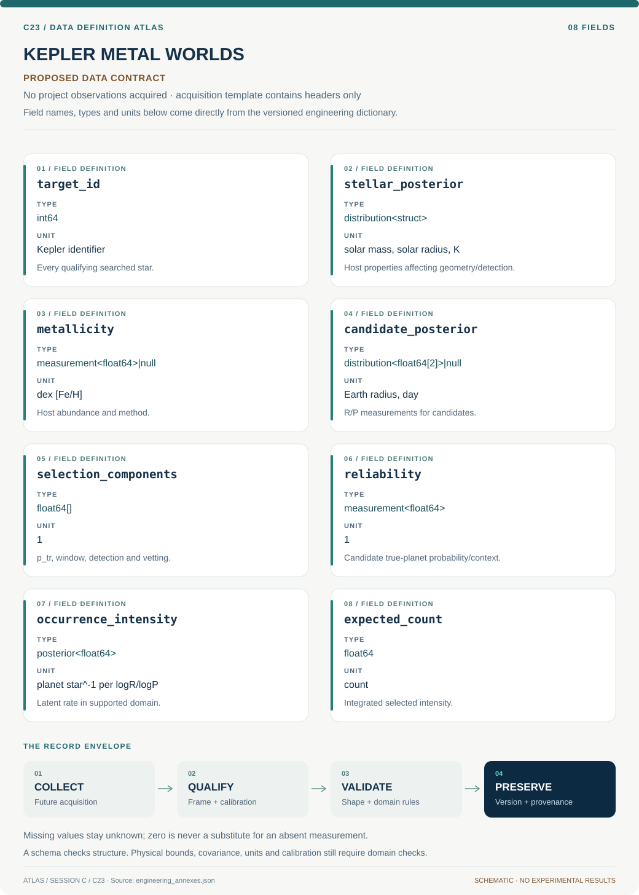

# C23 · Data blueprint

[KEPLER METAL WORLDS](../README.md) · [Figure gallery](../figures/README.md) · [Data atlas](../../../../data/README.md)

**PROPOSED CONTRACT · 8 fields · no project observations acquired.** The acquisition CSV contains column headers only. The diagram is a visual record specification, not measured data.

| Download | What it contains |
| --- | --- |
| [Acquisition CSV](acquisition.csv) | Empty columns ready for controlled acquisition |
| [Field dictionary](dictionary.csv) | Names, source types, units, meanings and quality rules |
| [JSON Schema](schema.json) | Nullable record structure with unit and quality metadata |

## Field reference

| Field | Type | Unit | Meaning | Quality / missingness |
| --- | --- | --- | --- | --- |
| target_id | int64 | Kepler identifier | Every qualifying searched star. | Denominator inclusion/exclusion reason mandatory. |
| stellar_posterior | distribution<struct> | solar mass, solar radius, K | Host properties affecting geometry/detection. | Joint covariance and source version. |
| metallicity | measurement<float64>&#124;null | dex [Fe/H] | Host abundance and method. | Missing state and method-offset group retained. |
| candidate_posterior | distribution<float64[2]>&#124;null | Earth radius, day | R/P measurements for candidates. | No-candidate target is separate from missing measurement. |
| selection_components | float64[] | 1 | p_tr, window, detection and vetting. | Each in [0,1]; no duplicated window factor. |
| reliability | measurement<float64> | 1 | Candidate true-planet probability/context. | False-positive model version required. |
| occurrence_intensity | posterior<float64> | planet star^-1 per logR/logP | Latent rate in supported domain. | Log base and bin/support boundaries explicit. |
| expected_count | float64 | count | Integrated selected intensity. | Quadrature convergence and target count recorded. |

## Acquisition and provenance

Null means missing or unknown; record its cause. Preserve product identifier, retrieval timestamp, source hash, calibration, coordinate and time frame, covariance basis, selection rules and every transformation. JSON Schema checks structure; physical bounds and the quality rules above require domain validation.

- [Kepler completeness/reliability products overview](https://exoplanetarchive.ipac.caltech.edu/docs/Kepler_Data_Products_Overview.html) — archive or acquisition resource; inclusion here does not assert that its data have been retrieved.
- [DR25 simulated data](https://exoplanetarchive.ipac.caltech.edu/docs/KeplerSimulated.html) — archive or acquisition resource; inclusion here does not assert that its data have been retrieved.

[Controlled data-management procedure](../../../../engineering/DATA_MANAGEMENT.md)

## Included evidence to explore

Real NASA Exoplanet Archive snapshot of the first 200 planet names alphabetically among rows with period and radius. Panel A preserves discovery-method categories and logarithmic scales; panel B makes the selected fields and nine missing host-metallicity values visible. This extract is not representative and cannot establish occurrence rates or physical class labels.

[Data atlas: tables, model definitions and provenance](../../../../data/README.md). Shared reduced-model evidence has a narrower domain than this project contract.
