# C24 · APOLLO DUST CLOCK

**Original project:** The long-period orbit of the dust-producing Wolf-Rayet binary WR 125

**Session C:** Astronomy & Space Physics

**Document class:** engineering research design and analysis record · **Revision:** 3 · **Date:** 2026-10-02

**Evidence state:** design basis, mathematical formulation and verification plan documented. Project-specific empirical results remain to be acquired; executable shared model demonstrations have their own recorded checks.

[Session C](../README.md) · [All projects](../../../ENGINEERING_DOCUMENTATION.md) · [Session handbook](../../../handbooks/SESSION_C.md) · [← C23](../C23-kepler-metal-worlds/README.md) · [C25 →](../C25-orion-burst-sentinel/README.md)

| Proposed requirements | Specified verification cases | Defined data fields | Cited resources |
| ---: | ---: | ---: | ---: |
| 5 | 4 | 7 | 2 |

[Explore the data blueprint](data/README.md) · [Open the figure gallery](figures/README.md) · [Download acquisition template](data/acquisition.csv) · [Browse the data atlas](../../../data/README.md)

---

## Purpose and scientific objective

Jointly infer the orbit and episodic dust emission of WR 125 using spectroscopy and infrared photometry. The 2024 study provides a long-period spectroscopic baseline; new work should test its assumptions and predict subsequent evolution rather than retain an outdated unknown-period framing. Allow dust formation to lag or span periastron, because an infrared maximum is not automatically the orbital closest approach.

**Question:** How well can a sparse long-period spectroscopic orbit and infrared dust episodes constrain eccentricity, periastron timing, dust cooling, and formation duration?

**Testable hypothesis:** A joint orbital and dust-response model will predict infrared decline more accurately than exact periastron-triggered bursts and will expose uncertainty caused by wind-line radial velocities.

## 1. Design basis and analysis boundary

The WR 125 system couples a long-period spectroscopic orbit to episodic dust emission. The 2024 primary study supplies the current orbital/dust baseline, with its measurements and priors traced to avoid double use. Infrared peak timing is a response to formation and cooling, not an enforced periastron marker. WR line shifts retain wind-specific nuisance terms.

Begin with a Keplerian comparator and thermal dust SED, then finite-width separation-dependent dust injection and cooling. Sparse multi-decade coverage, line-specific offsets, distance and dust opacity remain uncertainty inputs. A single-lined orbit constrains a mass function rather than individual masses without inclination/companion information. Forecasts target epochs that discriminate remaining orbit and dust-response alternatives.

## 2. Requirements and verification traceability

These are project design requirements or proposed analysis gates. A numerical target is not a NASA requirement unless its controlling source is explicitly identified. “TBD” identifies evidence required before a decision; it is not permission to assume a value. Verification evidence listed here is planned, unless a linked result explicitly records execution.

| ID | Requirement / gate | Engineering rationale | Verification method | Basis / required evidence |
| --- | --- | --- | --- | --- |
| C24-R1 | Spectroscopic and photometric epochs shall use a common declared time scale with exposure provenance. | Long baseline fits still depend on precise phase conventions. | Timestamp/source-table audit. | WR125 primary publication context. |
| C24-R2 | Dust activation lag shall be a fitted or explicitly fixed parameter, never silently equated to periastron. | IR maxima need not mark closest approach. | Lag-zero and finite-lag fixtures. | Proposed response requirement. |
| C24-R3 | Kepler solver residual shall be below 10^-10 radians in the accepted eccentricity range, a proposed target. | Orbital numerical error can contaminate velocity predictions. | Residual and endpoint/eccentricity sweeps. | Proposed numerical target. |
| C24-R4 | Line-specific zero points/jitter shall be retained for WR emission velocities. | Wind changes can mimic orbital shifts. | Alternate-line and season prediction diagnostics. | Existing wind-line caveat. |
| C24-R5 | Dust mass shall include opacity/distance and optical-depth assumptions. | SED normalization alone is degenerate. | Unit, thin/thick and prior-sensitivity audit. | Proposed physical inference contract. |

## 3. Architecture and controlled interfaces

An observation ledger links velocity extraction windows, instrument offsets and infrared passbands to cited epochs. A Kepler solver outputs separation and true anomaly. The velocity module applies shared orbital motion plus line-specific offsets/jitter. The dust module maps separation into a finite formation window, evolves dust temperature/optical depth and predicts filter-integrated flux.

The joint likelihood shares distance and orbital parameters but keeps dust lag/cooling independent of the velocity clock. A provenance gate determines whether the published orbital posterior is used as a prior or a comparison; reusing its observations prohibits independent double weighting. A forecast engine ranks future epochs by discrimination of posterior branches, outputting predicted velocity/color intervals rather than invented observations.

Orbital separation drives a delayed dust response, while velocity and IR measurements constrain different clocks with explicit shared-data accounting.

[Editable engineering diagram source](figures/architecture.mmd)

## 4. Mathematical model and derivation

### Governing equations

$$
v_r(t)=\gamma+K[\cos(\nu(t)+\omega)+e\cos\omega]
$$

$$
M=E-e\sin E=2\pi(t-T_0)/P
$$

$$
F_\nu(t)=F_{\nu,*}+M_d(t)\kappa_\nu B_\nu[T_d(t)]/D^2
$$

### Variables, units and conventions

- P and T0 in years or days with consistent barycentric timing
- Vr, gamma, and K in km s^-1; e dimensionless; angles in radians
- Dust mass Md in g; opacity kappa in cm^2 g^-1; Td in K
- Flux density in Jy after unit conversion; distance D in cm
- Dust-source optical depth and stellar continuum are checked before assuming optically thin emission

### Assumptions and boundary conditions

- WR emission-line shifts can carry wind-structure systematics; allow line-specific zero points and jitter.
- Infrared burst timing constrains dust response and orbital phase jointly rather than enforcing equality to periastron.

### Derivation step 1

$$
M=2\pi(t-T_0)/P=E-e\sin E
$$

Mean anomaly is periodic in the common time unit. Solve eccentric anomaly E with safeguarded iteration for the stated e range.

### Derivation step 2

$$
r=a(1-e\cos E),\quad\tan(\nu/2)=\sqrt{(1+e)/(1-e)}\tan(E/2)
$$

Use quadrant-safe conversion for true anomaly; this connects orbital phase to separation-dependent dust activation.

### Derivation step 3

$$
v_r=\gamma+K[\cos(\nu+\omega)+e\cos\omega]
$$

The line-of-sight model uses the declared sign convention and line-specific additive nuisance offsets.

### Derivation step 4

$$
F_\nu=F_{\nu,*}+M_d\kappa_\nu B_\nu(T_d)/D^2
$$

For optically thin dust under the standard isotropic emissivity convention, mass times opacity times Planck intensity divided by distance squared gives spectral flux; integrate through each band and check optical depth.

### Inference or simulation procedure

Reconstruct a source-cited radial-velocity and multiband photometry table, including nondetections and instrument offsets. Fit Keplerian orbital motion with robust likelihoods and wind-line nuisance terms. Link dust injection to separation using a finite-width activation function and uncertain lag, then evolve temperature and optical depth through a physically motivated expansion/cooling model. Compare single-temperature dust with broader temperature distributions. Use the documented 2024 orbital solution as an external comparison or prior, with clear accounting if the same measurements are reused. Forecast epochs whose velocities or infrared colors discriminate remaining orbital solutions.

### Validity domain and fidelity limits

A single-lined orbit does not determine individual masses without inclination and companion information. Dust opacity, distance, and temperature can trade off with mass; sparse multi-decade coverage can leave aliases.

## 5. Data specifications and provenance

**Proposed data contract · observations pending.** This visual inventory shows the record fields to acquire or derive. It contains no project measurements. [Open the data blueprint and downloads](data/README.md).

| Field | Type | Unit | Physical / statistical meaning | Quality and missing-data rule |
| --- | --- | --- | --- | --- |
| epoch | float64 | BJD or declared day | Measurement time in common system. | Original clock and conversion retained. |
| radial_velocity | measurement<float64> | km s^-1 | Line-derived WR velocity. | Line definition, instrument and wind-jitter group attached. |
| infrared_flux | measurement<float64>&#124;limit | Jy | Passband-integrated observation. | Nondetection censoring and response curve retained. |
| measurement_cov | float64[n,n] | mixed declared | Instrument/common-calibration covariance. | Shared zero points and photometric scales explicit. |
| orbital_parameters | posterior<struct> | day, km s^-1, radian | P,T0,K,e,omega,gamma. | e in [0,1); multimodal aliases retained. |
| dust_parameters | posterior<struct> | g, K, cm^2 g^-1, day | Mass, temperature, opacity and activation lag. | Mass/opacity degeneracy reported. |
| forecast | distribution<struct> | day, km s^-1, Jy | Future velocity/IR color predictions. | No forecast row labeled observation. |

[Machine-readable record schema](data/schema.json) · [Empty acquisition CSV](data/acquisition.csv) · [Field dictionary CSV](data/dictionary.csv)

The CSV above contains column headers only. Its schema defines future records and does not establish that original-team data or a particular archive product have been acquired. Frame, timing, calibration, covariance, selection and provenance details must accompany populated records.

### WR125 2024 orbital/dust publication

[Product, archive or reference](https://arxiv.org/abs/2405.10454)

**Fields:** Velocity and photometry epochs, orbital solution, infrared SED constraints

**Access:** Open paper; inspect associated tables and spectra availability.

**Role:** Current target-specific baseline.

### WR125 earlier multiwavelength campaign

[Product, archive or reference](https://arxiv.org/abs/2109.12365)

**Fields:** Infrared/X-ray epochs, archival comparisons, recurring dust event

**Access:** Open publication; obtain original instrument products where accessible.

**Role:** Independent-era observational context.

## 6. Uncertainty, sensitivity and identifiability

Period, eccentricity and periastron epoch can trade off under sparse long-baseline coverage. Instrument zero points and wind-line jitter add correlated uncertainty across seasons. Retain orbital aliases and compare different line subsets instead of selecting one narrow posterior from a flexible jitter fit.

Dust mass covaries with opacity, distance and temperature; formation duration and cooling lag can move the infrared maximum independently of periastron. Use multiband colors to improve temperature identification and compare one-temperature with distributed-temperature models. Test optical-depth sensitivity and source-continuum subtraction. Forecast information gain should account for these covariances so proposed observations distinguish real alternatives rather than only reduce a well-constrained nuisance term.

## 7. Engineering trade study

| Alternative | Benefit | Cost / limitation | Decision rule |
| --- | --- | --- | --- |
| Orbit plus empirical IR curve | Simple separate clocks. | Weak physical dust interpretation. | Use baseline for period/lag exploration. |
| Optically thin single-temperature dust | Interpretable SED normalization/color. | Mass-opacity and temperature-distribution ambiguity. | Use where optical-depth checks and held-out colors pass. |
| Finite-formation/cooling model | Predicts lag and color evolution. | More geometry/opacity assumptions. | Adopt only with independent-era prediction improvement. |

## 8. Verification and validation cases

| Case ID | Stimulus / condition | Expected result / criterion | Method | Evidence artifact |
| --- | --- | --- | --- | --- |
| C24-V1 | Circular orbit | For e=0, separation is constant and velocity is a sinusoid under fixed orientation. | Analytic orbital fixture. | Kepler limit. |
| C24-V2 | Kepler equation closure | Computed E satisfies E-e sin E=M within proposed tolerance. | Eccentricity/phase grid and solver residual. | Declared numerical target. |
| C24-V3 | Dust scaling | At fixed T and opacity, doubling mass doubles excess flux and doubling distance quarters it. | Noise-free SED fixture. | Optically thin flux equation. |
| C24-V4 | Independent era | Velocity and multiband dust predictions are compared with withheld campaign data. | Freeze orbit/dust choices before era holdout. | Proposed temporal validation. |

**Execution status:** these cases are specified, not claimed as executed. Close a case only with the versioned inputs, output, uncertainty, reviewer and pass/fail rationale.

### Additional scientific validation gates

- Hold out an entire infrared epoch series and predict color and flux evolution.
- Fit one dust episode and predict the other with propagated period uncertainty.
- Check residual line dependence and compare orbit conclusions under alternative wind jitter and dust-lag priors.

## 9. Implementation and reproducible work packages

1. Build source-cited velocity/IR table with timing/passbands.
2. Implement safeguarded Kepler and line-specific velocity model.
3. Create dust activation/cooling and response-integrated SED modules.
4. Enforce published-data prior/comparator provenance gate.
5. Fit orbit/dust aliases and independent-era holdouts.
6. Publish covariance-aware future epoch predictions and dust-model sensitivity.

### Investigation sequence

1. Audit repeated measurements and coordinate/time conventions across decades.
2. Fit spectroscopic orbit before introducing uncertain dust-phase coupling.
3. Fit dust cooling and formation duration with multi-instrument photometric offsets.
4. Produce posterior forecasts and expected information gain for future spectroscopy and infrared observing.

### Resources and interfaces to expertise

- Binary-orbit sampler, infrared SED tools, spectroscopy and WR-wind expertise, archival photometry.

## 10. Failure modes and interpretation controls

| Failure mode | Effect on result | Detection / evidence | Design response |
| --- | --- | --- | --- |
| IR maximum fixed to periastron | Biased orbit/lag interpretation. | Velocity fit conflicts with dust timing. | Fit finite dust response separately. |
| Published posterior double counted | Overprecise orbital constraints. | Source-overlap provenance audit. | Use posterior as prior or observations once, not both. |
| Wind variability treated as orbit | False eccentricity/phase shifts. | Line/season residual inconsistency. | Line-specific jitter and alternate-line tests. |

- Assuming infrared maximum equals periastron can overconstrain the orbit; systematic wind-line shifts may dominate formal errors.

## 11. Required engineering outputs

- Orbit and dust posterior atlas, data-provenance ledger, future-epoch predictions, and observing priorities.

### Scientific result figures to produce during execution

Multi-decade radial velocities and infrared outbursts with joint posterior orbit, dust-response lag, and forecast uncertainty.

## 12. Cited technical and scientific resources

- [Richardson et al. (2024), WR125 orbit and dust](https://arxiv.org/abs/2405.10454) — Current orbital and infrared baseline.
- [Arora et al. (2021), WR125 campaign](https://arxiv.org/abs/2109.12365) — Earlier infrared and high-energy context.

Framework and evidence rules: [engineering documentation standard](../../../engineering/ENGINEERING_STANDARD.md), [model assurance](../../../engineering/MODEL_ASSURANCE.md), [uncertainty procedure](../../../engineering/UNCERTAINTY_AND_DECISION_RULES.md), [data management](../../../engineering/DATA_MANAGEMENT.md). NASA-inspired names are creative identifiers; requirements and results are not NASA certification.
