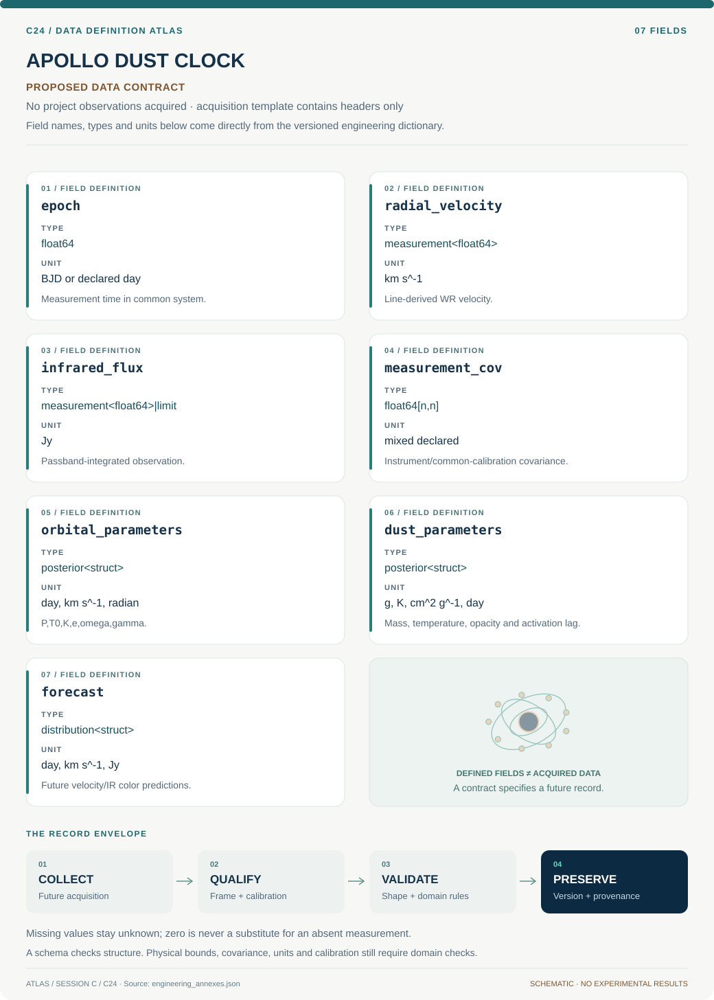

# C24 · Data blueprint

[APOLLO DUST CLOCK](../README.md) · [Figure gallery](../figures/README.md) · [Data atlas](../../../../data/README.md)

**PROPOSED CONTRACT · 7 fields · no project observations acquired.** The acquisition CSV contains column headers only. The diagram is a visual record specification, not measured data.

| Download | What it contains |
| --- | --- |
| [Acquisition CSV](acquisition.csv) | Empty columns ready for controlled acquisition |
| [Field dictionary](dictionary.csv) | Names, source types, units, meanings and quality rules |
| [JSON Schema](schema.json) | Nullable record structure with unit and quality metadata |

## Field reference

| Field | Type | Unit | Meaning | Quality / missingness |
| --- | --- | --- | --- | --- |
| epoch | float64 | BJD or declared day | Measurement time in common system. | Original clock and conversion retained. |
| radial_velocity | measurement<float64> | km s^-1 | Line-derived WR velocity. | Line definition, instrument and wind-jitter group attached. |
| infrared_flux | measurement<float64>&#124;limit | Jy | Passband-integrated observation. | Nondetection censoring and response curve retained. |
| measurement_cov | float64[n,n] | mixed declared | Instrument/common-calibration covariance. | Shared zero points and photometric scales explicit. |
| orbital_parameters | posterior<struct> | day, km s^-1, radian | P,T0,K,e,omega,gamma. | e in [0,1); multimodal aliases retained. |
| dust_parameters | posterior<struct> | g, K, cm^2 g^-1, day | Mass, temperature, opacity and activation lag. | Mass/opacity degeneracy reported. |
| forecast | distribution<struct> | day, km s^-1, Jy | Future velocity/IR color predictions. | No forecast row labeled observation. |

## Acquisition and provenance

Null means missing or unknown; record its cause. Preserve product identifier, retrieval timestamp, source hash, calibration, coordinate and time frame, covariance basis, selection rules and every transformation. JSON Schema checks structure; physical bounds and the quality rules above require domain validation.

- [WR125 2024 orbital/dust publication](https://arxiv.org/abs/2405.10454) — archive or acquisition resource; inclusion here does not assert that its data have been retrieved.
- [WR125 earlier multiwavelength campaign](https://arxiv.org/abs/2109.12365) — archive or acquisition resource; inclusion here does not assert that its data have been retrieved.

[Controlled data-management procedure](../../../../engineering/DATA_MANAGEMENT.md)
