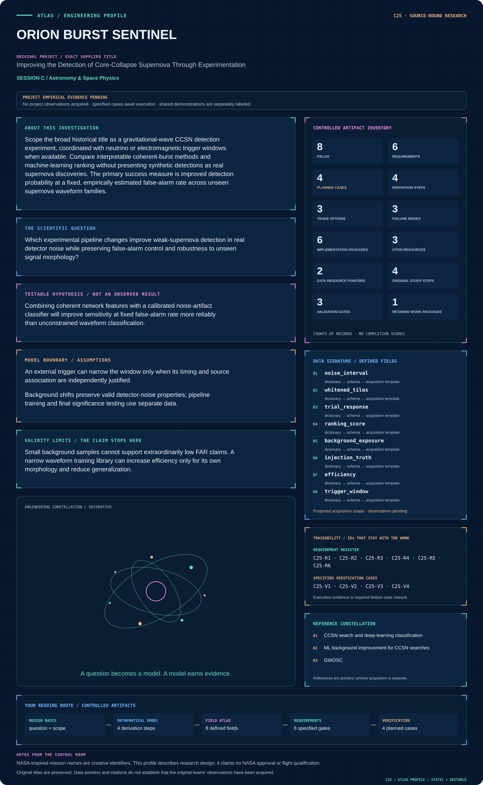
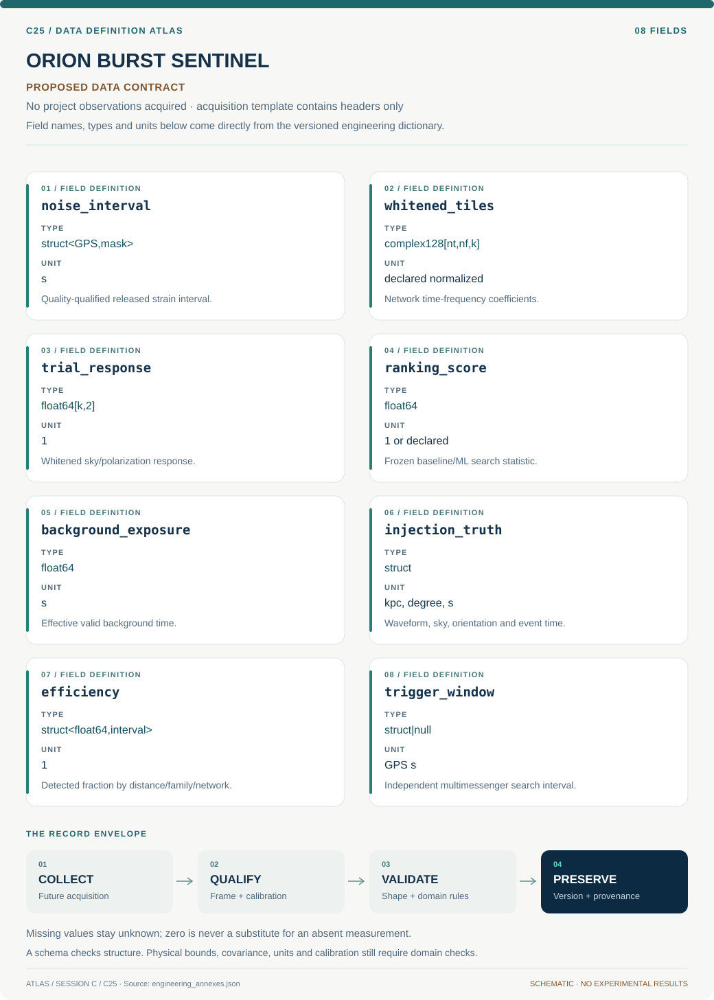

# C25 · ORION BURST SENTINEL

**Original project:** Improving the Detection of Core-Collapse Supernova Through Experimentation

**Session C:** Astronomy & Space Physics

**Document class:** engineering research design and analysis record · **Revision:** 4 · **Date:** 2026-10-02

**Evidence state:** design basis, mathematical formulation and verification plan documented. Project-specific empirical results remain to be acquired; executable shared model demonstrations have their own recorded checks.

[Session C](../README.md) · [All projects](../../../ENGINEERING_DOCUMENTATION.md) · [Session handbook](../../../handbooks/SESSION_C.md) · [← C24](../C24-apollo-dust-clock/README.md) · [C26 →](../C26-lisa-pendulum-pathfinder/README.md)

| Proposed requirements | Specified verification cases | Defined data fields | Cited resources |
| ---: | ---: | ---: | ---: |
| 6 | 4 | 8 | 3 |

[Explore the data blueprint](data/README.md) · [Open the figure gallery](figures/README.md) · [Download acquisition template](data/acquisition.csv) · [Browse the data atlas](../../../data/README.md)

---

## Mission profile

| Profile panel | Engineering signal | Open the evidence |
| --- | --- | --- |
| Mission identity | Improving the Detection of Core-Collapse Supernova Through Experimentation | [Scientific objective](#purpose-and-scientific-objective) |
| Model cockpit | 3 governing expressions; 4 derivation steps; declared assumptions and validity envelope | [Mathematical formulation](#4-mathematical-model-and-derivation) |
| Data blueprint | 8 proposed fields with types, units and quality rules | [Field map & downloads](data/README.md) |
| Verification queue | 6 proposed requirements; 4 specified cases; project execution evidence pending | [Case definitions](#8-verification-and-validation-cases) |
| Figure wall | Architecture, field map, planned result description | [Open full gallery](figures/README.md) |
| Resource library | 3 cited primary resources with support statements | [Cited resources](#12-cited-technical-and-scientific-resources) |

### Model cockpit

**Analysis method:** Use a fixed coherent-burst baseline with network timing, polarization, and null-stream diagnostics. Propose one change at a time: time-frequency clustering, morphology features, denoising, or artifact-aware ranking. Estimate background using independent noise and justified time shifts; inject physically diverse CCSN polarizations into untouched strain. Calibrate ML scores on validation noise rather than interpreting raw scores as probabilities. Preregister efficiency and FAR reporting, computational latency, and fail-safe behavior under missing detectors. Compare performance with and without a justified neutrino trigger window.

**Operating envelope:** Small background samples cannot support extraordinarily low FAR claims. A narrow waveform training library can increase efficiency only for its own morphology and reduce generalization.

**Variables and conventions**

- Whitened network data d use a documented noise PSD and time-frequency normalization
- Coherent and null energies are dimensionless ranking components, not direct radiated energy
- FAR in events per unit time; Ton is the independently justified on-source window
- Detection efficiency is dimensionless and indexed by distance, orientation, waveform family, and network
- P_signal projects onto detector responses for a trial sky location; sky-search trials are included in background

### Artifact wall

Background sets the decision threshold before held-out efficiency is measured; trigger timing and finite exposure constrain significance separately.

**Scientific result to produce:** Detection efficiency versus distance at common FAR, ablation comparisons, coherent/null feature maps, and background-exposure limits.

### Investigation feed · planned work

The feed records proposed work packages. A row becomes executed evidence only with versioned inputs, outputs and a reviewed result.

| Sequence | Evidence state | Engineering work package |
| --- | --- | --- |
| 01 | Planned | Freeze released-noise and physical-family partitions. |
| 02 | Planned | Implement whitened network projector/coherent-null fixtures. |
| 03 | Planned | Build valid-interval background and trial accounting. |
| 04 | Planned | Calibrate frozen thresholds for each network configuration. |
| 05 | Planned | Run paired unseen-family efficiency and latency replays. |
| 06 | Planned | Publish finite-FAR confidence limits, trigger provenance and dropout behavior. |

### Mission connections

Connections are reading routes based on actual shared resources, supplied sessions or included illustrations. They do not establish physical dependencies, team collaborations or validated results.

| Connected mission | Original investigation | Recorded connection basis |
| --- | --- | --- |
| [C11 · ORION CORE INFERENCE](../C11-orion-core-inference/README.md) | Evaluation of Supernovae Astrophysical Parameters by Using Machine Learning on Laser Interferometric Data | Session C; [GWOSC](https://gwosc.org/) |
| [C24 · APOLLO DUST CLOCK](../C24-apollo-dust-clock/README.md) | The long-period orbit of the dust-producing Wolf-Rayet binary WR 125 | Session C |
| [C26 · LISA PENDULUM PATHFINDER](../C26-lisa-pendulum-pathfinder/README.md) | Low Frequency Prototype of Laser Interferometer Suspensions for Gravitational Wave Detection | Session C |
| [C23 · KEPLER METAL WORLDS](../C23-kepler-metal-worlds/README.md) | Investigating the Relationship Between Exoplanet Occurrence & Host Star Metallicity | Session C |
| [C27 · SPHEREX COSMIC PRISM](../C27-spherex-cosmic-prism/README.md) | SPHEREx: The Future of Satellite Astronomy | Session C |
| [C22 · HUBBLE GALACTIC EXHALE](../C22-hubble-galactic-exhale/README.md) | Measuring Galactic Wind Frequency and Strength as a Function of Environment | Session C |

[Machine-readable connection register and ranking rule](../../../registry/mission_connections.json)

### Reading playlist

| Route | Start here | Continue to |
| --- | --- | --- |
| Understand the idea | [Scientific objective](#purpose-and-scientific-objective) | [Design boundary](#1-design-basis-and-analysis-boundary) → [Mathematics](#4-mathematical-model-and-derivation) |
| Inspect the data | [Visual blueprint](data/README.md) | [Provenance](#5-data-specifications-and-provenance) → [Uncertainty](#6-uncertainty-sensitivity-and-identifiability) |
| Make a design decision | [Trade study](#7-engineering-trade-study) | [Failure modes](#10-failure-modes-and-interpretation-controls) → [Required outputs](#11-required-engineering-outputs) |
| Prepare execution | [Requirements](#2-requirements-and-verification-traceability) | [Verification](#8-verification-and-validation-cases) → [Implementation](#9-implementation-and-reproducible-work-packages) |

## Complete engineering dossier

The profile above is a browsing layer. The full design basis, equations, derivations, data contract, uncertainty, trades and controlled case definitions follow.

## Purpose and scientific objective

Scope the broad historical title as a gravitational-wave CCSN detection experiment, coordinated with neutrino or electromagnetic trigger windows when available. Compare interpretable coherent-burst methods and machine-learning ranking without presenting synthetic detections as real supernova discoveries. The primary success measure is improved detection probability at a fixed, empirically estimated false-alarm rate across unseen supernova waveform families.

**Question:** Which experimental pipeline changes improve weak-supernova detection in real detector noise while preserving false-alarm control and robustness to unseen signal morphology?

**Testable hypothesis:** Combining coherent network features with a calibrated noise-artifact classifier will improve sensitivity at fixed false-alarm rate more reliably than unconstrained waveform classification.

## 1. Design basis and analysis boundary

The CCSN detection experiment compares coherent burst ranking changes at a fixed empirical false-alarm rate. Inputs are physical polarization waveforms, released network noise, detector quality and optional independently justified multimessenger windows. Synthetic injections are performance tests, not supernova discoveries. A physical-parameter estimator is downstream and cannot define the detection score after looking at test truth.

Begin with whitened network coherence/null energy, then one preregistered ranking modification at a time. Training noise, validation background and final holdout intervals are distinct. Search sky trials, missing detectors and trigger timing enter the background experiment. An external trigger reduces the time window only with independently documented timing/source association. Small background samples produce limits rather than extraordinarily low FAR claims.

## 2. Requirements and verification traceability

These are project design requirements or proposed analysis gates. A numerical target is not a NASA requirement unless its controlling source is explicitly identified. “TBD” identifies evidence required before a decision; it is not permission to assume a value. Verification evidence listed here is planned, unless a linked result explicitly records execution.

| ID | Requirement / gate | Engineering rationale | Verification method | Basis / required evidence |
| --- | --- | --- | --- | --- |
| C25-R1 | Pipeline comparisons shall use the same frozen false-alarm-rate target and background intervals. | Higher efficiency at a looser threshold is not improvement. | Paired ranking/threshold provenance audit. | Proposed controlled comparison. |
| C25-R2 | Signal/background test partitions shall exclude training physical waveforms and noise epochs. | Morphology and glitch leakage inflate performance. | Simulation/noise hash split audit. | Proposed independent testing. |
| C25-R3 | Network timing, polarization and searched sky trials shall enter both injections and background. | Incorrect trials underestimate false alarms. | Known-sky and sky-grid replay. | Existing coherent-burst observation model. |
| C25-R4 | FAR estimates shall include finite-background confidence limits and effective live time. | Zero background events do not imply zero FAR. | Poisson-limit fixture and dependent-shift audit. | Proposed statistical requirement. |
| C25-R5 | Latency shall be reported as median and 95th percentile on a declared machine, a proposed reporting target. | Average runtime hides processing backlog. | Replay timing with input/configuration manifest. | Proposed operational measurement. |
| C25-R6 | Missing-detector configurations shall either use separately calibrated thresholds or abstain. | Network rank/coherence changes with availability. | Detector-dropout replay. | Proposed fail-safe interface. |

## 3. Architecture and controlled interfaces

The released-strain adapter produces quality-qualified time-frequency tiles and locally estimated PSDs. A network projector maps trial sky/polarization responses into whitened detector space. A coherent baseline computes signal-subspace and null energies; an optional ML ranker receives only declared features. Time-shift/background generation respects valid intervals and stores the effective analyzed exposure.

An injection engine supplies unseen physical families with distance/orientation draws. A threshold calibrator fits on validation background and is frozen before final efficiency measurement. The reporting module joins detections with injected truth, background counts and latency traces. Trigger-window metadata enter as an independent boundary, never as a learned shortcut to synthetic truth.

Background sets the decision threshold before held-out efficiency is measured; trigger timing and finite exposure constrain significance separately.

[Editable engineering diagram source](figures/architecture.mmd)

## 4. Mathematical model and derivation

### Governing equations

$$
d_k=F_k^+h_++F_k^\times h_\times+n_k
$$

$$
\rho_{\rm coh}^2=\mathbf d^\dagger\mathbf P_{\rm signal}\mathbf d;\quad E_{\rm null}=\mathbf d^\dagger(\mathbf I-\mathbf P_{\rm signal})\mathbf d
$$

$$
\mathrm{FAP}=1-e^{-\mathrm{FAR}\,T_{\rm on}}
$$

### Variables, units and conventions

- Whitened network data d use a documented noise PSD and time-frequency normalization
- Coherent and null energies are dimensionless ranking components, not direct radiated energy
- FAR in events per unit time; Ton is the independently justified on-source window
- Detection efficiency is dimensionless and indexed by distance, orientation, waveform family, and network
- P_signal projects onto detector responses for a trial sky location; sky-search trials are included in background

### Assumptions and boundary conditions

- An external trigger can narrow the window only when its timing and source association are independently justified.
- Background shifts preserve valid detector-noise properties; pipeline training and final significance testing use separate data.

### Derivation step 1

$$
F_w=S_n^{-1/2}F,\quad P=F_w(F_w^\dagger F_w)^+F_w^\dagger
$$

Whitened antenna matrix Fw defines a Hermitian signal projector; the pseudoinverse handles deficient polarization rank.

### Derivation step 2

$$
E_{coh}=d^\dagger Pd,\quad E_{null}=d^\dagger(I-P)d
$$

Both energies are dimensionless under the chosen tile normalization. Signal and null subspaces partition total whitened energy.

### Derivation step 3

$$
\mathrm{FAR}=N_{bg}/T_{bg},\quad\mathrm{FAP}=1-e^{-\mathrm{FAR}T_{on}}
$$

The conversion assumes a Poisson stationary background after all search trials; nonstationarity requires stratified or empirical treatment.

### Derivation step 4

$$
N_{bg}=0\Rightarrow\mathrm{FAR}_{95}=-\ln(0.05)/T_{bg}
$$

The one-sided Poisson upper limit shows finite observation cannot establish zero rate. Tbg must reflect justified effective exposure, not blindly multiplied correlated shifts. The zero-count calculation is a one-sided 95% Poisson rate upper limit, not a measured nonzero background rate.

### Inference or simulation procedure

Use a fixed coherent-burst baseline with network timing, polarization, and null-stream diagnostics. Propose one change at a time: time-frequency clustering, morphology features, denoising, or artifact-aware ranking. Estimate background using independent noise and justified time shifts; inject physically diverse CCSN polarizations into untouched strain. Calibrate ML scores on validation noise rather than interpreting raw scores as probabilities. Preregister efficiency and FAR reporting, computational latency, and fail-safe behavior under missing detectors. Compare performance with and without a justified neutrino trigger window.

### Validity domain and fidelity limits

Small background samples cannot support extraordinarily low FAR claims. A narrow waveform training library can increase efficiency only for its own morphology and reduce generalization.

## 5. Data specifications and provenance

**Proposed data contract · observations pending.** This visual inventory shows the record fields to acquire or derive. It contains no project measurements. [Open the data blueprint and downloads](data/README.md).

| Field | Type | Unit | Physical / statistical meaning | Quality and missing-data rule |
| --- | --- | --- | --- | --- |
| noise_interval | struct<GPS,mask> | s | Quality-qualified released strain interval. | Training/validation/test role immutable. |
| whitened_tiles | complex128[nt,nf,k] | declared normalized | Network time-frequency coefficients. | PSD/window conventions and gap masks required. |
| trial_response | float64[k,2] | 1 | Whitened sky/polarization response. | Condition number and network rank recorded. |
| ranking_score | float64 | 1 or declared | Frozen baseline/ML search statistic. | Threshold/model version attached. |
| background_exposure | float64 | s | Effective valid background time. | Shift dependence and exclusions documented. |
| injection_truth | struct | kpc, degree, s | Waveform, sky, orientation and event time. | Physical-family split key required. |
| efficiency | struct<float64,interval> | 1 | Detected fraction by distance/family/network. | N/k and grouped uncertainty retained. |
| trigger_window | struct&#124;null | GPS s | Independent multimessenger search interval. | Null gives untriggered search; association provenance mandatory. |

[Machine-readable record schema](data/schema.json) · [Empty acquisition CSV](data/acquisition.csv) · [Field dictionary CSV](data/dictionary.csv)

The CSV above contains column headers only. Its schema defines future records and does not establish that original-team data or a particular archive product have been acquired. Frame, timing, calibration, covariance, selection and provenance details must accompany populated records.

### GWOSC strain

[Product, archive or reference](https://gwosc.org/)

**Fields:** Strain segments, sample rate, detector quality, released metadata

**Access:** Public released data; segregate training, background, and blind test intervals.

**Role:** Realistic noise and background.

### CCSN deep-learning search study

[Product, archive or reference](https://arxiv.org/abs/2001.00279)

**Fields:** Signal families, noise-artifact tests, classification design

**Access:** Open publication; inspect waveform and code availability.

**Role:** Detection-method comparator.

## 6. Uncertainty, sensitivity and identifiability

PSD drift and non-Gaussian glitches alter coherent/null ranking and background stationarity. Time shifts can share data and are not unlimited independent exposure. Quantify effective background by noise regime and report finite counts with confidence limits. Sky-grid and clustering trials affect event-rate normalization and must be identical across compared methods.

Physical waveform families, orientation and distance determine efficiency uncertainty. Whole families are held out; noise variants of one waveform are correlated scientific tests. Ranker calibration can change under detector dropout or unseen glitches, so evaluate each network separately. Trigger-window uncertainty propagates into FAP; it does not increase intrinsic detector sensitivity.

## 7. Engineering trade study

| Alternative | Benefit | Cost / limitation | Decision rule |
| --- | --- | --- | --- |
| Coherent/null baseline | Transparent network consistency. | Glitch morphology remains difficult. | Use required reference pipeline. |
| Feature-based ML ranking | Can reject recurring artifacts. | Training-domain and calibration risk. | Adopt only at matched FAR on unseen noise/families. |
| Externally triggered search | Smaller justified time/sky trials. | Requires reliable independent association. | Use only with documented trigger information. |

## 8. Verification and validation cases

| Case ID | Stimulus / condition | Expected result / criterion | Method | Evidence artifact |
| --- | --- | --- | --- | --- |
| C25-V1 | Projector identities | P squared equals P and coherent plus null energy equals total energy. | Analytic full-rank/rank-deficient matrices. | Orthogonal projection identities. |
| C25-V2 | No background events | Upper FAR bound is finite and scales inversely with exposure. | Poisson k=0 fixture. | Declared 95% count limit. |
| C25-V3 | Detector dropout | Pipeline uses recalibrated rank/threshold or emits unsupported configuration. | Synthetic missing detector stream. | Declared availability contract. |
| C25-V4 | Unseen family/noise | Efficiency at frozen FAR and latency are reported without retuning. | Independent physical and noise holdouts. | Proposed detection validation. |

**Execution status:** these cases are specified, not claimed as executed. Close a case only with the versioned inputs, output, uncertainty, reviewer and pass/fail rationale.

### Additional scientific validation gates

- Hold out hydrodynamics codes and detector-noise epochs, plus realistic glitches.
- Compare efficiency at the same FAR and confidence interval; report unmeasurable low-FAR regimes explicitly.
- Use independent blind signal injections and noise-only trials; audit detector and waveform label leakage.

## 9. Implementation and reproducible work packages

1. Freeze released-noise and physical-family partitions.
2. Implement whitened network projector/coherent-null fixtures.
3. Build valid-interval background and trial accounting.
4. Calibrate frozen thresholds for each network configuration.
5. Run paired unseen-family efficiency and latency replays.
6. Publish finite-FAR confidence limits, trigger provenance and dropout behavior.

### Investigation sequence

1. Freeze baseline, waveform-family split, search trials, trigger-window conventions, and FAR targets.
2. Benchmark baseline latency and false alarms before tuning changes.
3. Run controlled ablations and blind injections through the full pipeline.
4. Release improvement curves with uncertainties and observed background exposure, including failure domains.

### Resources and interfaces to expertise

- Coherent burst implementation, GWpy, ML tools optional, waveform archive, signal-processing/GW mentor.

## 10. Failure modes and interpretation controls

| Failure mode | Effect on result | Detection / evidence | Design response |
| --- | --- | --- | --- |
| Overstated FAR from many dependent shifts | False significance. | Effective-exposure and repeated-noise diagnostics. | Stratify background and report bounds. |
| ML signal-score leakage | Inflated efficiency. | Shared simulation/noise IDs. | Physical/noise split and feature provenance. |
| Trigger window chosen after candidate | Underestimated trials/FAP. | Timing decision audit. | Preregister independent window or use full search trials. |

- Denoising can distort signal morphology; short background duration and threshold tuning on test data invalidate significance.

## 11. Required engineering outputs

- Blinded detection challenge, sensitivity/FAR atlas, reproducible baseline and ablations, and latency report.

### Scientific result figures to produce during execution

Detection efficiency versus distance at common FAR, ablation comparisons, coherent/null feature maps, and background-exposure limits.

## 12. Cited technical and scientific resources

- [CCSN search and deep-learning classification](https://arxiv.org/abs/2001.00279) — Noise-artifact robustness and detection study.
- [ML background improvement for CCSN searches](https://arxiv.org/abs/2002.04591) — Artifact-ranking and coherent-burst improvement precedent.
- [GWOSC](https://gwosc.org/) — Public detector-noise access.

Framework and evidence rules: [engineering documentation standard](../../../engineering/ENGINEERING_STANDARD.md), [model assurance](../../../engineering/MODEL_ASSURANCE.md), [uncertainty procedure](../../../engineering/UNCERTAINTY_AND_DECISION_RULES.md), [data management](../../../engineering/DATA_MANAGEMENT.md). NASA-inspired names are creative identifiers; requirements and results are not NASA certification.
