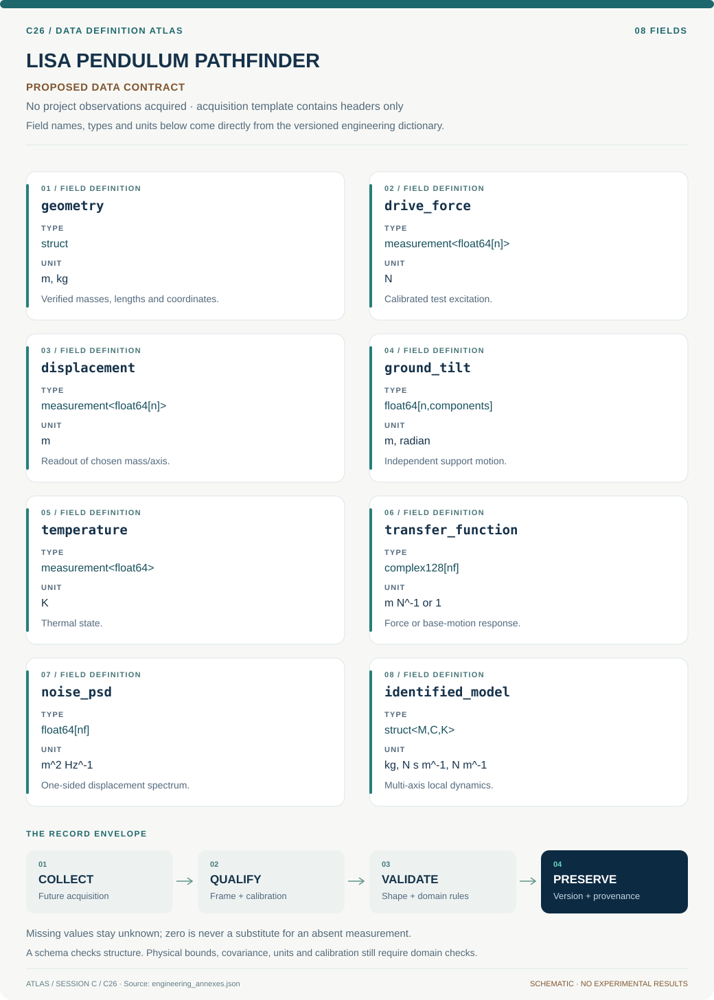
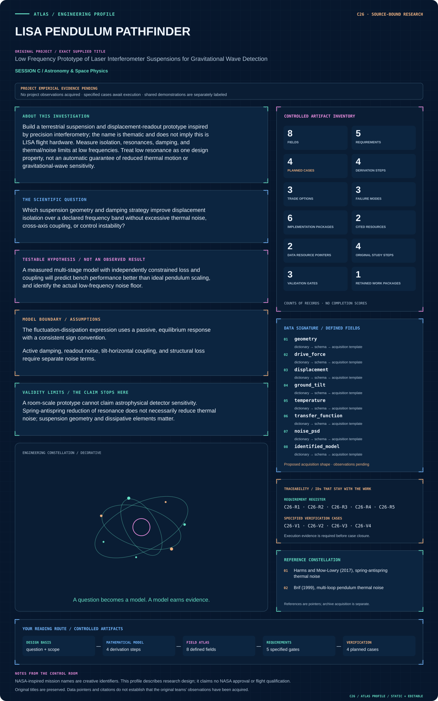

# C26 · Figure gallery

[LISA PENDULUM PATHFINDER](../README.md) · [Data blueprint](../data/README.md) · [Data diagnostic gallery](../../../../data/figures/README.md)

## Engineering architecture

Measured dynamics support separate passive thermal and active-loop noise budgets; sensor-floor and base-coupling assumptions limit isolation claims.

[SVG](architecture.svg) · [Editable Mermaid source](architecture.mmd)

## Data blueprint

**Proposed contract · observations pending.** Every field, type, unit and meaning comes from the controlled dictionary. [Open SVG](data-map.svg) · [Download dictionary](../data/dictionary.csv)

## Mission profile

The scientific question, hypothesis, model boundary and document metadata are drawn from controlled sources. Proposed work remains distinguished from acquired evidence. [Open SVG](mission-profile.svg)

## Planned scientific result

Mechanical mode sketch with measured/model Bode responses, cross-axis coupling, and displacement-noise budget in m/sqrt(Hz).

This final scientific result remains an execution deliverable; the design diagrams do not establish an empirical finding.
