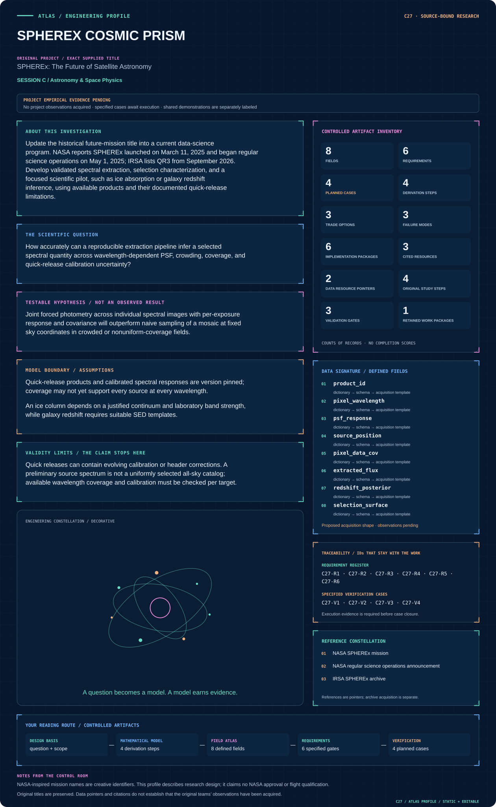
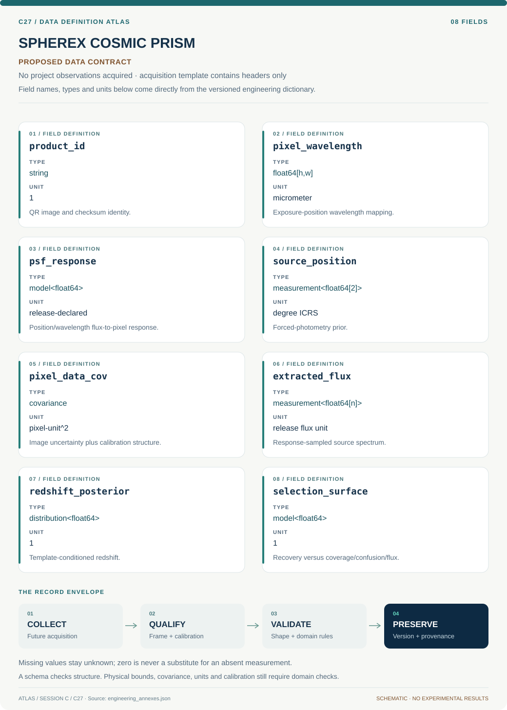

# C27 · SPHEREX COSMIC PRISM

**Original project:** SPHEREx: The Future of Satellite Astronomy

**Session C:** Astronomy & Space Physics

**Document class:** engineering research design and analysis record · **Revision:** 4 · **Date:** 2026-10-02

**Evidence state:** design basis, mathematical formulation and verification plan documented. Project-specific empirical results remain to be acquired; executable shared model demonstrations have their own recorded checks.

[Session C](../README.md) · [All projects](../../../ENGINEERING_DOCUMENTATION.md) · [Session handbook](../../../handbooks/SESSION_C.md) · [← C26](../C26-lisa-pendulum-pathfinder/README.md) · [C28 →](../C28-lowell-lunar-lantern/README.md)

| Proposed requirements | Specified verification cases | Defined data fields | Cited resources |
| ---: | ---: | ---: | ---: |
| 6 | 4 | 8 | 3 |

[Explore the data blueprint](data/README.md) · [Open the figure gallery](figures/README.md) · [Download acquisition template](data/acquisition.csv) · [Browse the data atlas](../../../data/README.md)

---

## Mission profile

| Profile panel | Engineering signal | Open the evidence |
| --- | --- | --- |
| Mission identity | SPHEREx: The Future of Satellite Astronomy | [Scientific objective](#purpose-and-scientific-objective) |
| Model cockpit | 3 governing expressions; 4 derivation steps; declared assumptions and validity envelope | [Mathematical formulation](#4-mathematical-model-and-derivation) |
| Data blueprint | 8 proposed fields with types, units and quality rules | [Field map & downloads](data/README.md) |
| Verification queue | 6 proposed requirements; 4 specified cases; project execution evidence pending | [Case definitions](#8-verification-and-validation-cases) |
| Figure wall | Architecture, field map, planned result description | [Open full gallery](figures/README.md) |
| Resource library | 3 cited primary resources with support statements | [Cited resources](#12-cited-technical-and-scientific-resources) |

### Model cockpit

**Analysis method:** Use IRSA metadata to select a small field with adequate spectral coverage and independent benchmark spectroscopy. Retrieve individual spectral-image cutouts and their PSF, uncertainty, and quality extensions. Extract forced photometry with joint nearby-source/background fitting and compare with the official tool. Propagate correlated calibration and source-confusion errors. Run an ice-absorption or redshift pilot with preregistered model assumptions; forward simulate completeness and blending through the actual coverage. Check documented header corrections and QR2/QR3 differences before combining products. Keep mission-scale forecasts separate from measured pilot performance.

**Operating envelope:** Quick releases can contain evolving calibration or header corrections. A preliminary source spectrum is not a uniformly selected all-sky catalog; available wavelength coverage and calibration must be checked per target.

**Variables and conventions**

- e indexes exposures, p pixels; spectral flux in release-documented units
- Each pixel has wavelength and PSF from instrument calibration; wavelength in micrometers
- Ice wavenumber in cm^-1 and band strength A in cm molecule^-1 yield column in molecules cm^-2
- Redshift z dimensionless; calibration nuisance parameters and foreground extinction propagated
- Choose either ice-column or redshift pilot as primary before fitting; equations illustrate two supported scientific branches

### Artifact wall

Versioned quick-release geometry and joint extraction precede the galaxy-redshift pilot; coverage and blend covariance constrain its valid domain.

**Scientific result to produce:** Sky coverage and wavelength completeness linked to extracted spectra, PSF/blend residuals, and independently validated ice or redshift estimates.

### Investigation feed · planned work

The feed records proposed work packages. A row becomes executed evidence only with versioned inputs, outputs and a reviewed result.

| Sequence | Evidence state | Engineering work package |
| --- | --- | --- |
| 01 | Planned | Freeze QR3/QR2 inputs and documented correction states. |
| 02 | Planned | Implement pixel wavelength/PSF/unit adapters. |
| 03 | Planned | Build isolated then joint forced-photometry covariance solver. |
| 04 | Planned | Compare matched official-tool extractions and analytic injections. |
| 05 | Planned | Fit response-integrated redshift templates with nuisance calibration. |
| 06 | Planned | Release coverage/confusion selection maps and spectroscopy holdout posteriors. |

### Mission connections

Connections are reading routes based on actual shared resources, supplied sessions or included illustrations. They do not establish physical dependencies, team collaborations or validated results.

| Connected mission | Original investigation | Recorded connection basis |
| --- | --- | --- |
| [C26 · LISA PENDULUM PATHFINDER](../C26-lisa-pendulum-pathfinder/README.md) | Low Frequency Prototype of Laser Interferometer Suspensions for Gravitational Wave Detection | Session C |
| [C28 · LOWELL LUNAR LANTERN](../C28-lowell-lunar-lantern/README.md) | Narrow-band Filter Photometry Calibration for the Lowell 20'' | Session C |
| [C25 · ORION BURST SENTINEL](../C25-orion-burst-sentinel/README.md) | Improving the Detection of Core-Collapse Supernova Through Experimentation | Session C |
| [C29 · ACE WIND SHOCK LEDGER](../C29-ace-wind-shock-ledger/README.md) | Energy Balance at Interplanetary Shocks: In-situ Measurement of the Fraction in Energetic Protons with ACE and Wind | Session C |
| [C24 · APOLLO DUST CLOCK](../C24-apollo-dust-clock/README.md) | The long-period orbit of the dust-producing Wolf-Rayet binary WR 125 | Session C |
| [C30 · ARTEMIS FIRST HORIZONS](../C30-artemis-first-horizons/README.md) | The Origins of Supermassive Black Holes | Session C |

[Machine-readable connection register and ranking rule](../../../registry/mission_connections.json)

### Reading playlist

| Route | Start here | Continue to |
| --- | --- | --- |
| Understand the idea | [Scientific objective](#purpose-and-scientific-objective) | [Design boundary](#1-design-basis-and-analysis-boundary) → [Mathematics](#4-mathematical-model-and-derivation) |
| Inspect the data | [Visual blueprint](data/README.md) | [Provenance](#5-data-specifications-and-provenance) → [Uncertainty](#6-uncertainty-sensitivity-and-identifiability) |
| Make a design decision | [Trade study](#7-engineering-trade-study) | [Failure modes](#10-failure-modes-and-interpretation-controls) → [Required outputs](#11-required-engineering-outputs) |
| Prepare execution | [Requirements](#2-requirements-and-verification-traceability) | [Verification](#8-verification-and-validation-cases) → [Implementation](#9-implementation-and-reproducible-work-packages) |

## Complete engineering dossier

The profile above is a browsing layer. The full design basis, equations, derivations, data contract, uncertainty, trades and controlled case definitions follow.

## Purpose and scientific objective

Update the historical future-mission title into a current data-science program. NASA reports SPHEREx launched on March 11, 2025 and began regular science operations on May 1, 2025; IRSA lists QR3 from September 2026. Develop validated spectral extraction, selection characterization, and a focused scientific pilot, such as ice absorption or galaxy redshift inference, using available products and their documented quick-release limitations.

**Question:** How accurately can a reproducible extraction pipeline infer a selected spectral quantity across wavelength-dependent PSF, crowding, coverage, and quick-release calibration uncertainty?

**Testable hypothesis:** Joint forced photometry across individual spectral images with per-exposure response and covariance will outperform naive sampling of a mosaic at fixed sky coordinates in crowded or nonuniform-coverage fields.

## 1. Design basis and analysis boundary

The SPHEREx record treats the mission as operating: NASA documents its March 11, 2025 launch and May 1 science start; IRSA lists QR3 in September 2026. The proposed pilot selects galaxy redshift inference as its primary output, with extraction validation preceding science fitting. Ice-column analysis remains a separate future branch requiring its own continuum and band-strength contracts.

The data boundary includes released spectral images, per-pixel wavelength response, PSF, uncertainty, masks and source-position priors. Begin with isolated forced photometry, add joint neighboring-source/background extraction, then redshift-template fitting and selection characterization. Quick-release calibration/header corrections and target-specific spectral coverage are explicit. No uniformly selected all-sky science catalog or extraction performance is assumed.

## 2. Requirements and verification traceability

These are project design requirements or proposed analysis gates. A numerical target is not a NASA requirement unless its controlling source is explicitly identified. “TBD” identifies evidence required before a decision; it is not permission to assume a value. Verification evidence listed here is planned, unless a linked result explicitly records execution.

| ID | Requirement / gate | Engineering rationale | Verification method | Basis / required evidence |
| --- | --- | --- | --- | --- |
| C27-R1 | All inputs shall retain QR release, header-correction state and calibration-response version. | Quick-release changes affect extraction geometry. | Product/header manifest audit. | IRSA release documentation. |
| C27-R2 | Extraction shall use per-exposure/pixel wavelength and PSF rather than one fixed field bandpass. | Linear-variable-filter response varies spatially. | Known-source response-forward fixture. | IRSA spectral-image semantics. |
| C27-R3 | Flux conservation shall close within 0.5% in noiseless isolated-source fixtures, a proposed target. | PSF normalization error biases SED/redshift. | Injected-source count/flux ledger. | Proposed numerical target. |
| C27-R4 | Neighbor/background covariance shall propagate into the extracted spectrum. | Crowding produces correlated spectral uncertainty. | Blended-source recovery and covariance checks. | Proposed extraction contract. |
| C27-R5 | Redshift validation shall hold out benchmark spectra and field regions. | Template/position tuning can leak benchmark truth. | Source/field split and frozen redshift prediction. | Proposed independent science validation. |
| C27-R6 | Completeness shall use actual coverage and quick-release quality masks. | Nominal mission wavelengths do not ensure target coverage. | Coverage-aware source injection-recovery. | Proposed selection requirement. |

## 3. Architecture and controlled interfaces

A release adapter emits spectral-image pixels, uncertainty extensions, wavelength maps, PSF response and WCS. A source-prior adapter supplies sky positions and uncertainties from independently cited catalogs. Joint forced photometry fits neighboring source amplitudes and local background at each sampled response, retaining covariance across sources and exposures.

The extracted-spectrum assembler combines observations using calibration-group nuisance terms rather than inverse-variance averaging alone. A redshift engine integrates SED templates through individual responses and permits photometric calibration/extinction nuisance parameters. An official-tool comparator evaluates the same selected sources. Coverage/confusion injection produces a separate selection surface and unsupported-wavelength mask.

Versioned quick-release geometry and joint extraction precede the galaxy-redshift pilot; coverage and blend covariance constrain its valid domain.

[Editable engineering diagram source](figures/architecture.mmd)

## 4. Mathematical model and derivation

### Governing equations

$$
d_{ep}=\sum_sF_s(\lambda_{ep})P_{ep}(s)+B_{ep}+\epsilon_{ep}
$$

$$
\tau_{\rm ice}(\lambda)=-\ln[F(\lambda)/F_{\rm cont}(\lambda)];\quad N_{\rm ice}=\int\tau(\widetilde\nu)d\widetilde\nu/A
$$

$$
p(z\mid F)\propto p(F\mid z,\mathrm{SED},\mathrm{cal})p(z,\mathrm{SED},\mathrm{cal})
$$

### Variables, units and conventions

- e indexes exposures, p pixels; spectral flux in release-documented units
- Each pixel has wavelength and PSF from instrument calibration; wavelength in micrometers
- Ice wavenumber in cm^-1 and band strength A in cm molecule^-1 yield column in molecules cm^-2
- Redshift z dimensionless; calibration nuisance parameters and foreground extinction propagated
- Choose either ice-column or redshift pilot as primary before fitting; equations illustrate two supported scientific branches

### Assumptions and boundary conditions

- Quick-release products and calibrated spectral responses are version pinned; coverage may not yet support every source at every wavelength.
- An ice column depends on a justified continuum and laboratory band strength, while galaxy redshift requires suitable SED templates.

### Derivation step 1

$$
d_{ep}=\sum_sP_{ep,s}F_s(\lambda_{ep})+B_{ep}+\epsilon_{ep}
$$

P includes the declared normalized PSF and spectral response. Source flux units and pixel units must be connected by release calibration, not assumed identical.

### Derivation step 2

$$
\widehat{\mathbf F}=(P^T\Sigma^{-1}P)^{-1}P^T\Sigma^{-1}(d-B)
$$

For a locally linear amplitude problem, this generalized least-squares solution exposes blending through the matrix condition number. Uncertain positions/background require joint fitting.

### Derivation step 3

$$
\Sigma_F=(P^T\Sigma^{-1}P)^{-1}
$$

Conditional amplitude covariance is broadened by shared calibration and position uncertainties; a singular matrix identifies unresolvable blends.

### Derivation step 4

$$
p(z\mid d)\propto\int p[d\mid z,SED,cal,ext]p(z,SED,cal,ext)\,dSED\,dcal\,dext
$$

Template spectra are redshifted and response-integrated before comparison. Multimodal redshift posteriors remain multimodal rather than one forced best value.

### Inference or simulation procedure

Use IRSA metadata to select a small field with adequate spectral coverage and independent benchmark spectroscopy. Retrieve individual spectral-image cutouts and their PSF, uncertainty, and quality extensions. Extract forced photometry with joint nearby-source/background fitting and compare with the official tool. Propagate correlated calibration and source-confusion errors. Run an ice-absorption or redshift pilot with preregistered model assumptions; forward simulate completeness and blending through the actual coverage. Check documented header corrections and QR2/QR3 differences before combining products. Keep mission-scale forecasts separate from measured pilot performance.

### Validity domain and fidelity limits

Quick releases can contain evolving calibration or header corrections. A preliminary source spectrum is not a uniformly selected all-sky catalog; available wavelength coverage and calibration must be checked per target.

## 5. Data specifications and provenance

**Proposed data contract · observations pending.** This visual inventory shows the record fields to acquire or derive. It contains no project measurements. [Open the data blueprint and downloads](data/README.md).

| Field | Type | Unit | Physical / statistical meaning | Quality and missing-data rule |
| --- | --- | --- | --- | --- |
| product_id | string | 1 | QR image and checksum identity. | Release/header-correction/calibration status mandatory. |
| pixel_wavelength | float64[h,w] | micrometer | Exposure-position wavelength mapping. | Missing/invalid map pixels excluded. |
| psf_response | model<float64> | release-declared | Position/wavelength flux-to-pixel response. | Normalization and unit conversion documented. |
| source_position | measurement<float64[2]> | degree ICRS | Forced-photometry prior. | Astrometric covariance retained. |
| pixel_data_cov | covariance | pixel-unit^2 | Image uncertainty plus calibration structure. | Masks remain missing; shared calibration modes retained. |
| extracted_flux | measurement<float64[n]> | release flux unit | Response-sampled source spectrum. | Coverage mask and neighbor covariance attached. |
| redshift_posterior | distribution<float64> | 1 | Template-conditioned redshift. | Store alternate modes and template/grid support. |
| selection_surface | model<float64> | 1 | Recovery versus coverage/confusion/flux. | No interpolation beyond tested domain without flag. |

[Machine-readable record schema](data/schema.json) · [Empty acquisition CSV](data/acquisition.csv) · [Field dictionary CSV](data/dictionary.csv)

The CSV above contains column headers only. Its schema defines future records and does not establish that original-team data or a particular archive product have been acquired. Frame, timing, calibration, covariance, selection and provenance details must accompany populated records.

### IRSA SPHEREx mission/archive page

[Product, archive or reference](https://irsa.ipac.caltech.edu/Missions/spherex.html)

**Fields:** QR2/QR3 images, calibration responses, extraction tools, release documentation

**Access:** Public archive; QR3 listed September 2026. Record exact release, header correction status, and coverage.

**Role:** Primary mission data and current status.

### IRSA SPHEREx explorer overview

[Product, archive or reference](https://irsa.ipac.caltech.edu/onlinehelp/spherex/spherex/overview.html)

**Fields:** Spectral-image semantics, wavelength-dependent position information, archive tools

**Access:** Public documentation; use current explanatory supplement for numerical calibration details.

**Role:** Observation operator and extraction conventions.

## 6. Uncertainty, sensitivity and identifiability

Blending, astrometric offsets and local background correlate source amplitudes. Wavelength/PSF errors can shift apparent spectral features, while shared quick-release calibration creates correlated color errors. Preserve those covariance modes and inspect condition numbers before reporting an extracted spectrum. Unsupported wavelengths remain absent rather than interpolated data.

Template mismatch, extinction and redshift can trade off at limited resolving power. Use independent spectroscopy to measure coverage and catastrophic-mode behavior, without calibrating on the held-out source. Sweep calibration/header and source-prior variants separately from SED alternatives. Completeness depends on source density and actual spectral coverage, so a successful isolated-source pilot does not validate a crowded or uniformly selected all-sky catalog.

## 7. Engineering trade study

| Alternative | Benefit | Cost / limitation | Decision rule |
| --- | --- | --- | --- |
| Isolated forced photometry | Auditable low-confusion extraction. | Restricted source domain. | Use first validation tier. |
| Joint neighbor/background fit | Retains crowding covariance. | Degenerate blends and prior sensitivity. | Use when matrix support/astrometry are adequate. |
| Official extraction comparator | Independent implementation check. | May share calibration/model assumptions. | Compare matched inputs plus analytic injections, not treat as exact truth. |

## 8. Verification and validation cases

| Case ID | Stimulus / condition | Expected result / criterion | Method | Evidence artifact |
| --- | --- | --- | --- | --- |
| C27-V1 | Isolated constant SED | Extracted amplitude reproduces inserted spectrum within numerical target. | Noiseless response-level source injection. | Flux/response closure. |
| C27-V2 | Two coincident identical sources | Individual amplitudes are nonidentifiable while summed flux may be constrained. | Degenerate design-matrix fixture. | Linear inverse-problem rank. |
| C27-V3 | Missing wavelength coverage | No measured point is emitted for unavailable bands. | Mask injection and spectrum assembly audit. | Declared missing-data contract. |
| C27-V4 | Spectroscopic holdout | Redshift interval coverage and alternate modes are evaluated with frozen templates/extraction. | Independent benchmark source/field. | Proposed redshift validation. |

**Execution status:** these cases are specified, not claimed as executed. Close a case only with the versioned inputs, output, uncertainty, reviewer and pass/fail rationale.

### Additional scientific validation gates

- Hold out benchmark sources and observation visits; compare spectral residuals and parameter coverage.
- Inject blended sources and absorption features into realistic exposures with actual coverage.
- Compare independent extraction methods and release versions, tracking calibration changes rather than averaging inconsistent products.

## 9. Implementation and reproducible work packages

1. Freeze QR3/QR2 inputs and documented correction states.
2. Implement pixel wavelength/PSF/unit adapters.
3. Build isolated then joint forced-photometry covariance solver.
4. Compare matched official-tool extractions and analytic injections.
5. Fit response-integrated redshift templates with nuisance calibration.
6. Release coverage/confusion selection maps and spectroscopy holdout posteriors.

### Investigation sequence

1. Freeze one scientific pilot, target field, release version, and independent benchmark sample.
2. Build cutout/extraction manifests and inspect wavelength coverage and flags.
3. Fit source/background models and compare against official spectrophotometry outputs.
4. Validate spectral quantities, completeness, and blending before expanding the pilot.

### Resources and interfaces to expertise

- IRSA tools/API, spectral fitting, PSF modeling, laboratory band strengths or galaxy templates, modest batch compute.

## 10. Failure modes and interpretation controls

| Failure mode | Effect on result | Detection / evidence | Design response |
| --- | --- | --- | --- |
| Old header/PSF mismatch | Biased position/flux. | Release correction-state audit. | Use matched corrected products and response. |
| Blend covariance discarded | Overprecise colors/redshift. | Ill-conditioned source matrix. | Joint covariance or unresolved-source label. |
| Nominal bands treated as complete coverage | Fabricated spectral constraints. | Exposure coverage mask. | Return absent wavelengths and conditional pilot domain. |

- Using prelaunch assumptions or obsolete headers can produce spurious features; confusion and missing coverage limit inference.

## 11. Required engineering outputs

- Current-mission data notebook, pilot spectral atlas, release/correction ledger, and selection-aware science result protocol.

### Scientific result figures to produce during execution

Sky coverage and wavelength completeness linked to extracted spectra, PSF/blend residuals, and independently validated ice or redshift estimates.

## 12. Cited technical and scientific resources

- [NASA SPHEREx mission](https://science.nasa.gov/mission/spherex/) — Verified launch and active mission status.
- [NASA regular science operations announcement](https://www.nasa.gov/missions/spherex/nasas-spherex-space-telescope-begins-capturing-entire-sky/) — May 1, 2025 science-operation start.
- [IRSA SPHEREx archive](https://irsa.ipac.caltech.edu/Missions/spherex.html) — Current QR3 release and analysis resources.

Framework and evidence rules: [engineering documentation standard](../../../engineering/ENGINEERING_STANDARD.md), [model assurance](../../../engineering/MODEL_ASSURANCE.md), [uncertainty procedure](../../../engineering/UNCERTAINTY_AND_DECISION_RULES.md), [data management](../../../engineering/DATA_MANAGEMENT.md). NASA-inspired names are creative identifiers; requirements and results are not NASA certification.
