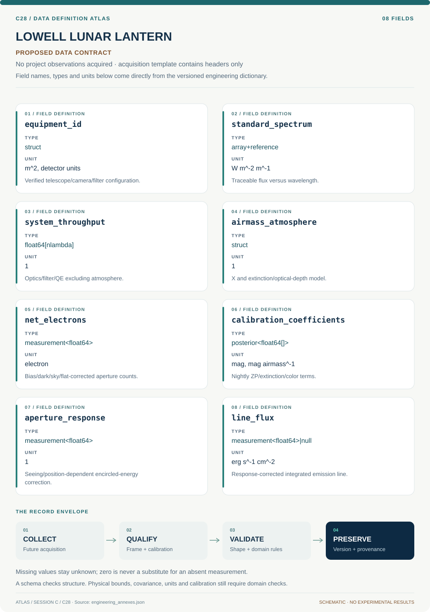

# C28 · Data blueprint

[LOWELL LUNAR LANTERN](../README.md) · [Figure gallery](../figures/README.md) · [Data atlas](../../../../data/README.md)

**PROPOSED CONTRACT · 8 fields · no project observations acquired.** The acquisition CSV contains column headers only. The diagram is a visual record specification, not measured data.

| Download | What it contains |
| --- | --- |
| [Acquisition CSV](acquisition.csv) | Empty columns ready for controlled acquisition |
| [Field dictionary](dictionary.csv) | Names, source types, units, meanings and quality rules |
| [JSON Schema](schema.json) | Nullable record structure with unit and quality metadata |

## Field reference

| Field | Type | Unit | Meaning | Quality / missingness |
| --- | --- | --- | --- | --- |
| equipment_id | struct | m^2, detector units | Verified telescope/camera/filter configuration. | Unknown geometry/curve remains TBD. |
| standard_spectrum | array+reference | W m^-2 m^-1 | Traceable flux versus wavelength. | Exact source file/version and uncertainty retained. |
| system_throughput | float64[nlambda] | 1 | Optics/filter/QE excluding atmosphere. | Component ledger checks no atmospheric factor. |
| airmass_atmosphere | struct | 1 | X and extinction/optical-depth model. | Time/weather state and applicability recorded. |
| net_electrons | measurement<float64> | electron | Bias/dark/sky/flat-corrected aperture counts. | Saturated/nonlinear states masked; negative noise retained. |
| calibration_coefficients | posterior<float64[]> | mag, mag airmass^-1 | Nightly ZP/extinction/color terms. | Full covariance and color convention. |
| aperture_response | measurement<float64> | 1 | Seeing/position-dependent encircled-energy correction. | Standard/science applicability checked. |
| line_flux | measurement<float64>&#124;null | erg s^-1 cm^-2 | Response-corrected integrated emission line. | Null if continuum or passband correction unavailable. |

## Acquisition and provenance

Null means missing or unknown; record its cause. Preserve product identifier, retrieval timestamp, source hash, calibration, coordinate and time frame, covariance basis, selection rules and every transformation. JSON Schema checks structure; physical bounds and the quality rules above require domain validation.

- [MAST reference atlases/CALSPEC](https://stdatu.stsci.edu/hlsp/reference-atlases) — archive or acquisition resource; inclusion here does not assert that its data have been retrieved.
- [New Lowell observing/calibration campaign](https://outerspace.stsci.edu/spaces/PANSTARRS/pages/298812324/PS1%2BAbsolute%2Bphotometric%2Bcalibration) — archive or acquisition resource; inclusion here does not assert that its data have been retrieved.

[Controlled data-management procedure](../../../../engineering/DATA_MANAGEMENT.md)
